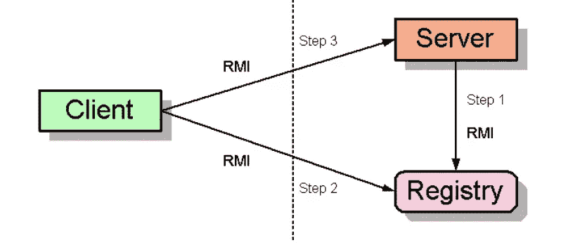
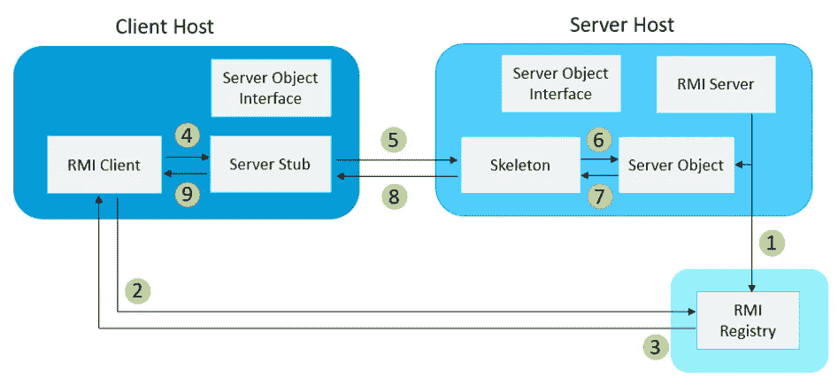
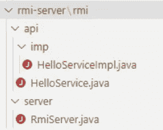
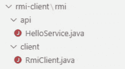

# JNDI 注射系列:RMI 向量-基础

> 原文：<https://infosecwriteups.com/jndi-injection-series-rmi-vector-1-31044f782daa?source=collection_archive---------2----------------------->


[https://AWS images . detik . net . id/community/media/visual/2022/01/13/ilustrasi-jalan _ 169 . JPEG](https://awsimages.detik.net.id/community/media/visual/2022/01/13/ilustrasi-jalan_169.jpeg)

JNDI (Java 命名和目录接口)是一个 Java API，允许客户端通过名称发现和查找数据和对象。它用于从存储这些对象的几个服务提供者那里获得命名和目录服务:LDAP(轻量级目录访问协议)和 Java RMI registry(远程方法调用)等。

JNDI 是一个简单的 Java API，只接受一个字符串参数，但是如果该参数被攻击者破坏，受害者应用程序将连接到恶意的 LDAP/RMI 服务器并执行任意命令。

这篇博文将带你了解什么是 RMI 的基本知识，在下一篇博文的[中，你将看到如何利用 RMI 系统获得 RCE。在以后，更多关于 JNDI 注入攻击的主题将在本系列中讨论。](https://medium.com/@yany.dong/jndi-injection-series-rmi-vector-dynamic-class-loading-from-remote-url-28dcbf9cee27)

RMI 是一种被滥用来实现 RCE 的技术，考虑到 RMI 操作受到一个 [Java 安全管理器](https://docs.oracle.com/javase/7/docs/api/java/lang/SecurityManager.html)的额外检查和约束，表面上看起来似乎是反直觉的。但是情况并不总是这样，因为一些 JVM 版本不应用相同的限制和策略，因此，与其他通道(如 LDAP)相比，RMI 有时可能是一个更容易的通道，LDAP 受到防御者更严密的监控。

# 1.Java RMI 简介

Java RMI 附带了 Java JDK 1.1 和更高版本。它是一个真正的 Java 分布式计算应用程序接口。

Java RMI 是一种机制，它允许存在于一个 Java 虚拟机(RMI 客户机)中的对象调用在另一个 Java 虚拟机(RMI 服务器)中定义的方法。在 RMI 系统中，从 RMI 服务器导出一个对象，并从 RMI 客户机调用它的方法。为了促进这种交互，本地 JVM 可能需要与远程对象相关的 Java 字节码。这一特性导致了下一篇博文中涉及的攻击媒介。

RMI 注册表是 RMI 系统的一个关键组成部分，它提供了一个集中的目录。RMI 分布式应用程序使用 RMI 注册表来获取对远程对象的引用。每当 RMI 服务器创建一个对象时，它就向 RMI 注册中心注册这个对象。为了调用远程对象，RMI 客户机在 RMI 注册表中通过远程对象的名称查找并获取远程对象引用，然后在 RMI 服务器上调用远程对象的方法。这个过程如图 1 所示。



图 1—[http://www . cs . CMU . edu/AFS/cs . CMU . edu/user/pzheng/www/KDI-IIM/RMI _ image1 . jpg](http://www.cs.cmu.edu/afs/cs.cmu.edu/user/pzheng/www/KDI-IIM/RMI_Image1.jpg)

最初的 RMI 解决方案包括两个关键的中间对象:存根和框架。RMI 使用存根和框架对象与远程服务器对象进行通信。远程服务器对象是驻留在 RMI 服务器虚拟机上的对象，它的方法可以从 RMI 客户端调用。

存根是一个驻留在客户端的对象，代表 RMI 服务器上的远程对象。存根启动与远程虚拟机的连接，并将消息从 RMI 客户机调用者传输到 RMI 服务器，等待响应。在得到响应后，存根负责处理它并将结果返回给调用者。

框架是 RMI 服务器端的一个对象。当框架收到来自存根的传入消息时，它从消息中提取方法名和参数，调用 RMI 服务器上实际对象的相应方法，整理结果并将响应发送给存根。

将所有元素放在一起，创建如图 2 所示的经典 RMI 架构:



图 2

1.  RMI 服务器创建一个实现服务器对象接口的远程对象，并在 RMI 注册中心注册它(使用 **bind()** 或 **reBind()** 方法)。
2.  RMI 客户机在 RMI 注册中心寻找服务器对象(使用 **lookup()** 方法)。
3.  RMI 客户机获得存储在注册表中的服务器存根，该存根引用服务器对象。
4.  RMI 客户机调用者调用远程对象上的方法，该方法实际上是在服务器存根上调用的。
5.  方法参数被捆绑到一条消息中。如果参数是对象，它们将被序列化。这个过程被称为编组。服务器存根将消息发送给驻留在 RMI 服务器中的服务器框架对象。
6.  框架对象从消息中解编方法名和参数，并使用与服务器存根相关联的服务器对象上的参数调用方法。
7.  服务器对象执行该方法并将结果返回给框架。
8.  框架在消息中整理结果，并将消息发送到存根。
9.  存根对返回的消息进行解组，以提取结果并将其传输给 RMI 客户机调用者。

值得注意的是，开发 RMI 应用程序必须做的一件事是定义服务器对象接口。该接口定义了将从远程服务器对象中导出哪些远程方法/变量。

RMI 已经摆脱了骨架文件的使用。在 JDK 1.2(1998 年发布)中，上述 RMI 体系结构中的框架被通用服务器端调度代码所取代。同样，在 2004 年发布)中，静态生成的存根被动态代理所取代。RMI 系统以更轻量级的方式运行。

# 2.创建 Java RMI 应用程序

为了更好地理解 RMI 的工作原理，我们使用了两台 CentOS 7.9 服务器来建立一个演示环境。CentOS 服务器使用 Java SE Runtime Environment 1 . 6 . 0 _ 29(6u 29)作为 RMI 服务器和 RMI 客户端，因为旧版本的 JDK 部署了宽松的远程方法调用安全策略，并且它可以在下一篇博文中的[中的未来 RMI 利用演示中重用。为了简单起见，演示将 RMI 服务器和 RMI 注册中心放在同一个 Linux 机器上。](https://medium.com/@yany.dong/jndi-injection-series-rmi-vector-dynamic-class-loading-from-remote-url-28dcbf9cee27)

# 2.1 准备 Java 环境

要安装 JDK 的具体历史版本，可以在登录 oracle 官方网站后进入[https://www . Oracle . com/Java/technologies/javase-Java-archive-javase 6-downloads . html](https://www.oracle.com/java/technologies/javase-java-archive-javase6-downloads.html)获取目标 JDK 的下载地址(我是进入“开发者工具”模式后从浏览器的网络选项卡中获取带有 AuthParam 的下载网址的)。

在 CentOs 服务器上执行 wget。下面提供了一个执行示例:

```
[root@demo ~]# wget -O jdk-6u29.bin https://download.oracle.com/otn/java/jdk/6u29-b11/jdk-6u29-linux-x64-rpm.bin?AuthParam=1671893419_f213a470eff1bb72f9921ec7b5087375
```

AuthParam 因您的情况而异，或者您可以用自己的方式获得 JDK bin 文件。

通过执行以下命令安装 bin:

```
[root@demo ~]# chmod +x ./jdk-6u29.bin
[root@demo ~]# ./jdk-6u29.bin
```

检查 java 版本，确保它是 1.6.0_29。

```
[root@demo ~]# java -version
java version "1.6.0_29"
Java(TM) SE Runtime Environment (build 1.6.0_29-b11)
Java HotSpot(TM) 64-Bit Server VM (build 20.4-b02, mixed mode)
```

# 2.2 开发 RMI 服务器程序

**定义远程接口**

RMI 应用程序应该从扩展 RMI 定义的远程接口的远程接口开始。可以远程调用的远程对象的方法必须在接口中指定。接口中的每个方法都必须声明为抛出 RemoteException，以解决远程方法调用期间的错误。

在这种情况下，HelloService 接口是在 HelloService 定义的。

HelloService.java

```
package rmi.api;
import java.rmi.*;
​
public interface HelloService extends Remote{
  public String sayHello(String message) throws RemoteException;
}
```

RMI 服务器和 RMI 客户机应用程序都包含相同的接口，作为这两方之间通信的契约。

**开发实现类(服务器对象)**

远程接口提供了特定远程对象的所有方法的描述，接下来的事情是创建该接口的实现，并提供该接口的所有抽象方法的实现。

HelloServiceImpl.java

```
package rmi.api.imp;
import java.io.Serializable;
import java.rmi.*;
import java.rmi.server.UnicastRemoteObject;
import rmi.api.HelloService;
​
public class HelloServiceImpl extends UnicastRemoteObject implements HelloService{
​
    private static final long serialVersionUID = 1L;
    public HelloServiceImpl()  throws RemoteException {
      super();
    }
​
    public String sayHello(String message) throws RemoteException {
      System.out.println("It is from serve, the message received from the client is " + message);
      return message;
    }
}
```

HelloServiceImpl 扩展了`java.rmi.server.UnicastRemoteObject`，这意味着当你的对象被构造时，会调用`UnicastRemoteObject`构造函数。这将对象挂接到处理套接字监听和远程方法调度的 RMI 内部基础设施。换句话说，它“导出”了 HelloServiceImpl 对象。

**创建 RMI 服务器**

在 RMI 服务器上，RMI server 是在 RmiServer.java 中实现的。

RmiServer.java

```
package rmi.server;
import java.rmi.*;
import java.rmi.registry.LocateRegistry;
import rmi.api.imp.HelloServiceImpl;

public class RmiServer {
  public static void main(String[] args) {
    try {
      System.out.println("RMI Server Starts...");
        //This creates a registry local to the RMI server.
      LocateRegistry.createRegistry(8888);

        //create a stub of the remote object
      HelloServiceImpl hImpl = new HelloServiceImpl();
      System.out.println("Bind the hImpl to helloService");

       //This command bind our stub to a unique key helloService, As a result, the remote object is now available to any client that can locate the registry.
      Naming.bind("rmi://localhost:8888/helloService", hImpl);
​
      System.out.println("Waiting to be invoked by Client...");
      Thread.sleep(10000000);
      System.out.println("RMI Server Stops");
    } catch (Exception e) {
      System.out.println("error: " + e);
    }
  }
}
```

**编译代码**

上述源代码文件放在下面的布局中，供您参考。



在 RMI 服务器上，编译 java 文件并在 rmi-server 目录下执行。

```
[root@demo rmi-server]# javac rmi/server/RmiServer.java 
​
[root@demo rmi-server]# java rmi/server/RmiServer
RMI Server Starts...
Bind the hImpl to helloService
Waiting to be invoked by Client...
```

现在，RMI 服务器正在等待来自 RMI 客户机的任何远程调用请求。

# 2.3 开发 RMI 客户端程序

假设您已经按照 2.1 中的说明在客户机服务器上安装了 Java SE Runtime Environment 1 . 6 . 0 _ 29(6u 29)，唯一需要做的就是定义与 RMI 服务器上相同的远程接口，并创建 RMI 客户机程序。

**定义远程接口**

该接口应该与 RMI 服务器中指定的包路径相同，否则当 RMI 客户机试图调用远程服务器对象上的方法时，您将遇到“no security manager:RMI class loader disabled”错误。

HelloService.java

```
package rmi.api;
import java.rmi.*;
​
public interface HelloService extends Remote{
  public String sayHello(String message) throws RemoteException;
}
```

**创建 RMI 客户端**

在 RMI 客户机上，RMI 客户机是通过 RmiServer.java 创建的。

RmiClient.java

```
package rmi.client;
import java.rmi.*;
import java.util.Arrays;
import rmi.api.HelloService;
​
public class RmiClient {
  public static void main(String[] args) {
    String host = "localhost:8888";
    if (args.length > 0)
      host = args[0];
    try {
      String names[]=Naming.list("rmi://" + host + "/helloService");
      System.out.println("I am client, it is service list: "+Arrays.asList(names));
​
      HelloService h = (HelloService) Naming.lookup("rmi://" + host + "/helloService");
​
      System.out.println("It is on client, the result from server is "+h.sayHello("John"));
    } catch (Exception ex) {
      System.out.println("error: " + ex);
    }
  }
}
```

以上源代码文件存储在以下结构中，供您参考。



在 RMI 客户机服务器上，编译 java 文件并在 rmi-client 目录下执行它。

因为您已经将 RMI 服务器和客户机放在不同的服务器上，所以当启动 RMI 客户机时，RMI 服务器的 IP(在本演示中，192.168.0.95 是 RMI 服务器的 IP)应该作为一个参数提供。

```
[root@demo rmi-client]# javac rmi/client/RmiClient.java 
​
[root@demo rmi-client]# java rmi/client/RmiClient 192.168.0.95:8888
I am client, it is service list: [//192.168.0.95:8888/helloService]
It is on client, the result from server is John
[root@demo rmi-client]#
```

RMI 服务器接收来自 RMI 客户端的方法调用，控制台如下所示:

```
[root@demo rmi-server]# java rmi/server/RmiServer
RMI Server Starts...
Bind the hImpl to helloService
Waiting to be invoked by Client...
It is from serve, the message received from the client is John
```

观察到在 RMI 服务器上执行了 **sayHello** 方法，结果被发送到客户端。

源代码可以从 [github](https://github.com/zer0-map/JNDI-Injection-Series/tree/main/RMIVector) 获得。

参考:

[https://www.baeldung.com/java-rmi](https://www.baeldung.com/java-rmi)

https://paper.seebug.org/1091/

# 最后的想法

如果您有任何问题或反馈，请随时发表评论。如果你认为这篇博文有帮助，请点击拍手👏按钮下面几下，以示支持！

## 来自 Infosec 的报道:Infosec 每天都有很多内容，很难跟上。[加入我们的每周简讯](https://weekly.infosecwriteups.com/)以 5 篇文章、4 条线索、3 个视频、2 个 GitHub Repos 和工具以及 1 个工作提醒的形式免费获取所有最新的 Infosec 趋势！