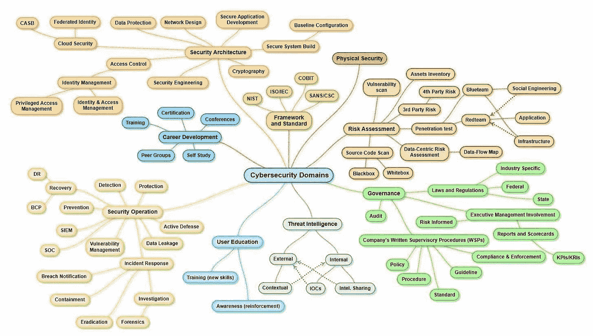

# 信息安全领域的工作

> 原文：<https://infosecwriteups.com/jobs-in-information-security-infosec-93a5efc12ca2?source=collection_archive---------0----------------------->

* *本文面向初学者，非专家。:-D

几乎所有每周回复我的推特的人都说他们想“进入信息安全”或者“成为一名圣灵降临者”；他们很少选择任何其他工作或者比这更具体的工作。我认为这是因为他们没有意识到信息安全领域中的所有不同领域(简称为 InfoSec，对于我们行业之外的人来说是“网络”)。我可以同情；我加入的时候也是这个位置。我认识三个渗透测试人员和许多风险分析师，但我不知道还有其他几个领域可能让我感兴趣，甚至可能存在。我知道我不想成为一名风险分析师，所以我认为唯一的选择是 PenTester。现在我知道那根本不是真的。这篇博文将详细介绍信息安全领域的其他几个领域，希望这个领域的新手能够更容易找到自己的位置。这不会是详尽无遗的，但我会尽力而为。

图片由奥本海默&公司的[亨利·江](http://www.sccongress.com/new-york/henry-jiang/author/40883/)提供

> 上图显示了信息安全领域中 8 个不同的潜在领域，作者是[Henry Jiang](http://www.sccongress.com/new-york/henry-jiang/author/40883/)；治理、风险、职业发展、用户教育、标准、威胁情报、安全架构和安全运营。

这篇文章已经移到我的新博客:[https://shehackspurple . ca/2022/01/01/jobs-in-information-security-infosec/](https://shehackspurple.ca/2022/01/01/jobs-in-information-security-infosec/)

*关注* [*Infosec 报道*](https://medium.com/bugbountywriteup) *获取更多此类精彩报道。*

 [## 信息安全报道

### 收集了世界上最好的黑客的文章，主题从 bug 奖金和 CTF 到 vulnhub…

medium.com](https://medium.com/bugbountywriteup)