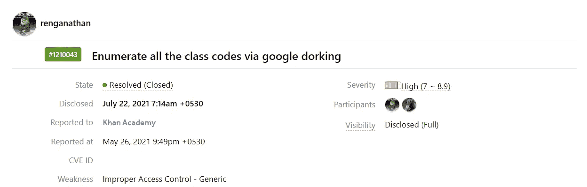

# 在可汗学院未经老师邀请参加任何班级

> 原文：<https://infosecwriteups.com/joining-any-class-without-the-teachers-invitation-in-khan-academy-25b0855a56c1?source=collection_archive---------1----------------------->

你好，

我是伦加纳森。

VDP 汗学院

这篇文章是关于我在 khanacademy.org 发现的一个漏洞。可汗学院在[哈克龙](https://hackerone.com/khanacademy)上得了一个 VDP。

有一个虚拟课堂可能有点类似谷歌教室我猜:)

我开始测试几个漏洞，比如从学生到老师的权限提升&不幸的是，我找不到一个:/

所以我测试了类连接功能，我发现类链接是这样的:

> khanacademy.org/join/A1B95FG6

我测试了 IDOR 并寻找相似的类代码。但是正确代码的机会非常少，大多数都返回 404:(

所以为了简单起见，我使用了下面的 google dork 来列举所有的类代码:

> 网址:khanacademy.org/join/*

因此，我能够列举所有的课程，并参加了一个课程:)，如 H1 报告的概念验证部分所示

断然的

 [## 可汗学院在 HackerOne 上披露:枚举所有职业代码...

### 我使用了这个特定的 Google dork ` site:khanacademy . org/join/* `来列举所有加入类的链接。1.去吧…

hackerone.com](https://hackerone.com/reports/1210043) 

感谢阅读:)
注意安全。

[https://www.instagram.com/renganathanofficial/](https://www.instagram.com/renganathanofficial/)