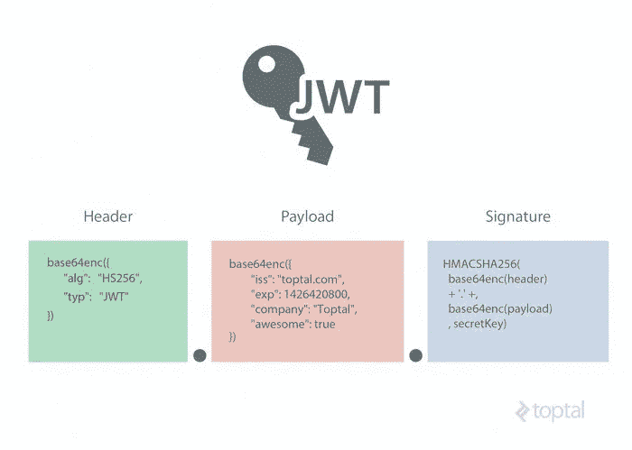
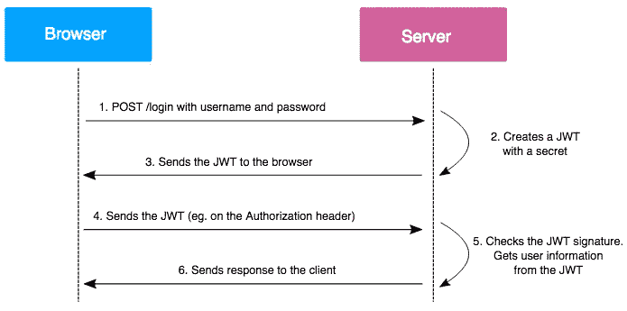

# JSON web 令牌

> 原文：<https://infosecwriteups.com/json-web-tokens-c1f01028f5ac?source=collection_archive---------1----------------------->

[弗洛里安·奥利佛](https://unsplash.com/@florianolv?utm_source=unsplash&utm_medium=referral&utm_content=creditCopyText)上 [Unsplash](https://unsplash.com/@florianolv?utm_source=unsplash&utm_medium=referral&utm_content=creditCopyText)

几十年来，cookies 一直用于验证用户身份和保存会话数据。但是一个简单的会话 cookie 有一定的局限性，并且需要考虑太多的属性。
我们来谈谈一个不仅有助于认证，还能提供授权的令牌，如何？我们将要讨论的令牌被称为 JWT 或 JSON Web 令牌。

JSON web 令牌是一种广泛用于 web 应用程序的访问令牌。JWT 基于 JSON(JavaScript 对象)格式。

与容易被伪造的 cookie 不同，忽略一些例外，使 JWT 难以被更改的是它有签名的事实，该签名或者使用秘密密钥/私人密钥来确保完整性。

通常，服务器使用密钥对 JWT 令牌进行签名，以确保 JWT 令牌中包含的信息是安全的，并且不会被攻击者为了操纵其身份而更改。服务器将检测到对令牌中的信息进行编辑的尝试，并且作为尝试修改的结果，服务器将不接受该令牌。

在大多数情况下，令牌用于身份验证，并作为 cookie 分配给用户，但它更常见于标头中，服务器每次处理请求时都会检查它。

**JWT 的结构。**

[来源](https://uploads.toptal.io/blog/image/956/toptal-blog-image-1426676395222.jpeg)

# 一种 JWT 包括:

*   头球
*   有效载荷
*   一个签名

请记住，它们都是 base64url 编码的，用点(.).

这使得区分报头、有效载荷和签名变得更加容易。

# 页眉

JWT 以一个 base64 编码的报头开始，当我们解码时，它告诉我们正在使用的算法的一些信息，例如 HS256 或 HS512

示例:

{ "alg" : "HS256 "，" type" : "JWT" }

base64url 编码后，将提供以下解码字符串:eyjhbgcioijiuzi 1 niis INR 5 CCI 6 ikpxvcj 9

这里使用的算法是 HS256。但使用最适合自己和公司政策的算法，还是要由开发者来决定。

# 有效载荷

有效载荷后面是报头，报头后面是更多的内容。假设在访问控制机制中使用了 jwt，那么有效负载必须与该机制相关，以便它能够正常工作。

它可以存储诸如用户名、时间戳、用户角色等信息

在下面的例子中使用时，我们的令牌的目标是识别用户的角色。以下是有效负载以 base64 格式编码的 JWT 令牌字符串的外观:

eyjhy 2 nlc 3 nfdhlwzsi 6 imfkbwluin 0

当我们解码上述字符串时，它会显示如下输出

{access_type:"admin "，用户名:" securitylit " }

正如您所看到的，它包含许多属性，如访问类型、用户名和其他信息，这些信息允许服务器区分它们可以访问的资源类型和试图访问它们的用户。

# 签名

那么，如果报头和有效载荷是基于 64url 编码的，它们就不能被轻易改变吗？

是的，它们可以，这也是它们使用起来不安全的原因之一。然而，正是因为有了第三个要素，JWT 才是可靠和安全的。

JWT 的签名是令牌的第三部分，也是最后一部分。

如果您还记得的话，头部分会告诉您使用什么算法。标头和有效负载首先经过 base64url 编码，然后使用密钥加密。签名的格式如下。

签名= HMAC-sha 256(base64 urlencode(header)+' . '+ base64urlEncode(有效负载)，secret_key)

仅仅为了这个例子，我已经使用了 learnjwt 的密钥。

签名变成了:DNV 2 av 0k-4pxodrvlorqaa 8 CJ u8 SZ 8 xag q 8 tcv 9 og 7 q

[来源](https://www.vaadata.com/blog/wp-content/uploads/2016/12/JWT_tokens_EN.png)

对于使用 JWT 的应用程序，您可能会看到这样的内容，

eyjhbgcioijuzi 1 NII SINR 5 CCI 6 ikpxvcj 9 . eyjhy nlc 3 nfdhlwzsi 6 imfkbwluin 0 . DNV 2 av 0k-4pxodrvlorqaa 8 CJ u8 SZ 8 xag q 8 tcv 9 og 7 q

第一个点之前的红色部分是报头，然后是有效载荷和签名。

由于头和有效负载只是简单的 base64url 编码，您可以解码它们并查看它们的内容。但是如果您试图将它们更改为，或者模拟您的受害者，或者更改您的角色，您将会得到一个错误(假设 JWT 配置正确)。

这是因为，报头和有效载荷可以伪造，但签名不能伪造，直到您获得密钥。

# 绕过 JWT 的方法

虽然 JWT 似乎是促进认证和授权的一站式解决方案，但如果没有正确实施，它可能会被证明是麻烦的。

这里有一些你可以尝试绕过 JWT 的方法。

1.  更改算法类型。

如果后端允许更改算法(alg)，可以尝试将其设置为 None(即“alg”:“None”)。

既然算法已经被设置为 None，您就可以篡改有效负载了。backed 将不检查签名，因为它已被设置为无。

2.提供无效的签名。

也有可能应用程序从不检查签名，从而导致 JWT 旁路。

3.暴力破解密钥

虽然不推荐，但您可以尝试暴力破解密钥。如果密钥很小且容易被猜到，您可以在篡改有效载荷后伪造一个有效签名。

# 结论:

JWT 是一种开放标准，用于在两方(即客户端和服务器)之间共享安全信息。它很紧凑，但使用起来很可靠。然而，如果没有正确实施，它可能会成为任何 web 开发人员和公司的噩梦。

JWT 错误配置的一些影响及其局限性包括:

代币侧顶

攻击者使用这种方法，在拦截或窃取用户或系统管理员的令牌后，通过模拟目标用户身份来获得对系统的访问权限。

用户没有内置的令牌撤销

JWT 代币一旦发行，就不能撤销；只会过期。一旦令牌被泄露，我们就没有办法撤销令牌，直到它过期。

## 来自 Infosec 的报道:Infosec 每天都有很多内容，很难跟上。[加入我们的每周简讯](https://weekly.infosecwriteups.com/)以 5 篇文章、4 条线索、3 个视频、2 个 GitHub Repos 和工具以及 1 个工作提醒的形式免费获取所有最新的 Infosec 趋势！