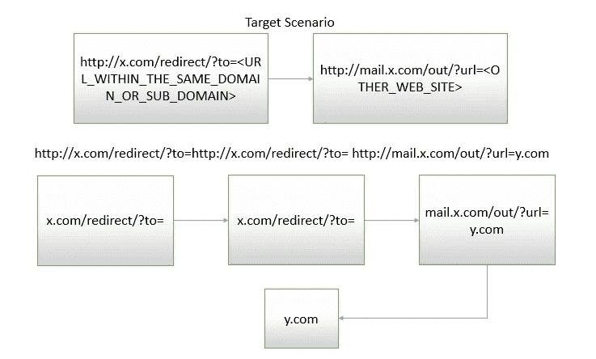

# 跳过栅栏

> 原文：<https://infosecwriteups.com/jumping-over-the-fence-ce0fe5f9a3a2?source=collection_archive---------0----------------------->

*注:以下文章发表于 2016 年 13 月 9 日 https://FogMarks.com*

**

*鸣谢:谷歌图片*

> *“栅栏是用来被跳过的”——约翰·多伊*

*正如
你可能已经猜到了(或者没有猜到)，今天的案例研究是关于开放重定向，以及绕过为防止它们而设计的机制。好玩！*

*我已经和你分享了我对开放重定向及其对网站总体安全的影响的想法。
现在是展示如何通过操纵 AOR(反开放重定向)机制实现开放重定向的时候了。*

*大 AOR 的一个很好的例子是脸书的 linkshim 系统。它基本上是在脸书上发布的每个 URL 上附加一个访问令牌。
访问令牌是个人，因此只有现在查看链接的用户可以点击它并被重定向到它的目的地；其他人没有。此外，linkshim 机制检查用户的目的地，并防止用户被重定向到恶意网站。是的，很酷。*

# *嗯，直到现在阳光明媚，我们都在海滩上玩得很开心*

*把啤酒递给我，好吗？
但是，当我们如此信任的责任区机制被操纵而采取不同的行动时，会发生什么？这正是我们今天要见证的。*

*遗憾的是，大多数使用 AOR 的网站只管理发布给它们的链接**，如果这些链接是第三方网站的话。这意味着，如果我在 x.com 网站上发布了一个到 x.com 网站的链接，这个链接将会出现在 x . com 上:x.com/out?url=y.com***

*但是如果我发布一个指向同一个域名的链接(在 x.com 上发布 x.com/blabla ),链接会显示为:x.com/blabla*

*发生这种情况的原因是因为网站通常相信自己会在内部重定向用户。他们认为将访问令牌附加到将用户重定向到同一个域的链接上是“安全的”和“无意义的”。你可以像很多人一样同意他们的观点。我已经无数次听到这样的说法:“如果某个页面容易受到开放重定向的攻击，那么就没有理由检查到它的重定向”。但现在我要彻底改变这种想法。*

# *一个非常受欢迎的设计网站*

*不幸的是，我不能透露它的名字，它有这个确切的弱点。该网站允许“内部链接”在没有任何访问令牌或验证的情况下被重定向，但要求推荐者是同一个域。相当聪明。
但是 AOR 机制允许任何内部链接被重定向，**只要它的域名是该公司的域名或子域之一。***

*使用一个域枚举软件，我能够检测到网站的一个子域，其中包含该公司员工的邮件服务，并且**该邮件服务在其注销页面上有一个开放重定向漏洞**——即使用户没有登录，当注销页面被访问时，带有“重定向后”GET 参数，用户被重定向到任何其他页面，甚至是第三方网站。顺便说一下，邮件服务并不认为这种行为是开放重定向漏洞。去想想。*

*现在我在一个子域页面上有了一个开放的重定向，我怎样才能让它从主域上落下来呢？*

*答案很简单——我将简单地利用 AOR 机制的逻辑缺陷将用户重定向到子域，并从那里重定向到第三方站点。*

*但还是有一个问题——正如我之前所说，AOR 机制允许链接被重定向到一个子域，但前提是引用者是同一个网站。*

# ***那么我做了什么？***

***我只是将用户重定向到同一个页面，然后他再次被重定向。***

*例如:
如果 2 个易受攻击的页面是:
**易受攻击的邮件服务:**[http://mail.x.com/out?url=y.com](http://mail.x.com/out?url=y.com)
**【域内易受攻击的】页面:**【http://x.com/redirect?to=mail.x.com/out?url=y.com】T21*

*第二页要求推荐人标题来自 from，我只是发布了以下网址:*

*[**http://x.com/redirect?to=x.com/redirect？to=mail.x.com/out？URL = y . com**](http://x.com/redirect?to=x.com/redirect?to=mail.x.com/out?url=y.com)*

*就是这样。*

*这里有一个 AOR 机制中简单易用的逻辑缺陷的例子。*

**

*一如既往，*

*干杯！*