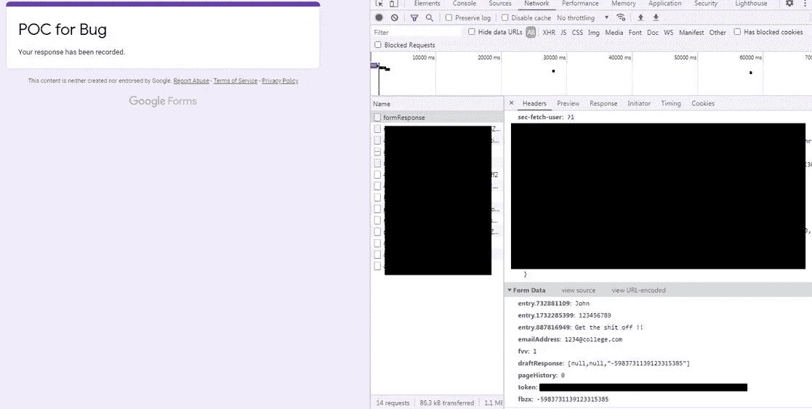
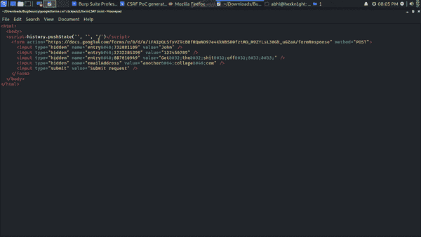
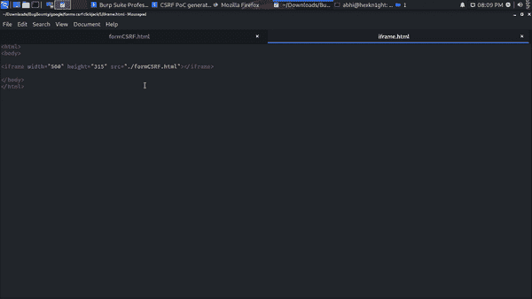
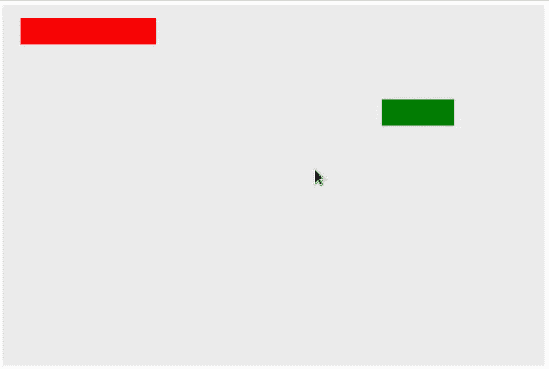
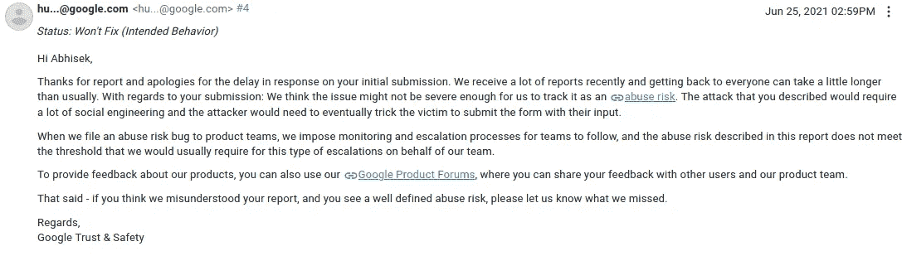
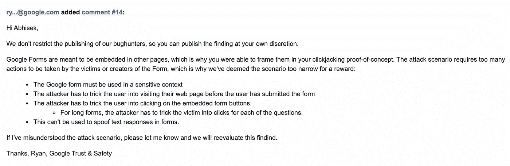

# 只需点击一下！！以你的名字#GoogleForms [Unpatched️]的名义提交的任何未经核实的数据

> 原文：<https://infosecwriteups.com/just-a-click-any-unverified-data-submitted-in-behalf-of-your-name-googleforms-unpatched%EF%B8%8F-7e1c00ba781c?source=collection_archive---------1----------------------->

> ***免责声明:这个问题没有补丁，我发表这篇文章作为信息来源。我不负责任何形式的误用或利用此问题对用户造成的伤害。***

大家好，希望大家在这次***#新冠肺炎*** 疫情期间平安健康。我带着一份书面报告回来了，这将与我在谷歌表单平台上发现的一个 bug 有关。

是基于 [**Clickjacking**](https://portswigger.net/web-security/clickjacking) 和[**CSRF**](https://portswigger.net/web-security/csrf)**的链接(跨站请求伪造)的创意 bug。**

**让我们进行一次基本的演练，Google Forms 帮助创建表单和收集数字格式的海量/大数据。它目前被**学校和学院**用于考试、**招聘公司**用于收集员工信息、**公共事件** **处理程序、****以及更多**所使用。**

****

**举个例子，一家公司在通过一所大学的招聘过程中面临一个挑战(需要解决的问题)。因此，他们创建了一个表格来收集答案。它将有电子邮件 Id，姓名，手机号码和答案。**

> **信息。表格只能用官方的学院邮箱 id 提交一次，不允许额外的条目。表单设置。每个用户限 1 个回答。**

**现在，让我们提交响应并寻找发送的请求。**

****

**请求中发送了多个参数，重要的是要注意用户数据中的前四个参数。**

**现在，我用前四个参数复制请求，看看会发生什么。**

****

**我们必须找到它重定向到谷歌表单页面。让我们增加一项技术，使攻击成为可能。如果我们在 iframe 中添加这个页面会怎么样？**

****

**戈特查。！现在你可以利用这一点。你所需要的就是在页面上添加一些 CSS(样式)并让用户点击它。**

****

**在这个过程之后。用户会发现表单已经被提交**【不知不觉地表单通过这次攻击被提交】****

**最后，一个大学生被要求提交一些他不知道的数据，但这些数据是以他的名义提交的。**

**它可以通过针对某人而被广泛利用。假设我想让我的敌人在这次招聘测试中失败。我会特别针对他发动这次袭击。**

**我在谷歌的 VRP 平台上报告了这个错误，但是得到的回应是！！**

****

> *****注:这篇文章是在谷歌 VRP 团队批准后发表的。*****

****

**感谢阅读。下次再见，还有一篇报道。在 [Instagram](https://www.instagram.com/abhis3k_r/) 、 [Twitter](https://twitter.com/abh1sek_r) 和 [LinkedIn](https://in.linkedin.com/in/abhisek-r) 上关注我。**