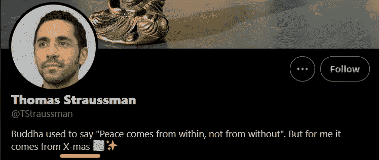
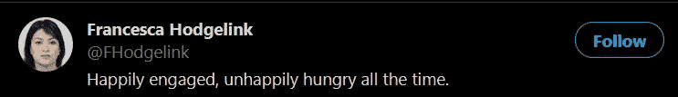
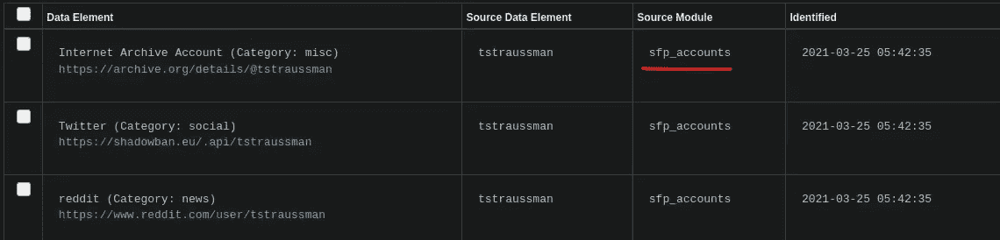
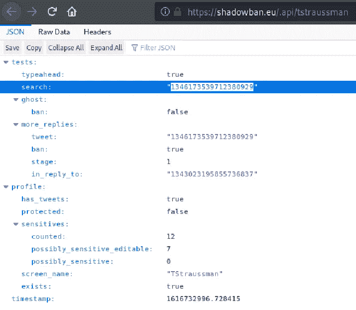
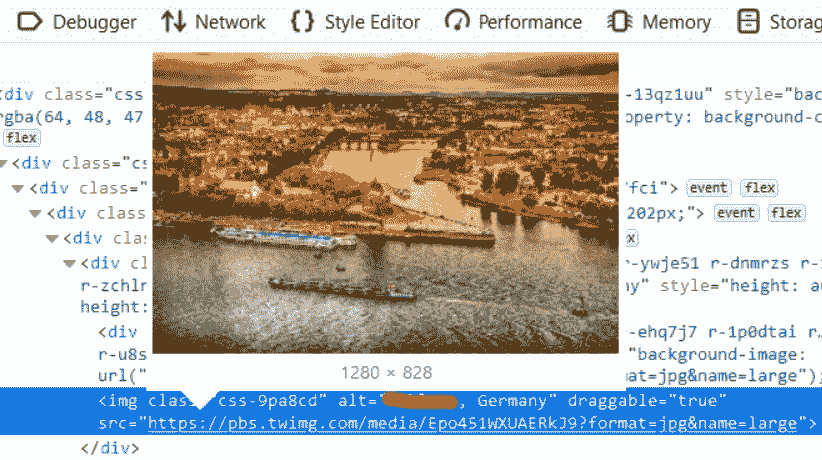
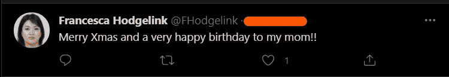
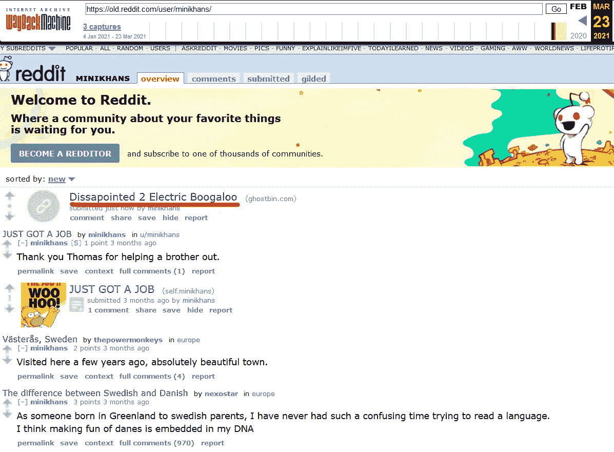
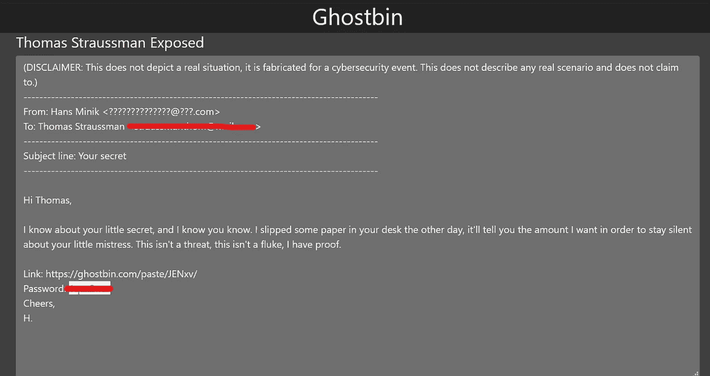

# KaffeeSec — SoMeSINT 报道

> 原文：<https://infosecwriteups.com/kaffeesec-somesint-write-up-74e8253d287?source=collection_archive---------1----------------------->

SOCMINT(社会媒体情报/调查)技术和工具介绍。用你令人敬畏的技巧在网上调查一个神秘的丈夫！

这里接入房间:[https://tryhackme.com/room/somesint](https://tryhackme.com/room/somesint)

# **任务一**

在这个房间里，你将学习社交媒体分析和取证。您将了解 google dorking、网站存档、社交媒体枚举/分析，以及在社交媒体调查中 OSINT 技术的基本用法。你不需要任何之前的 OSINT 知识就能在这个房间里做得很好，但它绝对有帮助。我已经在房间底部的“**资源**”任务中包含了一些资源，我鼓励您在完成此房间后查看这些资源！

该房间的标志格式为 **ks{flag}** 。标志不区分大小写，但必须拼写正确(复制/粘贴)。在这个过程中的任何时候，你都可以在 [TryHackMe Discord](https://discord.gg/yURS99AjEg) (在#room-help 频道)寻求帮助。
在 [KaffeeSec](https://discord.gg/mVWYwmj) discord 服务器中也欢迎任何和所有的反馈。

1.  **点击完成** 无需回答

# 任务 2

1.  谁雇佣了你？
    ks{}
2.  **你在调查谁？** (ks { first name last name })易右！

# **任务三**

1.  你在调查谁？(ks {名字姓氏})
    C…..节日

在开始之前，我先说这些账户只能在 Twitter 和 Reddit 上找到。请不要试图进一步调查超出范围的内容

只需谷歌一下这个名字:tstraussman

2.托马斯的生日是哪一天？

去他的 Reddit([https://www.reddit.com/user/Tstraussman/](https://www.reddit.com/user/Tstraussman/))。还查了他的“蛋糕日”

3.**托马斯未婚妻的推特账号是什么？**

4.托马斯的背景图片是什么？

你能行的..！

# **任务四**

1.  **用于查找这些账户的源模块是什么？**

2.**检查 shadowban API。“搜索”的价值是什么？**

ks{1346173539712380929}

# **任务 5**

1.  托马斯和他的未婚妻去哪里度假了？

在他未婚妻的推特账户上转来转去。你有照片。只要从你的浏览器进入图像并检查元素，或者你可以使用[反向图像搜索](https://en.wikipedia.org/wiki/Reverse_image_search)。

2.**弗朗西丝卡母亲的生日是什么时候？**

3.**他们的猫叫什么名字？**

我亲爱的小宝贝— …..

4.弗朗西斯卡喜欢看什么节目？

查看它的最后一个帖子

# **任务 6**

1.  托马斯的同事叫什么名字？

2.他的同事住在哪里？

我们知道汉斯和托马斯在一起工作。我们知道托马斯住在哪里。所以，很容易吧…！

3.**我们找到的链接的粘贴 ID 是什么？(标志格式)**

转到[https://old.reddit.com/user/minikhans](https://old.reddit.com/user/minikhans)在返程机中搜索。

转到这个链接，你的答案就在那个网址里。

4.**下一个链接的密码？(标志格式)**

5.托马斯的情妇叫什么名字？
埃米尔莉亚·莫勒

6.**托马斯的电子邮件地址是什么？
上面提到的**

# **任务 7**

恭喜你在这里成功了！下面是一些资源，我鼓励你在完成本课程后尝试一下:

其他 TryHackMe 房间:

*   [探照灯即时](https://tryhackme.com/room/searchlightosint)
*   [网络新闻](https://tryhackme.com/room/webosint)
*   [谷歌多金](http://tryhackme.com/room/googledorking)

想要更多的挑战吗？查看这些 CTF:

*   [赛博 Soc](https://ctf.cybersoc.wales/challenges)
*   [采购游戏](https://sourcing.games/)

**感谢阅读……*😊😊*** 如果你喜欢请喜欢并分享…！！