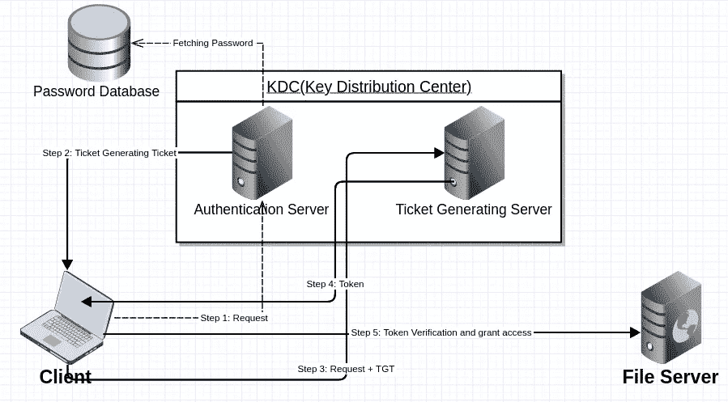

# Kerberos 身份验证协议

> 原文：<https://infosecwriteups.com/karberos-authentication-protocol-25103716a197?source=collection_archive---------2----------------------->

卡贝洛斯狗(希腊神话中)

如今，身份验证和安全性是人们关心的问题。谨记保密和隐私有许多身份验证协议，任何用户都可以使用这些协议来验证对任何特定服务器/数据库或系统的访问。其中， **Kerberos** 最适用于客户端/服务器[认证](https://en.wikipedia.org/wiki/Authentication)。

在经历这些过程之前，这个名字背后有一个有趣的事实。 **Kerberos 是希腊神话中的三头犬**。在这个协议中，我们使用三个密钥来验证客户端[。](https://en.wikipedia.org/wiki/Client_(computing))

现在，想象一下，如果有一个客户端想要连接到一个文件服务器来获取一些数据，在这个上下文中，我们使用 Kerberos 协议来验证他的身份。

在这个 auclient 认证协议中有三个系统。一个是**客户端**和**文件系统**另一个是第三方认证系统，在这种情况下称为**[**密钥分发中心**](https://en.wikipedia.org/wiki/Key_distribution_center) 进一步它有两个组件一个是 **AS(认证服务器)**另一个是**票生成服务器(TGS)** 。**

**让我们来看看这些步骤:**

****

**验证客户端的步骤**

****步骤 1:** 客户端使用其用户 id 向**认证服务器**发送请求，该请求由共享密钥部分加密。当 **AS** 收到客户端的请求时，它会根据用户 id 在数据库中检索密码。使用客户端的密码作为 as 和客户端之间的共享密钥来解密客户端的请求。这就是验证用户的方式。**

****步骤 2:** 客户端 AS 验证后，生成**票授予票**并发送给客户端。这张票是用另一个密钥加密的。**

****第三步:**客户端获得 TGT 后，它会将请求发送给 TGS。当 TGS 得到**TGT+请求**时，它使用与 AS(认证服务器)共享的密钥进行解密。**

****步骤 4:** 然后 **TGS(票证生成服务器)**发布**令牌**并发送回客户端。这个令牌也是用另一个密钥加密的。这个密钥是 Kerberos 协议中 Ticker 生成和文件服务器之间的最后一个共享密钥。**

****第五步:**由 **TGS** 客户端获取颁发的令牌，将其发送给文件服务器，然后文件服务器使用共享密钥解密令牌，最后客户端获得对文件服务器的访问。**

**这样，客户端通过**【密钥生成中心】**的验证，访问目标系统。**

**感谢您的时间，希望这是简单和有帮助的。**