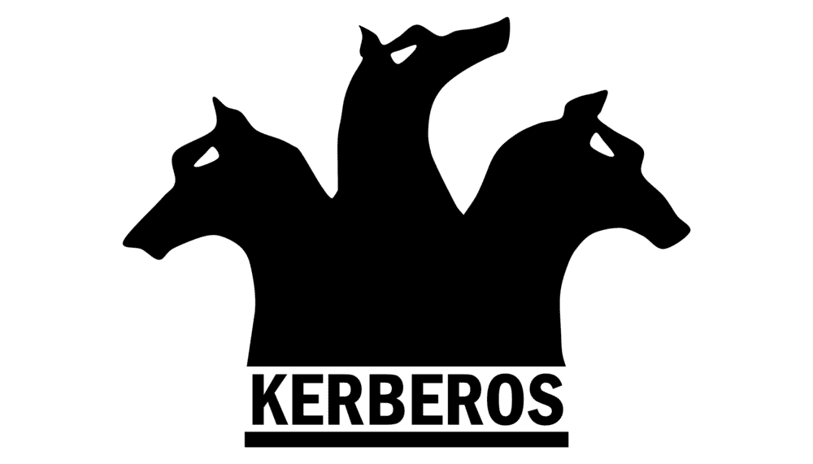
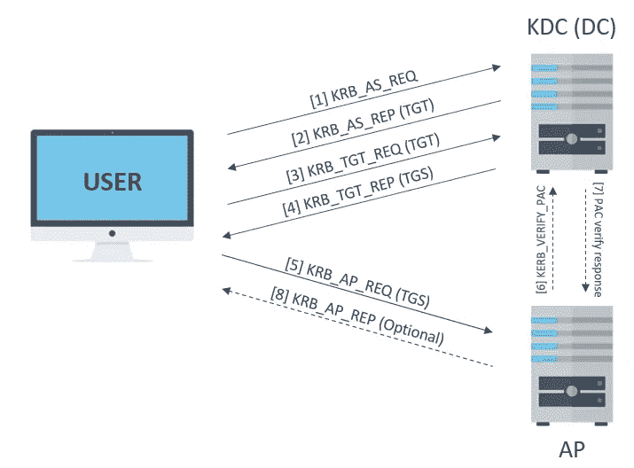
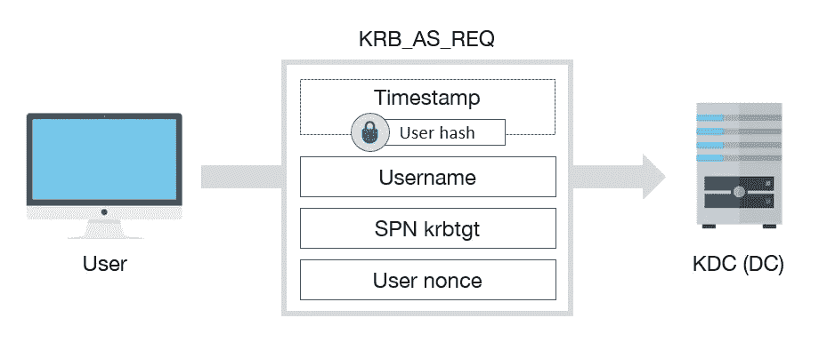
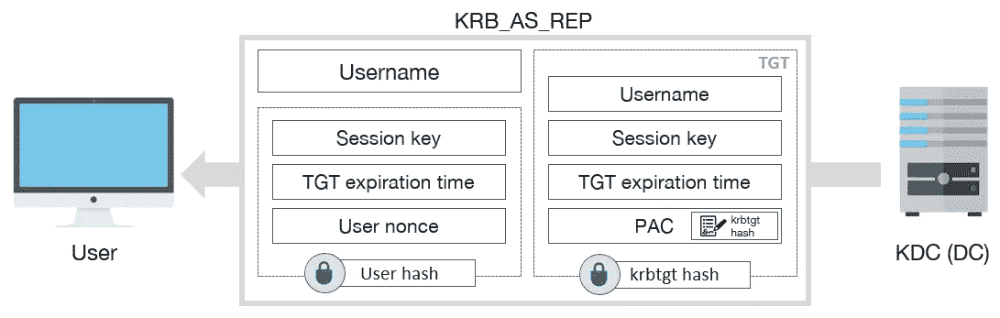
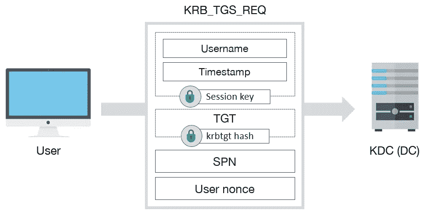
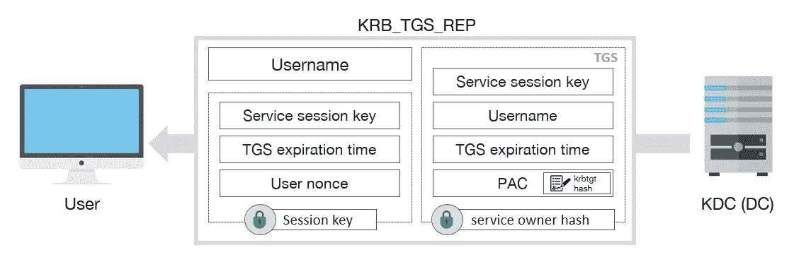
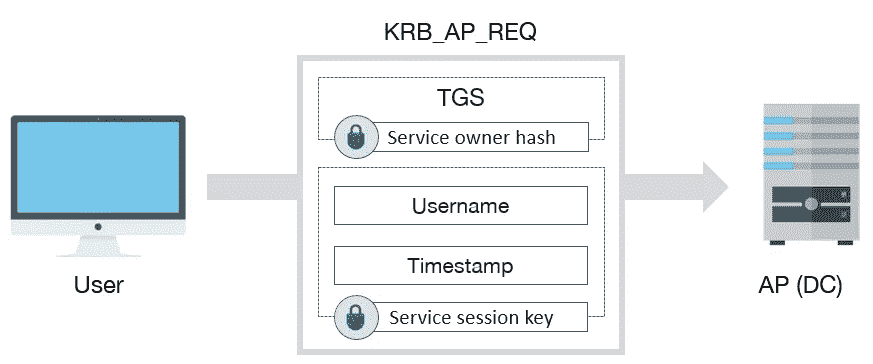

# Kerberos 身份验证(同样…但更好)

> 原文：<https://infosecwriteups.com/kerberos-authentication-again-but-better-badb5dc88b2d?source=collection_archive---------5----------------------->

认证协议旨在确保试图访问资源、信息或系统的个人、程序或实体是真实的，而不是入侵者。

Windows 环境中最知名的认证协议之一是 **Kerberos** ( [RFC 1510](https://datatracker.ietf.org/doc/html/rfc1510) 为 V5)。

最初，该协议是由 [**麻省理工**](https://kerberos.org/) 在 80 年代末开发的，但仍被 Windows 用作在 **Active Directory** 环境中的默认认证协议，取代了旧的 **NTLM** 协议(旧的但在许多 AD 环境中广泛使用)。

参考文献。[https://m0chan.github.io/](https://m0chan.github.io/)

Kerberos 的基础是简单的加密概念:对称密钥和可信第三方。

一个[**对称密钥**](https://www.ibm.com/docs/en/ztpf/2020?topic=concepts-symmetric-cryptography) 只是各方用来加密或解密消息的一个字/串。

[**可信第三方**](https://csrc.nist.gov/glossary/term/trusted_third_party) 是除所有者和验证者之外的实体，受所有者、验证者或两者的信任，提供某种服务。在 Kerberos 的情况下，受信任的第三方提供认证服务:一般来说，这就是域控制器。

对于 Kerberos 身份验证，最常见的关键字是: **ticket** 。在这种情况下，门票只是进入电影院、音乐会或 Windows 服务的“通行证”。

当用户想要访问 Windows 域中的任何服务(即他的 Windows 工作站)时，需要一个**服务票**。
要获得服务票，客户端需要与**出票服务器** ( **TGS** )对话，与 TGS 对话需要一张特殊的服务票。TGS 的服务票被称为**赠票** (TGT)。

在一个真实世界的例子中，进入一场音乐会你需要一张票(TGT ),在入口处，在使用扫描仪验证后，它的一部分被工作人员撕掉；剩下的部分是 TGS，允许你进入座位、后台等。

# 实体

Kerberos 协议在身份验证过程中包括以下 3 个实体:

*   **客户端**:想要访问资源用户或服务
*   **密钥分发中心(KDC)** :认证服务(AS)支持的可信第三方认证服务，发布“票”(TGTs)。
*   **应用服务器(AP)** :提供用户需要的服务

# 流动

身份验证协议流程如下图所示；接下来的段落会爆炸每一步。

1.  客户端向密钥分发中心(域控制器)发送一个 ***KRB_AS_REQ*** 请求一个 TGT。

[4]: Tarlogic

该请求包括以下数据:

*   **时间戳**:使用客户端密码哈希(对称密钥)加密
    –验证客户端并防止重放攻击
*   **用户名**:KDC 必须知道哪个用户想要一个 TGT
*   用于 *krbtgt* 账户
    的 **SPN 服务**——这是一个“硬编码”字符串，因为首先客户端需要与 m̶a̶n̶a̶g̶e̶r Kerberos 服务对话。
*   由用户
    生成的**随机数**，用户和 KDC 使用它来检测重放攻击

2.密钥分发中心通过解密时间戳来验证用户身份，并且如果时间戳是正确的(解密是可能的)，则用***KRB _ 代理*** 消息来响应:

[4]: Tarlogic

该响应包括以下数据:

*   **用户名**
*   **Ticket-Grant Ticket(TGT)** –TGT 只有 KDC 可读，因为它是用 *krbtgt* 帐户的密码散列加密的，并用于以下请求
    –krbtgt**帐户是 Kerberos 协议的[密钥主密钥](https://ghostbusters.fandom.com/wiki/Vinz_Clortho)，可以访问存储在域控制器中的所有用户和服务密码散列**
*   **加密数据**与用户密码哈希
    的哈希–这些数据只能由用户读取，用于验证随机数(与用户发送的随机数相同)，并记录会话和票证持续时间

3.现在，用户已经可以使用 TGT an 来请求 TGS 使用所提供的 TGT 发送***KRB _ TGS _ 请求*** 消息来访问服务:

[4]: Tarlogic

该消息包括以下数据:

*   **用会话密钥**加密数据(只有 KDC 和用户知道，对称密钥)
    –这用于验证用户请求 TGS，因为 TGT 包含用户用来加密信息的相同会话密钥；如果解密失败，那么一定是出了问题，入侵者可能正在篡改流量
*   KDC 之前获得的 **TGT** 作为“担保”
*   请求服务的 **SPN** (即工作站登录、SMB 共享等。)
*   用户生成的另一个**随机数**

4.KDC 验证请求和 TGT，然后在一条***KRB _ TGS _ 代表*** 消息中返回一个 TGS:

[4]: Tarlogic

该响应包含:

*   用户名
*   使用服务密码哈希加密的 TGS(KDC 知道所有用户/服务密码哈希，它是域控制器)
    –TGS 仅可由 KDC 和服务读取，因为它使用 SPN 的密码哈希加密，并用于以下实际访问服务和维护会话的请求
*   带有会话密钥散列的加密数据
    –这些数据只能由用户读取，用于验证随机数(与用户发送的随机数相同)，并记录会话和访问服务的票证持续时间

5.用户最终可以使用 ***KRB_AP_REQ*** 消息发送 TGS 以与服务(AP)交互:

[4]: Tarlogic

该消息包含:

*   先前由 KDC 发送的 TGS
    ——因为它是用服务密码散列加密的，所以 AP 可以解密票证并验证消息和会话
*   带有服务会话密钥的加密数据
    –服务会话密钥对用户是已知的，因为它是由 KDC 加密发送的，服务本身也是已知的，因为它在 TGS 内部；如果所有的解密都是正确的，则请求被验证

为了进一步的安全验证(该步骤是可选的)，AP 可以向 KDC 发送***KERB _ VERIFY _ PAC***请求以验证 PAC 消息内容。特权属性证书( **PAC** )是 Kerberos 票据的扩展，它包含关于用户特权的有用信息；如果 KDC 验证(如果不易受[MS14–068](https://support.microsoft.com/en-us/topic/ms14-068-vulnerability-in-kerberos-could-allow-elevation-of-privilege-november-18-2014-9692b9fc-e5e1-73e0-4058-37d19893275c)攻击)用户权限；该访问被准许。

参考资料:

*   [微软:Kerberos 认证概述](https://docs.microsoft.com/en-us/windows-server/security/kerberos/kerberos-authentication-overview)
*   [Varonis: Kerberos 认证说明](https://www.varonis.com/blog/kerberos-authentication-explained/)
*   [sthaltbits:什么是 Kerberos？](https://stealthbits.com/blog/what-is-kerberos/)
*   Tarlogic:Kerberos 是如何工作的？