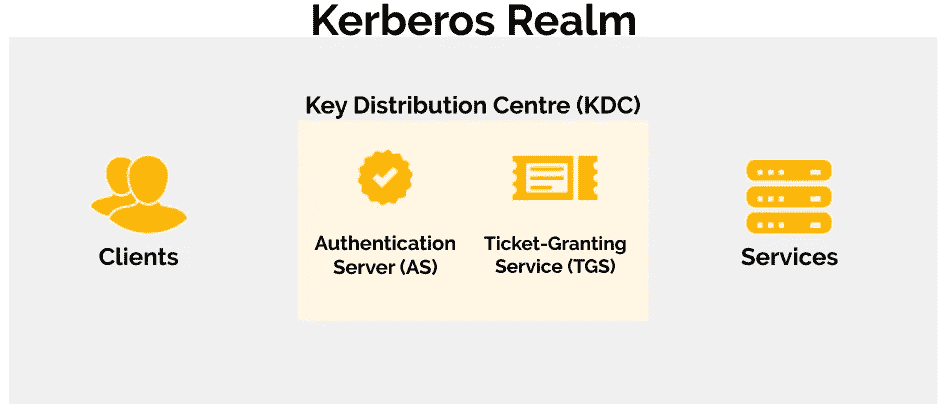
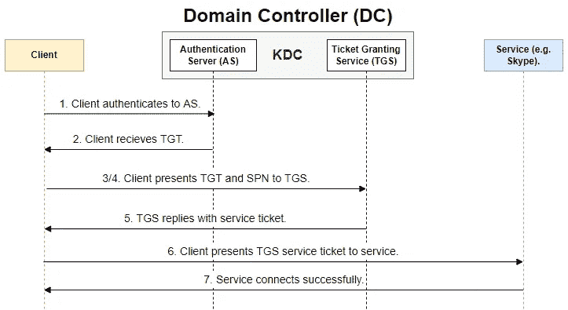

# Active Directory 中的 Kerberos 身份验证

> 原文：<https://infosecwriteups.com/kerberos-authentication-in-active-directory-2dc4af232f65?source=collection_archive---------1----------------------->

本文提供了 Kerberos 身份验证协议工作原理的基本概述。在本文中，我们将探索 Kerberos 的基本功能以及如何在 Active Directory 中使用它。Kerberos 是一个很大的主题，本文将只涉及基础知识，所以说了这些之后，让我们开始吧！

# 什么是 Kerberos？

在我上一篇名为“ [***活动目录概述***](/active-directory-overview-98692e1b0233) ”的文章中，我简要提到了活动目录有两种主要的认证类型，即 **NTLM** 和 **Kerberos** 。[微软](https://docs.microsoft.com/en-us/windows-server/security/kerberos/kerberos-authentication-overview)为 Kerberos 提供了以下描述:

> Kerberos 是一种认证协议，用于**验证用户或主机**的身份。

Kerberos 是一种计算机网络认证协议，用于识别每个提供秘密密码的用户。Kerberos 在 Active Directory 中用于提供每个用户的权限信息，但是它不执行授权。确定用户是否可以访问其资源是每个服务的责任，Kerberos 不验证用户可以访问哪个资源或服务。

# 为什么要用 Kerberos？

由于它有许多[好处](https://www.educative.io/blog/kerberos-in-5-minutes)，所以被广泛使用，下面列出了其中的一些。

*   安全: Kerberos 从不通过网络传输密码。
*   **单点登录:** Kerberos 只要求用户在第一次认证客户端时输入一次密码。
*   **受信任的第三方:** Kerberos 使用一个称为密钥分发中心(KDC)的集中式认证服务器，网络中的所有其他设备默认信任该服务器。这种外包确保了敏感信息不会存储在本地机器上。
*   **相互认证:**在 Kerberos 中，在允许通信之前，必须对通信的两端进行认证。

# Kerberos 的核心组件是什么？

在讨论 Kerberos 的核心组件时，经常会用到以下术语。

*   [**Kerberos 域**](https://www.citrix.com/blogs/2015/10/21/domain-to-kerberos-realm-mapping/#:~:text=A%20Kerberos%20realm%20is%20the,domain%20over%20which%20it%20presides.) :类似于域的逻辑网络，Kerberos 认证服务器有权通过该网络认证用户、主机或服务。
*   [**【KDC】**](https://www.educative.io/blog/kerberos-in-5-minutes):包含认证服务器(AS)和票据授予服务(TGS)。它的主要功能是充当这两者之间的仲裁者，中继来自 AS 的消息，授予一个票据授予票据(TGT)，然后将它传递给 TGS 进行加密。域的 KDC 位于域控制器上。
*   [**认证服务器(AS)**](https://www.educative.io/blog/kerberos-in-5-minutes) :客户端使用用户名和密码登录，向 AS 认证自己。然后，AS 将用户名转发给 KDC，后者进而授予 TGT。
*   [**【票据授予服务(TGS)**](https://www.educative.io/blog/kerberos-in-5-minutes) :当客户想要访问一项服务时，他们必须向 TGS 出示他们的 TGT。
*   **服务主体名称(SPN):** 赋予服务实例的标识符，用于将服务实例与域服务帐户相关联。

下图说明了这些组件是如何组合在一起的。

Kerberos 组件概述。

# 什么是 Kerberos 票证？

Kerberos 处理的主要结构是票证。这些票被交付给用户，以便用户使用它们在 Kerberos 领域中执行一些操作。有两种类型:

*   [**TGS** (票证授予服务)](https://book.hacktricks.xyz/windows-hardening/active-directory-methodology/kerberos-authentication)是用户可以用来验证服务的票证。它用服务密钥加密。
*   客户端认证成功后，KDC 授予 [**TGT** (票据授予票)](https://book.hacktricks.xyz/windows-hardening/active-directory-methodology/kerberos-authentication)。它被提交给 KDC 以请求 TGSs，并用 KDC 密钥加密。

# Kerberos 身份验证如何在 AD 环境中工作？

在 Kerberos 身份验证过程中会执行一系列步骤，但是在实时情况下，该过程非常快。以下步骤概述了 Kerberos 身份验证在 Active Directory 中的工作方式。

1.  当用户登录到活动目录时，用户**使用用户的密码向位于域控制器(DC)上的认证服务器(AS)** 进行认证，DC 当然知道该密码。
2.  DC 向用户发送一张**票据授予票据(TGT)** Kerberos 票据，用于 Kerberos 有权认证的领域。然后，TGT 被缓存在用户的计算机上供以后使用，并呈现给任何 DC 来证明 Kerberos 服务票据的身份验证。
3.  用户决定他们想要访问 Skype 服务，这使得用户的工作站为用户的 exchange 服务器查找**服务主体名称(SPN)** 。
4.  一旦 SPN 被识别，计算机再次与 DC 通信，并且**将用户的 TGT 以及 SPN** **呈现给用于用户需要通信的资源的票据授予服务**。
5.  DC 用票据授予服务(TGS) Kerberos **服务票据进行回复。**
6.  用户工作站**将 TGS 提交给交换服务器**进行访问。
7.  Skype 连接成功。

下面的序列图说明了上面概述的步骤。

Kerberos 认证序列图示例。

# 结束语

希望这篇关于 Kerberos 的短文有助于提供它是什么以及它如何工作的基本概述。Kerberos 是一个很大的话题，值得深入了解，并且被大多数使用 Active Directory 的大公司广泛使用。谢谢你看完，继续黑！😄