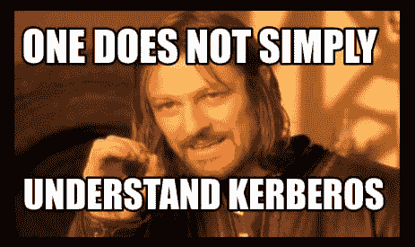
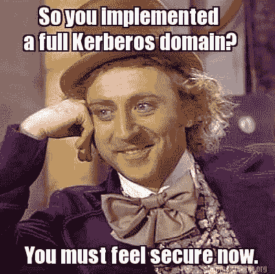

# Kerberos:票证认证协议

> 原文：<https://infosecwriteups.com/kerberos-the-ticket-authentication-protocol-d545dde9fe03?source=collection_archive---------0----------------------->

演职员表:迷因创造者

# 介绍

Kerberos 是一个第 7 层(应用层)客户端-服务器网络认证协议。它允许客户端在不安全的网络中使用票证安全地对服务/资源进行身份验证。它使用用户数据报协议(UDP)作为其传输层协议。

它是由麻省理工学院在 20 世纪 80 年代开发的。该协议是以哈迪斯的三头犬赛伯勒斯命名的。

*有趣的事实:Kerberos 标识中的 3 只狗代表客户、KDC 和访问*的服务

关于加密，Kerberos 使用对称加密，即相同的密钥用于加密和解密数据。它支持 RC4，DES，AES 256 位和 AES 128 位密码，其中 RC4 是最古老和最弱的

Kerberos 是 Active Directory 中的**默认认证方法**

Kerberos 服务器运行在域控制器上，它侦听端口 88/UDP。它也被称为密钥分发中心(KDC)，因为它向客户分发门票。由于 KDC 在域控制器上运行，它可以获取信息(NT 哈希、SID 等)。)从活动目录数据库。

KDC 由两部分组成:

*   认证服务器:认证客户端并向其颁发 TGT
*   票证授予服务(TGS)服务器:验证客户端的 TGT 并向其颁发 TGS

如上所述，Kerberos 使用票证向服务/资源认证客户端。有两种类型的票:

*   票证授予票证(TGT):由身份验证服务器发布，用于对域中的客户端进行身份验证，并让它们稍后请求 TGS。
*   票证授予服务(TGS):用于访问网络中的服务。客户端将其 TGT 呈现给 TGS 服务器，以便它可以接收特定服务的 TGS，然后访问它。收到 TGS 后，客户端将其提交给服务进行访问。

默认情况下，这些票证会在 10 小时后过期。这可以在组策略管理控制台中更改。

KDC 的服务账户是 *krbtgt* 账户。默认情况下，此帐户存在于域控制器上，不能删除/修改。它的密码又长又复杂，由系统设置并定期更改。krbtgt 帐户的 nt 散列用于加密 TGTs。

为了识别域中的服务，Kerberos 使用服务主体名称(SPN)。这些唯一标识符用于将服务实例与服务帐户相关联，以便我们可以对实例进行身份验证并对其进行管理。

SPN 格式的一个例子是

`Hostname/Username.Domain.TLD:Port`

主机名->运行该服务的计算机的主机名

用户名->服务帐户的用户名

端口->服务监听的端口

使用 Kerberos 时，会向 TGT 和 TGS 添加一个特殊的证书。它被称为特权属性证书(PAC ),包含用户的特权和信息(组成员、SID 等)。)服务使用它来确认用户就是他们所说的那个人。这在 Kerberos 中是可选的。

在 Kerberos 中，领域指的是 KDC 用于向服务/资源发放票证和验证用户身份的域。

# 版本

Kerberos 版本 1–3 是在 MIT 内部开发和使用的。

在 20 世纪 80 年代末，Kerberos 版本 4 向公众发布。该协议具有有限的票证功能。它使用弱数据加密标准(DES)密码。为了识别主机，它使用 IP 地址和“接收方制造权”编码系统。票证的生命周期必须以 5 分钟为单位指定，并且不支持跨领域身份验证。

Kerberos 版本 5 发布于 1993 年。它以 RFC 1510 的形式出现，但在 2005 年被 RFC 4120 淘汰。关于票证，该协议支持转发、续订和事后更新。对于加密，它使用高级加密标准(AES)密码。该版本支持所有类型的地址，并使用 ASN.1 编码系统。用户可以设置明确的开始和结束时间，从而允许任意的票证生存期。它支持跨领域身份验证。

# 认证过程

学分:tarlogic.com

1.  一旦客户端登录到他们的计算机，它将发送一个票请求到 KDC。用户的计算机将发送用用户的 nt 散列(将 NT 散列视为密钥)加密的当前时间、他们的用户名以及他们希望访问的服务(在本例中是 krbtgt)。(作为请求)
2.  收到该请求后，KDC 会检查域中是否存在使用该用户名的用户。为此，它将检查广告数据库。如果它找到用户，它将获取它的 NT 散列并解密时间。如果发现时间与 DC 的时钟时间相差不超过 5 分钟，它将继续前进。这是为了防止重放攻击。KDC 将产生一个 TGT。这个 TGT 包含服务名(krbtgt)、截止日期、会话密钥、PAC 和客户机的用户名。除了服务名之外的所有内容都用 krbtgt 用户的 NT 散列加密。然后用用户的 NT 散列对会话密钥的副本进行加密，并将它们发送回用户。(AS_REP)
3.  用户的计算机将使用用户的 NT 哈希解密会话密钥的副本。现在，要访问一个服务，客户端的计算机将向 KDC 发送 TGT、他们希望访问的服务的名称和一个验证符。认证者指的是用会话密钥加密的客户端用户名和当前时间。这是为了证明客户端拥有只能使用其 nt 哈希(TGS 请求)解密的会话密钥
4.  收到这个消息后，KDC 将使用 krbtgt 用户的 NT 散列解密 TGT。通过这样做，它将提取会话密钥并解密验证者。如果这是成功的，它继续进行。然后，KDC 将尝试查找该服务名称的 SPN，当它找到时，它将获得与之关联的服务帐户。然后它会生成一个 TGS。这个 TGS 包含服务名、截止日期、新的会话密钥、来自 TGT 的 PAC 和客户端的用户名。除了服务名之外的所有内容都用服务帐户的 NT 散列加密。然后用用户的 NT 散列对新会话密钥的副本进行加密，并将它们发送回用户。(TGS 共和国)
5.  客户端的计算机将向服务实例发送 TGS 和验证器(客户端的用户名和当前时间),它们用新的会话密钥加密。一个新的认证器将证明客户机拥有新的会话密钥，该密钥只能使用它们的 nt 散列(AP_REQ)来解密
6.  该服务将使用其服务帐户的 nt 哈希解密 TGS，并提取新的会话密钥和 PAC。然后，它将使用新的会话密钥解密验证器。如果这是成功的，它继续进行
7.  为了验证这个 PAC 是否是合法的并且不是伪造的，服务将这个 PAC 发送到 KDC。(验证 _PAC)
8.  收到 PAC 后，KDC 会检查它是否有效。如果是，KDC 向服务器发送一条消息，让它知道这是有效的。(PAC _ 验证 _ 响应)
9.  该服务现在通过读取 PAC 知道用户的特权，并且它已经验证了用户的身份(用户能够使用会话密钥来加密验证器，该会话密钥只能使用他们的 NT 散列来解密)。现在允许用户访问服务实例(AP_REP)

除了 AP_REQ 和 AP_REP 之外的所有步骤都发生在 Kerberos 协议上。这两个步骤发生在服务实例支持的协议上。

# 结论

演职员表:本杰明·德尔皮

尽管与 NTLM 相比，Kerberos 似乎更安全，但该协议中存在多个缺陷，使得攻击者能够访问帐户，甚至接管整个域。我们将在下一篇文章中讨论 5 种攻击:)

在 LinkedIn 上与我联系👉[https://www.linkedin.com/in/aravbudhiraja/](https://www.linkedin.com/in/aravbudhiraja/)

## 来自 Infosec 的报道:Infosec 每天都有很多内容，很难跟上。[加入我们的每周简讯](https://weekly.infosecwriteups.com/)以 5 篇文章、4 个线程、3 个视频、2 个 GitHub Repos 和工具以及 1 个工作提醒的形式免费获取所有最新的 Infosec 趋势！