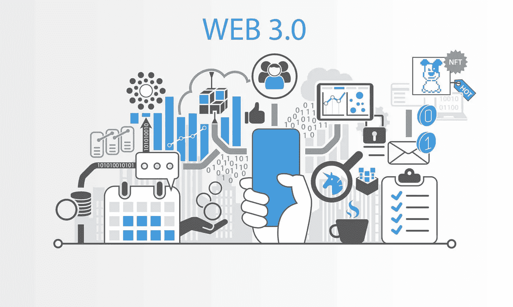
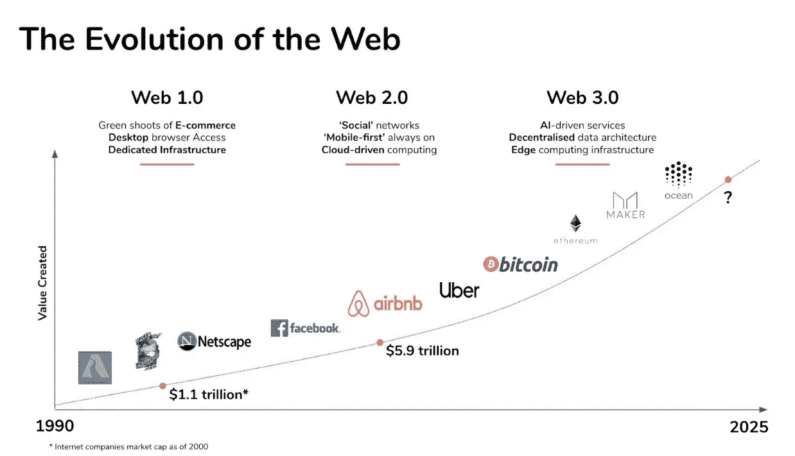
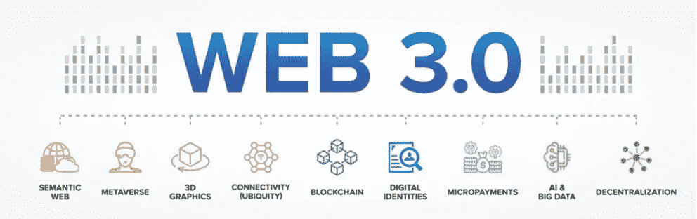
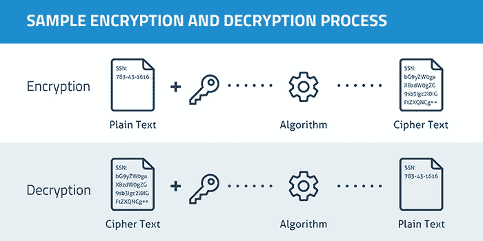

# Web 3.0 安全性:科技界关注的四个关键问题

> 原文：<https://infosecwriteups.com/key-web-3-0-security-issues-that-need-to-be-settled-2fd59c41d7d7?source=collection_archive---------0----------------------->

科技界正在积极讨论互联网的新版本 Web 3.0。尽管现代化网络的概念或多或少是清晰的，但对于数字环境的大规模改革，仍然没有清晰的算法。康奈尔大学教授詹姆斯·格里梅尔曼说，Web 3.0 将修复人们对当前网络不喜欢的一切，即使它是有争议的。尽管互联网的发展前景广阔，但它并不排除严重的 Web 3.0 安全问题。让我们来看看下一代互联网网络安全的四个瓶颈。

# Web 3.0:美丽的理论还是真实的东西？

互联网的发展是渐进的。过去的 Web 1.0 是基于带有链接的静态页面的。用户没有机会在网站上注册，与网页互动，自己添加信息。第一个版本就像一个全球数字图书馆，你只能阅读网站管理员上传的信息。

向下一个互联网版本 Web 2.0 的过渡发生在 21 世纪初，当时社交网络和 YouTube 出现了。每个用户都有机会在帖子、论坛、社区或视频中在线分享数据。人们开始将他们的个人和银行数据委托给网络来创建账户，在目标网站上注册，并在线支付商品和服务。

在 Web 2.0 的缺点变得清晰之前，用户对这种顺序感到很舒服。第一个与黑客攻击和窃取机密数据的风险有关，因为泄露信息的数量[正在逐年增长](https://www.statista.com/statistics/273550/data-breaches-recorded-in-the-united-states-by-number-of-breaches-and-records-exposed/)。因此，大约 70%的互联网用户[寻求增加](https://www.statista.com/statistics/1122387/internet-users-worldwide-looking-better-ways-protect-privacy/)他们在数字世界中的隐私。

第二个缺点与服务器所有者的权力过大有关。如果某人的观点与组织的政策相反，用户帐户将被阻止。Web 2.0 和它的前身一样，是基于客户机-服务器架构的，其中服务器由它们的所有者(组织或个人)集中管理。相应地，用户不希望他们的帐户冒风险，在一瞬间丢失上传的数据。

根据技术爱好者的说法，Web 3.0，或称区块链互联网，可以消除其前身的缺陷。集中式服务器有望被分布在计算机节点上的分散式数据库所取代。任何人都可以拥有一个节点，因此垄断公司将无法删除内容或用户帐户。信息将同时存储在数千台计算机上，不可能被删除、窃取或伪造。

此外，Web 3.0 支持者建议，在新版互联网中，任何内容都可以被标记化。所有者将对上传到网络上的照片、视频、文本或音频文件进行授权，并能够以数字货币的形式出售。由于分配给一个人的数字身份，元宇宙的运动将会发生。在任何平台上注册一次，然后在去中心化应用(dApps)之间自由移动就足够了。

# Web 3.0 怎么了？

尽管有光明的前景和 Web 3.0 的第一次尝试(区块链浏览器勇敢和 Opera 重生 3)，过渡到新版本是一个艰苦而漫长的过程。技术社区需要重新思考整个互联网。IT 专业人员需要考虑从标准的 HTTP 数据交换协议迁移到管理分散环境的文档。他们必须基于 DAO 实现公司和项目管理方案的现代化。这是一个巨大的机制，地球的整个经济和生活都建立在它上面。此外，[网络安全专家](https://andersenlab.com/blueprint/cyber-security-essentials-for-smes)也关注安全问题。行业专家讨论了需要解决的四个关键问题。

## 问题 1。信息的可靠性

由于在 Web 3.0 中一切都是去中心化的，专家们对信息的真实性和原创性产生了怀疑。以下问题仍然没有答案:“检查安全性和准确性的机制将如何工作？”，“谁来确认数据的有效性？”、“如何计算和防止数据操纵？”。这些问题仍然引起争议。越早找到这些问题的解决方案，我们就能越早来到 Web 3.0。

## 问题 2。数据可用性

Web 3.0 中用户对数据的过度依赖也令人费解。很难预测构建的系统将如何运行，以及如果其中的数据突然变得不可用，流程将会发生什么。专家们争论如果一两个节点脱落，整个网络会发生什么。

## 问题 3。数据安全

即使区块链被认为是最安全的技术之一(添加到块中的记录被安全地加密)，它也有它的问题。51%的攻击、Sybil 攻击、网络钓鱼攻击和窃取用户密钥——黑客在这样一个看似坚固的系统中发现了漏洞。

由于 Web 3.0 建立在区块链的基础上，网络安全专家必须想出一种机制来为黑客堵塞漏洞，阻止数据泄露。如果攻击者设法窃取了数字资产，几乎不可能再找回它。事实上，在一个分散的网络中，很难跟踪交易路径。

钱包克隆是一个常见的 Web 3.0 安全问题。如果黑客设法获得了用户的密码，他们就可以复制钱包并用它来支付服务费用。

## 问题 4。用户认证和签名

大多数 dApps 不对请求的响应进行认证或签名。也就是说，当用户的数字钱包收到来自这类 app 的数据时，无法验证响应是真实 app 发出的，数据不是假的。所以开发者一开始就要考虑如何保证基本的用户安全。它们必须建立有效的机制来发现和防范风险。

# 结论:反思元宇宙时代的安全

Web 3.0 挑战旧的网络模式。新的区块链互联网解决了其前身涉及隐私和数据丢失风险的重要问题。然而，这并不排除出现新的安全漏洞，这些漏洞与智能合约黑客或缺乏保护区块链网络用户的法律文件有关。

互联网的分布式特性可能会使检测和预防网络犯罪、错误信息或垃圾邮件变得更加困难。很难想象如何用不同的法律来监管一个位于区块链的网站在世界不同地方的活动。

监管机构、企业和网络用户需要了解 Web 3.0 将如何保护他们的隐私，以迎接即将到来的变化，并在数字世界中与他人无缝互动。

## 来自 Infosec 的报道:Infosec 每天都有很多内容，很难跟上。[加入我们的每周简讯](https://weekly.infosecwriteups.com/)以 5 篇文章、4 条线索、3 个视频、2 个 Github Repos 和工具以及 1 个工作提醒的形式免费获取所有最新的 Infosec 趋势！