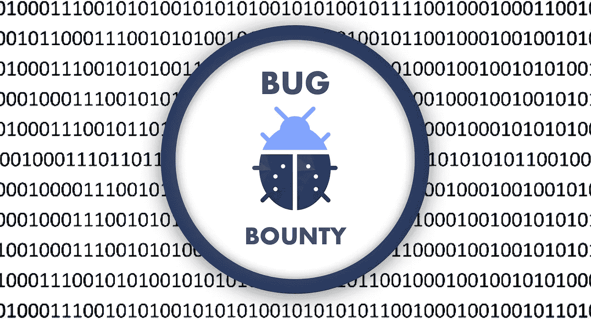

# 启动臭虫奖励

> 原文：<https://infosecwriteups.com/kick-start-in-bug-bounties-64376c23e393?source=collection_archive---------0----------------------->

图片来源:Hakin9.org

你好讨厌的黑客！

在这篇文章中，我将分享一些专业技巧，如果你刚刚开始 bug bounty &无法找到有效的 bug，这些技巧肯定会对你有所帮助。

对于这篇文章，我假设你已经知道了**网络应用黑客** &的基础知识，你已经熟悉了术语 **Bug Bounty。**

所以开门见山地说，在这篇文章中，我将分享 5 个关于臭虫奖励的技巧。

如果你虔诚地遵循每一步/提示，那么我可以保证，你将在 **1 到 5 个月**内获得你的第一笔奖金。

是啊！你没听错…找到你的第一个有效 bug 可能需要 **1 到 5 个月，甚至更久**。

所以**坚持是关键** …

我们开始吧！！！

现在！让我们从第一条建议开始吧…

# 一次只关注一个漏洞

大多数初学者都会犯这样的错误，他们学习一些网站黑客的基础知识，

然后他们开始在真实的网站上寻找随机的漏洞，

他们搜寻比如说 [**XSS**](https://portswigger.net/web-security/cross-site-scripting) 两个小时，如果他们找不到那个特定的漏洞(*他们将无法开始*)，那么他们就简单地转移到另一个漏洞。

请记住，有许多不同的端点可能存在特定类型的漏洞。

拥有关于特定漏洞的基本知识是不够的。

例如，您是否知道总共有 6 种不同类型的 SQL 注入，即，

1.  [基于盲布尔运算的](https://portswigger.net/web-security/sql-injection/blind)
2.  [工会基础](https://portswigger.net/web-security/sql-injection/union-attacks)
3.  [双重查询基础](https://blog.lucideus.com/2019/03/sql-injection-understand-double-query.html)
4.  [基于时间的](https://www.sqlinjection.net/time-based/)
5.  [基于错误的](https://medium.com/@hninja049/example-of-a-error-based-sql-injection-dce72530271c)
6.  [盲基于时间](https://beaglesecurity.com/blog/vulnerability/time-based-blind-sql-injection.html)

而且你知道吗，SQL 注入不仅有可能将某些**的基础参数**(即 *php？post=34* ， *asp？id=3* 等)

以下是 SQLi 注入点:

1.  基于 GET 的 SQL 注入
2.  基于 POST 的 SQL 注入
3.  基于 COOKIES 的 SQL 注入
4.  基于标题的 SQL 注入

所以关键是，如果你认为你通过观看一个视频在 10-20 分钟内就掌握了一个漏洞，

那你只是在欺骗自己

了解特定漏洞的更多信息，探索不同类型的利用技术。

阅读关于特定漏洞的文章，像这样搜索" *SQL 注入媒体评论* " &开始阅读。

在您能够在真实站点上找到特定漏洞的有效 bug 之前，不要移动到任何其他漏洞。

如果你问任何一个 bug 赏金猎人，他们会告诉你他们只搜寻 3-4 种类型的漏洞。

因此，与其学习所有漏洞的基础知识，不如一次只关注一个漏洞。

# 读取-搜寻-离开公式

制定一个日常计划，每隔 1-2 小时阅读一篇关于某个特定漏洞的文章(T4 的文章/书籍/评论等)。

然后在接下来的 1-2 个小时里继续搜寻，搜寻 2 个小时后，如果你找不到任何有用的东西，就把目标留到第二天。

然后重复这个 **READ — HUNT — LEAVE 公式。**

**记住**你现有的知识是不够的，你将需要一个知识助推器。

这就是为什么总是阅读至少 1 小时的原因。

不要一天搜寻超过 3 个小时，因为在开始时你将无法找到任何有效的 bug。

因此，过度狩猎会导致消极情绪&你通常会放弃狩猎。

# 不要依赖自动化漏洞扫描器

他们都是扯淡！

您经常会从这些工具中得到误报。

自动扫描仪只对黑帽黑客有帮助，

换句话说，如果你的目标是不运行 Bug Bounty 的个人网站，那么它会有所帮助。

# 目标选择非常重要

如你所知，臭虫奖励的竞争也增加了很多。

所以初学者很难在有限的目标范围内找到有效的 bug ( *而不是重复*)。

始终尝试搜寻那些具有较大测试范围的目标，即通配符域(*.target.com)在范围内。

建议去找那些只提供赠品或积分的目标，

不要只为了一开始就去跑钱…

Bug Bounty 就像数学一样，做的越多就越厉害。

# 尽可能遵循人迹罕至的道路概念

现在让我们假设，您已经通过阅读文章、书籍、文章、博客等了解了许多关于特定漏洞的知识，

你也选择了一个大范围的目标，但是如果你正在测试的领域已经被成千上万的 Pentesters & Bug 赏金猎人测试过了呢？

尽管事实上该域已经被数千名安全研究人员测试过，但是也有可能有人能够找到该特定域上的漏洞，

但是对于初学者来说，在这个特定的目标上发现第一个 bug 是非常困难的。

让我们举另一个例子，在这里，你和只有你能够找到一个特定的子域，让我们说**子域蛮力，**

那么现在告诉我，你能找到第一个有效 bug 的几率有多大？

现在我想，你知道我想说什么了，

**侦察** & **内容发现**应该是你最优先考虑的事情，它不仅会帮助你远离人群，还会帮助你实现**人迹罕至的理念**。

好了，今天就到这里吧！感谢阅读: )

在 GitHub、YouTube 和 Twitter 上关注我们:

GitHub:[https://github.com/PushpenderIndia](https://github.com/PushpenderIndia)

YouTube:[https://www.youtube.com/c/CyberAcademyHindi](https://www.youtube.com/c/CyberAcademyHindi)

推特:https://twitter.com/PushpenderIndia