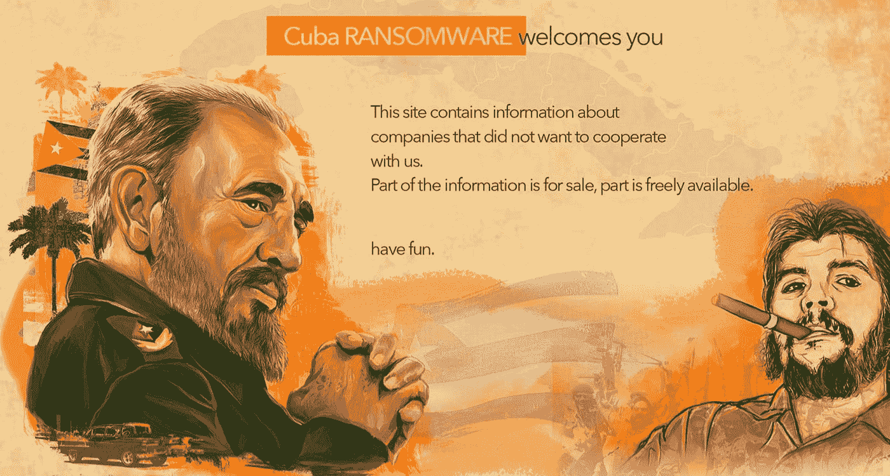
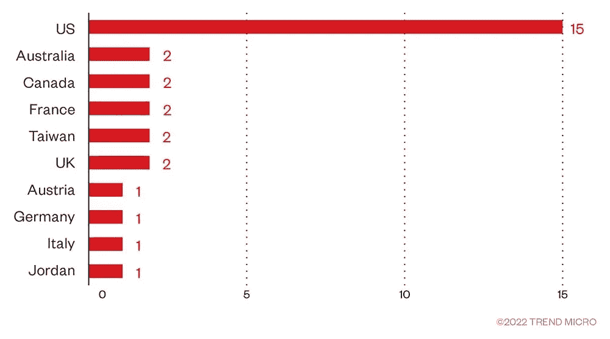
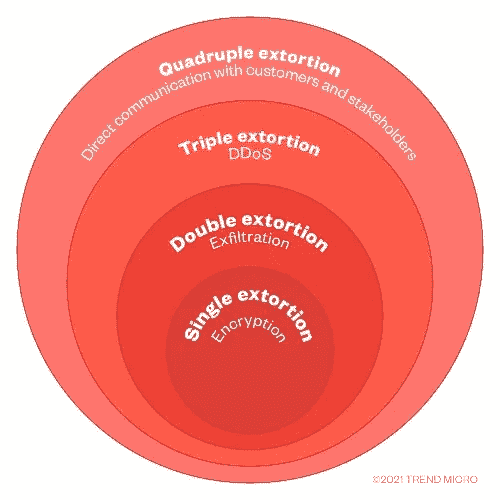

# 了解你的对手:古巴勒索软件

> 原文：<https://infosecwriteups.com/know-your-adversary-cuba-ransomware-7b899be0410d?source=collection_archive---------2----------------------->

## 在本文中，我们将尝试对古巴勒索病毒进行详细的技术分析，并了解古巴勒索病毒攻击的战术、技术、程序及其危害指标(IOCs)

古巴勒索软件-官方博客网站

# 关于“了解你的对手”系列:

欢迎来到我的“了解你的对手”博客系列，在这里我将解释组织最近面临的各种网络威胁。从勒索软件和恶意软件到特洛伊木马和高级持续威胁，我将深入研究网络罪犯用来渗透和破坏系统的战术、技术和程序。

通过这个系列，我的目的是让读者更深入地了解存在的各种类型的网络威胁，以及防御这些威胁的最佳实践。通过了解情况并采取积极措施，有可能降低成为这些威胁的受害者的风险，并更好地保护您的系统和数据。

因此，请和我一起踏上探索网络威胁世界的旅程，学习如何领先对手一步。我们可以共同努力，让互联网成为一个对所有人都更安全的地方。

# 什么是古巴勒索软件？

古巴勒索软件一直是网络安全社区的头条新闻。[网络安全&基础设施安全局](https://www.cisa.gov)和[联邦调查局](https://www.ic3.gov/Media/News/2021/211203-2.pdf)发布了一份[联合建议](https://www.cisa.gov/uscert/ncas/alerts/aa22-335a)关于来自一个被称为[古巴的组织的勒索软件攻击。在过去的一年里，研究人员观察到该组织针对的企业和机构数量有所增加，研究人员认为该组织的总部实际上位于俄罗斯。研究人员报告称，古巴在其攻击中使用了微软认证的恶意软件。](https://www.cisa.gov/uscert/ncas/alerts/aa22-335a)

虽然古巴勒索软件首次被发现是在 2019 年 12 月的[，但它直到 2021 年 11 月在一份联邦调查局的官方通知中详细描述了其活动后才声名狼藉。](https://thehackernews.com/2022/08/hackers-behind-cuba-ransomware-attacks.html) [FBI](https://www.ic3.gov/Media/News/2021/211203-2.pdf) 和 [CISA](https://www.cisa.gov/uscert/ncas/alerts/aa22-335a) 在 2022 年 12 月发表联合报告指出，截至 2022 年 8 月，古巴勒索软件行为者已经危害了全球 100 多个实体，索要超过 1.45 亿美元，并收到超过 6000 万美元的赎金。与大多数现代勒索软件运营商一样，他们使用[双重勒索技术](https://www.trendmicro.com/vinfo/us/security/news/cybercrime-and-digital-threats/the-state-of-ransomware-2020-s-catch-22)强迫受害者支付赎金。整个 2022 年，古巴勒索软件活动没有放缓的迹象。勒索软件集团已经实施了几次高调的攻击，包括针对欧洲政府机构的攻击。此外，其勒索软件程序也在不断改进，并增加了新的功能，以提高效率和效力。未来，鉴于这些事件及其不断演变，我们可能会看到该勒索软件更高级的迭代。

以下是古巴官方勒索软件泄露博客网站的暗网洋葱链接:[古巴官方博客](http://cuba4ikm4jakjgmkezytyawtdgr2xymvy6nvzgw5cglswg3si76icnqd.onion.ly/)

来源:[趋势科技](https://www.trendmicro.com/vinfo/us/security/news/ransomware-spotlight/ransomware-spotlight-cuba)

# 古巴勒索软件—战术、技术和程序(TTPs)

## 双重勒索:

恶意行为者使用双重勒索来勒索组织的数据，方法是通过渗透(有时通过将合法工具武器化)和威胁公开这些数据。勒索软件运营商通过地下论坛和博客，以及专门的数据泄露网站发布被盗信息的情况并不少见。阅读[这篇博客](https://www.trendmicro.com/vinfo/us/security/news/cybercrime-and-digital-threats/the-state-of-ransomware-2020-s-catch-22)了解更多关于双重敲诈的信息。

来源:[趋势科技](https://www.trendmicro.com/vinfo/us/security/news/cybercrime-and-digital-threats/ransomware-double-extortion-and-beyond-revil-clop-and-conti)

以下是与 to Cuba 勒索软件相关的 TTP:

**资源开发:**

*   危及基础设施:域名[ [T1584.001](https://attack.mitre.org/versions/v12/techniques/T1584/001/)

**初始访问:**

*   有效账户[ [T1078](https://attack.mitre.org/versions/v12/techniques/T1078/) ]
*   外部远程服务[ [T1133](https://attack.mitre.org/versions/v12/techniques/T1133/) ]
*   利用面向公众的应用程序[ [T1190](https://attack.mitre.org/versions/v12/techniques/T1190/)
*   网络钓鱼[ [T1566](https://attack.mitre.org/versions/v12/techniques/T1566/) ]

**执行**

*   命令和脚本解释器:PowerShell[[t 1059.001](https://attack.mitre.org/versions/v12/techniques/T1059/001/)]
*   软件部署工具[ [T1072](https://attack.mitre.org/versions/v12/techniques/T1072/) ]

**特权升级**

*   利用权限提升[[t 1068](https://attack.mitre.org/versions/v12/techniques/T1068/)]

**防御闪避**

*   削弱防御:禁用或修改工具

**横向移动**

*   远程服务会话:RDP 劫持
*   古巴勒索病毒行动者利用 RDP 会议横向移动。

**凭证访问**

*   凭证转储:LSASS 内存[ [T1003.001](https://attack.mitre.org/versions/v12/techniques/T1003/001/) ]
*   偷窃或伪造 Kerberos 票证:Kerberos osting[[t 1558.003](https://attack.mitre.org/versions/v12/techniques/T1558/003/)

**命令和控制**

*   代理:操纵命令和控制通信[ [T1090](https://attack.mitre.org/versions/v12/techniques/T1090/) ]

你也可以在这里看到关于古巴勒索软件 Mitre Att&ck [的更多信息。此外，检查矩阵视图的](https://attack.mitre.org/software/S0625/)[斜接附件& ck 导航器](https://mitre-attack.github.io/attack-navigator//#layerURL=https%3A%2F%2Fattack.mitre.org%2Fsoftware%2FS0625%2FS0625-enterprise-layer.json)。

> [不要迷失在黑暗中，保持领先:点击这里加入我的社区，学习真正的网络安全技能！](https://praveenjalasutram.medium.com/subscribe)

# 古巴勒索软件—危害指标(IOCS)

以下是一些与古巴勒索软件相关的 IOC:

## **哈希:**

*   f 1103 e 627311 e 73 D5 f 29 e 877243 e7c a 203292 f 9419303 c 661 AEC 57745 e B4 f 26 c
*   a7c 207 b 9 b 83648 f 69d 6387780 b 1168 e 2 f1 eabd 23 AE 6e 162 DD 700 AE 8112 F8 b 96 c
*   02a 733920 c7e 69469164316 E3 e 96850d 55 FCA 9 f 5 f 9d 19 a 241 fad 906466 EC 8 AE 8
*   BFF 4d d 37 febd 5465 e 0091d 9 ea 68006 be 475 c 0191 BD 8 c 7 a 79 a 44 fbf 4b 99544 ef 1
*   857 f 28 b 8 Fe 31 cf 5 db 6d 45d 909547 b 151 a 66532951 f 26 CDA 5 f 3320d 2d 4461 b 583
*   ECE FD 9 bb 8 b 3783 a 81 ab 934 b 44 EB 3d 84 df 5 e 58 f 0289 f 089 ef 6760264352 cf 878 a

## IP 地址:

*   193.23.244[.]244
*   144.172.83[.]13
*   216.45.55[.]30
*   94.103.9[.]79
*   149.255.35[.]131
*   217.79.43[.]148
*   192.137.101[.]46
*   154.35.175[.]225
*   222.252.53[.]33

## 电子邮件:

*   magikkey@cock[。]李
*   berkberk@cock。]李
*   sonom@cock。]李
*   filebase@cock[。]李
*   cloudkey@cock[。]李
*   frankstore@cock[。]李

## 比特币钱包:

*   BC 1 q 4vr 25 xkth 35 qslenqwd 7 aw 020 w 85 qrvlrhv 7 HC
*   BC 1 q 5 UC 0 fdnz 0 ve 5 pg 4 nl 4 up a9 ly 586t 6 wmnghfe 7 x
*   BC 1 q 6 rsj 3 cn 37 dngypu 5 kad 9 gdw 5 ykhcpwhjvun 3 z
*   bc1q 6 zkemtyyrre 2 mkk 23g 93 zyq 98 ygrygvx7z 2q 0t
*   BC 1 q 9 cj0n 9 k2 m 282 x0n ZJ 6 LH qjvhkdd 4h 95 sewek 83

## 其他 IOC:

*   [https://www.cisa.gov/uscert/ncas/alerts/aa22-335a](https://www.cisa.gov/uscert/ncas/alerts/aa22-335a)
*   [https://www.ic3.gov/Media/News/2021/211203-2.pdf](https://www.ic3.gov/Media/News/2021/211203-2.pdf)
*   [https://unit 42 . Palo alto networks . com/Cuba-勒索软件-热带-天蝎座/](https://unit42.paloaltonetworks.com/cuba-ransomware-tropical-scorpius/)
*   [https://www . picussecurity . com/resource/blog/cisa-alert-aa22-335 a-Cuba-ransomware-analysis-simulation-ttps-iocs](https://www.picussecurity.com/resource/blog/cisa-alert-aa22-335a-cuba-ransomware-analysis-simulation-ttps-iocs)
*   [https://speaker deck . com/fr 0 gger/technical-analysis-of-Cuba-ransomware](https://speakerdeck.com/fr0gger/technical-analysis-of-cuba-ransomware)

> 喜欢我的作品吗？那你为什么不支持我:
> 
> 给我买杯咖啡！

> 不要被蒙在鼓里，保持领先:点击这里加入我的社区，学习真正的网络安全技能！

# 同样来自作者:

*   [我的文章如何在搜索引擎优化的 Google #1 页面上排名](https://medium.com/illumination/how-my-article-ranked-on-google-1-page-with-seo-a4d0fa569401)
*   [使用 Python 和 Tor 创建暗网爬虫](/creating-darkweb-crawler-using-python-and-tor-53169d146301)
*   [使用 ChatGPT 创建暗网监控工具](/using-chatgpt-to-create-darkweb-monitoring-tool-7b7eeaab351f)
*   [如何在 Darkweb 上找到被攻破的凭据？](/how-to-find-compromised-credentials-on-darkweb-6e2af2b3a0e8)
*   [TOR 能让你匿名吗？查看 FBI 如何逮捕非法 TOR 用户](https://medium.com/coinmonks/can-tor-keep-you-anonymous-see-how-fbi-arrested-an-illegal-tor-user-ef8288f3480e)
*   [利用这些表面网络资源探索暗网:暗网洋葱链接的大集合](/explore-darkweb-with-these-surface-web-resources-a-large-collection-of-darkweb-onion-links-92a426f9c0f9)
*   [不要被抓！Bug 赏金猎人该不该用 VPN？](https://medium.com/coinmonks/dont-get-arrested-should-you-use-vpn-for-bug-bounty-hunting-c39019f34f10)
*   [LockBit 勒索软件隐藏的秘密被揭露！！！](https://medium.com/coinmonks/hidden-secrets-of-lockbit-ransomware-revealed-538b85296afc)
*   [网络威胁情报不仅仅是妥协的指标。事实核查！](https://praveenjalasutram.medium.com/cyber-threat-intelligence-is-not-just-indicators-of-compromise-fact-check-2fe25ac5e790)
*   评估网络威胁的艺术:如何识别和减轻真正的风险
*   [十大活跃勒索软件团伙:地缘政治、起源和目标](https://medium.com/coinmonks/top-10-active-ransomware-gangs-geopolitics-origin-and-targets-a8238ed1c098)
*   [超越黑暗网络:Telegram 成为威胁者的新枢纽](https://medium.com/coinmonks/beyond-dark-web-telegram-emerges-as-the-new-hub-for-threat-actors-6166f8e1d82)
*   你不会相信这个人工智能工具是如何在几分钟内建立一个网站的！
*   ChatGPT 瘾:ChatGPT 会让你痴迷的 3 个原因！
*   [了解你的对手:古巴勒索软件](/know-your-adversary-cuba-ransomware-7b899be0410d)
*   [勒索软件谈判:该做什么不该做什么](https://praveenjalasutram.medium.com/ransomware-negotiations-dos-and-don-ts-5f89883be705)
*   [我是如何赢得我的第一笔 1000 美元 Bug 赏金的](/how-i-earned-my-first-bug-bounty-reward-of-1000-9dc6643977e4)
*   [如何成功获得 Bug 赏金？](https://medium.com/@praveenjalasutram/how-to-succeed-in-bug-bounty-9b9ff5d0542f)
*   [成功完成臭虫奖励计划的 7 大技巧](https://praveenjalasutram.medium.com/top-7-tips-to-succeed-in-bug-bounty-programs-232e09716019)
*   [如何获得网络安全方面的工作？](https://medium.com/illuminations-mirror/how-to-get-a-job-in-cybersecurity-cdf6ec46d542)

## 来自 Infosec 的报道:Infosec 每天都有很多内容，很难跟上。[加入我们的每周简讯](https://weekly.infosecwriteups.com/)以 5 篇文章、4 个线程、3 个视频、2 个 GitHub Repos 和工具以及 1 个工作提醒的形式免费获取所有最新的 Infosec 趋势！