# Kubernetes 101 |在本地建立 Kubernetes 集群

> 原文：<https://infosecwriteups.com/kubernetes-101-setting-up-kubernetes-cluster-locally-aa8c34c89862?source=collection_archive---------1----------------------->

> 这篇博客是关于使用 Kind、Minikube、Kubeadm & K3s 等多种工具设置**本地 Kubernetes 集群**用于学习&测试。

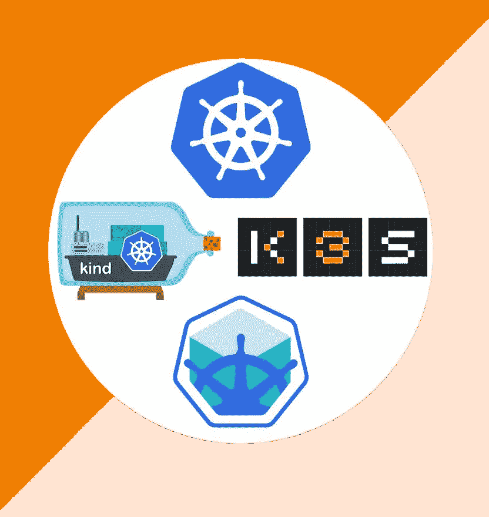

图片来自[https://www . jambit . com/en/latest-info/toilet-papers/minikube-vs-kind-vs-k3s-which-local-kubernetes-cluster-should-I-use/](https://www.jambit.com/en/latest-info/toilet-papers/minikube-vs-kind-vs-k3s-which-local-kubernetes-cluster-should-i-use/)

# 种类

> [kind](https://sigs.k8s.io/kind) 是一个使用 Docker 容器“节点”运行本地 Kubernetes 集群的工具。Kind 主要是为测试 Kubernetes 本身而设计的，但也可以用于本地开发或 CI。
> 
> kind 通过使用 Docker 容器作为“节点”来运行本地 Kubernetes 集群。

先决条件

此设置基于 ubuntu 18.04。在本练习中，我们将在本地创建一个 Kubernetes 集群，然后研究集群中的基本组件，之后我们将使用 YAML 文件在集群中创建一个 nginx pod，然后我们将销毁该集群。要在本地创建 Kubernetes 集群，请使用下面提到的命令:

*   Ubuntu Linux 18.04
*   码头工人

装置

*   安装 docker

```
#apt update -y
#apt update docker.io
```

*   安装[种类](https://kind.sigs.k8s.io/)

```
#curl -Lo ./kind [https://kind.sigs.k8s.io/dl/v0.14.0/kind-linux-amd64](https://kind.sigs.k8s.io/dl/v0.14.0/kind-linux-amd64)
#chmod +x ./kind
#mv ./kind  /usr/bin/kind
```

*   如果没有安装，请安装 Kubectl

```
#curl -LO "https://dl.k8s.io/release/**$(**curl -L -s https://dl.k8s.io/release/stable.txt**)**/bin/linux/amd64/kubectl"#sudo install -o root -g root -m 0755 kubectl /usr/local/bin/kubectl
```

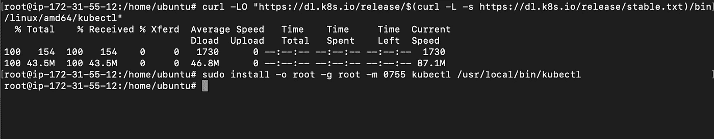

## 1)在本地创建集群

*   运行 kind 命令创建集群

```
#kind create cluster
```

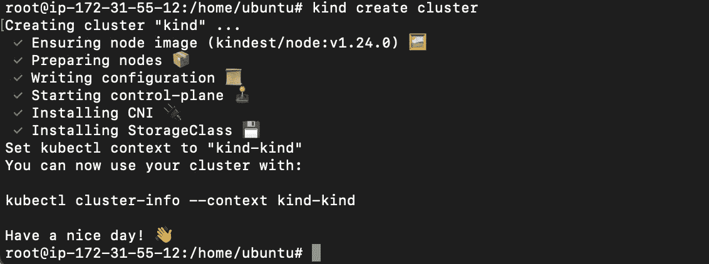

*   在本地部署我们的集群后，我们可以使用下面提到的命令来枚举该集群中的 pod 数量:

```
#kubectl get pods 
```

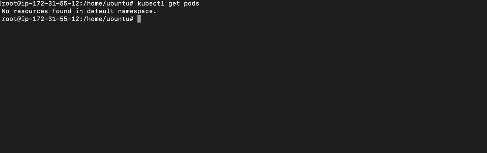

在默认命名空间中未找到资源，因此，我们没有在默认命名空间中安排任何 pod，让我们尝试使用下面提到的命令列出此群集的所有命名空间中存在的所有 pod:

```
#kubectl get pods -A
```

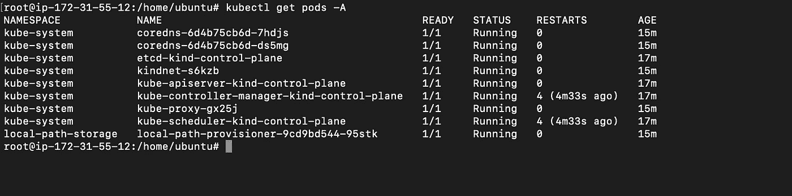

检查此群集中存在的节点数量:

```
#kubectl get nodes -o wide
```

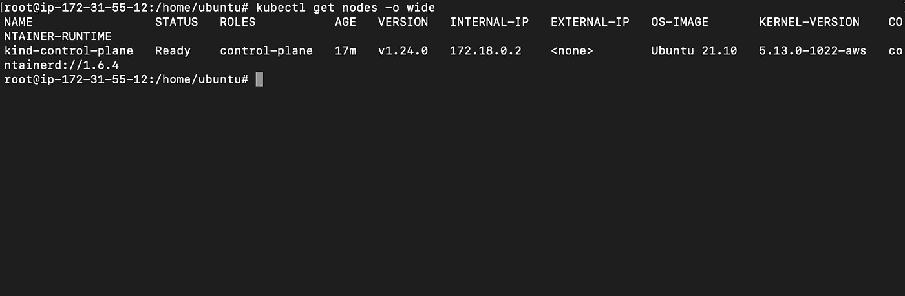

目前，我们没有在集群的默认名称空间中运行的 pods，但是在 kube-system 名称空间中运行了多个容器。

创建一个 YAML 文件，以便在 Kubernetes 集群中创建 nginx pod:

```
cat <<EOF >/tmp/nginx-web.yaml
apiVersion: v1
kind: Pod
metadata:
  name: nginx
spec:
  containers:
    - name: static-web
      image: nginx
EOF
```

## 使用下面提到命令在我们的集群中创建 nginx pod:

```
kubectl create -f /tmp/nginx-web.yaml
```

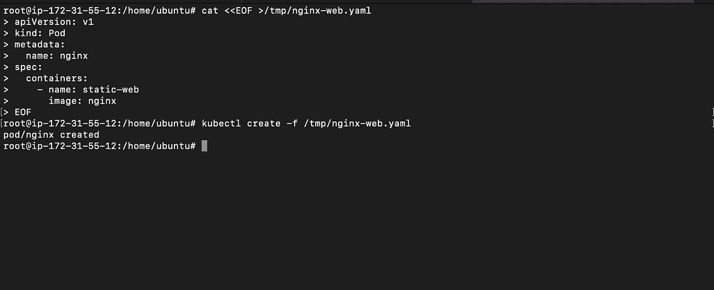

检查集群内的 pod:

```
kubectl get pods
```

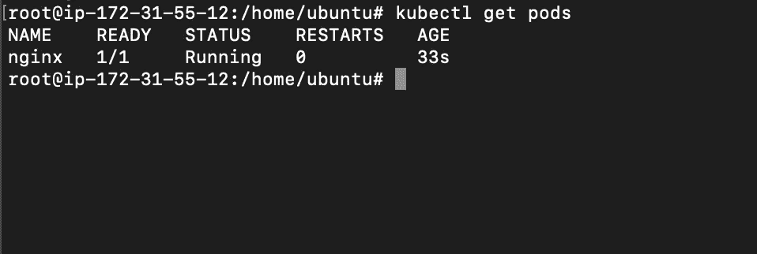

因此，我们在集群内部创建了一个 pod。

```
kind delete cluster
```

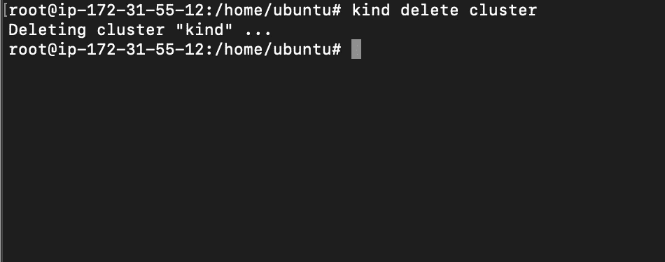

# 2.迷你库贝

**Minikube** 是一个 **Kubernetes SIGs 项目**，它产生了一个 VM，该 VM 本质上是一个**单节点 K8s 集群**。它使用可以在所有主要操作系统上使用的**虚拟机管理程序**。您可以**并行创建多个实例**。

## 额外补贴

*   **2 个或更多 CPU**
*   2GB 的可用内存
*   20GB 的可用磁盘空间
*   容器或虚拟机管理器，如: [Docker](https://minikube.sigs.k8s.io/docs/drivers/docker/) 、 [Hyperkit](https://minikube.sigs.k8s.io/docs/drivers/hyperkit/) 、 [Hyper-V](https://minikube.sigs.k8s.io/docs/drivers/hyperv/) 、 [KVM](https://minikube.sigs.k8s.io/docs/drivers/kvm2/) 、 [Parallels](https://minikube.sigs.k8s.io/docs/drivers/parallels/) 、 [Podman](https://minikube.sigs.k8s.io/docs/drivers/podman/) 、 [VirtualBox](https://minikube.sigs.k8s.io/docs/drivers/virtualbox/) 或[VMware Fusion/Workstation](https://minikube.sigs.k8s.io/docs/drivers/vmware/)


*   安装 docker 以避免错误。

```
#apt install docker.io#sudo usermod -aG docker $USER && newgrp docker
```

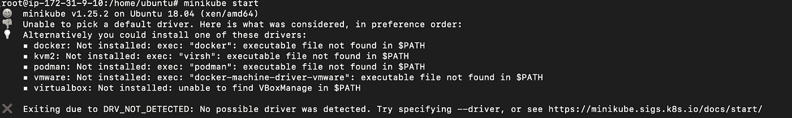

## 装置

```
curl -LO https://storage.googleapis.com/minikube/releases/latest/minikube_latest_amd64.deb
sudo dpkg -i minikube_latest_amd64.deb
```

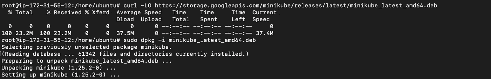

启动 minikube 以创建集群

> 以非 root 用户身份运行 minikube。

```
#minikube start
```

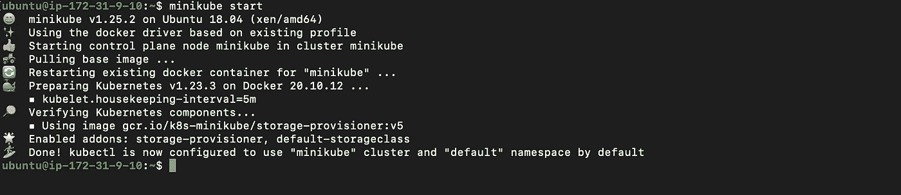

```
kubectl get nodes -o wide
```

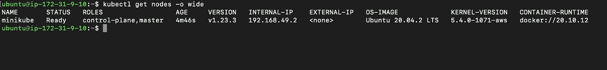

让我们创建一个 YAML 文件，以便在 Kubernetes 集群中创建 nginx pod:

```
cat <<EOF >/tmp/nginx-web.yaml
apiVersion: v1
kind: Pod
metadata:
  name: nginx
spec:
  containers:
    - name: static-web
      image: nginx
EOF
```

## 使用上述文件安排 nginx pod:

```
kubectl create -f /tmp/nginx-web.yaml
```

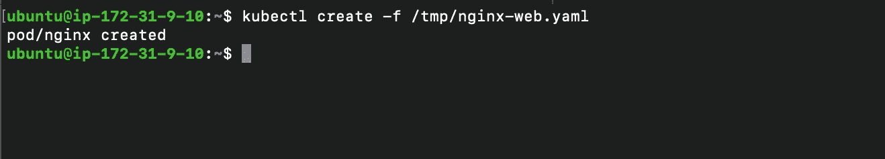

```
kubectl get pods
```

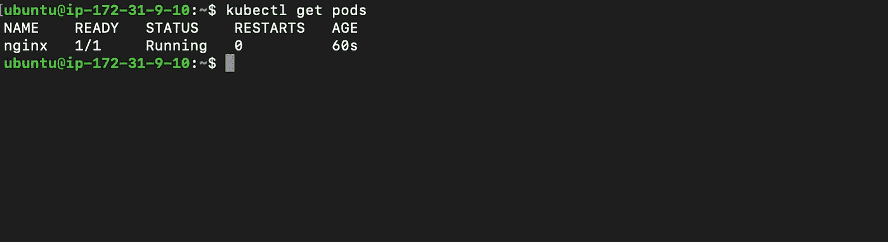

# 3.Kubeadm

## 额外补贴

*   2 个或更多 CPU
*   2GB 的可用内存
*   20GB 的可用磁盘空间

```
#sudo apt-get update
#sudo apt-get install -y apt-transport-https ca-certificates# Remove all other versions of docker from your system
sudo apt-get remove -y docker docker-engine \
  docker.io containerd runc

# Add docker GPG key
curl -fsSL https://download.docker.com/linux/ubuntu/gpg \
  | sudo gpg --dearmor \
  -o /usr/share/keyrings/docker-archive-keyring.gpg

# Add docker apt repository
echo \
  "deb [arch=amd64 signed-by=/usr/share/keyrings/docker-archive-keyring.gpg] https://download.docker.com/linux/ubuntu $(lsb_release -cs) stable" \
  | sudo tee /etc/apt/sources.list.d/docker.list

# Fetch the package lists from docker repository
sudo apt-get update

# Install docker and containerd
sudo apt-get install -y docker-ce docker-ce-cli containerd.io
```

# 为 kubeadm 配置 docker

我们必须对 docker 进行一些配置更改，以使其与 Kubernetes 一起工作，否则 kubeadm 飞行前检查将会失败。

```
# Configure docker to use overlay2 storage and systemd
sudo mkdir -p /etc/docker
cat <<EOF | sudo tee /etc/docker/daemon.json
{
    "exec-opts": ["native.cgroupdriver=systemd"],
    "log-driver": "json-file",
    "log-opts": {"max-size": "100m"},
    "storage-driver": "overlay2"
}
EOF# Restart docker to load new configuration
sudo systemctl restart docker# Add docker to start up programs
sudo systemctl enable docker# Allow current user access to docker command line
sudo usermod -aG docker $USER
```

# 安装 kubeadm、kubelet 和 kubectl

您需要确保 kubeadm、kubelet 和 kubectl 的版本是兼容的。

```
# Add Kubernetes GPG key
sudo curl -fsSLo /usr/share/keyrings/kubernetes-archive-keyring.gpg \
  [https://packages.cloud.google.com/apt/doc/apt-key.gpg](https://packages.cloud.google.com/apt/doc/apt-key.gpg)# Add Kubernetes apt repository
echo "deb [signed-by=/usr/share/keyrings/kubernetes-archive-keyring.gpg] [https://apt.kubernetes.io/](https://apt.kubernetes.io/) kubernetes-xenial main" \
  | sudo tee /etc/apt/sources.list.d/kubernetes.list# Fetch package list
sudo apt-get updatesudo apt-get install -y kubelet kubeadm kubectl# Prevent them from being updated automatically
sudo apt-mark hold kubelet kubeadm kubectl
```

# 确保禁用交换

必须禁用交换功能，因为 Kubernetes 不支持它。详见[关于 Kubernetes](https://github.com/kubernetes/kubernetes/issues/53533) 上 swap 的 GitHub 问题。

```
# See if swap is enabled
swapon --show# Turn off swap
sudo swapoff -a# Disable swap completely
sudo sed -i -e '/swap/d' /etc/fstab
```

运行下面提到的命令以避免错误:

> 此外，在 Kubeadm 未知服务运行时的情况下，v1alpha2.RuntimeService #4581 错误

```
rm /etc/containerd/config.toml
systemctl restart containerd
kubeadm init
```

# 使用 kubeadm 创建集群

```
kubeadm init --pod-network-cidr=10.244.0.0/16
```

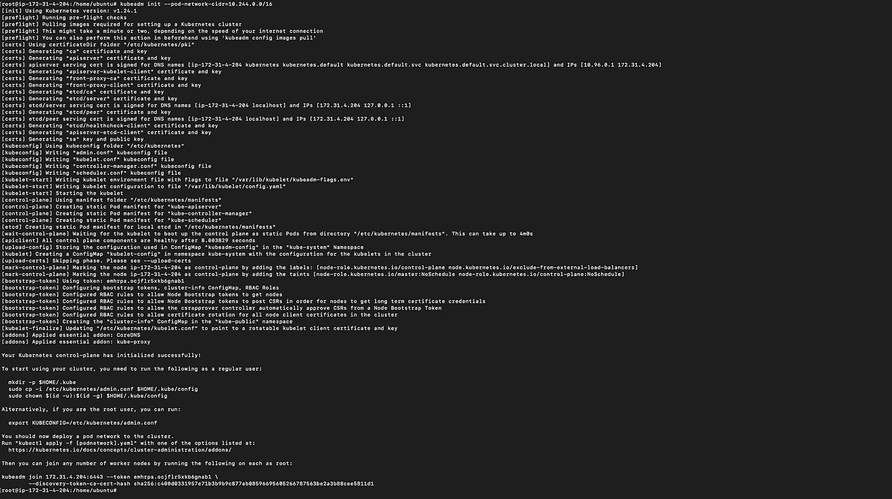

然后重新运行该命令

```
mkdir -p $HOME/.kube
cp -i /etc/kubernetes/admin.conf $HOME/.kube/config
chown $(id -u):$(id -g) $HOME/.kube/config
kubectl apply -f https://raw.githubusercontent.com/coreos/flannel/master/Documentation/kube-flannel.yml
kubectl apply -f https://raw.githubusercontent.com/coreos/flannel/master/Documentation/k8s-manifests/kube-flannel-rbac.yml
kubectl taint nodes --all node-role.kubernetes.io/master-
kubectl get nodes
```

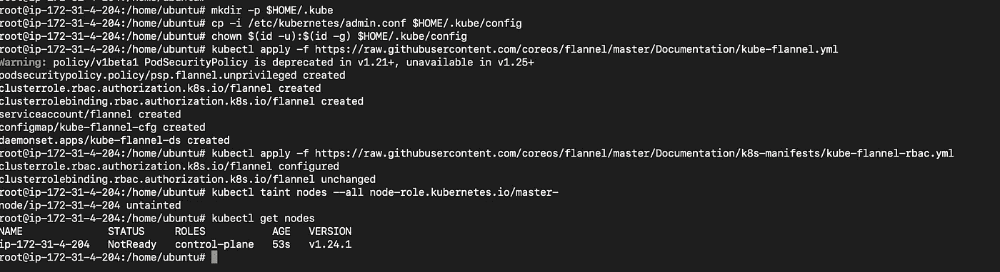

要重置集群，请执行以下操作:

```
kubeadm reset
```

# 4.K3s

K3s 是经过认证的高可用性 Kubernetes 发行版，专为无人值守、资源有限、远程位置或物联网设备内部的生产工作负载而设计。

运行命令，安装完成。

```
curl -sfL https://get.k3s.io | sh -
```

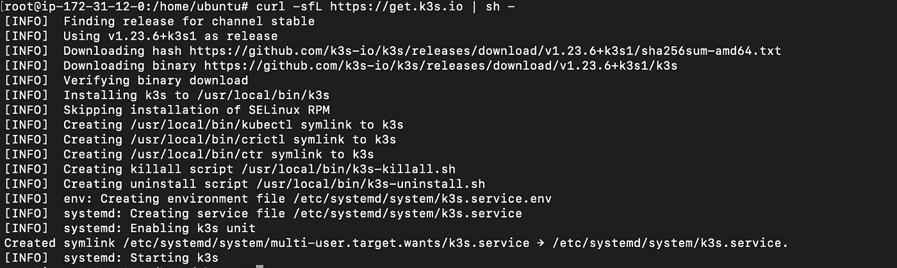

现在，让我们创建一个 YAML 文件来在 Kubernetes 集群中创建 nginx pod:

```
cat <<EOF >/tmp/nginx-web.yaml
apiVersion: v1
kind: Pod
metadata:
  name: nginx
spec:
  containers:
    - name: static-web
      image: nginx
EOF
```

## 使用上述文件安排 nginx pod:

```
kubectl create -f /tmp/nginx-web.yamlkubectl get pods
```

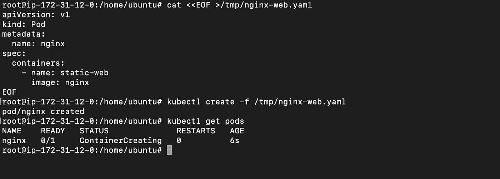

## 参考:

*   [https://blog . rad well . codes/2021/05/provisioning-single-node-kubernetes-cluster-using-kube ADM-on-Ubuntu-20-04/](https://blog.radwell.codes/2021/05/provisioning-single-node-kubernetes-cluster-using-kubeadm-on-ubuntu-20-04/)
*   [https://k3s.io/](https://k3s.io/)
*   [https://www.containiq.com/post/kubeadm](https://www.containiq.com/post/kubeadm)
*   [https://www . jambit . com/en/latest-info/toilet-papers/minikube-vs-kind-vs-k3s-which-local-kubernetes-cluster-should-I-use/](https://www.jambit.com/en/latest-info/toilet-papers/minikube-vs-kind-vs-k3s-which-local-kubernetes-cluster-should-i-use/)