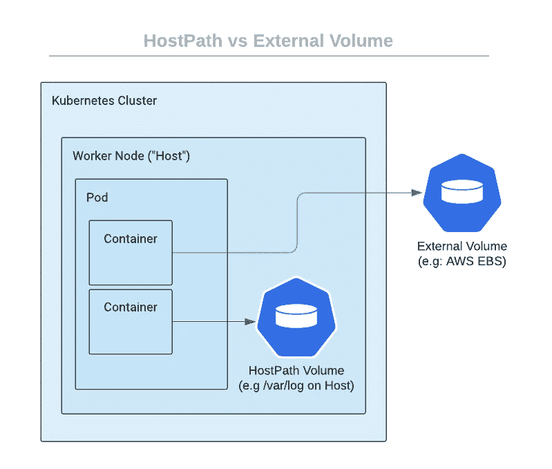
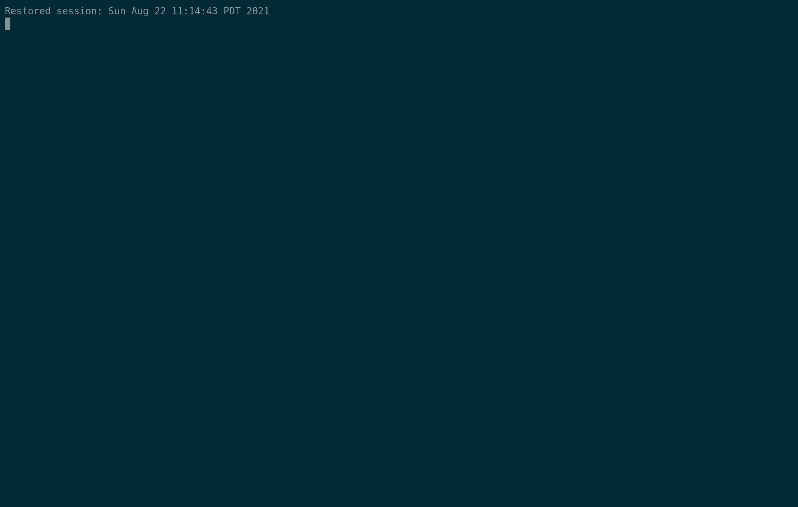

# 带有主机路径挂载的 Kubernetes 容器转义

> 原文：<https://infosecwriteups.com/kubernetes-container-escape-with-hostpath-mounts-d1b86bd2fa3?source=collection_archive---------3----------------------->

如果您使用 Kubernetes，将主机文件系统作为一个卷安装到容器中应该会让您夜不能寐。我来解释一下原因。



## 什么是“卷”？

因为容器应该是短暂的和无状态的，所以它们需要某种方法在容器之外保存数据。在某些情况下，他们甚至需要**持久的**数据存储，即使在容器重启后也能被访问。

有许多不同的卷类型，例如 awsElasticBlockStore 卷类型。此外部卷类型将 EBS 卷装入您的容器。如果您的容器重新启动，新的容器将挂载 EBS 卷来备份从以前的容器保存的数据。

但是也有可能使用本地存储来实现持久性。这意味着使用 Kubernetes worker 节点的主机文件系统。使用这个本地**主机路径**卷类型引入了一些有趣的安全隐患。Kubernetes 文档甚至提出了这样的警告:

> **警告:**
> 
> 主机路径卷存在许多安全风险，最佳做法是尽可能避免使用主机路径。当必须使用 HostPath 卷时，它的范围应该仅限于所需的文件或目录，并且以只读方式装载。

如果您有兴趣深入了解容器挂载是如何工作的，我建议您研究一下 linux 名称空间原语，特别是挂载名称空间。但是这对于理解这篇博文的其余部分是不必要的。

## 如何创建卷？

可以在 pod 的 Kubernetes yaml 清单中声明卷。您可以指定`.spec.volumes`和`.spec.containers[*].volumeMounts`来指定它是哪种类型的卷，以及在容器中的什么位置安装它。

这里有一个 pod 的例子，它创建了一个容器，将主机的根目录挂载到容器内部的`/host`。

```
**apiVersion**: v1
**kind**: Pod
**metadata**:
  **name**: test-pd
**spec**:
  **containers**:  
  - **image**: alpine
    **name**: test-container
    **command**: ["tail"]
    **args**: ["-f", "/dev/null"] 
    **volumeMounts**:
    - **mountPath**: /host
      **name**: test-volume
  **volumes**:
  - **name**: test-volume
    **hostPath**:
      *# directory location on host*
      **path**: /
      *# this field is optional*
      **type**: Directory
```

如果我们运行这个 pod 并在其中执行一个 shell，我们可以看到我们可以访问主机的根文件系统。


因此……任何能够创建不受限制地访问主机路径卷的 pod 的人都可以轻松提升他们的权限。

## 这怎么能被利用…真的吗？

希望没有人真的将根文件系统直接挂载到他们的容器中。一个更现实的例子是作用于特定目录的 HostPath 卷。例如，让我们修改原始示例:

```
**apiVersion**: v1
**kind**: Pod
**metadata**:
  **name**: test-pd
**spec**:
  **containers**:  
  - **image**: alpine
    **name**: test-container
    **command**: ["tail"]
    **args**: ["-f", "/dev/null"] 
    **volumeMounts**:
    - **mountPath**: /var/log/host
      **name**: test-volume
  **volumes**:
  - **name**: test-volume
    **hostPath**:
      *# directory location on host*
      **path**: /var/log
      *# this field is optional*
      **type**: Directory
```

从安全的角度来看，这个例子仍然有缺陷，但是我已经看到它在专业领域的合理使用。

不管出于什么原因，这个 pod 可以访问主机的`/var/log`目录。一旦我们考虑 Kubernetes 日志记录实际上是如何工作的，这就特别有趣了。运行`kubectl logs test-pd` 时，kubelet 返回/var/log/pods/<path _ to _ 0 . log>的内容。但是从主机的角度来看，pod 的 0.log 文件是一个符号链接。由于我们挂载了/var/log 并拥有写访问权限，因此我们可以将日志文件 symlink 覆盖到任意文件。让我们用/etc/shadow 的符号链接替换这个 test-pd 的日志文件符号链接。



在这里，我们可以读取/etc/shadow 的内容。完整的内容无法打印，因为它们不是预期的日志格式，但这可以通过使用`kubectl logs <pod> --tail=<line number>`查看完整的内容来解决。

## 缓解措施

有几种方法可以防止与主机路径卷相关的潜在错误配置。

1.  **将主机路径卷的范围限定到特定目录。**

确保指定一个必要的`spec.volumes.hostpath.path`目录。否则，请避免一起使用主机路径。

2.**确保主机路径卷是只读的。**

装载卷时，您可以将其设置为只读模式。

```
**volumeMounts**:
    - **mountPath**: /var/log/host
      **name**: test-volume
      **readOnly**: true
```

***奖励点:使用容器优化操作系统，如 Google 的容器优化操作系统或 AWS 的 Bottlerocket，它们默认包含只读根文件系统。

3.**通过准入控制器限制对主机路径卷的访问。**

随着 PodSecurityPolicies 现在被弃用，并且目前没有确定的标准，我建议使用[开放策略代理网关守卫](https://github.com/open-policy-agent/gatekeeper)或 [Kyverno](https://kyverno.io/) 来定义关于 HostPath 卷的策略。

这是一个完全拒绝 HostPath 的 Kyverno 集群策略。

 [## 不允许主机路径

### ⭐️如果你喜欢 Kyverno，在 GitHub 上给它一颗星吧！⭐️ Kyverno 吊舱安全政策类别最低版本主题…

kyverno.io](https://kyverno.io/policies/pod-security/baseline/disallow-host-path/disallow-host-path/) 

## 额外资源

有一篇很棒的 Aquasec 博客文章深入探讨了利用日志主机路径错误配置的问题。

[](https://blog.aquasec.com/kubernetes-security-pod-escape-log-mounts) [## Kubernetes 吊舱逃生使用日志安装

### Kubernetes 有许多活动部件，有时以某种方式组合它们会产生意想不到的安全缺陷。在…

blog.aquasec.com](https://blog.aquasec.com/kubernetes-security-pod-escape-log-mounts) 

BishopFox 很好地描述了更多的主机路径利用。

[](https://github.com/BishopFox/badPods/tree/main/manifests/hostpath) [## 主 BishopFox/badPods 的 bad pods/manifest/host path

### 在这种情况下，即使您无权访问主机的进程或网络名称空间，如果管理员没有…

github.com](https://github.com/BishopFox/badPods/tree/main/manifests/hostpath)