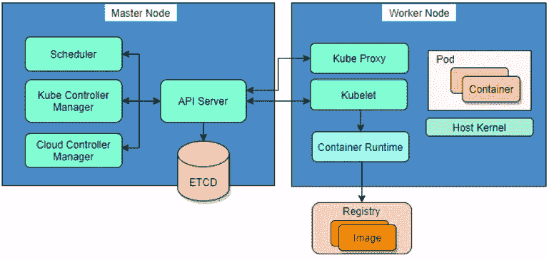

# Kubernetes 安全公司

> 原文：<https://infosecwriteups.com/kubernetes-security-df58a8e5f379?source=collection_archive---------1----------------------->

这篇博客文章从安全的角度介绍了 Kubernetes 中的安全特性和最佳实践。

# 1.保护集群

# 1.1 Kubernetes 组件



Kubernetes 是一个可移植、可扩展的开源平台，用于管理容器化的工作负载和服务。Kubernetes 集群通常由一组工作节点和一个主节点组成，提供容错和高可用性。控制平面托管重要组件，如 API 服务器、etcd、kube-scheduler 和 kubelet 等。，它负责做出有关集群的决策，并将其推向所需的状态。

在 Kubernetes 的早期，默认配置使 Kubernetes 的控制平面不安全。尽管从安全性的角度来看，默认设置已经有所改进，但是仍然值得在您的 Kubernetes 环境中检查一下配置。

# 1.2 安全 API 服务器

API 服务器验证和配置 API 对象的数据。它通过 HTTP 公开 RESTful APIs，执行所有操作，并将 API 对象存储到持久存储中。当您使用命令行与 Kubernetes 集群进行交互时，您实际上是在与 API 服务器进行通信。

控制 API 服务器相当于在集群中的每台机器上进行根访问。

要保护 API 服务器:

1.  对所有 API 流量使用传输层安全性(TLS)

*   安全端口

默认情况下，集群中的所有 API 通信都将使用 TLS 进行加密，安全端口用于为 https 提供身份验证和授权。如果禁用它，所有流量都不加密。因此，请确保 **—安全端口**参数(默认端口为 6443)未设置或设置为 1 到 65535 之间的整数值，对于旧版本，请确保 **—不安全端口**为 0，以禁用不需要身份验证和授权的 localhost:8080。

*   HTTPS 流量加密

使用 **— tls-cert-file** ， **— tls-private-key-file** 为 HTTPS 连接配置 x509 证书和私钥。

2.启用对 API 服务器的身份验证

Kubernetes 使用客户端证书、不记名令牌或认证代理来通过认证插件认证 API 请求。

通过将 **— client-ca-file** 参数传递给 API 服务器来启用客户端证书认证。

要禁用匿名访问，将 **— anonymous-auth** 设置为 false。

3.批准请求

授权检查用户是否被允许执行特定的任务。有几种授权模式:节点、ABAC、RBAC、Webhook。

通过使用**节点**作为 **—授权模式**之一，限制 Kubelet 节点只能读取与其相关的对象。

使用 **RBAC** 允许不同的实体在集群中执行不同的对象。

确保 **—授权模式**参数未设置为 **AlwaysAllow** 。

4.验证请求的准入控制

准入控制保证经过身份验证和授权的用户正确安全地执行任务。Kubernetes API 服务器使用**—enable-admission-plugins**来定义在修改集群中的对象之前要调用的准入控制插件的逗号分隔列表。

准入控制插件 **AlwaysAdmit** 允许所有请求，不过滤任何请求。所以确保**—enable-admission-plugins**参数被设置，其值不包括**always admission**。在不同的场景中，可以使用其他插件来保护集群。

# 1.3 保护 Kubelet

Kubelet 是每个节点上的代理，它与容器运行时交互以启动 pods，并确保 Kubernetes 创建的容器运行正常。

kubelet 最小化攻击面的一些配置选项:

1.  使用证书启用身份验证

检查 **— client-ca-file** 参数，并将其设置为客户端证书颁发机构文件的位置。如果没有 **— client-ca-file** 参数，请检查 Kubelet 配置文件是否将**身份验证:x509: clientCAFile** 设置为客户端证书颁发机构文件的位置。

设置 **— anonymous-auth** false 以禁用匿名访问。

将 **—只读端口**置 0，关闭只读端口，防止匿名用户访问正在运行的工作负载信息。

2.启用对 kubelet API 的授权

默认情况下，允许所有经过身份验证的请求。为了限制该行为，请确保 **—授权模式**存在并设置为 **Webhook** 而不是 **AlwaysAllow** 。

3.限制 kubelet 权限

将 **NodeRestriction** 包含在 API server**—admission-control**设置中，这样 kubelet 将只被允许修改自己的节点 API 对象，并且只修改绑定到自己节点的 Pod API 对象。

在 API 服务器**中包含**节点**—授权模式**参数仅允许 kubelets 读取与其节点相关联的 Secret、ConfigMap、PersistentVolume 和 PersistentVolumeClaim 对象。

4.证书轮换

Kubelet 使用客户端证书与 API 服务器通信，从 1.8 开始，kubelet 使用 **— rotate-certificates** 标志启用自动证书轮换，因此当到期截止日期临近时，将自动请求和颁发新证书。

# 1.4 保护 Etcd

Etcd 是一种高度可用的键值永久存储，用于存储高度敏感的配置数据。不幸的是，etcd 错误配置仍然猖獗。应该对它应用与任何其他数据存储相同的安全原则。

1.  加密传输中的信息

*   客户端到服务器

设置 **—证书文件**和 **—密钥文件**参数，以确保与 etcd 的 SSL/TLS 连接。

*   服务器对服务器

设置 **—对等证书文件**和 **—对等密钥文件**参数，以确保与 etcd 的 SSL/TLS 连接。

2.启用身份验证

*   客户端到服务器

检查所有由可信 CA 签署的客户端证书的传入 HTTPS 请求。通过将 **— client-cert-auth** 参数设置为 true 并使用 **— trusted-ca-file** 参数指定已签署客户端证书的可信 CA，启用 etcd 服务上的客户端身份验证。

设置 **— auto-tls=false** 禁止生成和使用自签名证书。

*   服务器对服务器

与客户端到服务器的身份验证类似，对于服务器到服务器的身份验证，将 **— peer-client-cert-auth** 设置为 true，使用 **— peer-trusted-ca-file** 参数为对等方指定可信 CA。

3.加密静态敏感数据

如果您将 Kubernetes 的机密存储在 etcd 而不是外部机密存储中，加密存储在磁盘上的 etcd 数据尤为重要。

**—encryption-provider-config**控制如何在 etcd 中加密 API 数据。该配置作为 API 服务器的一个名为 EncryptionConfiguration 的 API 提供。

```
/usr/local/bin/kube-apiserver  --encryption-provider-config=/var/lib/kubernetes/EncryptionConfiguration-example.yaml ...
```

encryption configuration-example . YAML 结构如下:

```
apiVersion: apiserver.config.k8s.io/v1
kind: EncryptionConfiguration
resources:
  - resources:
      - secrets
    providers:
      - identity: {}
      - aescbc:
          keys:
            - name: key1
              secret: c2VjcmV0IGlzIHNlY3VyZQ==
           ...
```

使用本地管理的密钥加密机密无法防止主机受损，因此如果可以的话，请使用 KMS 来获得额外的安全性。

# 2.认证和授权

如何配置认证和授权已经在**安全集群**->-**安全 API 服务器**中说明。这里只概述了与身份验证和授权相关的其他主题。

对于认证请求的 API 服务器，请求发布者需要拥有一个身份。

# 2.1 服务账户

在 Kubernetes 中，服务帐户用于为位于 pod 内的容器中的任何流程或应用程序提供身份。服务帐户是命名空间资源。

为了在不指定服务帐户的情况下自动管理服务帐户，应该将 **ServiceAccount** 包含在 API 服务器的**—enable-admission-plugins**中，并且不使用**—disable-admission-plugins**参数将其关闭。

创建服务帐户令牌以访问 API，并将其作为卷安装到 pod。如果 pod 遭到破坏，在 pod 内安装服务帐户令牌可以作为提升权限的途径。如果在 pod 中运行的工作负载不需要与 API 服务器通信，请在 ServiceAccount 或 Pod 定义上将**automountserviceaccountoken**设置为 false，以退出自动挂载令牌。

或者，您可以创建自己的服务帐户，并根据最小特权原则授予它特定的角色，而不是使用默认的服务帐户。

# 2.2 角色和集群角色

Kubernetes 使用 Role 和 ClusterRole 来管理对 API 的身份(用户或工作负载)访问。角色或集群角色包含一组规则来表示不同的附加权限(没有“拒绝”规则)。当创建角色或集群角色时，避免使用通配符来匹配所有项目。使用**通配符**可能会导致无意中获得访问新资源的权限。

API 服务器创建一组默认的 ClusterRole，其中一些属于被硬编码到 API 服务器源代码中的 **system:masters** 组，可以不受限制地对任何资源执行任何操作。

**系统的成员资格:masters** 组在与客户端证书认证模式结合时是非常危险的，因为这种类型的客户端证书不能被撤销。应该避免让任何用户成为 **system:masters** 组的成员，而是授予某人集群管理权限，这与使用 **system:masters** 组具有相同的效果。

# 3.安全运行容器

为了在 Kubernetes 中安全地运行容器，您需要执行以下操作:

*   使用最低特权来执行任务
*   根据需要进行最小主机装载
*   限制应用程序之间以及与外部之间的通信。

从 pod 的角度来看，安全性的主要问题是防止容器内运行的进程逃离隔离边界并获得对底层主机的访问权。pod 规范中有多种属性可以限制 pod 的容量。

*   特权容器拥有完全的访问权限，可以做宿主可以做的几乎所有事情。应防止 pod 在**特权**模式下运行，并且通常不应在**allowprivilegescalation**标志设置为真的情况下运行容器。
*   同样，其他主机资源应该被限制为与容器共享，如 **hostNetwork** 、 **hostPID** 、 **hostIPC** 、 **hostPort** 、 **hostPath** 。
*   **runAsNonRoot**/**MustRunAsNonRoot**为真或者 uid 范围不包括 0 的 **MustRunAs** 阻止容器作为非根用户运行。
*   从最低特权原则的角度来看，应该最小化容器允许的能力，不适当的能力可以被利用来执行特权提升或容器突破。
*   sysctl 接口允许管理员在运行时修改内核参数，如果使用不当，它可以禁用安全机制，应该只允许安全的**sysctls**子集。
*   容器不是沙箱，当在容器中运行不受信任的程序时，沙箱提供的额外隔离可以防止恶意代码伤害主机。 **gVisor** ，一个沙盒运行时工具，通过 **runsc** handler(简称“运行*沙盒容器*”)作为 **RuntimeClass** 与 Kubernetes 集成，在应用程序与其主机之间创建一个强大的安全边界。
*   使用 CPU / RAM 限制来防止 DOS。这些值应该是容器化应用程序工作的最小值。 **LimitRange** 和 **ResourceQuota** 可用于管理租户工作负载的资源使用情况。

对于网络通信，默认情况下，Kubernetes 集群中的所有 pod 发送和接收流量没有限制。网络分段对于确保所有 pod 仅与它们应该通信的精选 pod 通信非常重要。您还可以使用网络策略来阻止云平台中元数据 API 的流量。

所有名称空间都应该有**网络策略**，以确保只允许合法的流量。但是使用 NetworkPolicy 的前提条件是正在使用的 CNI 必须支持这样的功能。Calico 是支持网络政策的 CNI 之一。

# 4.容器运行时安全性

容器运行时是每个节点中的底层软件。运行容器是容器运行时的责任。运行时安全性是为了检测和防止恶意活动在容器内部发生。这些是 Linux 内核安全特性，也可以通过 SecurityContext 进行设置，为容器提供主动保护:

*   安全计算模式(seccomp)是一种限制进程访问系统调用的机制。它的工作原理是拦截系统调用，只允许那些被允许的系统调用通过
*   安全增强的 Linux (SELinux)是细粒度强制访问控制(MAC)的实现。
*   AppArmor 允许系统管理员使用每个程序的配置文件来限制程序的能力，这些配置文件决定了应用程序需要什么文件和权限。由于建筑设备配置文件具有挑战性，建议您使用类似于 [bane](https://github.com/genuinetools/bane) 的工具。

# 5.安全图像

在多租户集群中，私有映像只应由拥有凭证的用户使用。为了禁止未授权用户使用图像，使用 API 服务器的 **AlwaysPullImages** 准入插件。此外，AlwaysPullImages 可以确保获得与特定标签相匹配的最新版本的图像。

当您从公共注册中心或内部私有注册中心获取现成的图像时，您可以依靠签名图像来确保这些图像是真实的和预期的。一个更好的解决方案是，尝试让 kubernetes 只从一个可信的注册表中提取图像，并阻止所有其他图像。

当您构建您的映像时，在第一个“from”语句中从一个经过全面审查的注册表中开始一个安全的基础映像是很重要的。

集装箱图像扫描仪用于检查图像中包含的包裹。一些扫描程序还报告已知的恶意软件或敏感数据的存在。自动扫描仪应定期扫描文档和图像。

# 6.机密管理

如果您的应用程序代码需要访问凭证和其他机密信息，您有两种选择:将机密存储在 etcd 或第三方存储中。主要的云提供商都有密钥管理系统，将它们用于机密信息，与 etcd 一起用于不太敏感的信息。限制读写 RBAC 的秘密。

将机密传递给应用程序代码时，最好使用机密作为挂载的机密文件，而不是来自环境变量，因为注销环境以暴露机密是很常见的，并且永远不要将敏感信息(密码、令牌、证书)存储在映像中。

# 7.记录和监控 API 访问事件

Kubernetes 中有不同的日志来源。应用程序、工作负载和 Kubernetes 组件生成自己的日志。入口流量是非常重要的日志来源。Kubernetes 事件详细描述了资源状态的错误和变化。审计日志包括对 Kubernetes 的 API 调用。

日志应定期轮换，以确保它们在删除前得到存储。一些日志，比如事件日志和审计日志，应该存储在 Kubernetes 集群之外的持久位置。在所有集群节点上依靠第三方安全监控工具( **Falco** 、 **Aqua Enterprise** )是一种选择。

来自 Infosec 的报道:Infosec 上每天都会出现很多难以跟上的内容。 [***加入我们的每周简讯***](https://weekly.infosecwriteups.com/) *以 5 篇文章、4 个线程、3 个视频、2 个 Github Repos 和工具以及 1 个工作提醒的形式免费获取所有最新的 Infosec 趋势！*