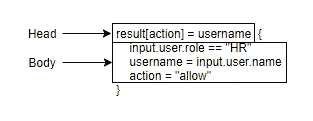
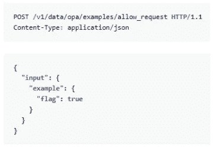
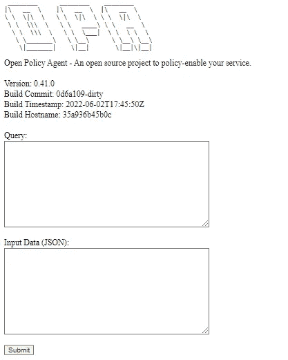
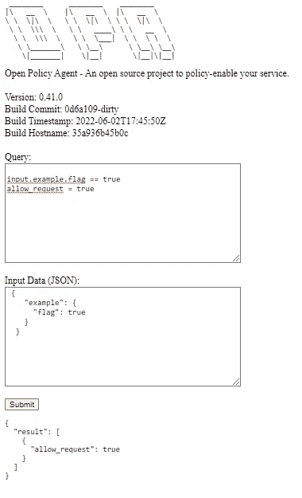

# 使用 OPA 执行 Kubernetes 安全策略

> 原文：<https://infosecwriteups.com/kubernetes-security-policy-enforcement-opa-70975ec51272?source=collection_archive---------1----------------------->


# 1.通过 OPA 将策略作为代码

Kubernetes 是一个著名的编排引擎，可以自动部署、管理和扩展容器化的工作负载。云原生容器正在被大规模使用，这使得保护 Kubernetes 环境变得势在必行。

随着技术和安全形势的不断变化，各种机构提供了标准化的框架和指南来帮助管理动态的 Kubernetes 生态系统安全。

有各种各样的安全框架可供 Kubernetes 使用，如 CIS、NIST 和米特 ATT&CK。但是，如何使 Kubernetes 生态系统遵守基于手册的安全指南和法规对 Kubernetes 专业人员来说可能是一个挑战。并不是每个人都有足够的资源来研究这些安全指南的细节，并确定在有限的资源下哪些是最重要的。警察作为代码发挥作用，以帮助执行合规标准。这种方法背后的理由是以编程语言(如 Yaml 或减压阀)的形式表示策略，并利用策略即代码执行引擎来确保策略在整个环境中得到满足。

在 Kubernetes 系统中，当通过发送请求与 API 服务器交互时，在 API 请求访问系统之前有三个步骤:认证、授权和准入控制。

第三步中的准入控制器是 Kubernetes 编排系统的插件，用于管理和实施集群的使用方式。它充当看门人的角色，在 API 请求通过身份验证和授权后对其进行解释，根据预定义的策略对其进行修改或检查，以在它进入集群之前拒绝或允许它。

开放策略代理(OPA)是准入控制器插件之一。在它的帮助下，减压阀语言可以用来实现政策作为代码。它管理跨不同系统的策略实施，预先检查请求是否违反策略或限制。正如其他准入控制器插件一样，OPA 确保在创建、更新和删除工作负载时符合策略。

本文介绍了 OPA 和一些简单的用例，以及如何将 OPA 作为准入控制器集成到 Kubernetes 系统中。

# 2.OPA 是如何工作的

OPA 是一个策略引擎，它允许用户或其他系统查询策略，以便对作为输入的数据做出决策。用户使用减压阀定义策略，通过这些策略，减压阀检查数据输入并将其转换为结构化文档，评估它是否符合或违反自定义策略。

策略可以被认为是一组规则。由于 OPA，策略可以在不同的应用程序之间共享，从一个中心位置分发，与应用程序业务逻辑隔离。

OPA 可以作为一个库嵌入，作为一个守护进程部署，或者简单地在命令行上运行，理解 OPA 最简单的方法是使用[减压阀游乐场](https://play.openpolicyagent.org/)试验不同的策略创建。

在深入简单的 OPA 用例之前，介绍一些 OPA 的核心概念是有帮助的。

# 2.1 政策

策略是用减压阀编写的，每个减压阀文件使用一组规则定义一个策略模块，这些规则可用于评估某个状态或输入。

一个简单的策略文件示例:

```
package example
​
allow[result] = true {
    input.user.role == "HR"
    result = "allow HR"
}
```

如果你不理解这里的语法，不要担心，稍后会有更多的介绍。

# 2.2 规则

规则是 if=then 逻辑语句。规则期望它们的输入来自于`input`对象。用户可以使用一个标识符查询 OPA 中加载的任何规则的值或决策，该标识符是从根数据节点`data.<package-path>.<rule-name>`开始的绝对分层路径。请注意根数据节点，它是 OPA 中的重要组件。

规则有头有体。



“结果”是规则的名称，头中的“动作”和“用户名”将对象结构定义为规则的值，格式为{" <value of="" action="">":" <value of="" username="">"}，规则查询响应的一部分如下:</value></value>

```
{
    "result": 
    {
         "<value of action>":"<value of username>"
    }
}
```

[规则可以是“完整的”也可以是“部分的”](https://www.openpolicyagent.org/docs/latest/#rules)。对于部分规则，有集合生成规则，它在查询响应中返回一个集合作为规则的值，还有对象生成规则，就像上面的例子一样。

**注意**:规则是函数的超集，不要把[和](https://www.openpolicyagent.org/docs/latest/faq/#functions-versus-rules)混淆，后者是一个带参数的规则。一个函数示例:

```
result(str) = true {
    str == "GET"
}
```

# 2.3 文件

文档是 OPA 中的基本数据单位。OPA 围绕 JSON 等结构化文档中表示的信息进行推理。OPA 中有两种类型的文档:基础文档和虚拟文档。

## 基础文档

基本文档包含存储在内存中的静态结构化数据。基础文档可用于描述当前状态。

## 虚拟文档

虚拟文档是通过评估策略模块中包含的规则来计算的。规则可以生成结构化数据，通常基于被查询规则可用的其他规则、数据或内置函数。

## 数据文档

数据是一个全局变量，数据文档像树一样分支在不同的层中，基础文档和虚拟文档都可以使用数据作为分层结构中的根来访问，您可以通过`/v1/data` HTTP API(如/v1/data/foo)或标识符(如`data.foo`)来查询它们。

## 输入文档

在某些情况下，当用户查询规则决策时，策略需要来自输入文档的输入值。要提供输入值，请在请求体中使用 POST HTTP request for OPA query 和 input。



## 文档 API

[数据 API](https://www.openpolicyagent.org/docs/v0.13.5/rest-api/#data-api) 公开了在 OPA 中读写基本和虚拟文档的端点。

一个常见的用例是通过数据 API 查询规则，您可以使用`/v1/data/<package-path>/<rule-name>`，如果规则需要输入对象，那么创建一个 POST 请求，将输入作为请求体，将返回一个计算的虚拟文档。

下面的图表解释了如何使用数据 API 调用规则。


# 3.OPA 使用案例

OPA 可以在不同的部署环境中运行。您可以在自己的机器上使用命令行直接与 OPA 交互，或者将它作为服务器运行，使用 HTTP 请求与它交互。

# 3.1 使用命令行与 OPA 交互

从 [Github releases](https://github.com/open-policy-agent/opa/releases) 下载一个 OPA 二进制，并通过命令行与之交互，非常方便。在某些情况下，如果下载的 OPA 不能在您的本地机器上正常工作，使用 docker 容器在内部运行 OPA 可能是一个更简单的选择。

在主机上的当前目录下准备一个 OPA 目录，进入该目录并下载一个 OPA 二进制文件，然后更改该二进制文件的模式。

```
> cd OPA
​
# choose v0.37.2 in order to run it inside ubuntu:18.04 container
> curl -L -o opa [https://github.com/open-policy-agent/opa/releases/download/v0.37.2/opa_linux_amd64](https://github.com/open-policy-agent/opa/releases/download/v0.37.2/opa_linux_amd64)
​
> chmod 755 ./opa
```

此处选择了 unbuntu 18.04 容器，运行映像并从主机将＄PWD/opadir 挂载为容器内的/opadir:

```
> docker run -it -v $PWD/opadir:/opadir -p 8181:8181 ubuntu:18.04
​
> cd /opadir
```

导航到容器中的/opadir 目录后，可以看到 OPA 二进制文件驻留在当前目录中。

完整的 OPA CLI 列表可在[这里](https://www.openpolicyagent.org/docs/latest/cli/#opa-eval)找到。我们仅使用`opa eval`来演示如何基于上述核心概念使用 opa CLI。

可以用`opa eval`子命令评估减压阀查询，可以使用- data 标志设置策略或数据文件，递归加载所有*。rego，*。json 或*。yaml 文件，或者分别加载它们。

例如:

政策 1.rego

```
package opa.examples
​
import input.example.flag
​
allow_request { flag == true }
```

输入 1.json

```
{
    "example": {
      "flag": true
    }
  }
```

按如下方式运行 OPA:

```
> ./opa eval -i input1.json -d policy1.rego 'data.opa.examples.allow_request'
{
  "result": [
    {
      "expressions": [
        {
          "value": true,
          "text": "data.opa.examples.allow_request",
          "location": {
            "row": 1,
            "col": 1
          }
        }
      ]
    }
  ]
}
```

响应中表达式块中的`"value": true`是指 data . OPA . examples . allow _ request 规则的 OPA 查询值。

# 3.2 作为服务器与 OPA 交互

`opa run`命令启动 OPA 运行时的一个实例，它可以是交互式 shell 或服务器。

要运行服务器，在本地或 docker 容器中使用`opa run --server`子命令行。

```
docker run -it -v $PWD/opadir:/opadir  -p 8181:8181 openpolicyagent/opa  run --server --log-level debug
```

默认情况下，OPA 服务器侦听 0.0.0.0:8181 上的 HTTP 连接。浏览 [http://localhost:8181](http://localhost:8181) ，如果一切正常，可以看到如下 GUI:



如果您在单击提交按钮时拦截流量，您将发现 POST /v1/query 请求被发送到后端服务器，以允许您执行特别查询并返回查询的值。有一个简单的例子，使用 GUI 根据输入数据执行查询。



除了从 GUI 发送的/v1/query 请求之外，您还可以使用前面提到的文档 API 部分中提到的数据 API 与 OPA 服务器进行交互。当服务器启动时，没有数据和策略，所以首先要做的是使用/v1/policies 端点通过 PUT 请求将策略文件推送到服务器。例如

```
> curl -X PUT [http://localhost:8181/v1/policies/policy-1](http://localhost:8181/v1/policies/policy-1) --data-binary @policy1.rego
```

policy1.rego 与上面的示例相同。policy-1 是存储在 OPA 服务器中的策略名称。

通过执行下面的检查策略是否已经成功推送，您将得到策略-1 的原始数据:

```
> curl [http://localhost:8181/v1/policies/policy-1](http://localhost:8181/v1/policies/policy-1)
{"result":{"id":"policy-1","raw":"package opa.examples\n\nimport input.example.flag\n\nallow_request { flag == true }\n","ast":{"package":{"path":[{"type":"var","value":"data"},{"type":"string","value":"opa"},{"type":"string","value":"examples"}]},"rules":[{"head":{"name":"allow_request","value":{"type":"boolean","value":true}},"body":[{"terms":[{"type":"ref","value":[{"type":"var","value":"eq"}]},{"type":"ref","value":[{"type":"var","value":"input"},{"type":"string","value":"example"},{"type":"string","value":"flag"}]},{"type":"boolean","value":true}],"index":0}]}]}}}[
```

创建一个新的输入文件:input2.json，之前的 input1.json 和 input2.json 的区别在于，input2.json 将 input1.json 的内容包装到“input”块中。

```
{
    "input": 
    {
        "example": 
        {
            "flag": true
        }
    }
}
```

针对 input2.json 查询 allow_request 规则决策:

```
> curl -X POST [http://localhost:8181/v1/data/opa/examples/allow_request](http://localhost:8181/v1/data/opa/examples/allow_request)  -d @input2.json   -H 'Content-Type: application/json'
​
{"result":true}
```

# 4.作为 Kubernetes 许可控制器运行 OPA

现在是时候回到赛道上，并使用 OPA 的 Kubernetes 安全警察执法。OPA 是一个通用策略引擎，它可以跨各种 IT 环境自动化和统一策略的实施。Kubernetes 准入控制是 OPA 的用例之一。

OPA 可以作为准入控制器直接与 Kubernetes 集成，或者使用 OPA Gatekeeper。

OPA Gatekeeper 的创建是为了增强和促进 OPA 与 Kubernetes 的集成。您可以从[网守网站](https://open-policy-agent.github.io/gatekeeper/website/docs/install/)找到安装指南，但在某些情况下，要重用减压阀规则文件，将 OPA 直接集成到 Kubernetes 系统中可能是更简单的解决方案。OPA 直接集成到 Kubernetes 的过程比较漫长，所以这里跳过这一部分。在 [OPA 网站](https://www.openpolicyagent.org/docs/latest/kubernetes-tutorial/)有详细阐述。

关于 OPA 网站[上的集成指南有两点需要指出。](https://www.openpolicyagent.org/docs/latest/kubernetes-tutorial/)

第一个是当提供 OPA 包时，使用网站中提供的命令可能会引起一些麻烦:

```
docker run --rm --name bundle-server -d -p 8888:80 -v ${PWD}:/usr/share/nginx/html:ro nginx:latest
```

当在 admission-controller.yaml 中启动 OPA 服务器时，无法通过用标志指定的[http://host . minikube . internal:8888/bundle . tar . gz](http://host.minikube.internal:8888/bundle.tar.gz)成功访问以这种方式提供服务的 OPA 包。

```
- "--set=services.default.url=http://host.minikube.internal:8888"
- "--set=bundles.default.resource=bundle.tar.gz"
```

捆绑文件服务的失败将导致 OPA 容器不能在 pod 内成功运行。

相反，您可以使用 Python SimpleHTTPServer 来服务包文件。

第二个是当组合多个策略时，指南定义了 main.rego，但是 main.rego 在某些情况下可能不起作用。例如，要对 disallowed_wildcard_host.yaml 执行以下 block-wildcard-ingress.rego，除非交换两个入口规则，否则 OPA 不会像预期的那样阻止入口的创建。这两个文件提供如下，原始文件可以在 github 的[看门人库库中找到](https://github.com/open-policy-agent/gatekeeper-library/tree/master/library/general/block-wildcard-ingress)

block-通配符-ingress.rego

```
package kubernetes.admission
​
deny[msg] {
  input.request.kind.kind == "Ingress"
  hostname := object.get(input.request.object.spec.rules[_], "host", "")
  contains_wildcard(hostname)
  msg := sprintf("Hostname '%v' is not allowed since it is a wildcard.", [hostname])
}
​
contains_wildcard(hostname) = true {
  hostname == ""
}
​
contains_wildcard(hostname) = true {
  contains(hostname, "*")
}
```

不允许的 _ 通配符 _host.yaml

```
apiVersion: networking.k8s.io/v1
kind: Ingress
metadata:
  name: wildcard-ingress
spec:
  rules:
  - host: '*.example.com'
    http:
      paths:
      - pathType: Prefix
        path: "/"
        backend:
          service:
            name: example
            port:
              number: 80
  # Extra test to ensure the rule still detects invalid hosts in files containing valid hosts
  - host: 'valid.example.com'
    http:
      paths:
      - pathType: Prefix
        path: "/"
        backend:
          service:
            name: example
            port:
              number: 80
```

在 [OPA 网站](https://www.openpolicyagent.org/docs/latest/kubernetes-tutorial/)上有很好的使用案例，关于如何使用 OPA 来阻止基于减压阀规则文件捆绑包的 Kubernetes 系统内部的不合规操作。

Kubernetes 系统中的输入对象是一个保留的全局变量，其值等于[准入审查](https://kubernetes.io/docs/reference/access-authn-authz/extensible-admission-controllers/#admissionreview-request-0)对象。API 服务器获取该对象，并将其提供给任何准入控制 webhook。

比如在 [OPA 网站](https://www.openpolicyagent.org/docs/latest/kubernetes-tutorial/)的 ingress-allowlist.rego 文件中，在“拒绝”规则内部，可以找到 input . request . kind . kind = =“Ingress”，这是 AdmissionReview 对象的一个用例。

Kubernetes 中 OPA 的完整输入对象如下所示:

```
{  
 "input": {
    "apiVersion": "admission.k8s.io/v1",
    "kind": "AdmissionReview",
    "request": {
      "dryRun": false,
      "kind": {
        "group": "",
        "kind": "ConfigMap",
        "version": "v1"
      },
      "name": "ingress-controller-leader",
      "namespace": "ingress-nginx",
      "object": {
        "apiVersion": "v1",
        "kind": "ConfigMap",
        "metadata": {
          "annotations": {
            "control-plane.alpha.kubernetes.io/leader": "{\"holderIdentity\":\"ingress-nginx-controller-cc8496874-6f992\",\"leaseDurationSeconds\":30,\"acquireTime\":\"2022-06-18T04:43:42Z\",\"renewTime\":\"2022-06-18T14:56:30Z\",\"leaderTransitions\":0}"
          },
          "creationTimestamp": "2022-06-18T04:43:42Z",
          "namespace": "ingress-nginx",
            ...
        }
      },
      "oldObject": {
        ...
      },
      "operation": "UPDATE",
       ...
    }
  }
}
```

您可以按照 OPA 日志获取完整的 webhook 请求:

```
kubectl logs -l app=opa -c opa -f
```

**感谢阅读，希望这篇博客能帮助你与 OPA 合作。**