# LAMPSECURITY: CTF4 [Vulnhub]演练

> 原文：<https://infosecwriteups.com/lampsecurity-ctf4-vulnhub-walkthrough-284c0decbcf8?source=collection_archive---------2----------------------->

朋友们，你们好，我是苏迪帕·希兰塔卡，我带来了另一项 CTF 挑战。这叫做 LAMPSECURITY ctf4，是一个从引导到根的初级挑战。你可以从 [Vulnhub](https://www.vulnhub.com/entry/lampsecurity-ctf4,83/) 找到这个盒子。

## **方法论**

*   网络扫描和枚举
*   浏览 HTTP 端口 80 服务
*   SQLMAP 扫描
*   从数据库中检索用户数据
*   通过 SSH 登录到目标机器
*   利用 SUDO 二进制文件开发目标
*   提升 root 权限

## **网络扫描和枚举**

首先，我们扫描网络以获取目标 IP。你可以使用 netdiscover。

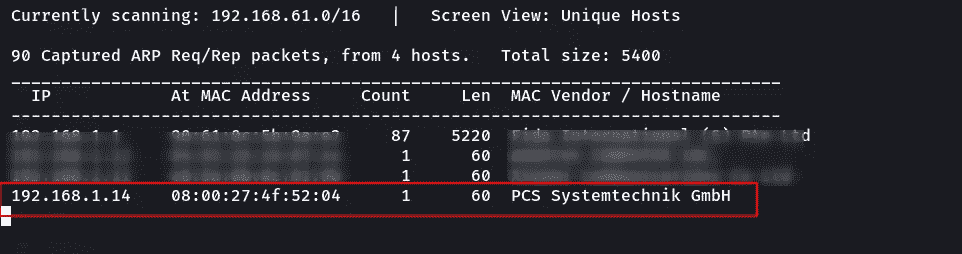

图 1-使用 netdiscover 进行网络扫描

在得到我们的目标之后，通过 Nmap 扫描网络，寻找开放的端口和服务。我们将能够找到端口 22(SSH)、端口 80 (HTTP)、端口 25 (SMTP)的开放端口。

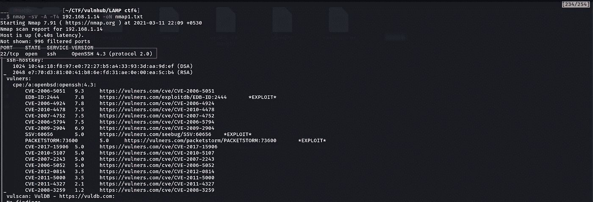

图 2-端口 22 打开(ssh)

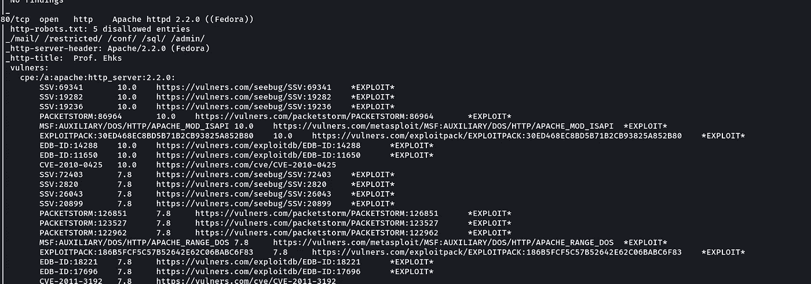

图 3-端口 80 打开(HTTP)

虽然我们发现端口 22 是打开的，但是我们不能通过 ssh 登录，因为我们不知道用户名和密码:(

所以，我在网上冲浪，因为我们有另一个开放端口 80。

## **浏览 HTTP 端口 80 服务**

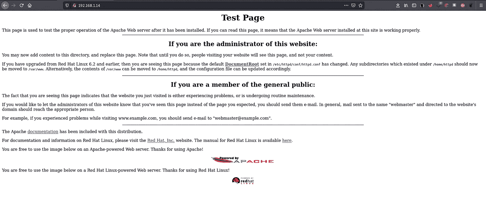

图 4-网页(初始)

当我们在网上冲浪时，它会弹出一个测试页面，Apache 服务器正在后台运行。我照例总是搜索 **robots.txt** 。Robots.txt 是网站管理员创建的文本文件，用于指导网络机器人(通常是搜索引擎机器人)如何在其网站上抓取页面。

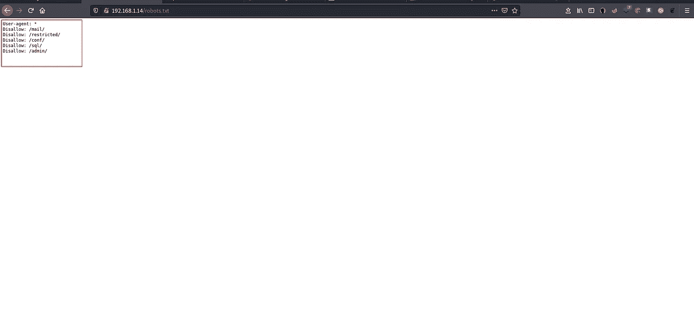

图 5-robots.txt 结果

因为我认为我能够在 robots 文件中找到有趣的目录。他们是，

*   /邮件/
*   /受限/
*   /sql/
*   /admin/
*   /conf/

得到这些目录后，我会查看每一个目录。

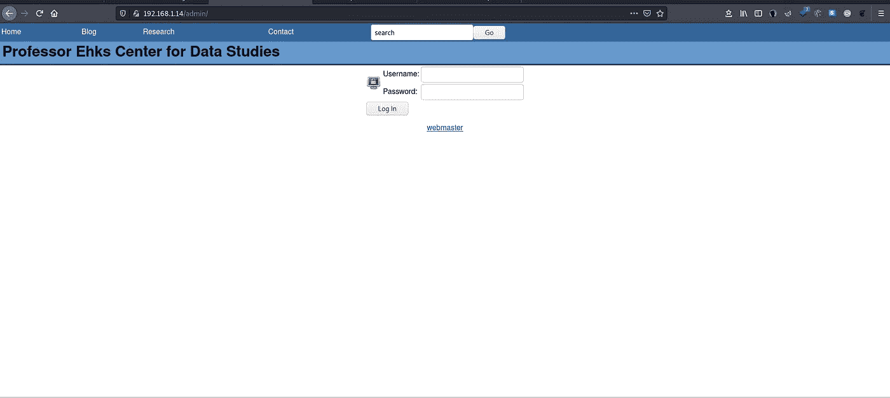

图 6-管理员登录

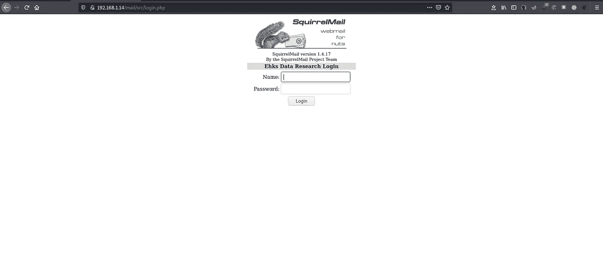

图 7-邮件登录

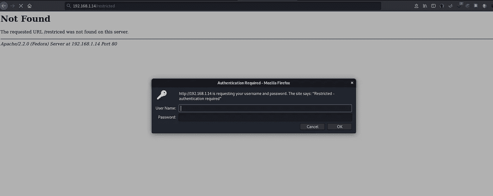

图 8-受限页面

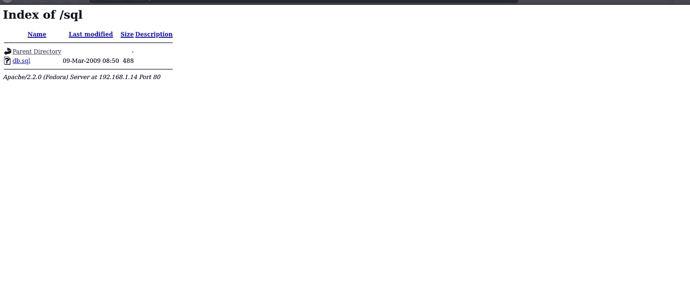

图 9-db.sql

因此，我发现有一个 SQL 数据库，我认为它可能容易受到 SQL 注入的攻击。

导航到 Blog 选项卡，通过进一步枚举，我发现 URL 参数“id”容易出现 SQL 注入错误，如下面的截图所示(图 11)。

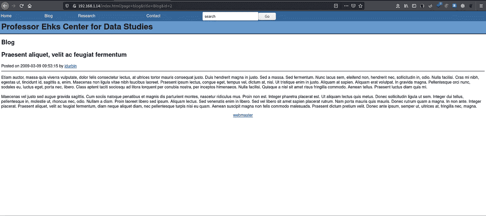

图 10-博客页面

然后，我尝试了以下命令来检查 SQL 注入是否存在。

*http://192 . 168 . 1 . 14/index . html？page = Blog&title = Blog&id = 2 '*

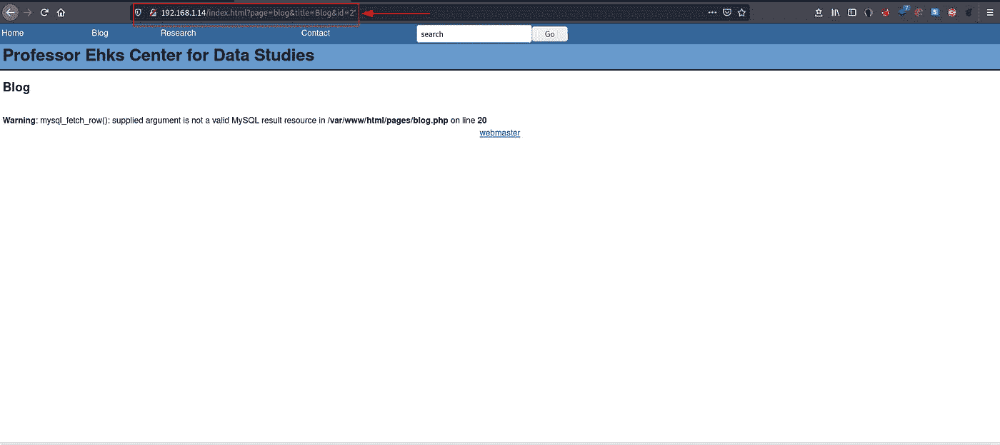

图 11-检查 SQL 漏洞是否存在

然后用 **SQLMAP** 命令枚举数据库以获得更多细节。

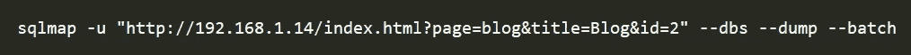

图 12-枚举数据库和检索数据

> *–DBS =枚举数据库*
> 
> *—转储=转储 DBMS 数据库表条目*
> 
> *— batch =从不要求用户输入，使用默认行为*

成功完成 SQLMAP 扫描后，我们获得了所有数据库的列表！

图 13-结果(ehks 数据库建立)

我们已经得到了数据库，现在我们尝试使用 ehks 数据库，用下面的命令提取其他细节。

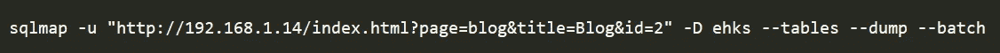

图 14-转储数据库的表

> *D = DB DBMS 数据库枚举*
> 
> *—表=枚举 DBMS 数据库表*

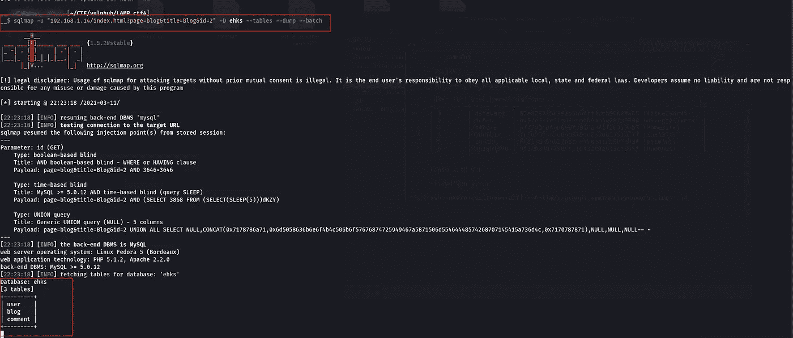

图 15-从 ehks 数据库中检索数据

哇！我们建立了三张桌子，

*   *用户*
*   *博客*
*   *评论*

在获得所有数据库的表之后，我们选择 ehks 数据库的**用户**表，并尝试用下面的命令提取更多的信息。

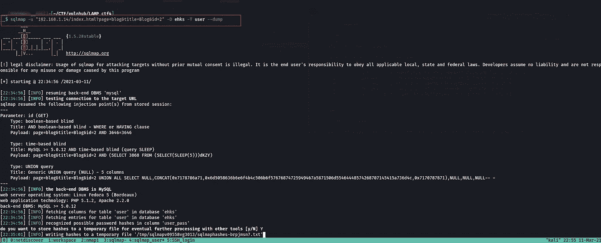

图 16-从用户表中检索数据

> *-T =要枚举的 TBL DBMS 数据库表*

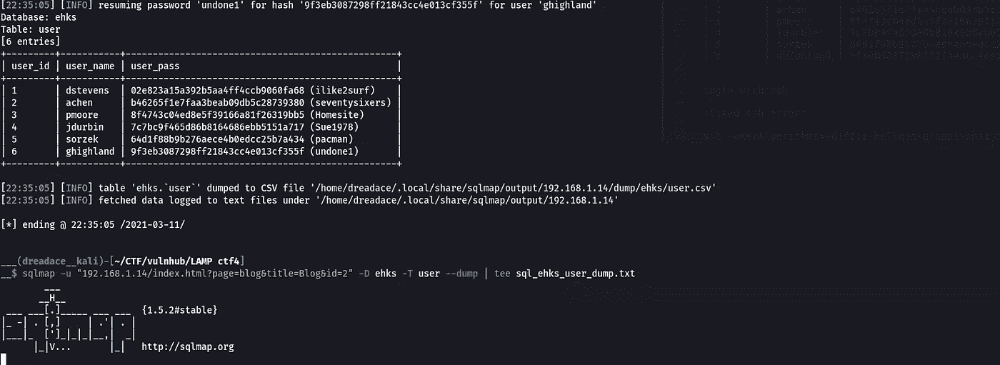

图 17-用户表条目的结果

嘣！最后，我们找到了用户表条目以及用户名和密码。

现在，使用给定的密码通过 ssh 登录是最容易的部分。

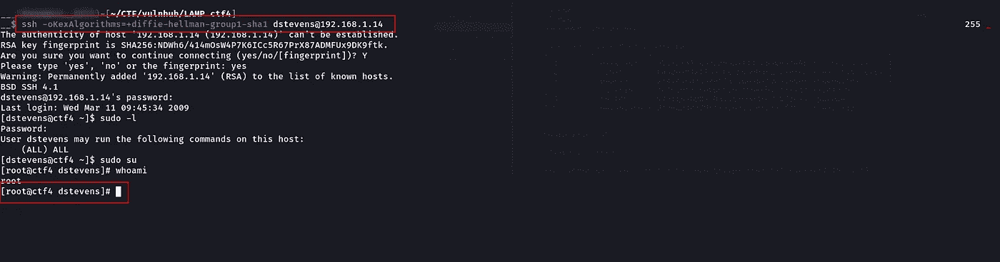

图 18-ssh 登录和提升权限

所以，我认为这将有助于提高你的知识，让我们来看看另一篇文章。下次见，再见👋开心点😃。