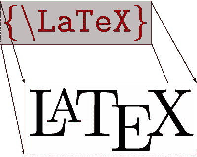
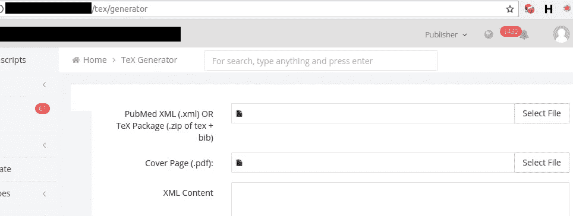
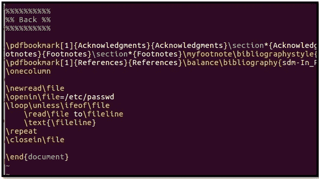
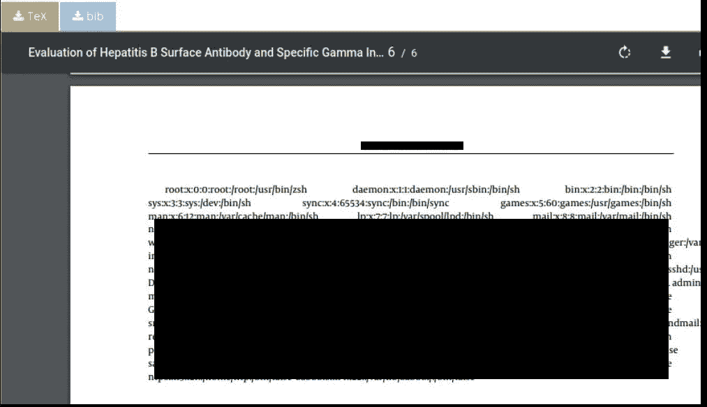
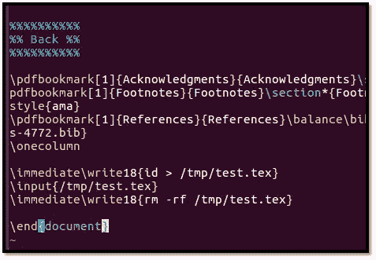
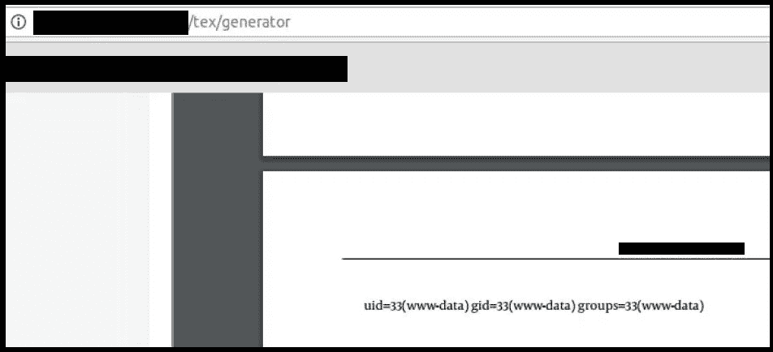
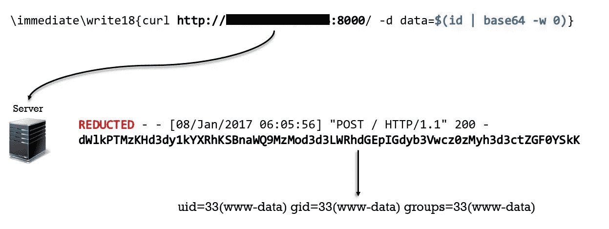
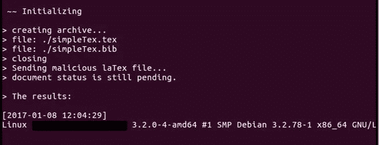

# 乳胶到 RCE，私人昆虫赏金计划

> 原文：<https://infosecwriteups.com/latex-to-rce-private-bug-bounty-program-6a0b5b33d26a?source=collection_archive---------0----------------------->

大约一年前，我参加了一个私人的 bug 赏金项目，我想把我学到的东西发表出来。CMS 是一个为作者、编辑等提供服务的期刊网站。我完成了获得编辑帐户的 XSS，我不打算通过这个故事。

在编辑的角色中，有许多选项，有趣的是“XML 检查器”和“将 LaTex 代码转换为 PDF”。第一个与我们的话题无关，第二个似乎很有趣。

将 LaTex 代码转换为 PDF

由于 LaTex 代码转换，远程攻击者可以远程执行命令，以下链接可能会有所帮助:

1.  [https://tex . stack exchange . com/questions/262625/security-latex-injection-hack](https://tex.stackexchange.com/questions/262625/security-latex-injection-hack)
2.  [https://0day.work/hacking-with-latex/](https://0day.work/hacking-with-latex/)
3.  [http://scum Jr . github . io/2016/11/28/pwning-collaborates-thanks-to-latex/](http://scumjr.github.io/2016/11/28/pwning-coworkers-thanks-to-latex/)

因此，我精心制作了如下所示的漏洞利用代码，以读取服务器中的本地文件:

导致了:

答对了，我要了`/etc/passwd`内容。命令执行的有效负载:

导致了:

# 带外技术

PDF 转换很烦人，我想升级我的特权，所以我通过

1.  编写利用漏洞的代码(LaTex 到 PDF)
2.  用 python 写一个服务器，接收结果，转换成明文，保存。

流程如下所示:

因此:

后来，我适应了这个利用，寻找服务器，我得到了数据库和弹性搜索由 SSRF 和乐趣。