# 懒惰管理员演练-Tryhackme

> 原文：<https://infosecwriteups.com/lazy-admin-walkthrough-tryhackme-158540d2ec24?source=collection_archive---------0----------------------->

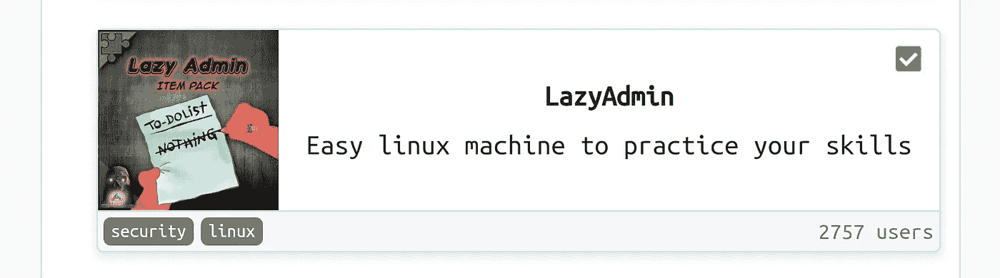

轻松的 Linux 机器来练习你的技能。

## 列举

我们做了 Nmap 扫描来了解开放的端口。

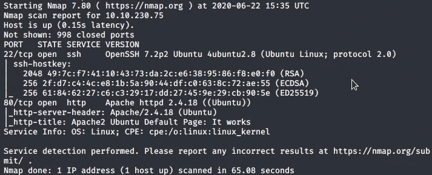

扫描显示 2 个打开的端口(端口 80)和(端口 22)端口 80 正在运行 Apache。在我们检查了端口 80 上的网页后，我们得到了 Apache 的默认网页。所以我们运行 Gobuster 来获取目录。

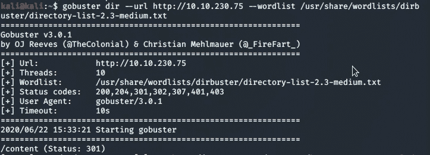

我们得到了一个名为“/content”的目录，所以我们通过浏览来检查这个目录。

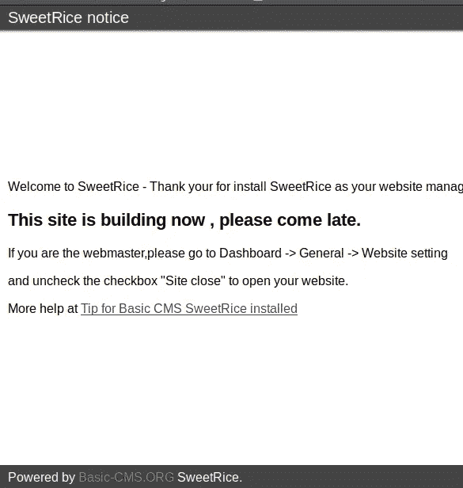

我们得到了一个 CMS SweetRice 的网页，这是一个用于管理网站的内容管理系统。所以我们对“/content”目录运行 Gobuster。

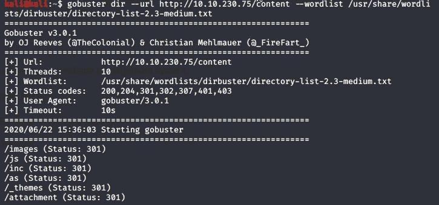

我们得到了更多的目录“/as”目录包含一个登录页面，但我们没有登录的凭据，所以我们检查了其他目录，我们检查了“/inc”目录。

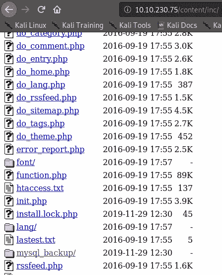

我们得到了一个“mysql_backup/”文件夹，因此我们检查了该文件夹。

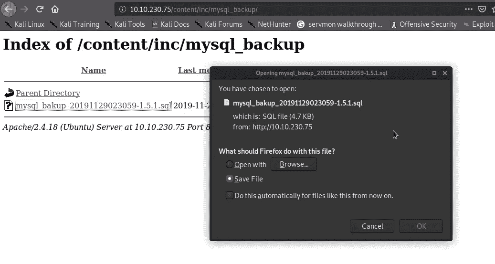

我们能够下载可能包含一些有用信息的文件，所以我们检查了 MySQL 备份数据库。

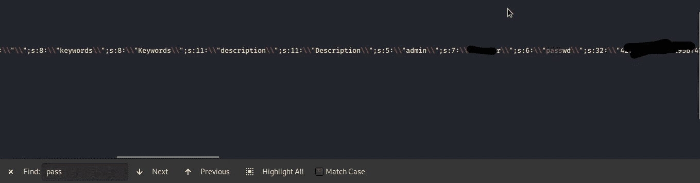

在下载的文件中，我们通过搜索获得了用户名和密码，但是密码在哈希中，所以我们使用哈希标识符来知道这是哪种类型的哈希。

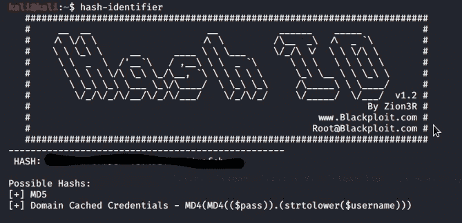

现在我们知道这是 MD5 哈希，我们也可以使用 crackstation 来破解这个哈希，但我们使用了开膛手约翰工具，这是最流行的密码破解工具之一。

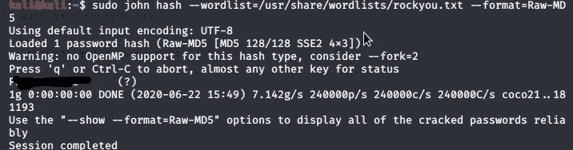

现在我们有了用户名和密码，所以我们可以尝试登录到我们找到的“/as”目录

提供凭据后，我们可以登录 SweetRice 的仪表板。

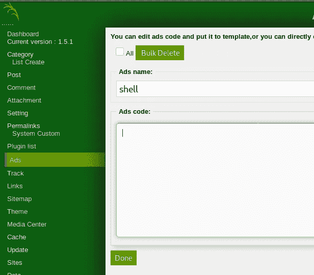

在 Ads 部分，我们可以添加一个脚本来获得反向连接。我已经从 [pentestmonkey](https://www.google.com/url?sa=t&source=web&rct=j&url=http://pentestmonkey.net/cheat-sheet/shells/reverse-shell-cheat-sheet&ved=2ahUKEwirgqHQ1pjqAhXLXCsKHWYsBk4QFjAAegQICBAD&usg=AOvVaw3oXoyESccCKauF2V8n4rj8) 下载了一个 Php 反向 shell 脚本，不要忘记更改脚本上的 Ip 地址和端口。

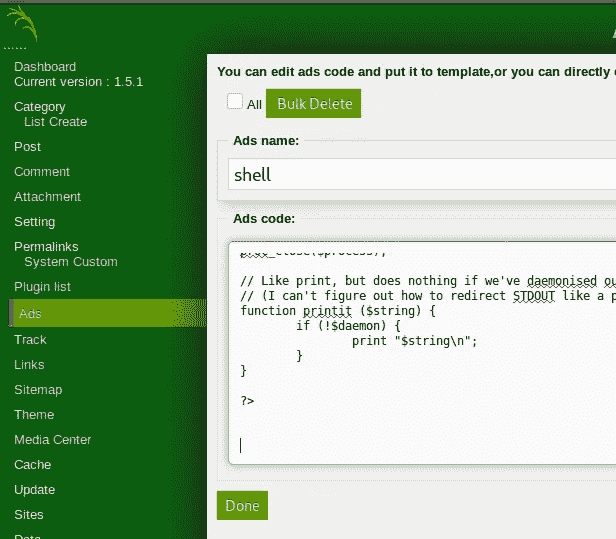

我们点击完成脚本上传。所以我们启动了一个 Netcat 监听器。

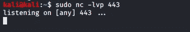

现在我们必须点击我们的反向外壳来获得连接。

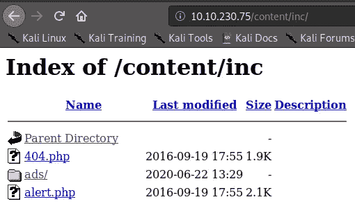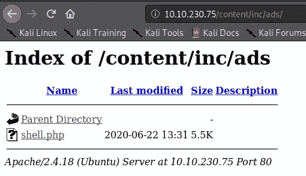

点击 shell.php 后，我们得到了一个反向的外壳。

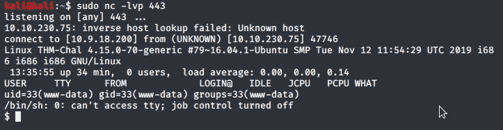

现在，您可以使用“cat user.txt”命令读取用户标志，我们还可以升级这个 shell。

> python3 -c '导入 ptypty.spawn("/bin/bash ")'

# 权限提升

因此，我们检查了“sudo -l”命令的权限

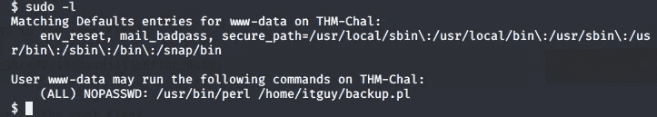

我们可以看到，有一个文件可以用 Perl 和 Sudo 来执行，因此我们使用“cat /home/itguy/backup.pl”命令检查了该文件。我们没有权限写入该文件。让我们来读取该文件。

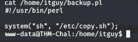

这个脚本运行一个 bash 脚本“/etc/copy.sh”让我们检查一下这个文件

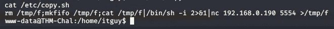

现在，我们检查了可以写入该文件并执行的权限。已经有一个反向 shell 脚本，因此我们只需更改 IP 地址和端口，它将为我们提供一个反向连接。我们尝试使用 nano 和 vim 编辑该文件，但没有成功，因此我们使用了“echo”命令。

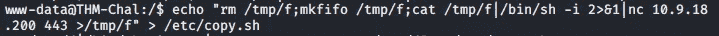

现在启动一个 Netcat 监听器来获得一个反向 shell 并执行这个文件

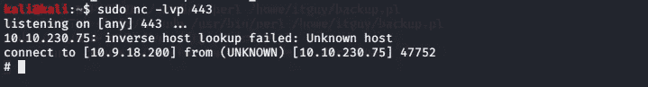

嗯，我们现在是根了！

我希望你已经学到了一些东西。