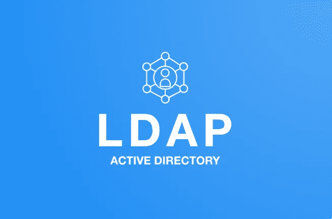
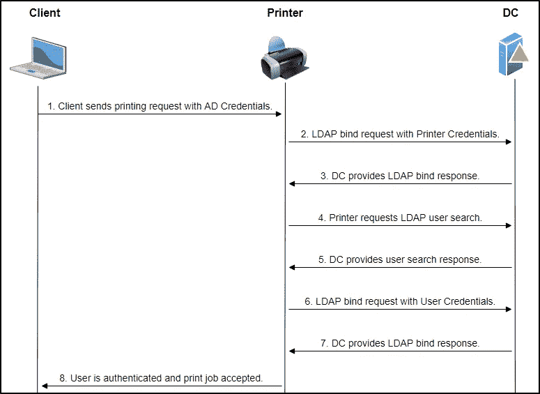

# 活动目录中的 LDAP

> 原文：<https://infosecwriteups.com/ldap-in-active-directory-f0de5729f72f?source=collection_archive---------0----------------------->



本文提供了轻量级目录访问协议(LDAP)的基本概述。在本文中，我们将探索 LDAP 的基本功能以及如何在 Active Directory (AD)环境中使用它。LDAP 是一个很大的主题，本文将只涉及基础知识，所以说，让我们开始吧！

# 什么是 LDAP？

微软对 LDAP 的描述如下:

> 轻型目录访问协议(LDAP)是一种直接在 TCP/IP 堆栈上运行的目录服务协议。它提供了一种用于连接、搜索和修改 Internet 目录的机制。

LDAP 的主要功能是使用户能够找到关于组织、个人等的数据。LDAP 是一种开放的跨平台协议，用于目录服务**认证**，并提供应用程序用来与其他目录服务服务器通信的通信语言。**目录服务**存储用户、密码和计算机帐户，并与网络上的其他实体(例如 Active Directory)共享这些信息。

# 为什么在 AD 环境中使用 LDAP？

LDAP 是 AD 背后的核心协议。目录访问是通过 LDAP 执行的—每当客户端在 AD 中搜索特定对象(比如用户或打印机)时，LDAP 就会被用来查询相关对象并返回正确的结果。

AD 支持 [Kerberos](https://medium.com/bugbountywriteup/kerberos-authentication-in-active-directory-2dc4af232f65) 和 LDAP 认证协议，但是 AD 和 Kerberos**不跨平台**。LDAP 是一种与 AD 对话的方式，是一种跨平台的协议，许多不同的目录服务和访问管理解决方案都可以理解。由于 Kerberos 比 LDAP 更安全，并且 LDAP 比 Kerberos 具有更多功能，因此大多数组织同时使用这两种协议。

与 Kerberos 一样，LDAP 用于 AD 环境中的身份验证。然而，使用 LDAP 认证，**应用程序**直接验证用户的凭证。应用程序有一对 AD 凭证，它可以首先使用这对凭证来查询 LDAP，然后验证 AD 用户的凭证。LDAP 身份验证是与 AD 集成的第三方(非微软)应用程序的常用机制。这些应用程序和系统包括:

*   Gitlab
*   詹金斯
*   定制开发的 web 应用程序
*   打印机
*   虚拟专用网

总之，AD 与 LDAP 一起工作，将两个应用程序结合起来可以改进访问管理。

# LDAP 认证是如何工作的？

[LDAP 认证](https://sensu.io/blog/what-is-ldap)包括通过连接使用 LDAP 协议的目录服务来验证所提供的用户名和密码。以这种方式使用 LDAP 的一些目录服务器有 OpenLDAP、MS Active Directory 和 OpenDJ。

以下是客户端和 AD 集成打印机之间的认证过程的逐步分解:

1.  客户端发送一个带有他们的 AD 用户名和密码的打印请求。
2.  打印机(LDAP 就绪系统)使用其 AD 凭据创建 LDAP 绑定请求，该请求用于验证客户端(例如用户或应用程序)并发送到域控制器(DC)。
3.  DC 提供绑定响应来指示打印机的认证是否成功。
4.  打印机请求 LDAP 用户搜索，用于在给定的 **LDAP** 目录中搜索唯一用户**。**
5.  DC 提供用户搜索响应。
6.  打印机执行另一个 LDAP 绑定请求，但这次使用用户的 AD 凭证。
7.  DC 提供另一个绑定响应来指示用户是否通过了身份验证。
8.  然后，打印机通知客户端验证是否成功以及打印作业是否被接受。

下面的序列图说明了上面概述的步骤。



LDAP 认证序列图示例。

# LDAP 信息收集

## NMAP 扫描

LDAP 的默认端口是389 和 636(ldaps)。默认情况下，全局目录(ActiveDirectory 中的 LDAP)在 LDAPS 的 3268 和 3269 端口上可用。NMAP 可用于检查目标机器上是否有任何默认 LDAP 端口是打开的。

```
nmap -sV -sC -Pn -v -oN nmap-report -p 389,636,3268,3269 10.10.174.119**389/tcp**   open  ldap          Microsoft Windows Active Directory LDAP (Domain: ENTERPRISE.THM0., Site: Default-First-Site-Name)
**636/tcp **  open  tcpwrapped
**3268/tcp**  open  ldap          Microsoft Windows Active Directory LDAP (Domain: ENTERPRISE.THM0., Site: Default-First-Site-Name)
**3269/tcp**  open  tcpwrapped
```

如果 LDAP 端口打开， [NMAP](https://book.hacktricks.xyz/network-services-pentesting/pentesting-ldap#automated) 可用于查看公共信息(如企业的域名。THM):

```
nmap -n -sV --script "ldap* and not brute" -p 389 10.10.7.86| ldap-rootdse: 
| LDAP Results
|   <ROOT>
|       domainFunctionality: 7
|       forestFunctionality: 7
|       domainControllerFunctionality: 7
|       rootDomainNamingContext: DC=ENTERPRISE,DC=THM
|       ldapServiceName: **ENTERPRISE.THM**:lab-dc$@LAB.ENTERPRISE.THM
|       isGlobalCatalogReady: TRUE
|       supportedSASLMechanisms: GSSAPI
|       supportedSASLMechanisms: GSS-SPNEGO
|       supportedSASLMechanisms: EXTERNAL
|       supportedSASLMechanisms: DIGEST-MD5
.......etc.
```

## LDAP 搜索

[LDAPsearch](https://book.hacktricks.xyz/network-services-pentesting/pentesting-ldap#ldapsearch) 可用于进一步查询域信息并执行额外的枚举，例如检查空凭证。

```
# Null Credentials
ldapsearch -x -h <IP> -D '' -w '' -b "DC=<1_SUBDOMAIN>,DC=<TDL>"
```

[HackTricks](https://book.hacktricks.xyz/network-services-pentesting/pentesting-ldap#basic-information) 提供了一个很好的概述，介绍了在渗透测试中如何枚举 LDAP 来查找关于域的信息。

# 结束语

希望这篇关于 LDAP 的短文有助于提供它是什么以及它如何工作的基本概述。LDAP 是一个值得深入了解的大话题，并且被大多数使用 Active Directory 的大公司广泛使用。谢谢你看完，继续黑！😄