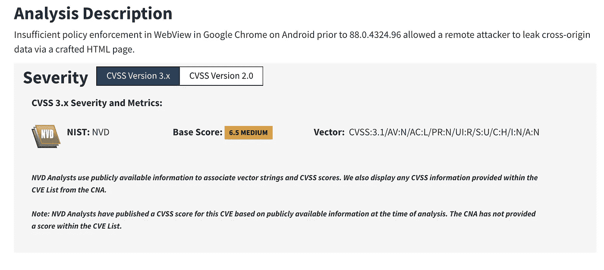
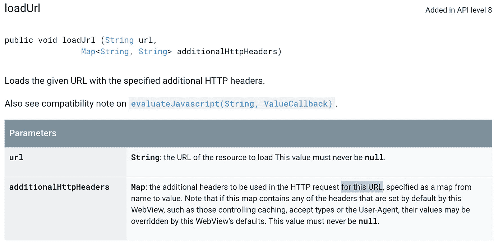
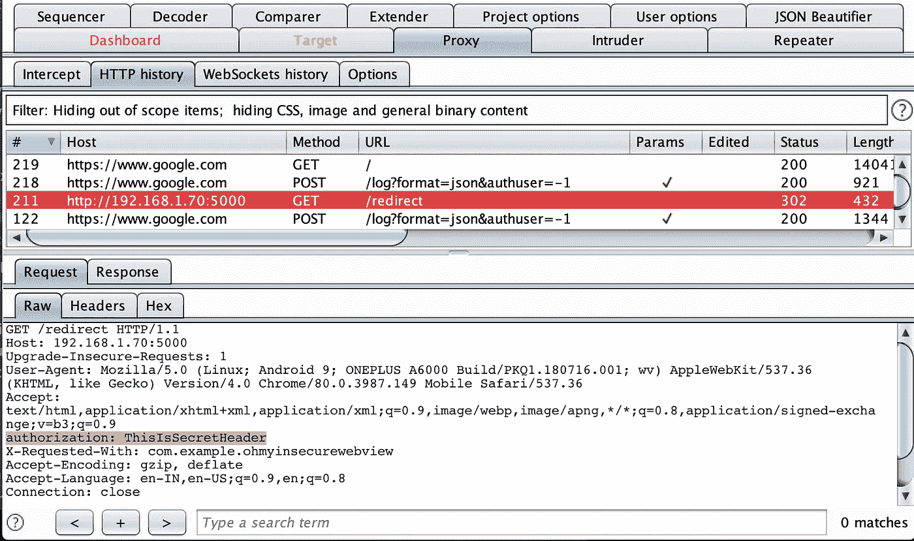
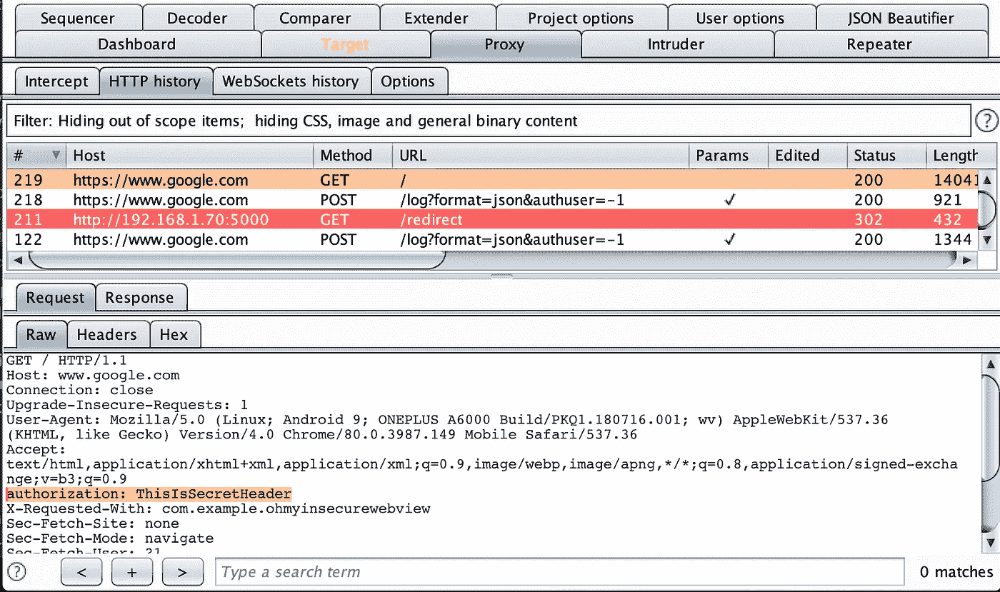

# 通过 Android Webviews 泄露敏感数据

> 原文：<https://infosecwriteups.com/leakage-of-sensitive-data-through-android-webviews-3b0b86486a28?source=collection_archive---------1----------------------->

## CVE-2021–21136:WebView 中的政策执行不足

## 识别 Android Webview 组件中的漏洞并获取 CVE 的故事-2021–21136



不久前，在分析一个安全问题时，我想到了学习一些 Webview APIs 的行为。在研究过程中，我发现在特定的场景中，Android webviews 可能会泄漏敏感数据，如用户的身份验证令牌、API 机密等。给第三方。medium 博客捕获了已确定的安全问题的技术细节。

我将通过复习一些基础知识来开始这个故事，以便刚接触 Android 世界的人能够理解这个问题。熟悉 Android Webviews 的人可以跳过下一部分。

# Android 网络视图


Android 允许开发者通过 Webviews 将网页内容直接显示到他们的应用程序中。您可以将它视为应用程序的专用 web 浏览器实例，用于向用户交付网页。

## 在 Webview 中加载内容

Webviews 的使用对开发者非常友好，因此目前被广泛使用。我们可以使用如下所示的***Webview # loadUrl****方法加载网页内容:*

```
**--* *WebView myWebView = (WebView) findViewById(R.id.webview);
myWebView**.loadUrl("http://www.google.com");
--**
```

> *如果您希望在请求加载 web 内容时传递一些头，或者希望加载一些受保护的内容，该怎么办？？*

*Android 还提供了一个重载版本的***Webview # loadUrl****方法，该方法允许我们向请求传递额外的请求头，如下所示:**

```
***--**Map<String, String> headers = new HashMap<>();
headers.put("Authorization", token);
--**WebView myWebView = (WebView) findViewById(R.id.webview);
myWebView.loadUrl("http://shivsahni.com", headers);* *--***
```

***头*自变量是一个映射<字符串，字符串>具有头名称和相应的值。在调用加载 web 内容时，这些头被添加到请求中。**

# **CVE-2021–21136:WebView 中的政策执行不足**

**该安全问题存在于重载版本的 *loadUrl(String url，Map < String，String>additional httpheaders)*的实现中，它加载 web 内容并将*additional httpheaders*HTTP 头附加到请求。在这种情况下，它包含敏感数据，如身份验证令牌、共享机密等。它可能会泄露给第三方。**

**当后端使用重定向来响应 web 内容加载(使用重载的 loadUrl 方法)时，就会发生这种情况。前端还会将报头附加到后续请求中，从而导致意外的数据泄漏。**

**以下截图来自[谷歌文档](https://developer.android.com/reference/android/webkit/WebView#loadUrl(java.lang.String,%20java.util.Map%3Cjava.lang.String,%20java.lang.String%3E))(在报告错误时拍摄)。这是一种误导，因为它提到为这个 URL 发送报头*，而实际行为是也向后续请求发送报头。***

****

## **概念证明**

**我制作了一个 Android 应用程序来演示这个安全问题。该应用程序有一个 Webview 组件，它加载带有附加标题(授权)的网页。**

```
**Note: I have used *shouldOverrideUrlLoading* in WebViewClient in order to allow Webview to control the redirects. As per the Google Docs:*Do not call WebView#loadUrl(String) with the request's URL and then return true. This unnecessarily cancels the current load and starts a new load with the same URL.* ***The correct way to continue loading a given URL is to simply return false, without calling WebView#loadUrl(String)****.*In case you are calling *loadUrl* inside *shouldOverrideUrlLoading*, you might not be leaking the sensitive data to third-party but you might be landing yourself into another security/privacy risk as this causes all renderer-initiated navigations (e.g. redirects, JS location changes, clicking on links, etc) to be converted into browser-initiated navigations.**
```

**以下代码片段显示了在 Webview 中加载 web 内容时如何传递 auth 数据**

```
***Map<String, String> headers = new HashMap<>();
headers.put("Authorization", auth);
WebViewClient wc= new myWebClient();
webView.setWebViewClient(wc);
webView.loadUrl(URL, headers);***
```

**对于这个概念验证代码，我使用 Flask 返回重定向响应。移动应用程序会收到一个 HTTP-302 响应，该响应会将应用程序重定向到 https://google.com**

```
***from flask import Flask,redirect
import os
app = Flask(__name__)*[*@app*](http://twitter.com/app)*.route('/redirect')
def hello_world():
    return redirect("*[*https://google.com*](https://google.com)*", code=302)**if __name__ == '__main__':
    print "Hello World!"
    port = int(os.environ.get('PORT', 5000))
    app.run(debug=True,host='0.0.0.0')***
```

**为了查看后台发生了什么，我将 PoC 移动应用程序连接到一个代理服务器。Burp Suite(Proxy)帮助我记录了所有的请求和响应。您可以很容易地观察到授权头也被发送到重定向请求(google.com)。**

****

**原始请求**

****

**重定向请求**

# **补救**

**由于兼容性的考虑，谷歌花了很长时间来修复这个问题。安全问题在最新的铬版本中被修复。**

## **你受影响了吗？**

**如果您使用重载版本的 *loadUrl* 方法和附加的头来加载 web 内容并传递敏感数据，如身份验证令牌、共享机密(如 API 密钥)等。并期望重定向到第三方/不可信域的响应，那么您可能会有风险。您可能希望以以下方式对此做出回应:**

*   **如果您在额外的头参数中发送 JWT，它们可能在过去已经与第三方共享，如果您有用户的长期 JWT 令牌，您必须使 JWT 令牌无效，以防止第三方在[违反信任](https://www.forbes.com/sites/kathleenchaykowski/2018/03/21/mark-zuckerberg-addresses-breach-of-trust-in-facebook-user-data-crisis/)的情况下访问它们**
*   **旋转秘密(API 密钥等。)因为它们可能已经随着重定向无意中与第三方共享了。**

**使用早于 M88 的版本的 Android 用户仍然容易受到攻击。建议用户必须立即更新 Webview。**