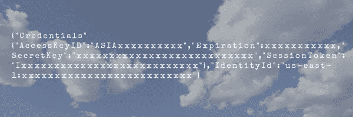
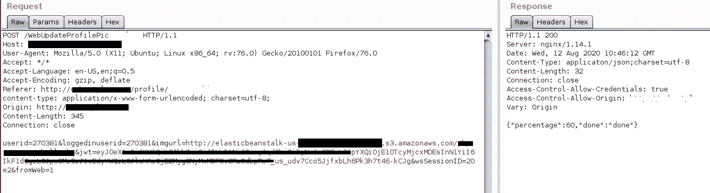
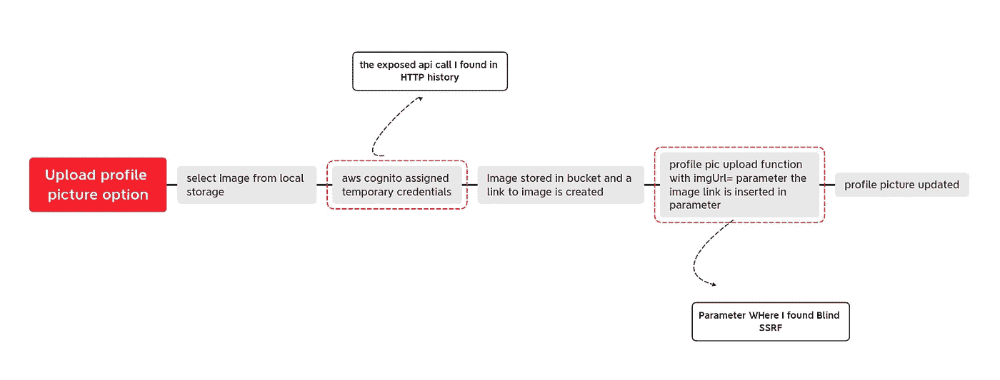
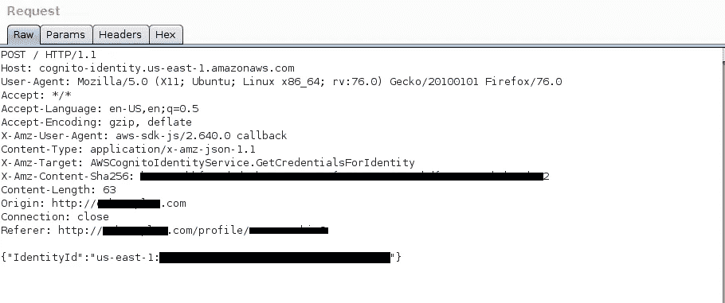
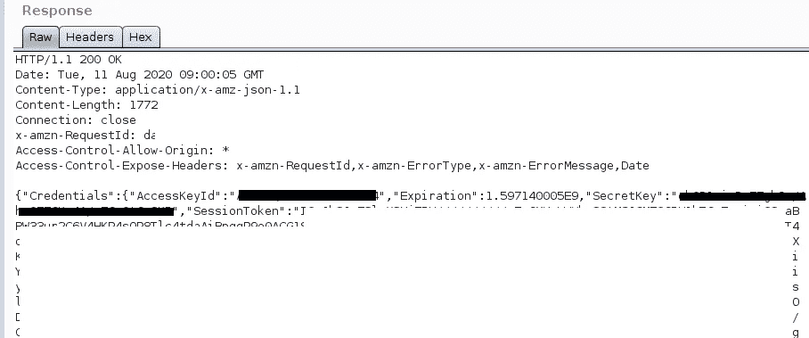
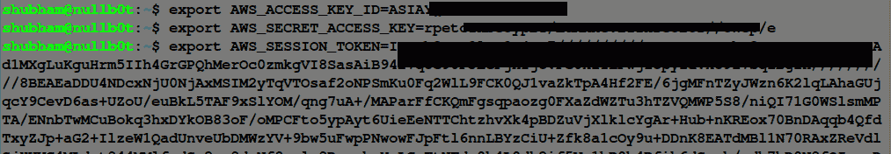
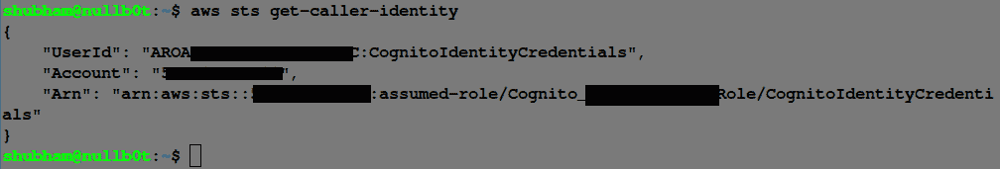
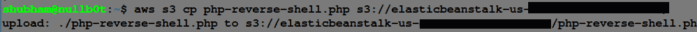
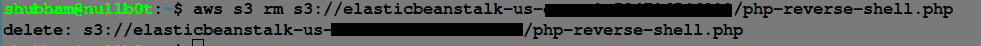

# 泄漏 AWS 元数据

> 原文：<https://infosecwriteups.com/leaking-aws-metadata-f5bc8de03284?source=collection_archive---------1----------------------->

## —不寻常的方式

以一种不寻常的方式找到 AWS 实例的凭证并利用它来获得对 bucket 对象的读/写访问的简短故事。



**Tl；dr:** 通过在响应中泄漏 AWS 凭据的应用程序的个人资料图片上传功能，找到了对 GetCredentialsForIdentity 的 AWS Cognito API 调用。

> AWS 实例元数据是关于实例的数据，可用于配置或管理正在运行的实例。在 AWS 中，实例元数据服务(IMDS)使有关计算实例、其网络和存储的信息可供实例上运行的软件使用。IMDS 也制作临时国书。在 AWS CLI 中配置此元数据凭据，用户可以访问与帐户相关的服务。

**通常的方式**

提取 AWS 凭据的传统方式是利用 SSRF。SSRF 攻击授予从目标机器发出请求的权限。如果应用程序运行在任何云服务上，攻击者就可以尝试访问元数据服务。

在 AWS 云服务的情况下，其路由在自动私有 IP 地址上通过 [http://169.254.169.254/](http://169.254.169.254/)

由于 AWS 的元数据服务不需要任何特定的头，因此获取 URL[http://169 . 254 . 169 . 254/latest/meta-data/iam/Security-credentials/ROLENAME](http://169.254.169.254/latest/meta-data/iam/security-credentials/ROLENAME)将返回 AccessKeyID、SecretKey 和安全令牌。

*测试用例:*

文件名. ext？URL = http://169 . 254 . 169 . 254/latest/meta-data/iam/security-credentials/rolename

```
Tip💡: Use CanaryTokens or Pythonanywhere server to test for SSRF Bugs
```

# 我遇到的情况是:

我正在测试一个应用程序，它是一个专业人士的网络平台，就像 Linkedin 一样，

打开我的打嗝套件，开始找虫子。在照片上传功能中发现了一个盲 SSRF 漏洞，但下一个原因是什么？它只是从目标机器发出一个请求，没有其他任何东西，没有响应消息！找不到任何方法来升级它或提取 AWS 元数据(虽然主要目标),因为在盲 SSRF 中，我已经知道该服务正在与 AWS Elastic beanstalk 一起运行，其中一些 ec2 实例作为服务器 ping ec2 实例 IP。

这是负责用 elastic-beanstalk bucket url 更新个人资料图片的请求。(这个&imgurl=参数容易受到盲 SSRF 的攻击，但是没有用😔)



但是等等…我怎么忘记看 HTTP 历史了

在检查 burp 中的 HTTP 历史记录时，我发现了一个公开的 AWS Cognito API 对 GetCredentialsForIdentity 的调用，作为响应，它给出了 AccessKeyID、SecretKey 和安全令牌。

> Amazon Cognito 是一种用户身份和数据同步服务，使开发人员可以轻松管理跨多个移动设备或连接设备的应用程序的用户数据。他们可以使用谷歌脸书和亚马逊等公共登录提供商为应用程序的用户创建身份。只需使用 Amazon Cognito API 保存用户数据并进行同步，用户数据就会安全地同步并存储在 AWS 云中。如果网站使用其他 AWS 服务(如亚马逊 S3、亚马逊迪纳摩数据库等。)Amazon Cognito 为您提供了具有有限权限的临时凭证，用户可以使用这些凭证来访问数据库资源。

GetCredentialsForIdentity API 请求

> 返回所提供身份 ID 的凭据

好的，让我倒回去让你看看个人资料图片上传功能的应用流程



公开的 AWS Cognito API 调用 GetCredentialsForIdentity，这有助于应用程序通过分配临时凭证将数据放入存储桶。呜哇！我达到了我的目标。



**滥用元数据:**

我们得到了凭证，现在我们可以做很多坏事，但首先让我们用 AWS CLI 配置这个凭证



现在只需点击一些 CLI 命令来提取我们需要的数据。

*   检查 AWS 获取呼叫者身份



*   列出存储桶对象

要列出所有桶对象，您必须给出桶名，否则它将显示拒绝访问。我已经知道了配置文件 pic 图像位置的存储桶名称。


*   将文件移动到存储桶



*   从存储桶中删除任何文件



正如您看到的，我们获得了对存储桶的读/写访问权限，这足以显示影响。但是攻击者可以做的更糟，他可以在本地下载所有数据，删除整个 bucket，然后从他的帐户中重新创建一个同名的 bucket。

即使如此，攻击者也可以通过将 PHP webshell 上传到 s3 bucket 来升级到 RCE，并在那里执行系统级命令。看这里:[https://www . notsosecure . com/exploining-ssrf-in-AWS-elastic-beanstalk/](https://www.notsosecure.com/exploiting-ssrf-in-aws-elastic-beanstalk/)

**结论:**

查看每个 HTTP 请求和响应(只需在后台启动您的 burp 代理，并体验应用程序的所有功能)，尤其是在服务器上读取或写入数据的地方。有时缺陷就在那里，你只需要浏览请求和响应。

虽然由于 IMDSv2 新的安全集成，用 SSRF 提取数据是不可能的，但仍然有许多应用程序没有更新它，所以仍然有机会取得成功。

参考资料:[https://docs . AWS . Amazon . com/cognitoidentity/latest/API reference/API _ getcredentialsforidentity . html](https://docs.aws.amazon.com/cognitoidentity/latest/APIReference/API_GetCredentialsForIdentity.html)

感谢瓦图尔·戈亚尔的校对。

❤迷因与安全。对 twitter.com/nullb0t 的任何讨论都开放