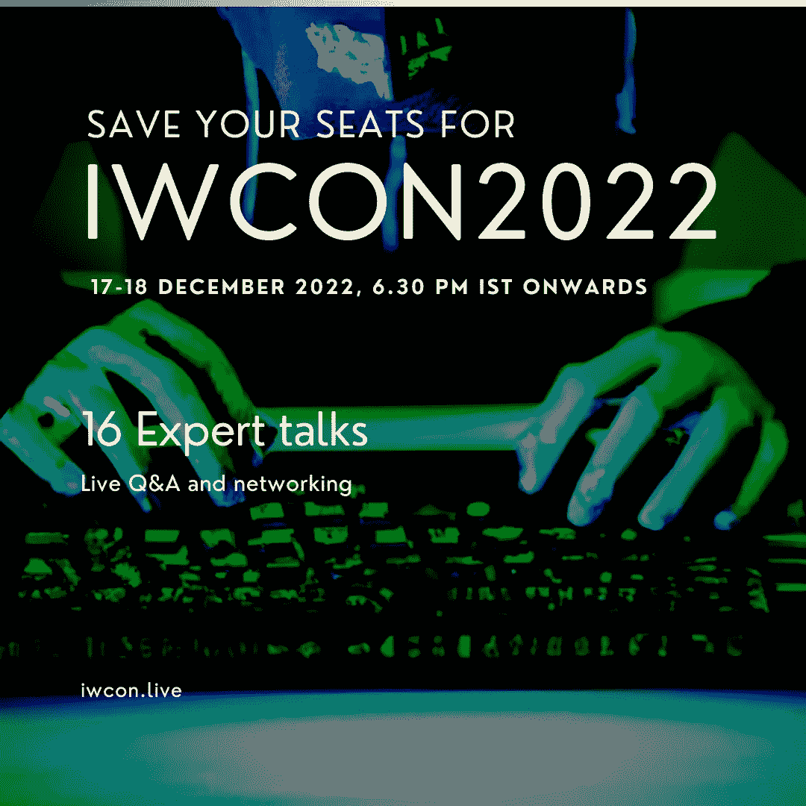

# 在 IWCON2022 网络安全大会上向 16 位专家学习

> 原文：<https://infosecwriteups.com/learn-from-16-experts-at-iwcon2022-cybersecurity-conference-7b281e9cf4e3?source=collection_archive---------10----------------------->

## 学习新技能，与网络安全专业人士建立联系。

亲爱的追随者们:

我们很高兴地宣布 2022 年 IWCON——Infosec Writeups 的虚拟网络安全会议和网络活动将于 2022 年 12 月 17 日至 18 日举行。

我们的专家演讲者将涵盖广泛的主题，从 CloudSec 到 Web3 安全，从漏洞奖金到 DFIR，从网络安全工具到独特的体验。

加入我们的会议，在年底前向世界上最好的人学习并掌握新技能。一些亮点包括:

*   **云环境中的威胁追踪**
*   黑客云:为了乐趣和利益
*   我访问管理面板的方法 Ahsan Khan aka hunter0x7
*   **阅读黑客攻击的 RFC**
*   **通过外部攻击面管理实现 API 安全**Phillip Wylie

不要错过这个向专家学习和与网络安全专业人士交流的机会。 [**现在就保住座位**](https://iwcon.live/) 让我们轰轰烈烈地结束 2022 年吧！

## 有什么问题吗？我们是来解决这些问题的。

我们很乐意回答任何问题、疑虑或阻碍您参加 IWCON 2022 的障碍。

请回复此邮件(或在下面留下评论)，我们会尽快回复您。

期待在 IWCON 2022 上与您见面。

[***今天预定你的座位*** 。](https://razorpay.com/payment-button/pl_K8cxPtmUyBH2PC/view)

最佳，
编辑团队
Infosec 报道。