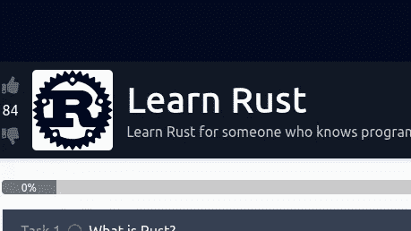
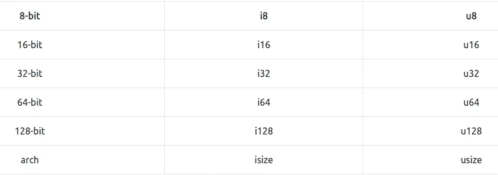
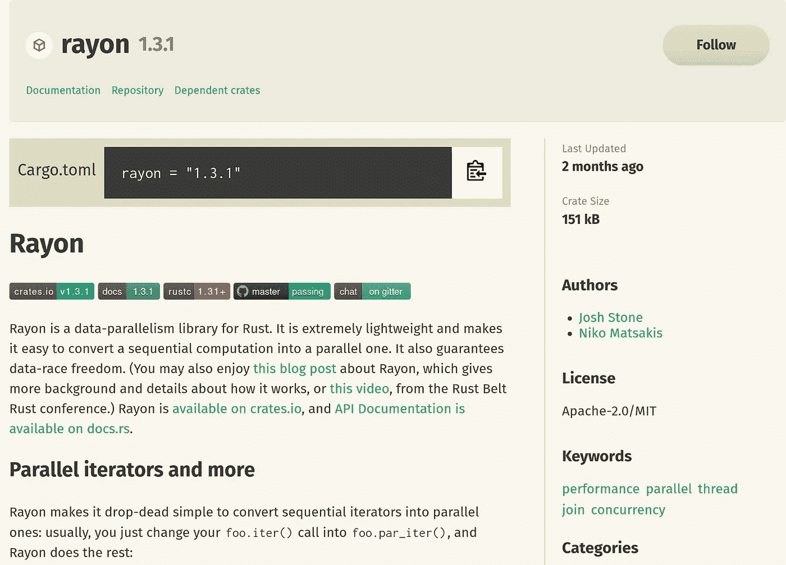

# 学习 Rust Tryhackme 的文章

> 原文：<https://infosecwriteups.com/learn-rust-tryhackme-writeup-55ab1e5be76c?source=collection_archive---------0----------------------->

## **这是 Tryhackme room“学会生锈”的一篇文章**



https://tryhackme.com/room/rust

**房间链接:**[https://tryhackme.com/room/rust](https://tryhackme.com/room/rust)
**注:此房免费**

# 任务 1:什么是铁锈？

# 介绍

Rust 是一种新的编程语言，由一个小团队在 2015 年创建，后来被 Mozilla(创建和维护 Firefox 的组织)采用。

它是一种编译的低级语言，旨在(并成功地)达到与 C++相同的速度，但同时结合了一些更高级的语言特性，如 Python 或 JavaScript。

Rust 有 3 个目标:

*   快的
*   安全的
*   多产的

# 快的

Rust 的目标是在性能方面与 C++相似。

Rust 是静态类型的，这意味着变量的数据类型在编译时是已知的。与我们不知道类型的情况相比，这允许编译器进一步优化代码。

Rust 不使用垃圾收集(尽管它是一种低级编程语言)。垃圾收集是程序试图从垃圾中回收内存的地方。垃圾是程序不再使用的对象占用的内存。

Go 是一种高级编程语言，语法上类似于 Python，但速度更快&编译时使用垃圾收集。这在 Discord 造成了巨大的开销，迫使他们从 Go 切换到 Rust。[https://blog . discord . com/why-discord-is-switching-from-go-to-rust-a 190 bbca 2 B1 f](https://blog.discord.com/why-discord-is-switching-from-go-to-rust-a190bbca2b1f)

需要注意的是，Python 和 JavaScript 使用垃圾收集。这些抽象可能会导致问题(如 Discord 的情况)，这就是为什么许多人选择低级编程语言。

# 安全的

Rust 是完全内存安全的。这意味着 Rust 不可能利用内存漏洞，除非您明确指定不安全的 Rust 代码。

微软安全响应中心表示，CVE MSRC 分配的任务中有 70%是内存安全问题。用微软自己的话说:

“这意味着，如果该软件是用 Rust 编写的，70%的安全问题很可能已经消除。我们不是唯一一家报告了这些发现的公司。

有时程序员必须执行不安全的操作。Rust 提供了包装这些不安全动作的工具，因此 Rust 编译器可以静态地执行不安全的代码。

所有权的概念保证了内存的安全性。所有 Rust 代码都遵循以下规则:

*   每个值都有一个变量，称为所有者。
*   一次只能有一个所有者。
*   当所有者超出范围时，该值将被丢弃。

值可以在变量之间移动或借用，但任何值都不能有一个以上的所有者。

让我们看一个 Python 失败的例子:

```
squares = (val * val for val in range(100))
print(min(squares))                 
print(max(squares))
```

我们想要的是:

```
0
9801
```

但是我们得到的是:

```
>>> print(min(squares))
0
>>> print(max(squares))
Traceback (most recent call last):
  File "<stdin>", line 1, in <module>
ValueError: max() arg is an empty sequence
```

这是因为 min 改变了变量 squares。这很奇怪，因为我们只想要最小值——而不是改变整个变量！

在 Rust 中，相同的代码是:

```
fn main()
   let squares = (0..100).map(|val| val * val); 
   println!("{:?}", squares.min());   
   println!("{:?}", squares.max());      
}
```

当我们试图编译它时，Rust 告诉我们:

我将在后面的任务中详细讨论这一点，但重要的是 **Python 允许函数改变它们不拥有的变量，而 Rust 不允许。**

PS:请注意 Rust 编译器是如何明确指出值、行、确切的字符、错误发生的位置以及解释为什么不允许该代码的完整错误消息的。而 Python 只是说。

```
max() arg is an empty sequence
```

# 生产力

Rust 的第三大目标很奇怪。生产力！

Rust 提供了开发人员高效工作所需的所有工具，随平台本身一起提供。

*注:以下列表读作:*

*   *工具*

*上述工具的说明。*

其中包括:

*   货物

拉斯特版的 NPM 或派皮。下载其他人创建的包。

*   克利皮

微软 Clippy，但重新设想了 Rust 来帮助开发。

*   RustFmt

自动格式化 Rust 代码

*   货物测试

Rust 开发人员创建的内置测试应用程序。

*   货物单据

使用文档注释(用 Markdown 编写)为您的代码自动生成文档。在发布到 Cargo 后，该文档将被发送到 [docs.rs](http://docs.rs) 。更不用说用文档编写的例子是自动为你测试的。没有更多未经测试的文档示例！

*   铁锈分析仪

认为 IDE 更聪明。Rust Analyzer 会清楚地标记您的代码有什么问题，为什么它是错误的，冲突和导致错误的确切字符，90%的情况下它会提供“自动修复”功能，自动为您修复这些错误。

*   生锈的书和文件

Rust 有一本书，叫做《书》,里面详细介绍了你想知道的关于 Rust 的一切。整洁的章节，易于搜索，并在您的处置免费。如果这还不够好的话，感谢 Rust 的文档注释，你将使用的几乎每个库都有大量的在线文档。

有了所有这些工具，编译一个 Rust 程序并在其中发现 bug 是非常罕见的。其实这种情况我只经历过一次。99%的情况下，工具和语言早在我点击 compile 之前就已经掌握了。

# 结论

如果你正在寻找速度极快、内存安全，但同时保持良好的生产力的东西，Rust 就是适合你的语言。

作为 Pentesters，我们的工作是为开发者提供解决方案。一开始，告诉 Python 开发人员低级语言是一个很好的选择听起来很奇怪。

但是 Rust 可以帮你，因为它支持用其他语言编写的函数调用(外来函数接口)。

我们可以使用 Rust 来重写安全或性能关键代码，这些代码将与我们现有的代码库协作。

这里有一个调用 C 代码的例子

```
extern "C" {
    fn abs(input: i32) -> i32;
}fn main() {
    unsafe {
        println!("C believes that the absolute value of -3 is: {}", abs(-3));
    }
}
```

**问题 1:** 就性能而言，Rust 与其他什么语言相似？

> **答案:c++**

**Q.2:** 这个任务中提到了什么著名的从 Go 转到 Rust 的公司？

> **答案:不和谐**

**问题 3:** 微软安全中心报告称，他们分配给 CVE 的内存安全问题占多大比例？包括%符号。

> **答案:70%**

**问题 4:**Rust 版的 NPM 或 PyPi 是什么？

> **答案:货物**

# 任务 2:安装和工具

在我们深入语言之前，让我们安装 Rust。

Rust 推荐使用工具`rustup`来管理 Rust 的多个版本。如果您熟悉 Python，您可能已经使用 virtualenvs 实现了类似的结果。也就是同一台机器上不同版本的 Python。

这是 Rust 团队为提高生产力而创造的另一个伟大的工具。

使用以下命令安装 RustUp:

`curl --proto '=https' --tlsv1.2 -sSf https://sh.rustup.rs | sh`

这个命令也可以在 Rust 网站[https://www.rust-lang.org/tools/install](https://www.rust-lang.org/tools/install)上找到

此命令将为您的操作系统安装 Rust 的稳定版本。

铁锈有三种味道。稳定版、测试版和夜间版。

Stable 是 Rust 的最新稳定版本(稳定版本通常每 6 周发布一次)。测试版定期更新。当语言本身更新时，每夜更新。

现在，让我们安装一些 Rust 工具来帮助我们的开发。

我们刚刚运行的命令也安装了`Cargo`，

Cargo 是 Rust 的包管理器。所有的软件包都被上传到 [https://crates.io](https://crates.io) 并且做了很多很酷的事情。

3 个核心货物指令是:

**货物安装**

从[板条箱中安装一个包装](http://Crates.io)

**货物发布**

发布一个包到 [crates.io](http://crates.io)

**货物更新**

更新所有本地包

但是，因为我们正在开发 RustCode，所以还有 3 个更重要的命令

**货物测试**

为我们的代码运行测试

**货物 fmt**

运行格式化工具。这个工具自动格式化你的代码(应用参数`--all`来格式化所有代码)。类似 Python 的黑色但是内置。

**货物夹子**

微软 Clippy 但生锈！Clippy 将指出代码中的常见错误，并帮助您纠正它们。

**社区工具**

有一个工具，是一个基于社区的工具——它被视为 Rust 生态系统的绝对必要工具。

那个工具是铁锈分析仪。想象一个更智能、更先进的 IDE。Rust-Analyzer 将在您编写代码时分析您的代码，在您编译之前发现错误，并提供自动修复选项来自动修复错误。

Rust-Analyzer 声明他们最受支持的版本是 VS Code，但是他们也可以在许多其他平台上使用。

值得注意的是，Rust 的主要工具是由 Rust 开发者自己编写的。在像 Python 这样的语言中，我们可能会争论`setuptools`或`poetry`是否正确。或者说`pytest`是否比`unittest`好。争论该用什么工具是拖延症。Rust 说“这些是你要用的工具”就是这样。这提高了生产率，因为您不必担心使用什么工具，但可能会因为工具可能不完全完整而阻碍开发。

**问 1:** 我们用来装铁锈的工具叫什么？

> **答案:Rustup**

**问 2:** 我们如何使用 cargo 安装 rustscan 软件包？

> **答:货物安装生锈扫描**

问题 3: 我们运行什么命令来格式化我们的代码？

> **答:货物 fmt**

# 任务三:你好，世界！

如果没有一个基本的“你好，世界！”就不是一个编程教程。

创建一个新文件夹，并在终端中键入:

```
cargo init
```

这使得货物初始化一个新的铁锈库。Cargo 将为您处理大部分工作。

文件结构如下:

```
- Cargo.toml
- src/
    - main.rs
```

`cargo.toml`是我们 Rust 项目的配置文件。它包括我们的依赖项、项目名称、作者、我们正在使用的 Rust 版本等等。

当我们刚刚运行`cargo init`时，我们的文件看起来会像这样:

```
[package]
name = "Hello_world"
version = "0.1.0"
authors = ["bee <bee@fake.com>"]
edition = "2018"
# See more keys and their definitions at [https://doc.rust-lang.org/cargo/reference/manifest.html](https://doc.rust-lang.org/cargo/reference/manifest.html)[dependencies]
```

文件夹`src`中的`main.rs`文件是我们编写代码的主文件。每一个单独的 Rust 项目**都必须**有一个主文件，每一个主文件都必须有一个主函数。

```
fn main() {
    println!("Hello, world!");
}
```

**趣事**原 C 本《你好，世界！在单词 world 上有一个大写字母。

在 Rust 中，我们用花括号来表示代码块。和分号来表示表达式的结束。

为了打印 Rust，我们使用宏`println!`。

我们知道`println`是一个宏，因为它被称为感叹号。简而言之，宏允许我们编写更多的代码。更简单地说，我们可以创建自己语法来翻译不同的代码。

为了运行这个程序，我们执行:

`cargo run`

这将导致:

```
➜ cargo run 
   Compiling hello_world v0.1.0 (/tmp/hello_world)
    Finished dev [unoptimized + debuginfo] target(s) in 0.21s
     Running `target/debug/hello_world`
Hello, world!
```

该命令:

*   用未优化的版本编译代码(以提高编译速度)
*   运行代码

您还会注意到已经创建了一个新文件夹，`target`。

`target`包含我们项目的二进制文件。

```
- Cargo.toml
- src/
    - main.rs
- target/
    - debug/
        = build/
        - deps/
        - examples/
        - hello_world
        - hello_world.d
        - incremental/
```

目前，唯一重要的文件是`hello_world`

这个文件实际上是我们程序的二进制文件。

我们可以通过在目录中运行 ls -l 来判断它是一个二进制文件

```
drwxr-xr-x    - bee 31 Jul 23:35 build
drwxr-xr-x    - bee 31 Jul 23:35 deps
drwxr-xr-x    - bee 31 Jul 23:35 examples
.rwxr-xr-x 2.9M bee 31 Jul 23:35 hello_world
.rw-r--r--   72 bee 31 Jul 23:35 hello_world.d
drwxr-xr-x    - bee 31 Jul 23:35 incremental
```

要构建我们的项目而不运行它，请运行:

`cargo build`

现在我们可以直接运行二进制代码了。

`./target/debug/hello_world`

这和`cargo run`完全一样，但是 2 个命令。

当我们想要构建我们的项目并优化它时，用发布概要文件运行它:

`cargo build --release`

使用普通货舱快速检查代码。使用 release 参数在 Rust 编译器允许的范围内最大限度地优化代码。

我们称`--release`为概要文件，特别是发布概要文件。Rust 编译器根据你的需要有不同的优化级别。

**问题 1:** 我们如何初始化一个新的 Rust 项目？

> **回答:货物初始化**

**Q.2:** 什么字符代表一个宏？

> **回答:！**

**Q.3:** 每个 Rust 项目需要什么作为文件？

> **答案:main.rs**

如果我们想给 Rust 项目添加一个依赖项，我们应该编辑什么文件？

> **答案:cargo.toml**

问题 5: 我们如何运行 Rust 项目？

> **答:货物运行**

**问题 6:** 我们如何用发布概要文件构建 RustScan 项目(优化程度最高)？

> **答:货物构建-发布**

**问 7:** 发布二进制文件存储在什么文件夹下？

> **回答:目标/发布**

**问题 8:** 使用优化级别，Rust 有多少个发布配置文件？

> **答案:4**

# 任务 4:变量

默认情况下，Rust 中的所有变量都是不可变的。

这是一个安全特性，也是一个生产力特性。不变的变量意味着您不必跟踪值何时改变，不变的变量对于并发性来说非常好

让我们来看看实际情况。

```
fn main() {
     let x = 5;
     println!("The value of x is: {}", x);
     x = 1;
     println!("The value of x is: {}", x);
 }
```

这段代码不编译**。**它返回错误:

`error[E0384]: cannot assign twice to immutable variable` x`
->src/main . RS:4:5
|
2 |设 x = 5；
| -
| |
|对` x`
的第一次赋值| help:使这个绑定可变:` mut x`
3 | println！(“x 的值为:{}”，x)；
4 | x = 1；
| ^^^^^不能对不可变变量赋值两次

错误告诉了我们需要知道的一切。

`cannot assign twice to immutable variable`

这是在告诉我们，我们在给一个不可变的变量(一个不能改变的变量)赋值，两次。这是不可能的。

我们得到编译时错误是很重要的，因为这可能导致错误和未定义的行为——这可能导致不安全的代码。在 Rust 中，一旦一个不可变的变量被设置，Rust 保证它在它的生命周期中永远不会改变。

为了使变量可变，我们将 mut 关键字放在它的前面，如下所示:

```
fn main() {     let mut x = 9;     println!("The value of x is:  {}", x);     let x = 4;     println!("The value of x is: {}", x); }
```

这段代码可以正确编译和运行:

`➜ cargo run`
编译 hello _ world v 0 . 1 . 0(/tmp/hello _ world)
在 0.14 秒内完成 dev [unoptimized + debuginfo]目标
运行` target/debug/hello _ world`
x 的值为:9
x 的值为:4

无法更改变量值可能会让您想起其他大多数语言都有的另一个编程概念:常量。像不可变变量一样，常量是绑定到名称上的值，不允许更改，但是常量和变量之间有一些不同。

有关任务，请参考该代码。

**问题 1**

`fn main() {`
设 x:u32 = 5；
println！(“x 的值为:{}”，x)；
x = "你好"；
println！(“x 的值为:{}”，x)；
}

**问题 2**

`fn main() {`
设 x:u32 = 5；
println！(“x 的值为:{}”，x)；
x = 5；
println！(“x 的值为:{}”，x)；
}

**Q.1:** 问题 1，这段代码编译了吗？t(真)或 F(假)

> **答案:F**

**问 2:** 问题 1 返回的错误码是什么？

> **答案:E0308**

**问题 3:** 问题 2 中的代码编译了吗？t(真)或 F(假)

> **答案:F**

**问 4:** 返回的错误**消息**是什么？

> **答:不能给不可变变量赋值两次**

# 任务 5:常量变量

铁锈也有常数。这些值不仅在默认情况下是不可变的，而且永远是不可变的。

常量可以在任何范围内声明，包括全局范围。这意味着我们可以在代码的任何部分使用它们的值，或者同时在多个地方使用它们的值。

常量只能是常量，不能设置为函数调用或任何其他在运行时可能改变的值。

我们用关键字`const`声明常量，如下所示:

`const HUNDRED_THOUSAND: u32 = 100_000;`

注意在 Rust 中，我们如何使用`_`字符来表示数字中的一个空格，而不影响值本身。这纯粹是为了可读性。

还要注意，用全大写字母命名常量是一种传统。

**遮蔽**

我要给你看一些一开始可能没有意义的东西。

```
fn main(){
    let x = 6;
    let x = x + 1;
    println!("{}", x)
}
```

这叫做*遮蔽*。Rustaceans (Rust 程序员)说:

*“第一个变量被第二个变量遮蔽”*

这意味着第二个变量值在使用时出现。一旦定义了不可变变量，我们就可以改变它的类型。

下面是官方 Rust 文档对这一原理的解释(根据示例进行了编辑)

“这个程序首先将 x 绑定到值 6。然后它通过重复 let x =来隐藏 x，取原始值并加 1，这样 x 的值就是 7。

通过使用 let，我们可以对变量执行转换，但在所有转换完成后，变量仍然是不可变的。

我们用关键字`let`有效地创建了一个新变量，这意味着我们可以改变值的类型。

```
let word = "hello";
let word = word.len();
```

这是允许的。

然而，如果我们试图使用 mut，它将不会被允许——因为 mut 不能改变类型。

```
let mut word = "hello";
word = word.len();
```

.

```
error[E0308]: mismatched types
 --> src/main.rs:3:12
  |
3 |     word = word.len();
  |            ^^^^^^^^^^ expected `&str`, found `usize`
```

**问 1:** 我们如何在 Rust 中定义一个常数？

> **答案:常量**

**Q.2:** 我们可以对一个常数进行阴影化吗？t(真)或 F(假)

> **答案:F**

**问 3:** 一旦定义了不可变变量，我们用什么来改变它的类型？

> **答案:阴影化**

**问 4:** 代码“CONST word = "yes " "会编译吗？t(真)或 F(假)

> **答案:F**

**Q.5:** 我们有“let word = "hello " "，如何获取变量的长度？

> **答案:word.len()**

# 任务 6:数据结构

在 Rust 中，我们经常会看到编译器抱怨我们的变量和函数没有类型提示。我们前面看到了 CONST 的类型提示。类型提示定义了变量在编译时的数据类型。

`let ports: u32 = 65535`

`: u32`表示变量`ports`的大小为`u32`。

整数中的`u`表示无符号，`32`是它有多少位。

无符号整数只能是正数，有符号整数可以是正数也可以是负数。

整数的范围从 16 位到 128 位。有些操作系统不能使用高于 u32 的整数，使用如此大的整数类型可能会降低某些系统上的程序速度。



当您探索 Rust 时，您会遇到许多不同的数据类型。对我来说，试图教他们所有人是愚蠢的，所以我选择只教我认为现在能帮助你理解 Rust 的东西。

我们已经看到了整数是如何工作的，但是字符串呢？

# 用线串

锈中有两种类型的弦。`String`和`&str`。

`String`是一个可增长的分配数据结构，而`str`是内存中某处不可变的固定长度字符串。

`&str`是`string.`的一个`string slice`

弦乐对于 Rust 新手来说比较混乱，但这些是核心原理。[这里列出了有关字符串的相关 Rust book 页面，以了解更多信息。](https://doc.rust-lang.org/book/ch08-02-strings.html)

**问题 1:** 给定数字-6，这是有符号的还是无符号的？

> **回答:署名**

**问题 2:** 给定数字 65536，我们能把它归入的最小无符号数据类型是什么？

> **答案:u32**

**问 3:**rust 中最小的有符号整数是多少？

> **答案:i16**

**问题 4:** 创建一个名为“tryhackme”的可变 u32 变量，并给它分配数字 9

> **回答:让 mut tryhackme:u32 = 9；**

**Q.5:** 字符串切片用什么数据类型表示？

> **回答:& str**

问 6: 假设你有一个变量 x，你想把这个变量作为一个字符串输入。你会写什么？在变量中包括 X，但不包括字母或=部分。

> **答案:x: String**

# 任务 7:功能

我们前面已经看到了一种特殊的函数，即`main`函数。

`main`函数是`main`文件第一个调用的函数，也是第一个调用的文件。

Rust 写的每个二进制文件都需要一个`main`文件，每个主文件都需要一个`main`函数。

Rust 中的函数定义为:

```
fn hello() -> u16{
    println!("hello!");
    6
}
```

主函数和这个一样，但是在二进制文件中它不返回任何东西。

```
fn main(){
    println!("I do not return!")
}
```

现在，你可能已经注意到在`hello`函数中，我们在末尾有一个 6。

*“什么？？?"我能听到你说。*

Rust 返回函数的最终表达式。

或者，我们可以使用`return`语句提前返回。然而，用它来返回函数末尾的值不是很好——Rustaceans 和 Clippy 会不喜欢这样😢

`6`是一个返回 6 的表达式，所以我们的`hello`函数返回 6。

我们的主函数不返回任何东西，这是应该的。

让我们给函数添加一些参数。

```
fn print_name(name: String){
    println!("{}", name);
}
```

我们的函数参数必须包含每个参数的类型。

现在让我们试着让这个函数返回一些东西。

```
fn print_name(name: String) -> u16{
    println!("{}", name);
    6;
}
```

当我们返回数据时，我们必须输入返回数据的类型。

这看起来很烦人，但是它让编写干净的代码变得容易多了。

比较这两个函数，一个在 Pythonic 伪代码中，一个在 Rust 中。注意:我们只有定义。

`def to_ip_address(ip):`

现已生锈:

`fn to_ip_address(ip: String) -> IpAddr{`

通过添加类型，我们可以清楚地看到我们正在接受一个字符串，并将其转换为 IP 地址。

通过适当的函数命名和类型提示，我们可以从它们的定义中知道大多数函数是做什么的。干净的代码怎么样😜

**问题 1**

```
fn hello(){
    8172192: u16;
}
```

**问题 2**

```
fn return(){
    6;
}
```

**问题 3**

```
fn test(name) {
    println!("{}", name);
}
test("bee");
```

**问 1:** 问题 1 会返回 8172192 吗？t(真)或 F(假)

> **答案:F**

**问 2:** 例 2 会运行吗？t(真)或 F(假)

> **答案:F**

问题 3: 我们应该给问题 3 的论点什么类型？

> **回答:& str**

**Q.4:** 函数中的最后一个表达式(返回)需要有分号。t(真)或 F(假)

> **答案:F**

**问 5:** 每个函数都需要返回一些东西。t(真)或 F(假)

> **答案:F**

**问 6:**Rust 中的函数可以嵌套在其他函数中。t(真)或 F(假)

> **答案:T**

**Q.7:** 我们用什么关键字从函数中提前返回？

> **回答:返回**

**问题 8:** 你嵌套了一个名为 main 的函数，在另一个名为 main 的函数里面。这能跑吗？t(真)或 F(假)

> **答案:T**

# 任务 8:循环

这里有 3 个锈环。

# 环

关键字`loop`永远循环，或者直到我们明确地告诉它停止。

```
fn main(){
    loop {
        println!("TryHackMe Rocks!");
    }
}
```

我们可以用 ctrl+c 中断，也可以让 Rust 用 break 中断

```
fn main(){
    loop {
        println!("TryHackMe Rocks!");
        break;
    }
}
```

# 条件 While 循环

Rust 也有 while 循环，当条件为真时循环。

看看这个例子中的一些代码，摘自 [Rust Book](https://doc.rust-lang.org/book/ch03-05-control-flow.html) :

```
fn main() {
    let mut number = 3;while number != 0 {
        println!("{}!", number);number -= 1;
    }println!("LIFTOFF!!!");
}
```

# 对于循环

Rust 还有 for 循环，我们可以用它来迭代集合中的元素。

```
fn main() {
    let a = [10, 20, 30, 40, 50];for element in a.iter() {
        println!("the value is: {}", element);
    }
}
```

注意 a.iter，我们用这个把 a 变成 iterable。这将很快变得对我们非常重要。

**问题 1:** 我们如何打破循环？

> **回答:破**

**Q.2:** 最简单的关键字做无限循环？

> **答案:循环**

**Q.3:** Turn let a = [10，20]；变成我们可以迭代的东西。

> **答案:a.iter()**

**Q.4:** While 循环也可以是无限的。t(真)或 F(假)。

> **答案:T**

# 任务 9:零成本抽象

这个任务是从我的博客上复制的，我曾经在那里写过关于[零成本抽象的文章](https://bees.substack.com/p/vtubers-random-algorithms-constraints)。

Rust 有一个非常酷的东西，叫做零成本抽象。这在其他低级语言中也存在，但作为一个 Python 冲浪爱好者，我以前从未遇到过。

零成本抽象是:

> “你不用的东西，你不用付钱。如果你用手工编码，你也不会做得更好。”

让我们来谈谈这个句子的两个部分。

> “不用的东西，不用付钱。”

这种语言不应该为一个不被使用的特性付出全局代价。假设使用 for 循环，这种语言需要一些大容量的 1gb 文件来降低其他所有东西的速度。如果我们从来不使用 for 循环，我们仍然为 for 循环付费！

> "而你所使用的，如果你手工编码，你不会做得更好."

关键是。

假设你写了一些代码，一个计算斐波那契数的函数。你把这段代码编译成汇编。

现在让我们假设你手写汇编来做同样的功能——计算斐波纳契数，但这次是在汇编中。

在汇编中写它意味着我们要么得不到性能，要么会失去性能。

通过使用零成本抽象，我们编写了抽象的代码(不是手写的汇编),如果我们试图手写汇编，我们不会做得更好。现在那很酷！

现在，让我们探索迭代器。

迭代器是用 Rust 处理一系列项的一种方式，很像 for 循环。

我们之前看到过`a.iter()`。这段代码将变量`a`变成了一个遍历`a`条目的迭代器。但是这段代码本身并没有做任何有用的事情。

这是因为迭代器是懒惰的 T2。你必须告诉他们做一些事情来从他们那里获得价值。

让我们来看一个真实的例子。

```
let a = vec![1, 2, 3];
let a_iter = a.iter();
for val in a_iter {
    println!("The value is {}, val);
}
```

我们通过在 for 循环中调用迭代器来让它做一些事情。

现在我们可以使用一些漂亮的函数式编程技巧让代码做一些事情并`consume`ITER。要对迭代器中的每个数求平方，然后求和，我们可以这样做:

```
let a = vec![1, 2, 3];
a.iter()
.map(|&i| i * i
.sum()
```

注意，在 Rust 中，我们可以用新的行来分隔方法的应用。

这只是迭代器所能做的一小部分。在这里阅读[锈书上关于它们的整章。](https://doc.rust-lang.org/book/ch13-02-iterators.html#processing-a-series-of-items-with-iterators)

然而，让我们回到手头的重要任务。零成本抽象。

在 Rust 中，迭代器是零成本的抽象。For 循环不是。这是根据[锈书。](https://doc.rust-lang.org/book/ch13-04-performance.html)

通过使用迭代器，我们利用了奇妙的零成本抽象。加速我们的整个计划。

**Q.1:** 迭代器比较懒。t(真)或 F(假)。

> **答案:T**

**问题 2:** For 循环在 Rust 一书中被明确地称为零成本抽象。t(真)或 F(假)。

> **答案:F**

**问 3:** 零成本抽象在 Python 或 JavaScript T(rue)或 F(alse)这样的高级语言中很常见。

> **答案:F**

# 任务 10:人造丝

Rayon 是 Rust 的外部机箱，通常我不会包含外部库。然而，它实在是太棒了，而且与我刚刚提到的最后几个任务非常吻合。

人造丝让多线程变得简单。不，真的。这非常容易。

转到 [Crates.io](https://crates.io/crates/rayon) 并复制包含带有版本号的板条箱的大黑盒。



现在进入 cargo.toml，并将其包含在 dependencies 部分。复制粘贴过来就行了。

好了，现在让我们把最后一个任务中的 iter 变成多线程。

```
fn sum_of_squares(input: &[i32]) -> i32 {
    input.iter()
         .map(|&i| i * i)
         .sum()
}
```

这是我们之前的代码。

```
use rayon::prelude::*;
fn sum_of_squares(input: &[i32]) -> i32 {
    input.par_iter() // <-- just change that!
         .map(|&i| i * i)
         .sum()
}
```

这是我们的多线程代码。

看看这有多简单！我们把 iter()改成 par_iter()就大功告成了。我们现在是多线程的。

**问题 1:** 我们用什么板条箱来轻松制作 iter 多线程？

> **答案:人造丝**

问题 2: 我们如何告诉 Rust 在我们的程序中包含一个外部的板条箱？我们把这个信息放在什么文件里？

> **答案:cargo.toml**

**问题 3:** 使用人造丝将 a.iter()变成多线程并行 iter

> **答案:a.par_iter()**

**问题 4:** 我们去什么网站买板条箱？

> **答案:crates.io**

# 任务 11: If 语句

**问题 1:** 我们可以基于一行 T(rue)或 F(alse)上的 if 语句给变量赋值

> **答案:T**

# 任务 12:错误处理

现在我们来了解一下铁锈的内部结构，它有助于保护铁锈的安全。错误处理。

在 Rust 中，任何*可以*出错的东西都会返回一个结果。具体来说`Result<T, E>`。`T`是你要找的结果，`E`是错误。

```
enum Result<T, E> {
    Ok(T),
    Err(E),
}
```

每当您打开一个文件时，该文件可能不在那里，或者可能无法成功打开该文件。它将返回一个结果，而你必须以这种方式处理它。

在 Python 中，异常处理是交给用户的。如果你想打开一个文件，请便。但是不要忘记写一个异常，如果文件不存在的话！

但是在 Rust 中，无论什么(除非你明确地告诉编译器忽略它)错误都必须被处理。

让我们看一个例子。

```
use std::fs::File;fn main() {
    let f = File::open("hello.txt");
}
```

我们打开一个文件。这个文件不是存储在 f 中，实际上存储的是一个结果枚举。

有两种方法可以检查某个东西是否返回结果。

1.  Rust Analyzer 会告诉我们返回类型是什么。
2.  我们给一个我们知道是错误的类型赋值，编译器会告诉我们。

如果我们赋值`let f: u32 = File::open("hello.txt");`，编译器会告诉我们。

```
--> src/main.rs:4:18
  |
4 |     let f: u32 = File::open("hello.txt");
  |            ---   ^^^^^^^^^^^^^^^^^^^^^^^ expected `u32`, found enum `std::result::Result`
  |            |
  |            expected due to this
  |
  = note: expected type `u32`
             found enum `std::result::Result<std::fs::File, std::io::Error>`
```

现在我们知道我们必须处理错误，但问题是如何处理。

我将向你展示三种方法。

1.打开

Unwrap 是最容易实现的。它告诉 Rust“我很确定这不会失败，所以继续下去，接受这个值”。如果它真的失败了，好吧，锈恐慌！

```
use std::fs::File;fn main() {
    let f = File::open("hello.txt").unwrap();
}
```

2.比赛

如果您熟悉 Python，那么 Match 就是您所期望的工作方式。

我们为 Ok 做一件事，为错误做另一件事。

```
use std::fs::File;fn main() {
    let f = File::open("hello);
    match f {
        Ok(file) => file,
        Err(_) => panic!("Couldn't open file."),
    }
}
```

如果结果是`Ok`，这意味着结果是成功的，我们可以直接获取文件。

如果是一个`Err`，这意味着发生了一个错误，我们需要做些什么。在这种情况下，程序会崩溃。

3\. ?

那个？操作员声明“如果结果正常，继续此功能。否则，如果它是一个 Err，将它沿堆栈向上传播回调用我的函数。”

为了说明这一点，让我们看看我从 Rust 的博客文章中截取的这个例子。

```
fn read_username_from_file() -> Result<String, io::Error> {
    let f = File::open("username.txt");let mut f = match f {
        Ok(file) => file,
        Err(e) => return Err(e),
    };let mut s = String::new();match f.read_to_string(&mut s) {
        Ok(_) => Ok(s),
        Err(e) => Err(e),
    }
}
```

我们在这个代码中有两个匹配。有点不守规矩。理想情况下，如果我们无法打开文件，或无法读取字符串，我们会将一个错误传播回堆栈，说明此函数失败。

如果没有，我们应该返回 Ok 结果。这样，调用我们的函数将接收到一个更容易处理的`Result`类型，而不需要我们处理多个`match`语句。

```
fn read_username_from_file() -> Result<String, io::Error> {
    let mut f = File::open("username.txt")?;
    let mut s = String::new();f.read_to_string(&mut s)?;Ok(s)
}
```

# 结论

这是 Rust 中最重要的概念之一。错误通常不会发生，因为每个错误都必须以某种方式处理。这有助于保护代码的安全。

**Q.1:** 打开文件返回的数据类型是什么？

> **答案:结果**

**问题 2:** 用类型提示写一个通用结果的数据类型

> **答案:结果 T，E>**

**问题 3:** 我们在一个函数中，我们得到一个结果枚举。如果结果是好的，我们想在这个函数中继续工作。如果结果是 Err，我们希望返回带有 Err 的父函数。我们应该用什么？

> **回答:？**

**问题 4:** 我们确信我们的结果将总是返回 Ok，我们应该使用什么？

> **回答:解开**

# 任务 13:挑战

挑战文件 1。

“M3I6r2IbMzq9”为正文。

文本用以下内容加密:

明文-> ROT13 -> base64 -> rot13

走相反的路，解密文件。

rot13 -> base64 -> ROT13 ->明文

你会注意到这两种方式的顺序是一样的，所以你不必担心顺序。确保 ROT13 在里面。

您可能会遇到终身借用检查器问题。

如果你这样做，这里有一些提示:

1.谷歌是你的朋友。

2.[https://doc . rust-lang . org/book/ch04-02-references-and-borrowing . html](https://doc.rust-lang.org/book/ch04-02-references-and-borrowing.html)

3.不要试图同时做这么多事情。将它分解成最基本的需求，然后慢慢构建，看看是什么导致了错误。

问题 1: 挑战 1

答案:THM{****}

提示:- 你学哪种语言

你可以在:
**LinkedIn:-**[https://www.linkedin.com/in/shamsher-khan-651a35162/](https://www.linkedin.com/in/shamsher-khan-651a35162/)
**Twitter:-**[https://twitter.com/shamsherkhannn](https://twitter.com/shamsherkhannn)
**Tryhackme:-**[https://tryhackme.com/p/Shamsher](https://tryhackme.com/p/Shamsher)


如需更多演练，请在出发前继续关注…

访问我的其他演练:-

感谢您花时间阅读我的演练。
如果你觉得有帮助，请点击👏按钮👏(高达 40 倍)并分享
它来帮助其他有类似兴趣的人！+随时欢迎反馈！