# 使用 OverTheWire 的 Bandit 学习 Linux 和 InfoSec 原理—第 1 部分

> 原文：<https://infosecwriteups.com/learning-linux-infosec-principles-using-overthewires-bandit-part-1-b19899e50710?source=collection_archive---------0----------------------->

## 从一个有趣的在线“战争游戏”开始学习 Linux

## 介绍

OverTheWire 是一个旨在教育用户安全概念的社区网站。它提供了几台在线机器，而每台都被称为“战争游戏”，以帮助我们“以充满乐趣的游戏形式学习和实践安全概念”。

本文的目标是为您提供一种实用而愉快的方式来了解 Linux 操作系统(特别是 *bash* shell)。稍后，我们还将介绍一些信息安全概念。我们将通过解决[https://overthewire.org/](https://overthewire.org/)提供的**强盗**机器的任务来实现。

Bandit 是 OverTheWire.org 网站提供的最重要的机器，旨在向人们介绍基本的 Linux 命令和信息安全思想。

根据官方网站:


OverTheWire.org 的强盗机主页

# 0 级

这台机器的第一个任务(0 级)是使用 SSH 访问它。SSH 代表 Secure Shell，是一种为远程命令执行而设计的协议。它通常在端口 22 上是活动的，但这不是强制性的——任何自由开放的端口都可以。

要使用 SSH 远程连接到一台机器，我们可以使用 Linux ssh 命令。其语法如下:

```
ssh {username}@{host}
```

这个命令将尝试登录到指定主机上的*用户*(可以是主机名，如[www.google.com、](http://www.google.com,)或 IP 地址)，在默认的 SSH 端口上(还记得吗？端口 22)。

但是，请等一下，我们的挑战明确指出，我们的相关端口是端口 2220。我们如何改变 ssh 命令的默认端口呢？

在 Linux 上，向大多数命令添加“— help”(破折号，破折号)将为我们提供一些关于如何使用这个程序的说明和提示:

```
ssh --help
```

结果是:

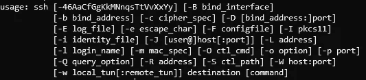

ssh —帮助命令输出

我们可以推断，使用-p 选项，我们能够更改默认端口。该任务的指令将用户名和密码设置为“bandit0”。所以我们的命令应该是:

```
ssh -p 2220 bandit0@bandit.labs.overthewire.org
```

我们将被提示一些文本，在输入“是”之后，将需要一个密码。输入“bandit0”，我们成功登录到服务器(注意，尽管您键入了密码，但不会显示任何字符，这完全正常):

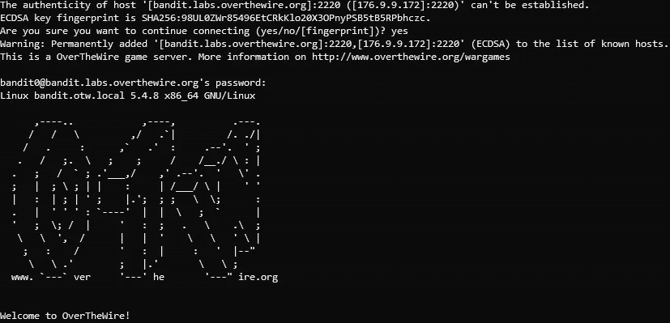

成功连接到 Bandit0 机器

万岁！0 级完成。要继续:

> 登录后，进入[1 级](https://overthewire.org/wargames/bandit/bandit1.html)页面，了解如何击败 1 级

# 0 级→1 级

我们在第一关的任务是在主目录下的**自述文件**中找到下一关的密码。为了在 Linux 中导航到一个文件夹，应该使用 *cd* 命令。主目录可以用~符号缩写:

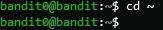

进入主目录

为了显示这个文件夹中包含的文件，我们可以使用 *ls* 命令。我们可以看到有一个名为 **readme** 的文件，我们可以使用 cat 命令读取其内容，如下所示:

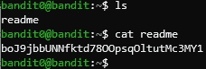

从自述文件中读取密码

# 1 级→2 级

现在，让我们在目标机器上登录 bandit1，并使用我们刚刚找到的密码。我们当前的目标是从名为“ *-”的文件中读取下一级的密码。*我们可以 *ls* 看到文件确实在我们当前的目录下(也叫*工作目录*)。但是执行" *cat -"* 不会产生任何输出。

快速的谷歌搜索会发现 *cat* 命令将破折号视为 *stdin* (标准输入流)的同义词，为了克服这个问题，我们可以键入“ *cat。/-"* 取而代之，反之"."指当前目录(*工作目录，记得吗？*)和/用于访问其内容:

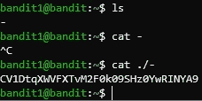

读取 Dash 文件

我们已经找到了密码，让我们继续下一关。

# 2 级→3 级

再次使用获得的密码登录目标机器中的 bandit2。

下一关的密码包含在一个名为**的文件中，文件名为**。使用 *ls* ，我们可以知道它位于我们的工作目录中。嗯，你可能已经猜到了，咱们就*猫*吧！

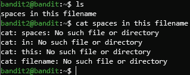

试图将**中的空格“猫”入此文件名**

意外错误！原因是 Bash Shell 使用空格作为不同命令和参数之间的分隔符。要覆盖这种行为，我们可以在每个空格前加上\:

`cat spaces\ in\ this\ filename`

非常管用！收集密码，继续到第 3 级。

# 3 级→4 级

下一个必需的文件据说位于**固有的**目录中。再次，使用 *ls* 我们可以看到 **inhere** 目录在目录树中我们当前的文件夹下。正如我前面提到的，我们可以使用 *cd* 命令来进入它。

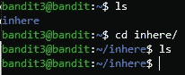

进入**固有的**文件夹

我们在正确的目录中，但是文件在哪里？OverTheWire 的 level 指令声明该文件被**隐藏**，这意味着它不会被显示，除非使用特殊参数。 *ls* 命令需要的参数是 *-a* :

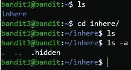

这里是**。隐藏**文件！

还记得那个什么**吗。**文件名是什么意思？请注意，在 Linux 中，隐藏文件是以点开头的文件名。我想现在你已经知道如何阅读密码并进入 4 级了。

# 四级→五级

这一关的目标是从单个可读文件(位于**的固有目录**中)中获取密码。还建议使用*复位*命令来“修复”终端。

一旦进入相关目录，我们可以看到有 10 个文件，格式都是 **-file0X** ，而 **X** 的范围是从 0 到 9。所有文件都以破折号开头，因此请注意 *cat* 命令的参数格式。

让我向您展示另一个技巧:在 Linux 中使用通配符，这类似于正则表达式。利用不同文件的名称格式，可以使用 ***** (星号)来表示任何字符可以位于特定位置。

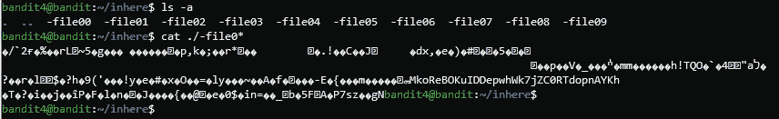

使用一个命令读取所有文件

你可能已经注意到了密码，但是让我向你展示另一个伟大的 Linux 工具，叫做 **strings** 。显然，这些文件中的许多字符我们人类无法阅读。strings 命令将文本作为输入，并提取人类可读的摘录。我们可以使用**管道重定向(|)** 来获取*猫*命令的输出，并将其设置为*字符串*命令的输入。

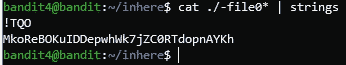

使用**字符串**从文件中提取密码

我们有密码。请务必忽略前面的 **M** ，因为它是由于 *cat* 输出的格式化方式而添加到字符串中的，所以密码是 **koRe……**

现在我们正前往这篇文章的最后一关。使用我们刚刚获得的密码并连接到 **bandit5** 。

# 第 5 级→第 6 级

我们目前的目标是找到一个**人类可读的**文件，其大小为 **1033 字节**并且**不可执行**。

为了检查**在**目录中所有文件的大小和权限，我们可以使用 *ls* 命令的一个参数，即 *ls -l* 。它扩展了输出并显示更多数据。

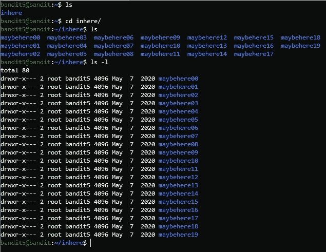

使用**固有**目录中的 **ls -l** 命令

看看由 *ls -l* 命令生成的每行输出之前的 **d** 。意味着下面的文件是一个目录！由于我们要搜索一个文件，并且有太多的文件夹需要我们手动检查，我们可以在 *ls* 命令中添加 *-R* 选项，并执行递归遍历。

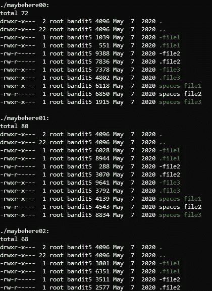

**ls -laR** 命令的结果

我们的输出看起来像这样。这是大量的文本，所以让我们使用 Linux 提供的最复杂的工具之一来过滤这个输入: **grep** 。

我们可以使用**管道重定向(|)** 将输入传递给 grep，您现在已经很熟悉了。我提醒你我们的目标文件大小是 1033 字节。文件的大小显示在日期前的 *ls -laR* 命令中。所以让我们使用 grep 来搜索这个文件:

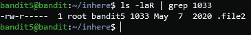

使用 **grep** 过滤输出

现在我们知道文件名是 **.file2** (一个隐藏文件！)，但是我们不知道它在哪里。为了找到答案，我们可以向 *ls* 命令添加另一个参数，即我们希望显示的文件名。请记住，因为所有文件都在目录中，所以我们需要使用 ***** 通配符来代替文件夹，以简化所有文件:

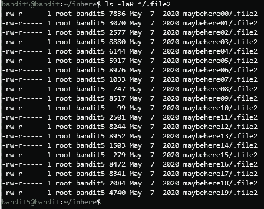

**ls -laR */.file2** 命令的输出

不，我们有一个名为 **.file2** 的文件列表。我们可以再浏览一遍，以便只查看所请求的内容。

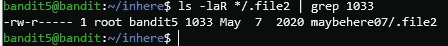

列出每个目录中的 **.file2** ，仅显示具有请求大小的目录

还记得**不可执行**的请购单吗？请注意第一列—这些是文件的权限。我们将在后面的教程中深入研究它们，但是字母 **X** 的缺失证明当前不可能(允许)执行该文件。

让我们在这里输入**maybe 07**，读出 **.file2** 。我们已经成功获得了密码！留到下一个帖子…

## 结论

现在再见。祝你在那之前玩得开心，愿即将到来的公历新年给我们所有人带来幸福和快乐！