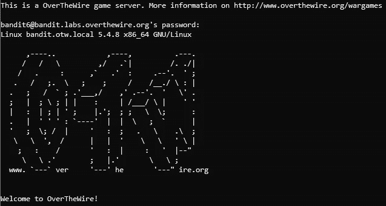
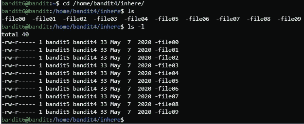
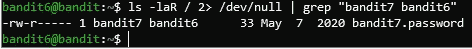
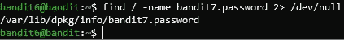
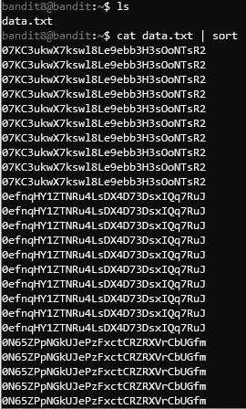
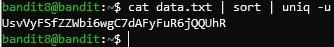
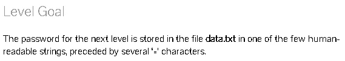
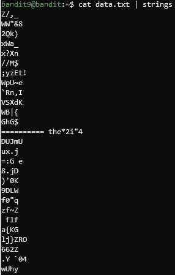
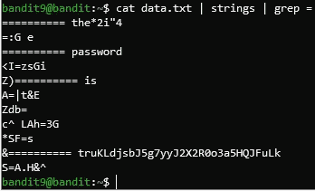

# 使用 OverTheWire 的 Bandit 学习 Linux 和 InfoSec 原理—第 2 部分

> 原文：<https://infosecwriteups.com/learning-linux-infosec-principles-using-overthewires-bandit-part-2-5beecb56e270?source=collection_archive---------4----------------------->

## 从一个有趣的在线“战争游戏”开始学习 Linux

**简介**

在之前的帖子([https://bit.ly/3r0woVT](https://bit.ly/3r0woVT))中，我们已经从 OverTheWire 的强盗机器的前 6 关开始了我们的 Linux 之旅。如果你还没有读这篇文章，强烈推荐你——你会有一个更好的介绍。

本质上，Bandit 是 OverTheWire.org 网站提供的最基本的机器，旨在向人们介绍基本的 Linux 命令和信息安全思想。

本文的目标是通过使用强盗“wargame ”,为您提供一种实用而愉快的方式来了解 Linux 操作系统(尤其是 *bash* shell)。如果你已经阅读了第一篇文章，或者对这篇文章过于热情(我完全理解:)，那么让我们开始吧。

# 我们停下来的地方

上一篇文章中我们做的最后一件事是获取 6 级的密码，也就是:dxjzpullxyr 17 uwoi 01 bnlqbtfemego 7。

让我们连接到这一层。ssh 的*命令是:*

`ssh -p 2220 bandit6@bandit.labs.overthewire.org`

SSH 是一种用于到目标的安全外壳连接的协议。我们指定要在端口号 2220 上连接到主机**bandit.labs.overthewire.org**中的用户 **bandit6** 。输入密码，我们就进入了。

登录**盗匪**机，**6 级**

# 6 级→7 级

我们在这一关的目标是找到下一关的密码。我们被告知密码文件可以位于服务器的任何地方**，这意味着每个目录(文件夹)都可能是它的容器。我们还被告知，该文件归 **bandit7** 用户以及 **bandit6** 组所有。而且，文件的大小是 **33 字节**。**

在 Linux 中，一个文件同时属于一个用户和一个组。这些设置决定了用户在系统上的权限，他们可以对给定文件做什么，不可以做什么。

虽然拥有用户是不言自明的，但是**组**机制更加复杂。基本上，一个用户可以是几个组的成员，这些组是系统中的逻辑结构，每个组都有不同的权限。创建组有多种目的，例如:管理服务(数据库、web 服务器……)、使用资源(打印机和其他硬件)等等。文件所属的组对其访问文件有特殊的权限。

我们知道 *ls* 命令，它用于列出给定目录的内容。我们也遇到了这个命令的 *-l* 选项，但是还没有彻底研究它——我们只是说它提供了更多的信息。现在就来研究一下吧。

使用 *cd* 命令，我导航到 **/home/bandit4/inhere** 目录，我们上次访问过这个目录。在这里输入 *ls* 可以看到有一些文件。让我们添加 *-l* 选项:

执行 **/home/bandit4/inhere** 目录下的 **ls -l**

我们发现我们收集了更多的信息。第一列，看起来像一个随机的字母序列，指定了文件的不同权限:我们现在忽略它。第二列显示了**硬链接**的数量，这是一个更高级的概念，我们将在后面讨论。

接下来的专栏与我们更相关。第三列指定拥有该文件的用户(记住，我们搜索由 **bandit7** 拥有的文件)，下一列显示拥有该文件的组(desired: **bandit6** ，如说明中所指定)。第五列显示文件的大小(所需: **33** )。最后的细节是最后修改的日期&时间。

让我们重新使用上次的策略:递归地列出所有文件，并对输出进行 grep。递归地列出系统中所有文件的命令如下:

`ls -laR /`

我们已经讨论过 *ls -l* 。 *a* 选项告诉 *ls* 命令列出隐藏文件，而 *R* 选项意味着**递归列出** —“进入”所有文件夹。末尾的/(斜杠)指示 *ls* 开始列出来自操作系统的**根的所有文件，即文件系统的“开始”。但是如果我们单独键入这个命令，我们将得到大量的输出，手动搜索效率极低。所以我们可以利用 *grep* 命令。**

*grep* 是一个在一串文本中搜索模式的命令。通常，我们通过**管道|** 使用它——使用另一个程序的输出作为 *grep* 的输入。例如:

`ls -laR / | grep to_search`

将只显示包含短语“to_search”的 *ls* 的输出行。我们希望根据 *ls* 命令格式和我们级别的要求，搜索包含短语“bandit7 bandit6 33”的 *ls* 条目。由于 *ls* 格式化其输出的方式，我们现在将省略“33 ”,并运行以下命令:

`ls -laR / | grep "bandit7 bandit6"`

注意引号，当我们搜索的模式包含空格时，我们必须用它们封装字符串。

我们得到很多输出，其中大部分是错误消息。在 Linux 中，错误消息被打印到 **stderr** 文件中。目前， **stderr** 文件被定义为与 **stdout** 相同——我们的默认输出流。这就是我们看到错误消息的原因。为了省略这些不必要的消息，我们将**将错误输出文件重定向**到一个名为 **/dev/null** 的文件，该文件接收输入(被写入)并丢弃所有内容。为此，我们键入 *2 > /dev/null* 。2 >指定了错误消息将被发送到哪里，在我们的例子中→发送到 **/dev/null** 文件。

查找所需的文件

万岁！我们得到了文件，我们知道它叫做 **bandit7.password** 。但是我们不知道如何访问它，因为它的目录(完整路径)是未知的。为此，我们将使用*查找*命令，如下所示:

`find / -name bandit.password 2> /dev/null`

命令是 *find* ，您已经知道/(斜杠)代表什么——find 工具将从这个文件夹开始搜索。 *-name* 参数表示我们将根据文件名搜索文件，我们接下来将提供文件名。最后但同样重要的是，我们像以前一样丢弃错误消息。

查找密码文件的完整路径

现在让我们读取文件，获取密码，进入下一关！

读取**第 7 级**的密码

# 7 级→8 级

首先，使用我们刚刚收集的密码登录同一台机器，登录到用户 **bandit7** 。我们现在被告知，密码可以在 **data.txt** 文件中找到，在第**百万个**字附近。

还记得我们通常 **pipe |** 输出到 grep 吗？看文件和*翻文件没什么区别！因此，让我们阅读该文件(在我们当前的目录中找到，执行一个基本的 *ls* 并自己查看)，并 grep 单词 **millionth** :*

读取**第 8 级**的密码

# 8 级→9 级

现在，密码再次存储在 **data.txt** 文件中，指令向我们揭示了它是唯一出现一次的文本行。如果我们试图读取文件，我们会看到大量的数据，我们无法手动处理，更不用说找到出现一次的行。

幸运的是，我们不需要这么做。有一个强大的 bash 实用程序叫做 *uniq* ，它可以立即向我们显示哪一行没有重复。 *uniq* 的输入必须排序，所以我们也将使用*排序*命令。让我们看看怎么做。

我们已经知道如何读取文件。为了对 **data.txt** 的内容进行排序，我们将再次 **pipe |** 输出 *cat* 命令，对*进行排序*:

读取 **data.txt** 文件并排序

可以看到，现在所有相同的密码被分组在一起。同样，因为文件的内容太大，我们无法看到整个输出。

让我们前往 uniq 。我们如何将最后一个命令的输出作为输入传递给 uniq ？你猜对了，**滚边|** ！因此，我们将重新执行最后一个命令，将它传送到 *uniq* 。确保使用 *-u* 选项运行 *uniq* ，以便只输出完全唯一(出现一次)的行。注意，使用几个管道完全没问题。

读取**第 9 级**的密码

# 9 级→10 级

登录 **bandit9** 用户，阅读水平仪的说明:

**第 9 级**的说明

同样，我们需要搜索 **data.txt** 文件，寻找人类可读的字符串。如果您还记得以前的帖子，您可以回忆起 *strings* 命令，它只输出人类可读的输入内容，我相信您知道我们将如何为这个命令提供输入。

在 **data.txt** 文件中搜索人类可读的字符串

输出与我们预期的一样，但仍然太大，我们无法手动探索。让我们利用这个级别的最后一个提示:密码前面有“=”。怎样才能找到包含这个字符的行？当然，你答对了。我们用 *grep* :

读取**10 级**的密码

干得好。我们已成功获取密码！留到下一个帖子…

# 结论

我希望通过这篇文章，您已经学习并提高了您的 Linux 技能。如前所述，我祈祷你也玩得开心！请留下一些评论，让我知道你更喜欢我做什么，或者希望我报道什么。

我必须感谢你们每一个阅读我帖子的人——你们太棒了。现在再见。祝你玩得愉快，直到我们再次见面！