# 使用 OverTheWire 的 Bandit 学习 Linux 和 InfoSec 原理—第 3 部分

> 原文：<https://infosecwriteups.com/learning-linux-infosec-principles-using-overthewires-bandit-part-3-69c8cf518bf6?source=collection_archive---------5----------------------->

## 从一个有趣的在线“战争游戏”开始学习 Linux

**简介**

在之前的帖子(【https://bit.ly/3qFZACp】)中，我们已经用 OverTheWire 的 Bandit 机器的 6 到 9 级继续了我们的 Linux 之旅。如果你还没有阅读前两篇文章，强烈推荐它们——你会有更好的介绍。

本质上，Bandit 是 OverTheWire.org 网站提供的最基本的机器，旨在向人们介绍基本的 Linux 命令和信息安全思想。

本文的目标是通过使用强盗“wargame ”,为您提供一种实用而愉快的方式来了解 Linux 操作系统(尤其是 *bash* shell)。如果你已经阅读了之前的帖子，或者太热衷于继续这篇文章(我完全理解:)，那么让我们开始吧。

# 我们停下来的地方

上一篇文章我们做的最后一件事是获取 10 级的密码，也就是:trukldjsbj 5g 7 yyj 2 x 2r 0o 3 a 5 hqjfulk。

让我们连接到这一层。ssh 的*命令是:*

`ssh -p 2220 bandit10@bandit.labs.overthewire.org`

SSH 是一种用于到目标的安全外壳连接的协议。我们指定要在端口号 2220 上连接到主机**bandit.labs.overthewire.org**中的用户 **bandit10** 。输入密码，我们就进入了。

登录**盗匪**机，**6 级**

# 10 级→11 级

下一关的密码存储在 **data.txt** 文件中，我们被告知其编码在 **base64** 中。 **Base64** 接受一个输入，并以特定的格式对其进行编码，使原始数据以不同的方式出现。我们可以通过立即阅读该文件来了解这一点:

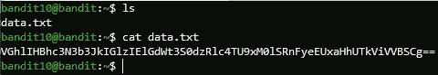

不解码读取 **data.txt**

我们可以看到文件的内容与 **bandit** 机器中密码的通常模式不符。因此，我们需要解码 **base64** 编码——幸运的是，有一个 bash 实用程序正好可以完成这项工作。令人惊讶的是，它叫做 *base64* 。

为了理解我们应该如何使用它，让我们使用`--help`选项:

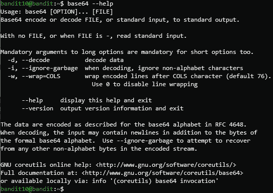

**base64** 命令帮助页面

我们可以推断，为了查看编码的密码，我们必须提供 *-d* 选项—解码输入。我们如何将文件的内容传递给命令呢？第一种选择是使用命令的语法，在末尾提供文件名。我相信你已经熟悉了第二种选择，我们在之前的文章中已经详细介绍过了。

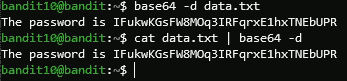

用两种方法解码密码

现在，使用这个密码进入下一关。

# 11 级→12 级

在这个关卡中，我们被告知虽然密码再次存储在 **data.txt** 中，但是所有的字母字符都被旋转了 13 位。这意味着编码是 **ROT13** ，这是凯撒密码的一种情况，在这种情况下，你用后面(或前面)第 13 位的字母替换每个字母。这是维基百科中的一个表格:

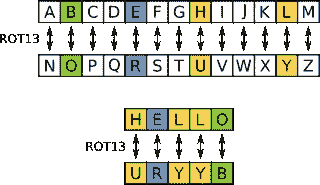

**ROT13** 编码

要解码密码文件的内容，我们可以使用 bash *tr* 命令，该命令可用于字符串操作。我们将利用 *tr* 来执行这个替换。tr 的工作方式是指定要修改的字符范围，然后指定要应用的替换。看一下下面的例子:

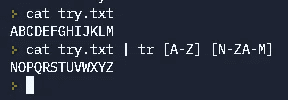

**ROT13** 替换使用 **tr**

我创建了一个名为 **try.txt** 的文件，其中包含 A 到 M 的大写字母。然后，我将 *cat* 命令的输出传送到 *tr* ，并确定替换:修改应该应用于**【A-Z】**范围内的所有字母，而从 N 到 Z 的所有字母将变成 A 到 M，反之亦然，分别为:**【N-ZA-M】**。该操作与上面显示的 **ROT13** 编码相匹配。

每次执行 *tr* 命令都可以执行一组替换。为了结合小写和大写字母开关，我们将再次使用管道，从而获得密码。

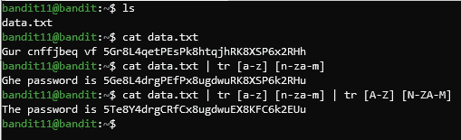

使用 **tr** 解码密码

第一个 *tr* 命令只修改了小写字母，而最后一个命令执行了所有必要的修改。我们继续吧。

# 12 级→13 级

乍一看，这些说明似乎有点让人不知所措:

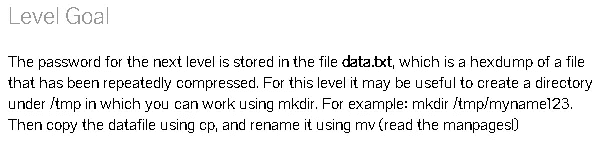

第十二级**的目标**

应该检查同一个文件。我们被告知这是一个压缩了很多次的文件的 hexdump。**文件压缩**是指获取一个文件，对其应用一种算法，从而减小其大小。一个 **hexdump** 意味着获取一个文件的内容并以十六进制的视图显示它们(基数为 16)。

让我们按照说明开始，使用 *mkdir* 命令在 **/tmp** 目录下创建一个新目录(文件夹):它接收新目录的路径作为参数。 **/tmp** 目录是 Linux 机器上最常见的目录之一，用于存放系统或其他应用程序临时需要的文件。

现在，我们将使用 *cp* 命令将 **data.txt** 文件复制到我们刚刚创建的文件夹中:该命令的语法如下——在 *cp* 之后应该是要复制的文件的路径，在它之后是目的地——我们希望文件副本所在的位置。

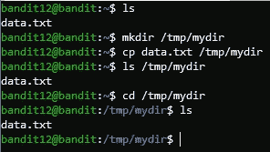

创建目录和复制文件

我们可以看到文件被复制了。然后，我们使用 *cd* 命令进入 **/tmp/mydir** 文件夹，看到该文件确实也驻留在那里。

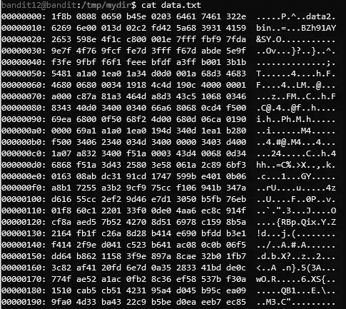

一个 **Hexdump** 文件

在尝试读取文件时，我们看到了什么是 Hexdump。要解码内容，我们可以使用 *xxd* 命令，该命令用于与 **Hexdumps** 交互。为了对文件进行解码，我们可以**将它的内容管道|** 到 *xxd* 添加 *-r* 选项，该选项告诉 *xxd* 将 **Hexdump** 转换为常规的二进制格式( *-r* 代表反向，默认情况下 *xxd* 是从二进制到 **Hexdump** )。

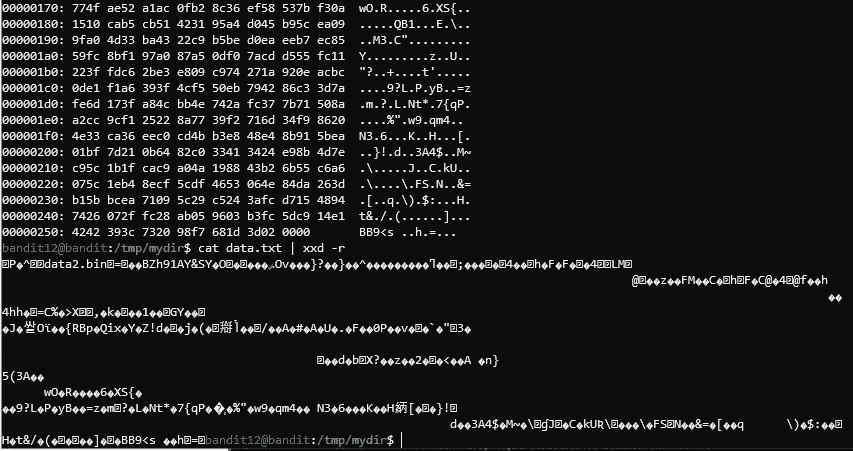

使用 **xxd** 解码 **Hexdump**

这个文件对我们来说仍然是不可读的，但是这种类型的内容更容易管理。为了以后更好的工作流程，让我们将这个结果保存在一个名为 **newdata** 的单独文件中。为此，让我们回忆一下 Linux 中输出的**重定向**。在上一篇文章中，我们将其应用于标准错误流 **stderr** 。现在，我们将它应用到标准输出流 **stdout** ，这是当前的终端，因为当我们执行一个命令时，我们会看到结果在我们面前！为此，我们只需在命令的末尾添加**>target _ file**——您可以看到输出现在在终端中被抑制了，但可以在文件中找到:

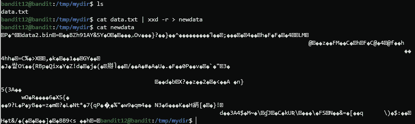

输出**重定向**用于 **data.txt** 解码

我们有一个文件，之前我们被告知这是一个压缩文件。但是我们不知道用的是哪种压缩算法/程序！幸运的是，我们可以使用一个名为 *file* 的工具来找出答案，它决定了提供给命令的文件的类型。

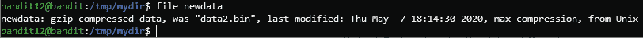

发现压缩机制

*文件*实用程序显示**新数据**被 **gzip** 压缩，以及它的原始名称和最后修改日期。要解压缩，我们首先必须有一个以**结尾的文件。gz** ，以便实用程序能够使用它。让我们再次使用 *cp* 命令，但是这一次，源文件名和目标文件名都在当前目录中，所以不需要提供路径。

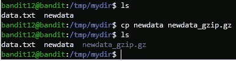

将 **newdata** 文件复制为**。gz** 文件

现在，使用 **gunzip** 命令解压它，并尝试读取它:

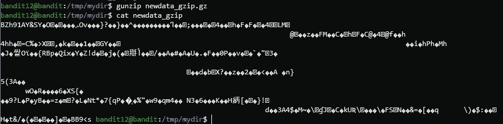

使用 **gunzip** 解压文件

尽管如此，内容并不清楚。我们能做什么来确定文件的类型？优秀—再次使用*文件*。

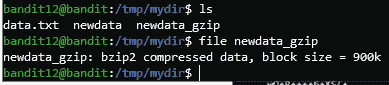

检查 **newdata_gzip** 文件的类型

**Bzip2** 是另一种压缩算法，我们也可以使用 **bunzip2** 命令对其进行解压缩。首先，确保您有一个扩展名为 **.bz2** 的文件副本，以便 **bunzip2** 能够正常工作。

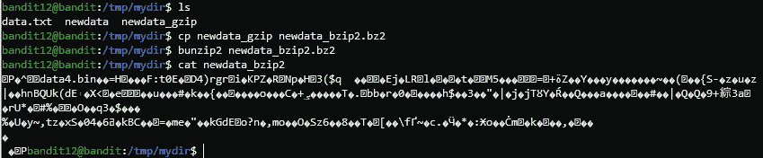

使用 **bunzip2** 解压文件

同样，文件的内容是不可读的，所以让我们再次执行相同的过程。

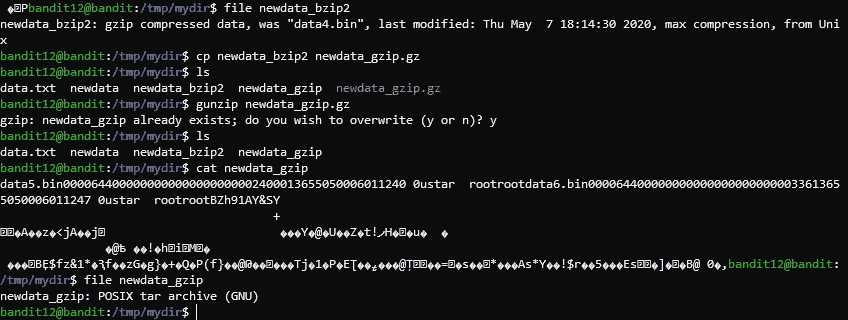

另一个 **gunzip** 执行

这是一种新的压缩格式，我们以前没有遇到过。用于与交互的命令仅接收带有**的文件。tar** 扩展，我相信现在您已经知道如何生成这些了:)。

之后执行**tar-xvf*解压 **tar** 存档。*

*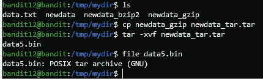*

*使用 **tar -xzvf** 解压一个档案*

**tar* 命令的输出是结果文件的名称。所以现在，我们需要改改它。同样的机制，添加必要的扩展，然后解压缩存档。*

**

*继续进行解压缩过程*

*最后，我们到达了最后一步。*

*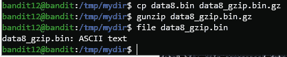*

*到达 **ASCII 文本**文件*

*一个 **ASCII 文本**文件是常见的文本文件格式。现在我们可以读取它并获得密码，在所有这些累人的步骤之后…*

*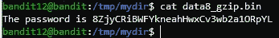*

*读取**13 级**的密码*

# *13 级→14 级*

*使用我们辛辛苦苦获得的密码登录到下一个级别。这个级别的说明是不同的——我们不需要找到一个密码，而是一个私有的 **SSH 密钥**。一个 **SSH 密钥**是用于 **SSH** 连接的安全认证机制，基于加密原理。*

*在执行通常的 *ls* 时，我们可以看到一个名为 **sshkey.private** 的文件。该文件包含认证信息。我们可以将这个数据提供给 *ssh* 命令，并使用 *-i* 选项用它来标识我们自己，该选项的值是密钥文件。 **Bandit14** 是我们自己机器上的用户，所以我们应该写 **localhost** ，而不是目标 IP/host，指的是我们自己的设备。*

*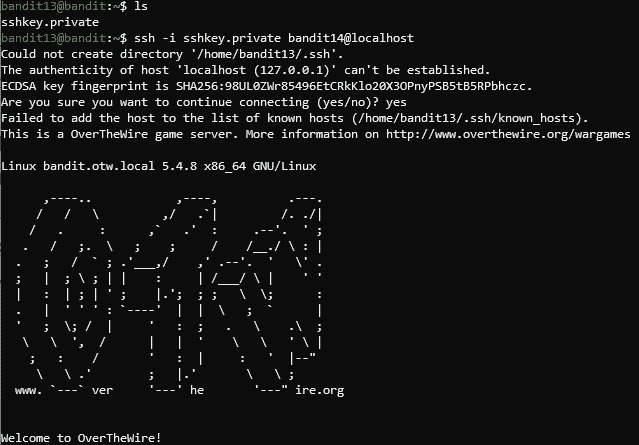*

*完成**第 13 级***

# *14 级密码—前往下一篇文章*

*实际上我计划把**第 13 级**放在这个帖子的最后，但是下次再讨论双 SSH 认证会很无聊，所以你被奖励了:)。最后一级的指导方针规定:*

> *下一级的密码存储在 **/etc/bandit_pass/bandit14 中，只能由用户 bandit14 读取。***

*现在我们以用户 **bandit14** 的身份登录，这样我们就可以读取它的密码并保存下来，以备下一篇文章使用。*

*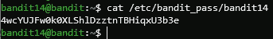*

*读取**14 级**的密码*

# *结论*

*哇，我们在这四个级别中遇到了如此多的术语和主题: **Base64、ROT13 Caesar Cypher、Hexdump、 *mkdir* & *cp* 、*文件*、输出重定向、SSH 密钥**以及几个**压缩算法**及其相应的命令。*

*我希望通过这篇文章，您已经学习并提高了您的 Linux 技能。如前所述，我祈祷你也玩得开心！请留下一些评论，让我知道你更喜欢我做什么，或者希望我报道什么。*

*我必须感谢你们每一个阅读我帖子的人——你们太棒了。现在再见。祝你玩得愉快，直到我们再次见面！*

*🔈🔈Infosec Writeups 正在组织其首次虚拟会议和网络活动。如果你对信息安全感兴趣，这是最酷的地方，有 16 个令人难以置信的演讲者和 10 多个小时充满力量的讨论会议。 [**查看更多详情，在此注册。**](https://iwcon.live/)*

* [## IWCon2022 - Infosec 书面报告虚拟会议

### 与世界上最优秀的信息安全专家建立联系。了解网络安全专家如何取得成功。将新技能添加到您的…

iwcon.live](https://iwcon.live/)*