# 使用 OverTheWire 的 Bandit 学习 Linux 和 InfoSec 原理—第 5 部分

> 原文：<https://infosecwriteups.com/learning-linux-infosec-principles-using-overthewires-bandit-part-4-69803b6f43ed?source=collection_archive---------1----------------------->

## 从一个有趣的在线“战争游戏”开始学习 Linux

## **简介**

在之前的帖子(【https://bit.ly/3qFZACp】)中，我们已经用 OverTheWire 的强盗机器的 14 到 18 级继续了我们的 Linux 之旅。如果你还没有阅读前四篇文章，强烈推荐它们——你会有更好的介绍。

本质上，Bandit 是 OverTheWire.org 网站提供的最基本的机器，旨在向人们介绍基本的 Linux 命令和信息安全思想。

本文的目标是通过使用强盗“wargame ”,为您提供一种实用而愉快的方式来了解 Linux 操作系统(尤其是 *bash* shell)。如果你已经阅读了之前的帖子，或者太热衷于继续这篇文章(我完全理解:)，那么让我们开始吧。

## 18 级→19 级

在上一篇文章的最后，我们找到了 18 级的密码:kfb F3 eyk 5 bpbrzwjqutbbfe 887 SVC 5 yd。让我们像往常一样用它登录到这个级别。

`ssh bandit18@bandit.labs.overthewire.org -p 2220`

哦哦！发生了什么事？我们提供了正确的密码，似乎认证过程成功了，但是我们立即被踢出服务器，得到消息“拜拜！”。

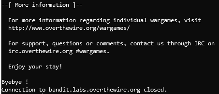

被踢出服务器

不要害怕！让我给你看看 17 级指令的附录:

奇怪信息的解释

所以我们需要升级到 19 级。这些说明是:

19 级指令

我们认为必须检查主目录中的**自述文件**的内容。还记得我在上一篇文章中建议保留它的密码吗？现在，我们将使用它进行初始访问，这将帮助我们超越“错误”。密码是:xlyvmn 9 we 5 zq 5 vhacb 0 szevqbrp 7 nbtn。但是一旦登录，我们发现我们没有权限读取相关文件，甚至连本地连接到 *bandit18* 都无法实现。

此外，即使密码是正确的，我们也被告知我们被排除在外的原因:有人修改了**。bashrc** 文件。这是一个 shell 脚本，它初始化与终端的交互会话。它定义了几个属性，在我们的例子中，SSH 登录到 **bandit18** 会立即将用户踢出。

因此，我们必须找到一种方法，在我们注销之前，甚至在没有完全登录的情况下执行该命令。幸运的是，我们可以使用 **SSH** 发送一个要执行的命令。为此，我们在 **SSH** 行的末尾添加了带引号的命令。

`ssh bandit18@bandit.labs.overthewire.org -p 2220 'cat readme'`

主目录是默认的登录目录，我们知道文件名，所以我们成功地获得了下一个级别的密码。

## 19 级→20 级

为了继续下一个级别，我们需要利用主目录中的 **setuid** 二进制文件。二进制文件是一个可执行文件，我们被告知执行它时不需要任何参数来理解它是如何工作的。

我们马上就去做，但是首先让我们解释一下什么是 **setuid** 。这是文件的一个属性，如果打开，意味着运行文件的不是实际运行它的用户，而是拥有它的用户。如果我们运行 **ls -l** :

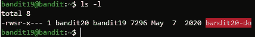

在 **home** 目录下运行 **ls -l**

你能认出左边的单个“s”吗？这证明了 **setuid** 位确实开启。现在，如果我们执行二进制文件，我们将不是管理进程的用户，其权限将被继承给进程——所有者将运行它，而进程将拥有他的权限。我们可以看到，拥有者是下一级， *bandit20* 。让我们执行脚本:

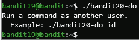

不带参数运行 **setuid** 脚本

我们举了一个例子。我们可以在脚本名称后提供一个参数，这将由用户 *bandit20* 作为命令运行。让我们试试 **whoami** 命令。它告诉我们我们是哪一个用户，正如我们所看到的，使用它的脚本显示 *bandit20* ，没有它的话— *bandit19* 。

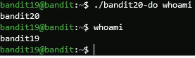

**带和不带 **setuid** 脚本的 whoami**

现在，让我们运行一个更有用的命令，读取下一关的密码，该密码存储在文件 **bandit20** 内的 **/etc/bandit_pass/** 目录中，只有该用户可以读取。

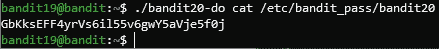

读取下一关的密码

通过利用脚本，我们获得了 *bandit20* 用户的权限并读取了密码。让我们继续。

## 20 级→21 级

哇，这是一个很长的段落！

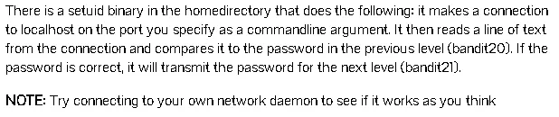

20 级指令

我们来总结一下。同样，我们有一个 **setuid** 文件，它连接到 **localhost** 的一个特定端口。然后，它读取收到的消息，并将其与当前级别的密码进行比较。提供的提示指导我们创建自己的“网络守护程序”——这意味着一个连接监听器，一个虚拟的“服务器”，我们将能够控制它，并因此向运行的 **setuid** 脚本发送正确的密码。

为了设置这个服务器，我们将使用 **netcat** :

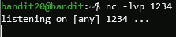

用 **netcat** 设置虚拟服务器

我们已经处理了 **netcat** 命令，但是让我们回顾一下参数的含义。 **l** 声明我们想要监听传入的连接。 **v** 代表 verbose，我们提供它来告诉 **netcat** 向我们显示尽可能多的数据。最后但同样重要的是， **p** 用于指定端口，稍后键入— 1234。

但是现在看起来我们好像被卡住了，因为 netcat 只是等待连接——但是我们应该发起连接，尽管如此！为了解决这个问题，我们将通过按 Ctrl+Z 暂停这个过程，在后台等待执行。现在，我们将使用适当的端口运行 **setuid** 脚本:`./suconnect 1234`

同样，这也需要等待—记住，它需要检查从连接收到的消息。所以我们也需要暂停这个过程，回到上一个过程。再次，按 Ctrl+Z。

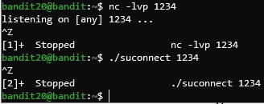

使用 Ctrl+Z 暂停进程

为了重新激活原来的进程，我们使用写在左边的数字—检索后台进程的命令是 **fg {process number}** ，代表“前台”。在`fg 1`之后，我们看到了我们所建立的联系的证据。现在，让我们发送 20 级的密码。

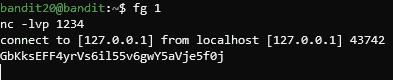

发送正确的密码

所有这些的目标是来自 **suconnect** 脚本的输出——所以我们需要返回到。你已经知道如何暂停当前进程并移动另一个进程，它的编号是 2。

接收我们发送的密码

下一个密码已发送，因此我们将返回到 **netcat** one 查看它。

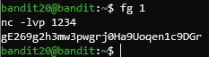

获取 21 级的密码

这就完成了。

## 21 级→22 级

我们来总结一下提供的细节:有一个相关的程序使用 **cron** 定期运行——这是 Linux 的一个重要组成部分——它被称为作业调度器(job scheduler)，顾名思义，它管理在特定时间运行的进程。其设置和要执行的命令在 **/etc/cron.d/** 目录中指定，该目录配置 **cron** 。让我们进入这个目录，看看里面有什么。

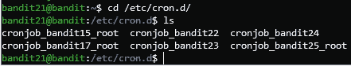

正在检查 **/etc/cron.d/** 目录

我们可能应该检查的文件是对应于我们当前级别的文件。我们来读一下。

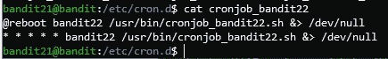

**cronjob_bandit22** 文件

这看起来像是毫无意义的咕哝，但是请耐心听我说:第一段定义了运行作业的频率/事件/时间——第一行指定在重新启动时执行，第二行指定“每分钟”。接下来，它提供负责的用户，然后是要运行的命令。在我们的例子中，一个脚本被执行，它的输出被丢弃( **/dev/null** 是一个文件，描述了一个丢弃所有写入它的信息的设备)。

那很有趣！让我们自己来检查这个脚本。

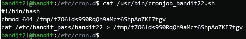

读取脚本文件

一个**。Linux 中的 sh** 文件是一个可执行脚本，它能够执行我们习惯在命令行输入的命令。这个脚本有 3 行。他们的角色:

1.  指定脚本的解释者——基本上是负责将脚本“翻译”成计算机可以理解的指令的人。这是 bash shell，我们总是使用它，因此可以使用我们知道的常规命令。
2.  更改/tmp/t7O6lds9S0Rq 的权限…..文件，这样每个人都可以阅读。我们现在就不深究权限了。
3.  *有趣的部分:*读取存储 22 级密码的文件内容，并将输出重定向到/tmp 目录中的文件。记住:第二行指定我们被允许读取这个文件！

因此，我们需要做的就是读取相关文件并找到密码:

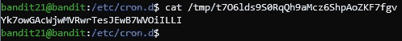

获取 22 级的密码

恭喜你！我们做到了。现在保留这个密码，直到下一篇文章:)

## 结论

我们在本文中解决的几个层次向我们介绍了关于 Linux OS 的更高级的概念和方面。我们逐渐发现越来越多的，运行世界的操作系统的主要部分: **setuid，cron，暂停和恢复进程…**

我希望通过这篇文章，您已经学习并提高了您的 Linux 技能。如前所述，我祈祷你也玩得开心！请留下一些评论，让我知道你更喜欢我做什么，或者希望我报道什么。

我必须感谢你们每一个阅读我帖子的人——你们太棒了。现在再见。祝你玩得愉快，直到我们再次见面！