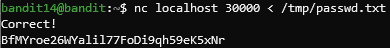
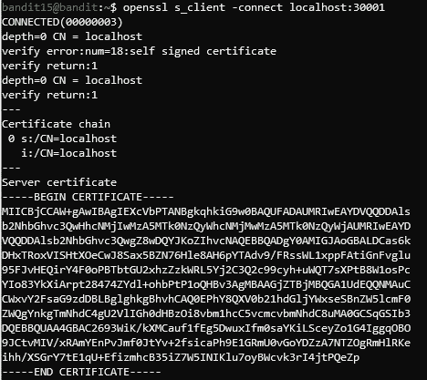
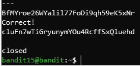
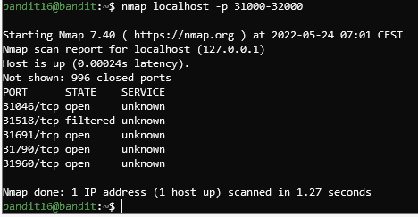
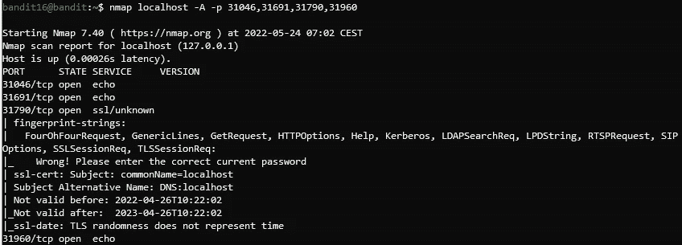
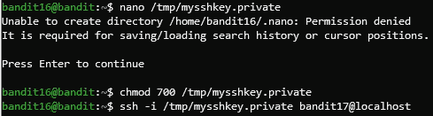
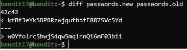

# 使用 OverTheWire 的 Bandit 学习 Linux 和 InfoSec 原理—第 4 部分

> 原文：<https://infosecwriteups.com/learning-linux-infosec-principles-using-overthewires-bandit-part-4-a202c2e44843?source=collection_archive---------6----------------------->

## 从一个有趣的在线“战争游戏”开始学习 Linux

**简介**

在上一篇文章([https://bit.ly/3qFZACp](https://bit.ly/3PxHGfP))中，我们用 OverTheWire 的强盗机器的 10 到 14 级继续了我们的 Linux 之旅。如果你还没有阅读前三篇文章，强烈推荐它们——你会有更好的介绍。

本质上，Bandit 是 OverTheWire.org 网站提供的最基本的机器，旨在向人们介绍基本的 Linux 命令和信息安全思想。

本文的目标是使用 Bandit“wargame ”,为您提供一种实用而愉快的方式来了解 Linux 操作系统(尤其是 *bash* shell)。如果你已经阅读了之前的帖子，或者太热衷于继续这篇文章(我完全理解:)，那么让我们开始吧。

## 催单

从第 13 级到第 14 级的转换并不总是向适当的用户提供密码——我们必须有一个双 SSH 连接，只有这样我们才能为 *bandit14* 用户检索密码。

现在，通过 SSH 连接到这个用户并提供密码，这样我们就可以继续了。

`ssh -p 2220 bandit14@bandit.labs.overthewire.org`

## 14 级→15 级

为了进入下一个级别，我们被指示将这个密码提交到本地主机上的端口 30000。但是首先， **localhost** 是什么意思？这是对当前机器本身的引用，一般与 127.0.0.1 IP 地址捆绑，称为**环回接口**。

为了实现这一目标，我们将利用一个叫做 **netcat** 的工具，它经常被戏称为“瑞士军刀”来进行联网。它允许我们访问某个目标(通过指定 IP 地址和端口)，并建立一个可以传递消息的连接。

首先，我们将生成消息:使用 **nano** ，我们将在 */tmp/* 目录下创建一个文件，该文件用于存储临时文件(从其名称可以推断出)，并且我们对该文件具有写权限。

`nano /tmp/passwd.txt`

然后，粘贴你用来进入这一关的密码，因为这是我们要传递的信息。另一种方法是:

`touch /tmp/passwd.txt`

这将创建一个新的空文件。为了填充它，我们可以使用 **echo** 命令，并应用输出重定向，如前所述。

`echo 4wcYUJFw0k0XLShlDzztnTBHiqxU3b3e > /tmp/passwd.txt`

**echo** 命令只是简单地将一些内容打印到屏幕上，但是我们指示终端重定向输出——因此它不是出现在屏幕上，而是转到指定的文件。

现在我们终于可以运行 **netcat** 命令了，我们使用 **nc** 快捷方式来运行它:

使用 **netcat** 将之前的密码提交给 **localhost:30000**

在命令本身之后，我们键入主机(IP 地址，或者是一个特殊的关键字 **localhost** )、目标端口，然后我们重定向输入:我们告诉命令从我们刚刚创建的文件中读取它的输入，而不是给我们一个控制台，所以现在它的内容将被发送到指定的目标。

正如我们所观察到的，我们已经成功完成了这一关，并获得了下一关的密码。让我们连接到它！

## 15 级→16 级

这个阶段的任务与上一个非常相似，但是这一次我们需要对我们的连接进行 SSL 加密。这是一种加密协议，旨在保护互联网上的数据传输。这意味着，如果有人“嗅出”数据包，他将无法从中推断出任何东西，而不是直接使用 **netcat** 。

不幸的是，为了应用这种加密，我们不能再次使用 **netcat** ，而是使用一种叫做 **sslclient** 的工具，这一点令人惊讶。必要的命令是:

`openssl s_client -connect localhost:30001`

让我们解释一下其余的部分: *s_client* 指定我们希望作为一个客户端启动一个 SSL 连接，而不是一个监听的服务器。然后，设置 *-connect* ，之后是主机和端口，以便 **sslclient** 知道要连接到什么。

使用 **sslclient** 连接到端口 30001 上的 **localhost**

大量的信息向我们倾倒，但是在下面我们有一个提示。将密码粘贴到此级别:

让密码更上一层楼

我们可以继续前进。

## 16 级→17 级

这个的说明一开始看起来有点让人不知所措。为了更清楚，让我们将它们分成实际任务:

1.  在指定范围内搜索监听服务器。
2.  确定使用 SSL 的服务器。
3.  向所有匹配的服务器发送必要的消息，保存由不简单重复我们的服务器检索的密码。

敬第一个任务！事情变得相当有趣…最好的解决方案是使用名为 **nmap** 的工具，它是*网络映射器*的简写。它帮助我们扫描主机上的各种开放端口。我们也可以调整某些参数，使扫描精确地符合我们的需要。

`nmap localhost -p 31000–32000`

在命令本身之后，我们输入主机地址，在我们的例子中是 **localhost** 。然后，使用 *-p* 参数，我们指定一定范围的端口。

使用 **nmap** 扫描**本地主机**

我们得到一个端口列表，其中四个是开放的。我们进入第二步——检查哪些端口构成了使用 SSL 的服务器。同样， **nmap** 将是我们的度量——我们将只指定四个相关端口，但添加了*—*选项，代表主动，这样我们将获得关于这些开放端口背后的服务的更多信息。

使用 **-A** 参数和特定端口运行 **nmap**

我们可以推断只有端口 31790 使用 SSL，所以这一次它将是 **openssl** 命令的目的地。

`openssl s_client -connect localhost:31790`

这次输出的不是简单的密码，而是 SSH 的私钥。为了使用它，我们需要在 */tmp* 目录下创建一个文件，命名为*mysh key . private*，并使用您选择的任何文本编辑器粘贴密钥。确保您包括了密钥的“约束”——分别是开始/结束 RSA 私钥。此外，更改文件的权限，使其他用户无法访问该文件:

`chmod 700 /tmp/mysshkey.private`

别担心，我们以后会深入探讨权限。然后，正如我们在前一篇文章中所做的那样，我们将使用 SSH 进行身份验证。

移动到第 17 层

## 17 级→18 级

万岁！我们在这篇文章的最后一层。我们现在的目标不像以前那样涉及到 **nmap** 或其他组网原则，而是找到我们目录中两个文件的区别: *passwords.new* 和 *passwords.old* 。当前密码是第一个文件中与第二个文件中不同的那一行。

当然，我们可以手动检查这两个文件，但是我相信您已经猜到有一个更好的方法——一个 Bash 工具来自动化这个过程: **diff** 。它允许我们检查两个文件之间的差异。

使用 **diff** 查找密码

我们给 **diff** 提供了两个相关的文件作为命令行参数，输出告诉我们第 42 行有区别:上面一行是 *passwords.new* (第一个参数)中这一行的内容，下面一行是在 *passwords.old* (第二个参数)中找到的那一行。

这个密码将用于进入 18 级，现在不处理。

为了下一篇文章更容易访问(我已经进步了:)，所以你要听听我的建议；))，让我们保存 17 级的密码—记住，我们是使用私有 SSH 密钥输入的。要读取原始密码，请读取*/etc/bandit _ pass/bandit 17*文件的内容，并保留到下次使用。

# 结论

我们在本文中解决的几个层次向我们介绍了一个新概念:Linux 中的网络工具。事情开始变得更加有趣，这是未来信息安全相关问题的温和尝试:与 **nmap、netcat、openssl** …

我希望通过这篇文章，您已经学习并提高了您的 Linux 技能。如前所述，我祈祷你也玩得开心！请留下一些评论，让我知道你更喜欢我做什么，或者希望我报道什么。

我必须感谢你们每一个阅读我帖子的人——你们太棒了。现在再见。祝你玩得愉快，直到我们再次见面！