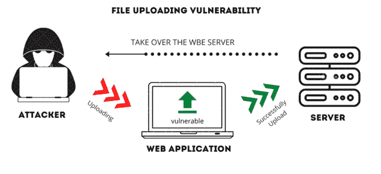
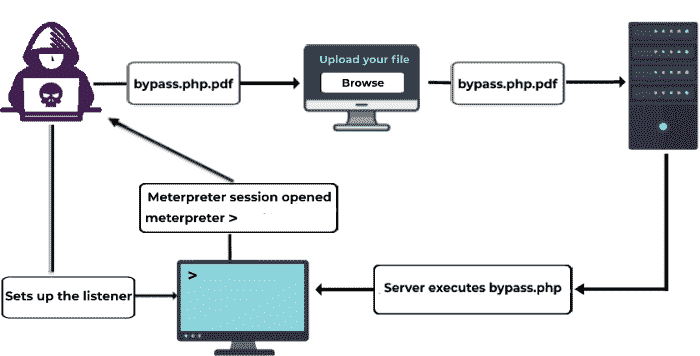

# 了解有关文件上传漏洞的更多信息

> 原文：<https://infosecwriteups.com/learning-more-about-file-upload-vulnerabilities-1833bed29f5d?source=collection_archive---------1----------------------->

**照片由**[**Shamsudeen Adedokun**](https://unsplash.com/@shams_ad?utm_source=unsplash&utm_medium=referral&utm_content=creditCopyText)**上** [**Unsplas**](https://unsplash.com/s/photos/hacking?utm_source=unsplash&utm_medium=referral&utm_content=creditCopyText)

与文件上传相关的漏洞是众所周知的，并且被认为是非常严重的。此漏洞的存在是因为应用程序允许用户在服务器上上传文件。这些图片可能是你的个人资料照片，也可能是你喜欢的任何附件。如果上传的文件处理不当，就会对应用程序造成威胁，攻击者可以利用这些上传的文件对应用程序进行进一步的攻击。这些攻击可能涉及远程代码执行(RCE)或危及整个基础架构的安全。

# **文件上传漏洞有哪些？**

[来源](https://secnhack.in/unrestricted-file-uploading-vulnerability/)

当用户能够使用应用程序将文件上传到服务器时，这些文件可能是附件或个人资料图片。然后，应用程序将这些文件存储在几种不同类型的存储中的一种。一些应用程序可能会将这些文件直接保存在服务器上，但许多组织使用存储桶来代替。将文件上传到服务器的过程称为文件上传。如果上传的文件没有得到安全管理，攻击者可能会将恶意文件上传到服务器。该文件可能是一个 webshell，根据具体情况，它可能被用来执行命令或危害 web 服务器。大多数情况下，应用程序通常会对已上传的文件执行大量检查，包括调整它们的大小、继续处理它们或根据要求压缩它们。他们还使用一些机制来添加对已上传文件的验证。例如，它们验证文件的内容类型或 MIME 类型，这两种类型在大多数情况下通常都能正常工作。

但是，如果应用程序无法对正在上传的文件进行这些验证，对手就能够上传恶意文件，这将从整体上损害服务器的完整性。

让我们了解一下易受攻击的文件上传代码是什么样子的

> if(is set($ _ FILES[' image ']){
> 
> $ file _ name = $ _ FILES[' image '][' name ']；
> 
> $ file _ ext = strtolow(end(explode(' . ')，$ _ FILES[' image '][' name ']))；
> 
> move_uploaded_file($file_tmp，" images/"。$文件名称)；
> 
> 呼应“成功”；
> 
> ?>

当用户将文件上传到网站时，网站会将文件直接移动到 web 服务器上的 images 文件夹中，而不是先对文件进行任何验证。

攻击者可以轻松上传如下所示的 webshell

> if(isset($_GET[‘cmd’]))
> 
> {
> 
> system($_GET[‘cmd’]);
> 
> }
> 
> ?>

After the shell has been uploaded, for example as a profile picture, an attacker can easily execute commands on the server by right-clicking on the profile picture and opening it in a new tab.

# **让我们了解一下剥削**

有几种方法可以利用这个漏洞。Web 应用程序通常有时会对

有多种方法可以绕过这一限制。比如:

## **通过修改内容类型头绕过它**

如果 web 应用程序只检查正在上传的文件的文件扩展名，这通常是通过检查随请求一起发送的内容类型头来完成的，那么攻击者可以通过拦截请求并使用该信息进行更改来轻松修改文件的内容类型头。例如，如果上传的文件包含 PHP 扩展名，如“bypass.php”，但应用程序只支持图像文件扩展名，如“png”或“jpeg”，则该文件将不被接受。这个特定的值，应用/八位字节流，将在那时被插入到内容类型报头中。因此，攻击者将上传一个文件，然后通过拦截请求，他们将能够将其转换为图像/jpeg 格式。如果攻击者这样做，因为只有内容类型头被匹配，文件将能够被上载，并且它将绕过对它的约束。

[来源](https://beaglesecurity.com/blog/vulnerability/insecure-file-upload.html)

## **使用空字节绕过限制**

对手可以通过在文件名中插入空字节字符(%00)来规避这一限制。因此，修改后的文件名将更改为 bypass.php%00.jpg。因此，空字节(%00)后面的所有内容都将被忽略。这将使应用程序认为正在上传一个 JPEG 文件，因为扩展名和内容类型头是完全匹配的。因此，文件将被成功上传。

# **补救**

*   将可以上传的文件类型限制为公司日常运营所必需的类型非常重要。
*   除非您首先对文件应用了基于允许列表的过滤器，否则不要接受未经过滤的文件名及其扩展名。
*   任何上传到服务器的文件都应该首先被应用程序扫描，然后应用程序应该检查文件的内容。在被其他用户访问之前，每一个文件都应该事先经过验证和病毒扫描。如果有哪怕是一丁点儿的怀疑，该文件应该被删除。

# **结论**

就应用程序安全性而言，上传文件的能力是最常见的漏洞之一，如果程序员管理员没有正确集成验证过程，利用该漏洞就相对简单。利用漏洞的方式或服务器授予的权限都会影响攻击的整体严重性。尽快实现 OWASP 前 10 项中列出的所有验证，然后尽快修补您的应用程序。这将避免您的应用程序中的文件上传漏洞。

*又及:信息安全领域每天都有很多事情发生，很难跟上。加入我们的* ***每周简讯*** *以 5 篇文章、4 个线程、3 个视频、2 个 Github Repos 和工具以及 1 个* ***工作提醒的形式免费获取所有最新的信息安全趋势！****[*https://weekly.infosecwriteups.com/*](https://weekly.infosecwriteups.com/)*