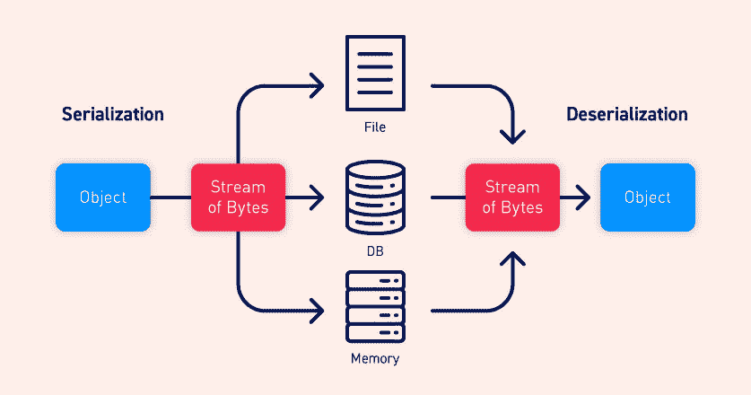

# 了解有关 YAML 反序列化的更多信息

> 原文：<https://infosecwriteups.com/learning-more-about-yaml-deserialization-9c08093b4a3d?source=collection_archive---------2----------------------->

**简介**

对于 Java、Python 和 Ruby 等编程语言，反序列化攻击非常普遍。当数据流在没有首先执行任何检查的情况下被直接反序列化时，这些缺陷就会显现出来，并可能导致远程代码的执行。

在这篇博文中，我们将学习另一种反序列化技术，但是是在 YAML 的环境中。

在深入了解 YAML 反序列化的基础知识之前，让我们先了解一下序列化和反序列化。

**连载:**

[来源](https://portswigger.net/web-security/deserialization)

让我们假设你正在玩一个网络游戏。你所拥有的角色会有很多属性。比如用户名、头像、衣服、等级、武器等。你认为这些属性是如何在服务器上传递/交流甚至存储的？

答案是序列化。

什么是序列化？将对象转换成字节流或平面结构称为序列化。

这个“字节流”也被称为对象的扁平版本。现在这可以通过网络发送，甚至可以保存在磁盘、文件和数据库中。

序列化的反义词是反序列化。反序列化是指将这些字节流转换回对象形式。

但是这怎么会导致漏洞呢？当 web 服务器接受一个序列化的值而不验证它，然后反序列化它时，问题就出现了。如果用户控制序列化的值，他可以篡改它，当反序列化时，会导致意想不到的结果。

什么是 YAML？

YAML 代表另一种标记语言。维基百科将 YAML 定义为“一种人类可读的数据序列化语言”。它通常用于配置文件和存储或传输数据的应用程序中。它使用 Python 风格的缩进来表示嵌套，还使用了更多

一种压缩格式，使用[]表示列表，使用{}表示地图。

与编程语言不同，它没有合适的格式，这也是它与其他语言的区别。

**让我们考虑一个例子:**

**未序列化数据:**

> {
> 
> 姓名':'马尼什'，
> 
> '年龄':12，
> 
> 技能':['编程'，'软技能']
> 
> }

序列化后，这将变成:

名称:马尼什

年龄:12 岁

技能:

-编程

-软技能

**这是一个怎样的漏洞？**

它不是。但是如果我们序列化一个对象，最终会发生什么，不是简单地反序列化它，而是执行它。

最常用的库是:PyYAML 和 ruamel.yaml，如果使用不安全的方法对它们进行序列化和反序列化，这两个库都容易受到 YAML 反序列化攻击。

PyYAML、ruamel.yaml 中用于序列化和反序列化的方法是相同的。

另一方面，用于序列化的方法有:

dump()，dump_all()，safe_dump()，safe_dump_all()。

若要序列化{ 'name': 'Manish '，' age': 12，' skills': ['programming '，' soft skills'] }

用于序列化对象的方法有:

load()、load_all()、full_load()、full_load_all()、safe_load()和 safe_load_all()。

**创建有效载荷**

我们在这里用来创建有效负载的方法是使用 __reduce__()方法。即使服务器使用 PyYAML 或 ruamel.yaml，这也是可行的。

注意:假设受支持的系统托管在基于 Unix 的操作系统上。

> 导入 yaml
> 
> 导入子流程
> 
> 类负载(对象):
> 
> def __reduce__(自己):
> 
> 返回(子流程。Popen，(' ls '，))
> 
> deserialized _ data = YAML . dump(Payload())
> 
> 打印(反序列化 _ 数据)

序列化的输出将是:

> ！python/对象/应用:子流程。波本
> 
> - ls

让我们先了解一下有效载荷:

如前所述，我们已经使用 __reduce__()方法创建了有效负载。我们使用了子流程模块，它提供了生成新流程的函数。使用的方法是 Popen，使用的参数是 **ls。**Popen 用于在新进程中执行新命令， **ls** 用于打印当前工作目录下的文件。

当这个有效负载进入 web 应用程序的易受 YAML 反序列化攻击的易受攻击字段时，它不仅会反序列化有效负载，还会执行它。

让我们看看备份的代码会是什么样子:

**deserialized _ data = YAML . load(data)**

如您所见，该命令成功执行，并输出当前工作目录的内容。

# 补救

此漏洞被分配了 CVE CVE-2017–18342，并已在 PyYAML 5.1 版中修补。

可能正在使用的 PyYAML 版本高于 5.1(当前版本是 6.0)

但是有没有办法完全绕过这个漏洞呢？嗯，这取决于你用的是哪个版本。也有不安全的方法，但是必须满足一定的条件才能执行。

注意:如果您希望尝试这样做，您可以切换到 PyYAML 版本< 5.1.

The load () method will throw an error if you try to use the load() method with the above payload. But if you added “ **Loader=Loader** ，或者将该行设置为**deserialized _ data = unsafe _ load(data，Loader=Loader)，**它将结束执行它。

同样，如果您使用的是 PyYAML 的更新版本，这就不适合您了，但是这里的问题是，一旦下载了 py YAML，没有多少人愿意更新他们的库。

结论

反序列化漏洞会产生广泛的影响，包括执行远程代码或提升权限。因此，在反序列化任何数据之前，对任何数据输入进行清理和检查是绝对必要的。