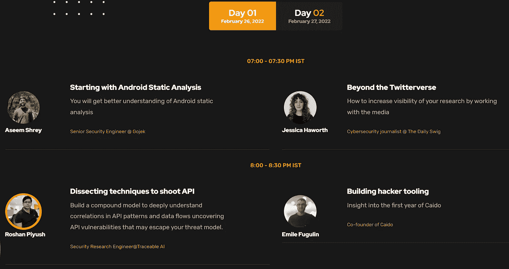
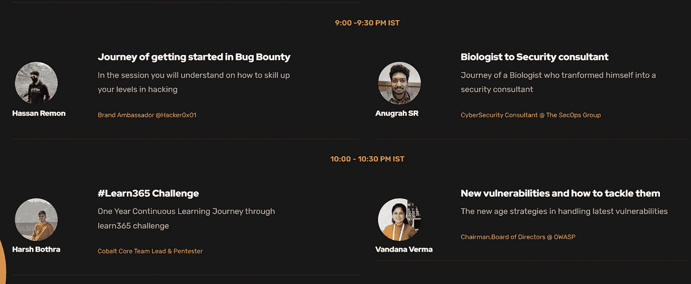

# Infosec 虚拟网络安全会议还剩不到 24 小时

> 原文：<https://infosecwriteups.com/less-than-24-hours-left-for-infosec-writeups-virtual-cybersecurity-conference-e640c76e497b?source=collection_archive---------1----------------------->

## 预订 IWCON2022 的门票了吗？

还剩不到 24 小时。在这里给自己留个槽[。](https://razorpay.com/payment-button/pl_IkurresccCErYp/view/)

你好

离 [**IWCON 2022**](https://iwcon.live/) 还有不到 24 小时 Infosec 书面报道的虚拟网络安全会议和网络活动。

你预订座位了吗？

点击 查看我们众星云集的演讲者名单 [**。**](https://iwcon.live/)

# 第一天先睹为快

让我们看看 2022 年 2 月 26 日的超值会议。

1.  **从 Aseem Shrey 的 Android 静态分析开始**，高级安全工程师@ Gojek
2.  **超越 Twitterverse** :如何通过与媒体合作提高你的研究的知名度，网络安全记者 Jessica Haworth @ The Daily Swig
3.  **剖析拍摄 API 的技术**:构建一个复合模型，深入理解 API 模式和数据流中的相关性，揭示可能逃脱您威胁模型的 API 漏洞，作者 Roshan Piyush，安全研究工程师@Traceable AI
4.  **打造黑客工具:洞察 Caido 元年**作者:Caido 联合创始人 Emile Fugulin。
5.  **品牌大使哈桑·瑞蒙**的《Bug Bounty》入门之旅[哈克龙](https://medium.com/u/6f816e37be2c?source=post_page-----e640c76e497b--------------------------------)。
6.  **生物学家到安全顾问**:由网络安全顾问 Anugrah SR @ sec ops Group 完成的生物学家转型为安全顾问的历程。
7.  **#Learn365 挑战赛**:为期一年的 Learn365 挑战赛，由 Harsh Bothra，Cobalt Core 团队负责人& Pentester 举办。
8.  **新的漏洞以及如何解决它们**:OWASP 董事会主席万达纳·维尔马的《处理最新漏洞的新时代战略》。

# 不要错过我们超酷的网络空间

每次 30 分钟的会议之后都有现场问答和交流。

想知道 infosec 中最酷的人之间的虚拟网络是如何工作的吗？点击 查看现场演示 [**。**](https://www.youtube.com/watch?v=fqJ7T1fW3zU)

你可以期待像这样的 25 人容量的房间，在那里你可以-

*   四处逛逛，和人们聊聊天
*   将您的个人资料图片添加到带有您姓名首字母的小圆圈中
*   添加一行简历、你的 Twitter 个人资料链接等。

这将会是一个很酷的认识新朋友的方式，扩大你的关系网，找到强大的关系，以及潜在的工作或实习机会。

激动吗？

[***现在就预订机票吧！***](https://razorpay.com/payment-button/pl_IkurresccCErYp/view/)

IST 时间 2 月 26 日晚上 7 点，IWCON 2022 见。

最佳，
编辑团队
Infosec 报道