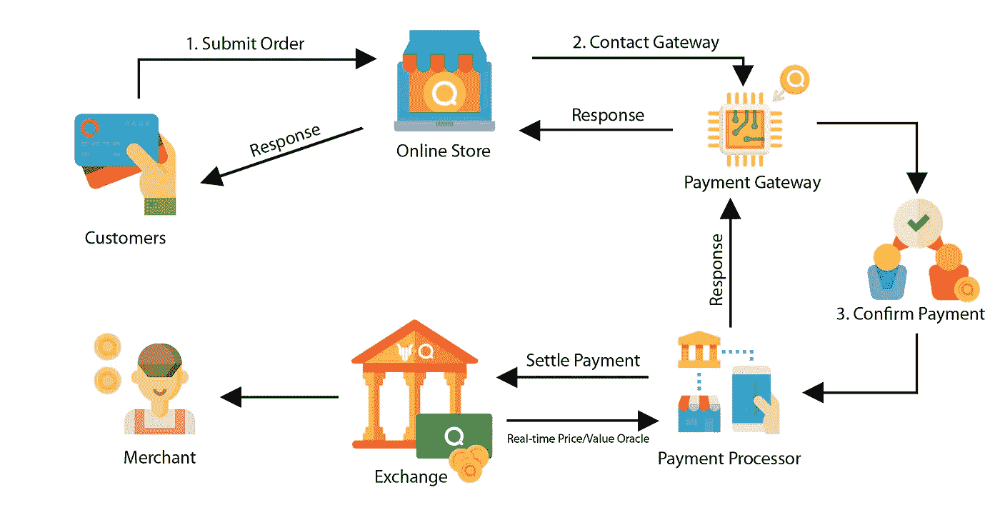
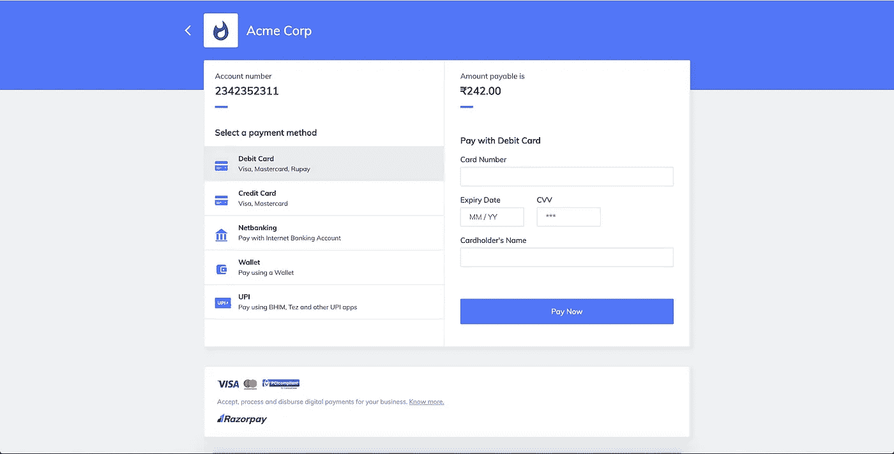
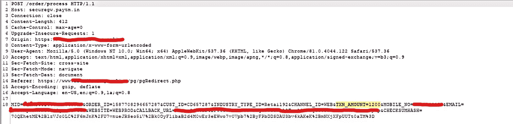
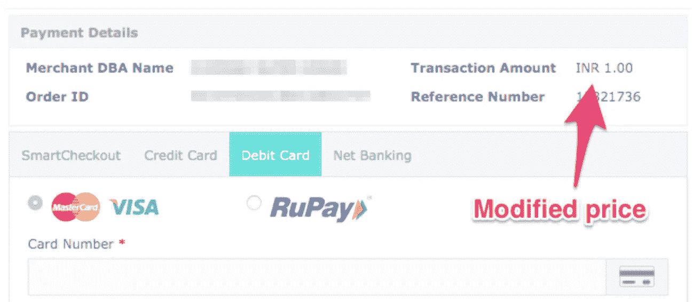
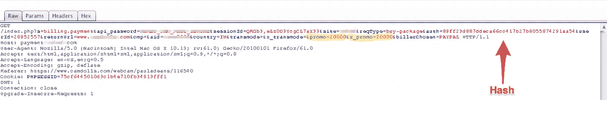

# 让我们进入支付网关

> 原文：<https://infosecwriteups.com/lets-break-into-payment-gateways-fc52523eeaca?source=collection_archive---------0----------------------->

# 什么是支付网关？？？

在线支付网关(PG)是连接您的银行账户和您需要转账的平台的隧道。PG 是一种软件，它授权您通过不同的支付模式进行在线交易，如网上银行、信用卡、借记卡、统一支付接口(UPI)以及目前可用的许多在线钱包。

PG 扮演第三方的角色，将您的资金从银行账户安全转移到商家的支付门户。

用更简单的话来解释，当你从 Flipkart 这样的流行数字平台购买一本书时，当你为这本书付款时，支付网关会通过将你的钱转移到 Flipkart 来帮助你。



支付网关流程

## 让我们了解支付网关的工作原理:

支付网关侧重于在整个支付过程中保护用户提供的敏感信息。它加密数据，如卡信息和银行账户信息，以确保用户的安全。

以下是展示典型支付网关如何工作的基本步骤:

1.顾客下了订单，然后按下网站上的提交或结账按钮，或其等效按钮

2.一旦发生这种情况，网站或电子商务平台会将客户带到一个支付网关，在那里他或她输入有关银行或他们用来支付的卡的所有相关信息。然后，PG 将用户直接带到发卡银行的页面或 3D 安全页面，请求授权交易。



支付网关(来源:razorpay.com)

3.一旦支付网关获得对交易的批准，银行就检查客户的账户中是否有足够的余额来使交易成功

4.支付网关相应地向商家发送消息。

→如果银行的回复是“否”，则商家随后会向客户发送一条错误消息，告知他们卡或银行账户的问题。

→如果银行门户的响应是“是”，则商家寻求银行的交易

5.银行与支付网关结算资金，支付网关又与商家结算资金

这个过程完成后，客户会收到一条订单已下的确认消息。


已下订单

如前所述，货币交易涉及个人银行和信用卡的敏感信息，这些信息完全属于个人隐私。因此，必须确保这些信息的安全。


## 支付网关如何保护信息安全:

支付网关可以确保你输入信息的安全性。以下是 PG 为保护您的数据安全所做的事情:

*   首先，整个交易是通过一个 HTTPS 的网址进行的。这与 HTTP 不同，因为 HTTPS 中的 S 代表安全。交易通过同一隧道进行
*   作为散列函数的结果，系统通常使用来自商家的签名请求来验证交易请求。这个签名的请求是一个密语，只有商家和支付网关知道
*   为了保护该过程的支付页面结果，请求服务器的 IP 被验证以检测任何恶意活动
*   收单机构、发卡行和支付网关支持虚拟支付者认证(VPA ),以进一步保护支付过程。VPA 是在 3d 安全协议下实现的，它增加了一层安全性，有助于在线买家和卖家轻松地相互认证。


# 黑客时间到了！

我们正处于电子商务飞速发展的时代，没有人能阻止它。阿里巴巴在短短 24 小时内创造了超过 308 亿美元销售额的新纪录，让我们冷静一下。然而，所有这些交易背后的机制只是在我们称之为互联网的巨大互联网络上流动的少量信息。任何了解这些交易背后的科学原理的人都可以找到一种永远在线购物的方法，而且是免费的。

我来解释三种不同难度的方式。
1。诺布之路
2。黑客之道
3。职业黑客之道
这三点是黑客攻击的垫脚石，能够操控任何支付网关。

## 1.noob 的方式

现在，这是最简单的方法来控制你购买的产品数量。这就是产品的成本/金额出现在 HTML 页面中表单的隐藏元素中的时候。因此，当我们选择一件我们打算购买的商品时，该商品的价格就会被加到商品的总金额中。然后，从填充到表单中的隐藏字段中获取价格，然后显示为总计。

```
<input type=”hidden” name=”business” value=”abc@xyz.com”>
<input type=”hidden” name=”cmd” value=”_xclick”>
<input type=”hidden” name=”item_name” value=”Classmate_Notebook”>
<input type=”hidden” name=”amount” value=”550">
<input type=”hidden” name=”currency_code” value=”INR”>
```

**如何绕过它-**

要更改产品的价格，您只需在将产品添加到购物车之前，在提到价格的隐藏表单字段中进行更改。通过这种方式，实际价格不会被添加到购物车中，您可以免费购买产品。

## 2.黑客道

这是第二种方法来控制你在网上购买的产品数量，并根据你的喜好改变价格。所以，在这个过程中，我们使用了类似 Burp Suite 这样的拦截工具。价格不在表单的隐藏字段中，所以我们不能像以前那样更改价格，而是将产品添加到购物车中。(见下图)



**如何绕过它-**

因此，一旦我们到达支付网关，我们就打开拦截，并在刚刚拦截的数据包中手动操作费用。在拦截器中编辑价格后，我们转发数据包，这样我们就有了自己的另一个免费产品。



## 3.职业黑客的方式

一直从事支付网关和在线交易的人，可能对之前的步骤非常熟悉，他们必须有适当的安全措施，可能已经解决了我上面提到的漏洞。防范这些漏洞最广为人知的方法是使用哈希。

散列被用作检查从电子商务网站发送到支付网关的消息的完整性的方法。散列和包括产品价格的其他值随后被发送过来进行验证，并且如果支付网关之前和之后的散列匹配，则交易被允许。



**如何绕过它-**

这是大多数安全供应商认为安全的方法，当你开始深入挖掘并开始一次只关注一个电子商务网站时，问题就出现了。

作为一名黑客，你学到第一件事就是永远不要放弃，找到一个解决方案，不管它有多疯狂。所以，我开始挖掘关于哈希和他们如何制定它。为了让开发者更容易将他们的电子商务网站与支付网关集成，这些公司在公共领域发表文章，介绍他们如何制定散列和其他细节。

稍微调查一下，您就可以找到这个文档，即在创建散列时所涉及的参数和散列技术。现在，一旦您获得了所需的参数，其中大部分都出现在您截获的数据包中，其中一个参数是密码，该密码也被使用，只有电子商务管理员知道。

因此，下一步是将参数放在一起，通过暴力或使用字典攻击来找到密码，一旦找到密码，您就可以根据产品的修改价格创建自己的哈希，并从该供应商那里购买无限量的免费产品，只要他们不更改密码。

这一步确实很难，但一些开发者只是复制了与文档中相同密码的代码，从而导致支付网关安全漏洞，并允许购买免费的在线产品。

> 这三种都是侵入 PG 的常规方法，让我们来看看我在发现中发现的其他一些额外信息

# 奖金信息！

1.  如上所述，阅读支付网关公司为商家网站开发者提供的文档。该文件包含一些关键信息，将有助于绕过付款确认。这包括:
    **$** 交易成功代码
    $**$**交易成功消息
    **$** 所涉及的参数以及它们在创建散列时使用的散列技术
    **$** 响应代码
    $**$**响应消息
    **$** 促销代码数据
    **$** 等

现在，使用像**交易成功代码**和**交易成功消息**这样的有用信息，尝试在 Burp Suite 的 intercept 选项卡中用 fail 响应替换它们。相信我，这对我来说成功了好几次。*这仅在商家不验证校验和散列时有效。*

2.每个人都试图在商家网站或支付网关篡改价格。但是，你有没有想过篡改数量。嗯，数量可以在商家网站或支付网关上篡改。只需在打嗝套件中捕获的数据包中查找**数量**或类似字段。如果我们篡改数量会发生什么？

→数量= 10 &价格= 120 美元；总计= 10 X 120 = 1200 美元
篡改数量= 0.01 &价格= 120 美元；总计= 0.01 x120 = 1.2 美元

这是我们可以做的，如果服务器端的价格是安全的。试图操纵数量。你也可以试着让数量-ve。

3.尝试模糊其他参数。例如
>促销代码
>钱包金额
>送货费用
每一个涉及到钱的参数🤑。

> 嗯，说实话，我找到的最安全的支付网关是[***razor pay***](https://razorpay.com/)***。*** 几乎，我已经绕过了每一个你说得出名字的支付网关。但是[***razor pay***](https://razorpay.com/)，我到现在还没有。但是让我们看看在不久的将来会发生什么😉。

感谢[***Twimbit***](https://twimbit.com/)*的同事们鼓励我发表这些文章。*

*如果你喜欢它，那么请鼓掌，如果你需要我的文章的任何帮助，请联系我。继续黑！*

> *本文提供的信息仅用于教育目的。我不会对任何使用本文信息的个人造成的任何损害负责。*

**

*推特:[https://twitter.com/marshmello_in](https://twitter.com/marshmello_in)*

*领英:【https://www.linkedin.com/in/harshakshit/ *

*https://www.facebook.com/harshakshit[脸书](https://www.facebook.com/harshakshit)*

*电子邮件:harshakshit.bit@gmail.com*