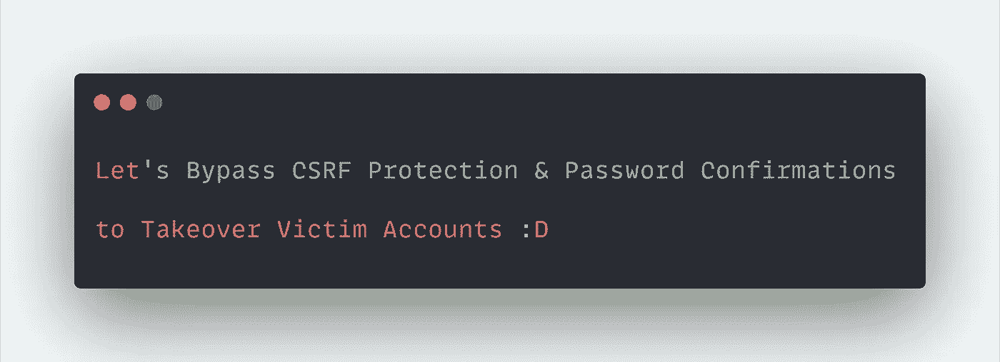

# 让我们绕过 CSRF 保护和密码确认接管受害者帐户:D

> 原文：<https://infosecwriteups.com/lets-bypass-csrf-protection-password-confirmation-to-takeover-victim-accounts-d-4a21297847ff?source=collection_archive---------0----------------------->



跨站点请求伪造(CSRF)在新的框架中很少出现，但是仍然像过去一样可以利用。CSRF，长话短说，这是一种攻击，攻击者制作一个请求并发送给受害者，服务器接受请求，就好像是受害者请求的一样，并对其进行处理。为了缓解这种情况，部署了多种保护机制，其中一种是**反 CSRF 令牌。**

亲爱的黑客和安全爱好者们，今天我将讲述我是如何绕过 CSRF 保护成功执行一次 CSRF 攻击的，并且在客户端验证绕过的帮助下，我能够通过更改密码执行一次完整的帐户接管。在开始攻击场景之前，让我们看看更多关于反 CSRF 令牌和可能的旁路。

> 如果你喜欢读我的文章，请在推特上关注:【https://www.twitter.com/harshbothra_】

****反 CSRF 令牌**是一种允许服务器唯一区分谁真正请求执行资源/动作以抵御 CSRF 攻击的方式。但是，由于应用程序中的弱实现，有几种方法可以绕过反 CSRF 令牌，例如:**

*   **移除反 CSRF 令牌**
*   **通过改变几个比特来欺骗反 CSRF 令牌**
*   **使用相同的反 CSRF 令牌**
*   **生成反 CSRF 令牌的弱加密技术**
*   **可猜测的反 CSRF 代币**
*   **偷令牌与其他攻击，如 XSS。**
*   ****将 POST 请求转换为 GET 请求，以绕过 CSRF 令牌检查。** *(这是我们将在本文中看到的)***

> ***附言:可能有其他旁路可用。我提到了一些我记得在我的头顶。如果你知道任何其他的，请回复以帮助读者，或者留下一个便条，这样我可以用适当的学分更新这个列表。:)***

**所以让我们称目标为**target.com。**摆弄完应用程序后，我发现 **/editprofile** 端点有这样的请求:**

```
POST /editprofile HTTP/1.1
Host: target.com
**<redacted>**username=test&description=<some_text>&phone=1231231231&anti_csrf=<token>
```

**因为您可以观察到 **anti_csrf** 令牌存在，并且服务器正在验证**令牌是否丢失或伪造。**所以基本上没有运气。然后我简单地改变了 POST 中的**请求方法，使&移除了 anti_csrf 参数**，伪造的请求看起来像:**

```
GET /editprofile?username=test&description=<some_text>&phone=1231231231 HTTP/1.1
Host: target.com
**<redacted>**
```

**我们成功地绕过了它。CSRF 剥削了。**

**但是，等等，它的严重性较低，因为除了更改一些配置文件信息之外，我们还不能做太多事情。在寻找更多的东西后，我检查了**密码重置功能**，但它再次要求在能够更改密码之前获得**当前密码**。因此，最初的密码更改请求如下所示:**

```
POST /changepassword HTTP/1.1
Host: target.com
**<redacted>**current_password=currentpassword&new_password=new_password&confirm_password=new_password&anti_csrf=<token>
```

**因此，我简单地删除了**当前密码**字段，它成功地重置了密码。**

**所以现在我们有两件事:**

1.  **旁路和执行旁路的方式**
2.  **更改密码时绕过当前密码的方法**

**现在，我们可以简单地链接问题**来更改使用 CSRF 的受害者用户的密码，伪造的请求将看起来像:****

```
GET /changepassword?new_password=new_password&confirm_password=new_password HTTP/1.1
Host: target.com
**<redacted>**
```

**只需使用 Burp 套件生成一个 CSRF PoC，或者您可以使用自己的方式来完成并将其发送给受害者。一旦受害者导航到攻击者的 crafter URL，他的密码就会被更改。**

****介质的初始严重度现在为高。****

# ****外卖:****

*   **永远不要忽视易受攻击的漏洞，因为它们可以用来在很大程度上增加影响。**
*   **绕过 CSRF 保护的方法。**
*   **永远不要放弃学习新事物。**

**如果你喜欢阅读文章**，请鼓掌并关注*媒体和 Twitter:*****

*****碎碎念:***[***https://www.twitter.com/harshbothra_***](https://www.twitter.com/harshbothra_)**

*****领英:***[***https://www.linkedin.com/in/harshbothra***](https://www.linkedin.com/in/harshbothra)**

*****网址:***[***https://harshbothra . tech***](https://harshbothra.tech)**