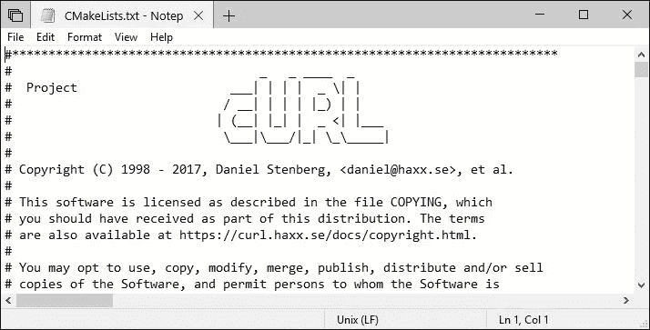
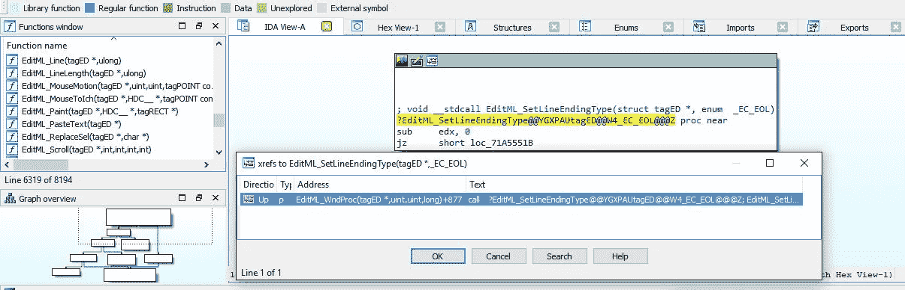
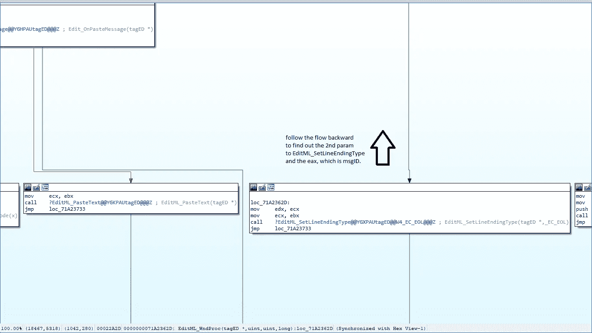
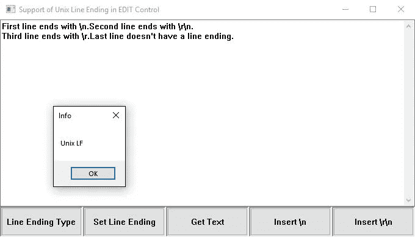

# 让我们弄清楚记事本是如何支持 Unix 行尾的(第一部分)

> 原文：<https://infosecwriteups.com/lets-figure-out-how-notepad-supports-unix-line-endings-part-i-26d54b29cf93?source=collection_archive---------0----------------------->

微软最近[宣布](https://blogs.msdn.microsoft.com/commandline/2018/05/08/extended-eol-in-notepad/)记事本将支持 Unix 和 Mac 行尾，从当前的 Windows 10 Insider 预览版(RS5)开始。这是一个很棒的新功能！看了这个公告，很好奇微软内部是怎么实现这个功能的。在这篇文章中，我将向你展示我是如何通过逆向工程解决这个问题的。微软为大多数 Windows 可执行文件提供了 [PDB 符号](https://docs.microsoft.com/en-us/windows-hardware/drivers/debugger/microsoft-public-symbols)，所以要反转它们并不难。



要准备反转，请在记事本中打开一个 Linux 文件，然后将 WinDbg 附加到 notepad.exe 进程，或者直接在 WinDbg 下启动记事本。

起初，我以为对不同行尾的处理是在 notepad.exe 本身实现的。因此，我在 WinDbg 中列出了 notepad.exe 的符号，试图找出是否有任何行尾相关的函数:

```
0:000> x notepad!*Linux*
0:000> x notepad!*Unix*
0:000> x notepad!*LineEnd*
```

它们都不返回任何内容，所以显然行尾不是由记事本处理的。记事本使用[编辑控件](https://msdn.microsoft.com/en-us/library/windows/desktop/bb775458.aspx)作为其输入区域。因此，我的下一个猜测是它们受 Windows 控件支持，通过 Windows APIs 向记事本公开。

为了简单起见，我用下面的命令枚举所有已加载模块的符号:

```
0:000> x *!*Linux*
0:000> x *!*Unix*
0:000> x *!*LineEnd*
```

最后，最后一个命令返回三个符号:

```
6f725110 COMCTL32!EditML_GetLineEndingType (<no parameter info>)6f7254e6 COMCTL32!EditML_SetLineEndingType (<no parameter info>)6f7250e2 COMCTL32!EditML_GetLineEndingCharacter (<no parameter info>)
```

为了确保这三个功能确实相关，我决定检查它们是否已经存在于 Windows 10 版本 1803 中:

```
0:000> x comctl32!*LineEnd*
0:000> vertarget
Windows 10 Version 17134 MP (4 procs) Free x86 compatible
Product: WinNt, suite: SingleUserTS
17134.1.x86fre.rs4_release.180410–1804
```

的确，它们是新功能——只存在于 Windows 10 预览版上。这三个函数表明编辑公共控件支持行尾，在`comctl32.dll`中实现。注意`user32.dll`和`comctl32.dll`有不同的编辑控件实现，应用程序可以选择使用哪一个。`comctl32.dll`实现比`user32.dll`更新，支持更多特性。这里我们只需要分析`comctl32.dll`。

接下来，在这三个函数上设置断点:

```
0:001> bm comctl32!*LineEnding*
1: 6f7c5110 @!”COMCTL32!EditML_GetLineEndingType”
2: 6f7c54e6 @!”COMCTL32!EditML_SetLineEndingType”
3: 6f7c50e2 @!”COMCTL32!EditML_GetLineEndingCharacter”
0:001> g
```

立即命中断点 1:

顾名思义，功能`UpdateStatusBarEOL`(帧#07)的目的是更新状态栏上的行尾指示器。该函数调用`SendMessageW` 向编辑控件发送窗口消息，以获取行尾类型。消息 ID 是 0x150D。调用堆栈还表明这个窗口消息最终由`COMCTL32!EditML_GetLineEndingType`处理。它的返回值随后被传递回`SendMessageW`的调用者，在本例中是`UpdateStatusBarEOL`。

为了理解`COMCTL32!EditML_GetLineEndingType`返回值的含义，我把`Notepad!UpdateStatusBarEOL`反过来:

```
// global variables:
const wchar_t szEOLCRLF[] = L” Windows (CRLF)”;
const wchar_t szEOLCRLF[] = L” Macintosh (CR)”;
const wchar_t szEOLCRLF[] = L” Unix (LF)”;void UpdateStatusBarEOL()
{
    wchar_t buf[0x80];
    int lineEndingType = SendMessageW(hwndEdit, 0x150D, 0, 0);
    switch (lineEndingType)
    {
    case 1:
        StringCchPrintfW(buf, 0x80, szEOLCRLF);
        break;
    case 2:
        StringCchPrintfW(buf, 0x80, szEOLCR);
        break;
    case 3:
        StringCchPrintfW(buf, 0x80, szEOLLF);
        break;
    default:
        StringCchPrintfW(buf, 0x80, szEOLCRLF);
    }
    SendMessageW(hwndStatus, 0x040B, 1, buf);
}
```

从上面的代码中，我们知道类型代码 1 对应于 CRLF，2 对应于 CR，3 对应于 LF。

可惜，`COMCTL32!EditML_SetLineEndingType`从来不叫。所以为了弄清楚如何调用它，我在 IDA Pro 中打开了 comctl32.dll，并搜索了这个函数。IDA Pro 的一个很好的特性是，您可以通过选择函数定义并按 X:



`COMCTL32!EditML_SetLineEndingType`由`COMCTL32!EditML_WndProc`调用，这显然是编辑控件的窗口过程回调。这个窗口程序的主体基本上是一个大的跳转表。



从反汇编中不难发现`SetLineEndingType`的消息 ID、`wParam`和`lParam`。结果是:报文 ID 为 0x150C，`wParam` 为行尾类型，不使用`lParam`。这意味着我们可以通过调用`SendMessageW(hwndEdit, 0x150C, <type code>, 0);`来设置行尾类型

为了测试我目前的发现，我编写了一个小的测试程序。我希望，如果我在 Windows 10 预览版上运行它，编辑框应该能够识别 Unix 和 Mac 行尾，并且我应该能够通过分别发送消息 0x150D 和 0x150C 来获取和设置行尾类型。但是结果是编辑控件不理解非 Windows 行尾，即使我已经调用了`SendMessageW`将行尾类型设置为 Unix 或 Mac:



到目前为止，我们知道了如何获取和设置行尾类型。第二部分将讨论我采取的修复错误的步骤，并使编辑控件完全识别所有行尾。