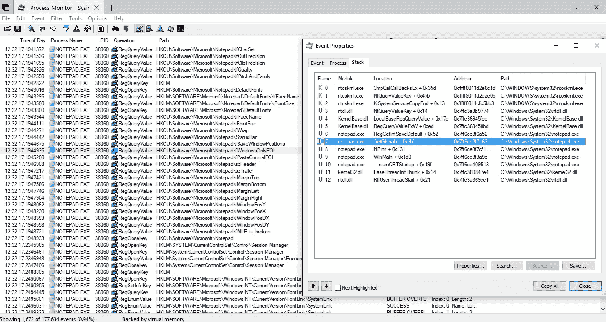
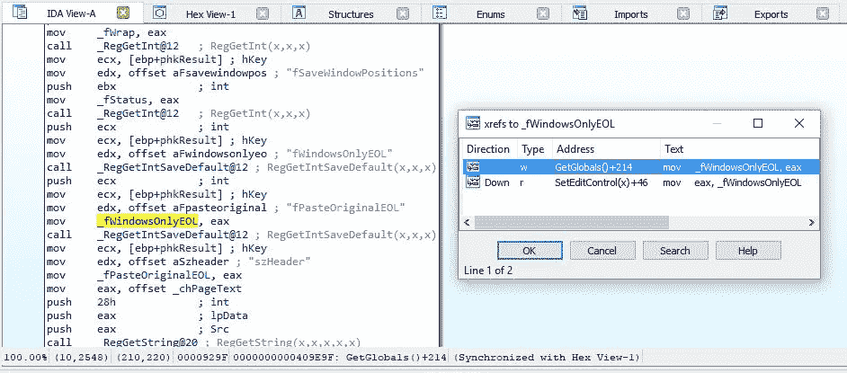
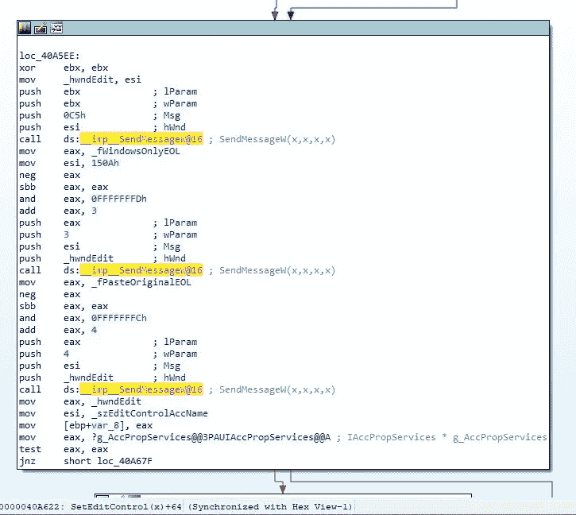
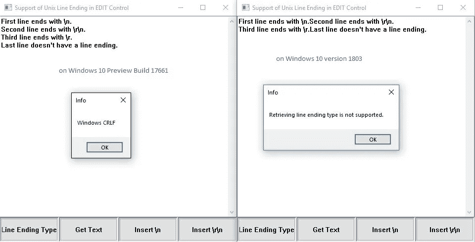
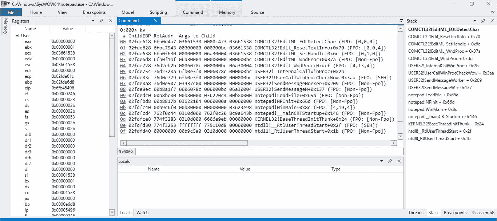

# 让我们弄清楚记事本是如何支持 Unix 行尾的(第二部分)

> 原文：<https://infosecwriteups.com/lets-figure-out-how-notepad-supports-unix-line-endings-part-ii-2755c001611c?source=collection_archive---------1----------------------->

本文继续讨论记事本如何支持 Unix 和 Macintosh 行尾。在[第一部分](https://medium.com/bugbountywriteup/lets-figure-out-how-notepad-supports-unix-line-endings-part-i-26d54b29cf93)中，我们已经发现应用程序如何通过`SendMessage`检索和设置行尾类型。第一部分的结尾提到，简单地创建一个编辑公共控件并不能使它支持 LF 和 CR 行尾。我们将在本文中讨论如何解决这个问题。

回想一下，微软[公告](https://blogs.msdn.microsoft.com/commandline/2018/05/08/extended-eol-in-notepad/)提到有两个注册表项允许你配置这个特性:在`HKEY_CURRENT_USER\Software\Microsoft\Notepad`下，将`fWindowsOnlyEOL`设置为 1 会导致记事本忽略 Linux/Mac 行尾(即与之前相同)，将`fPasteOriginalEOL`设置为 1 会使记事本不修改粘贴文本中的 EOLs。这是一个暗示，可能在公共控件级别，这个特性在默认情况下是关闭的。也许我们需要向编辑控件发送一些消息来启用它。

找出这两个注册表设置如何影响编辑控件的一个简单方法是在读取这些注册表项时查看调用堆栈。这可以通过在 WinDbg 中设置条件断点或使用进程监视器来完成。我发现使用进程监视器更容易，但是两者都是可行的。

在进程监视器中，我们设置过滤器只显示`notepad.exe`注册表事件。然后在列表中找到`fWindowsOnlyEOL`和`fPasteOriginalEOL`。选择事件条目，按 Ctrl-P，然后打开堆栈选项卡:



有趣的框架是#7: `GetGlobals`，因为我们想看看记事本读取这两个键后，是如何使用它们的值的。那么我们来考察一下 IDA Pro 中的功能`notepad!GetGlobals`:



记事本将注册表值保存到全局变量`_fWindowsOnlyEOL`和`_fPasteOriginalEOL`中。然后我们跳到`SetEditControl`，在该函数中`_fWindowsOnlyEOL`被读取:



这段代码相当于下面的 C++代码:

```
SendMessage(_hwndEdit, EM_LIMITTEXT, 0, 0);
SendMessage(_hwndEdit, 0x150A, 3, (_fWindowsOnlyEOL ? 0 : 3)); 
SendMessage(_hwndEdit, 0x150A, 4, (_fPasteOriginalEOL ? 0 : 4));
```

这意味着，要实现完整的 Unix/Mac EOL 处理，我们只需调用:

```
SendMessage(_hwndEdit, 0x150A, 3, 3);
SendMessage(_hwndEdit, 0x150A, 4, 4);
```

添加这两行之后，我的测试程序现在能够处理所有的 EOL 字符:



最后一个尚未探索的领域是 EOL 检测。同样，我们可以从函数名中找到一些提示:有一个函数叫做`Comctl32!EditML_EOLDetectChar`。该名称表明它负责处理行尾检测。为了找出如何从应用程序中调用它，我们启动记事本并在这个函数上设置一个断点。

```
0:000> bp COMCTL32!EditML_EOLDetectChar
0:000> g
```

结果这个函数在 UI 出现之前被调用了三次。前两个调用发生在文本文件加载之前，所以我们可以跳过它们。第三次，调用堆栈是:



这里记事本调用`SendMessageW(0x6078C, 0x00BC, 0x06A30004, ...)`。`0x00BC`是`EM_SETHANDLE`的消息 ID。[文档](https://msdn.microsoft.com/en-us/library/windows/desktop/bb761641.aspx)说这个消息“设置一个多行编辑控件将使用的内存句柄”，而`wParam`参数是一个“编辑控件用来存储当前显示文本的内存缓冲区句柄，而不是分配它自己的内存”。由此，我们可以推断出`EditML_EOLDetectChar`从传递给`EM_SETHANDLE`的缓冲区中的文本中检测到了 EOL 字符。因此，我们可以使用以下代码来检测编辑控件中当前文本的 EOL 类型:

```
HLOCAL hMem = (HLOCAL)SendMessageW(g_hwndEdit, EM_GETHANDLE, 0, 0);
HLOCAL hNewMem = LocalReAlloc(hMem, BUF_LEN, LMEM_MOVEABLE);
SendMessageW(g_hwndEdit, EM_SETHANDLE, (WPARAM)hNewMem, 0);
```

在这一系列文章中，我们发现了微软是如何在记事本中实现 Linux 和 Mac 行尾的。我为测试编写的程序的源代码可以在:[https://github.com/xiaoyinl/UnixTextboxDemo](https://github.com/xiaoyinl/UnixTextboxDemo)获得。

注意，使用未记录的 API 并不是一个好主意，就像本文中没有提到的那样，但是研究一下这些内部 API 是如何工作的并没有什么坏处。此外，由于微软不会混淆 Windows 二进制文件，并提供公共符号，因此反转它们相对容易。所以如果你是逆向工程新手，我觉得挑选一些有趣的 Windows EXE/DLL 文件进行逆向是练习你逆向工程技能的好方法。