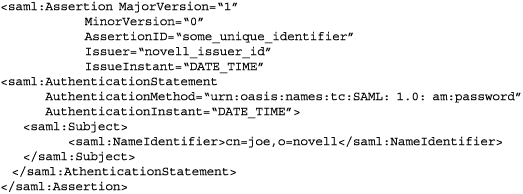
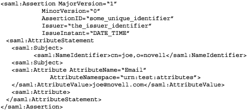
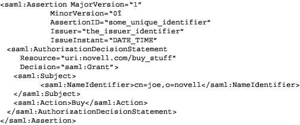
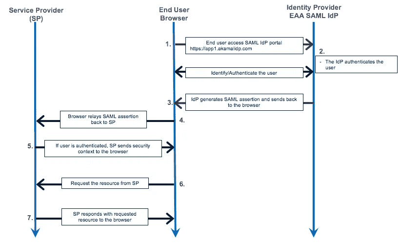

# 让我们好好谈谈吧！

> 原文：<https://infosecwriteups.com/lets-have-a-saml-talks-402559b34d4e?source=collection_archive---------2----------------------->

嘿大家好👋

大家都好吗？！希望你很好，并保持自己的生产力。本文将只关注 SAML 基础知识和与之相关的一些漏洞。

# #引言

SAML 的正确定义是，“SAML( **安全声明标记语言)**是一种基于 XML 的 SSO(单点登录)认证机制，它在身份提供者(IdP)和服务提供者(SP)之间传输用户身份数据，以认证用户访问其请求的资源，而无需每次都询问凭证”。

用外行的话来说，“SAML 是你在你居住的城镇中的一个朋友(身份提供者)，他认识该城镇的每一个供应商(服务提供者)，并且由于他已经授权给你(你是他的朋友)，所以每一个其他供应商无需任何进一步的询问就向你提供他们的服务。”

它具有以下优势:

*   不需要输入凭证
*   无需记住和更新密码
*   没有弱密码

SAML 的实现似乎是合乎逻辑的，因为大多数组织在用户登录到他们的 Active Directory 域或 Intranet 时已经知道他们的身份。因此，让用户登录其他第三方应用程序，如 web-app 应用程序(gmail、Outlook、微软 Office 等)也是有意义的。

# SAML 认证是如何工作的？

在我们进入技术解释之前，让我们先来看几个术语。

*   **身份提供者:**身份提供者(IdP)是一种存储和验证用户身份的服务。IDP 通常是云托管的服务，它们通常与单点登录(SSO)提供商合作来验证用户。
*   **服务提供者:**信任身份提供者并授权给定用户访问所请求的资源。
*   **SAML 断言:**由身份提供者发送给服务提供者的包含用户授权的 XML 文档。这是通过 HTTP 浏览器重定向发送的。

有 3 种类型的 SAML 断言:

*   **认证声明**证明用户的身份，同时产生用户的登录时间&所使用的认证方法。



SAML 身份验证断言示例

*   **属性断言**为服务提供者提供 SAML 属性。SAML 属性是关于登录用户的数据。



SAML 属性断言示例

*   **授权声明**包含某个用户已经被授权访问指定资源的证明。



SAML 授权*断言示例*

Microsoft Active Directory 或 Azure 是常见的身份提供者。Salesforce 和其他 CRM 安排通常是专业合作，因为它们依赖身份提供商进行客户验证。

所以让我们试着理解这一切。

假设您登录了一个充当身份提供者(Microsoft AD)的系统。让我们假设用户也想访问任何第三方应用程序，如 Salesforce。

上面的 SAML 身份验证流程看起来像这样:

1.  你可以通过互联网访问任何微软的广告。
2.  应用程序 Microsoft AD 识别您，即用户，并将您重定向到身份提供者(IdP ),提示您输入有效的凭证(用户名、密码&可能还有您的 2fa 身份验证)。这就是身份验证请求的样子。
3.  现在，您可以通过登录身份提供者来建立会话。
4.  身份提供者以 XML 文档的形式制作和验证响应，其中包含电子邮件、用户名等用户数据，现在身份提供者使用 [X.509](https://www.ssl.com/faqs/what-is-an-x-509-certificate/) 证书对该文档进行签名。
5.  现在，当登录 Microsoft AD(身份提供商)时，您尝试访问第三方应用程序，如 Salesforce(服务提供商)。您从 Salesforce 请求资源，它会通过 SAML 请求将您重定向到身份提供商(即 Microsoft AD)。
6.  SAML 请求通过浏览器(用户代理)传递给身份提供者(Microsoft AD ),后者现在向浏览器(用户代理)发回一个 SAML 响应(XML 文档),该响应是之前在步骤 4 中制作的，并用 X.509 证书进行了数字签名。
7.  浏览器(用户代理)现在将相同的 SAML 响应传递回服务提供商(Salesforce)。
8.  服务提供商(Salesforce)在通过浏览器(用户代理)从身份提供商(Microsoft AD)收到 SAML 响应后，现在无需要求凭据即可对用户进行身份验证。

> 请注意，在整个过程中，服务提供商知道身份提供商的存在，这也是服务提供商信任身份提供商来认证任何用户的原因。



SAML 流可视化。

综上所述，我认为 SAML 身份验证允许您访问一个服务，最终允许您访问所有其他相关服务。

# # SAML 配置

任何 SAML 配置都是在 SAML 的两个关联实体上完成的，即 IdP 和 SP。IdP 的配置很重要，因为它应该知道当用户尝试访问任何 SP 时应该被重定向到哪里。并且需要配置 SP，因为它需要知道 IdP 发送的 SAML 断言是可信的。

**配置 IdP**

SAML 断言格式由 SP 提供，由 IdP 设置。以下是任何管理员都需要设置的任何 SAML 断言的几个关键元素。

**# EntityID:** 对任何 SP 来说都是独一无二的名字。格式/语法可能会有所不同。参见下面的例子。

```
<EntityDescriptor entityID="urn:mace:incommon:example.edu">
```

**#断言消费者服务(ACS):**SAML 断言将被发送到的 URL 的位置。参见下面的例子

```
https://example.edu/SAML/consume
```

**# ACS 验证器:**正则表达式形式的安全机制，确保 SAML 断言到达指定的 ACS。

```
^https:\/\/example\.edu\/saml\/consume\/$
```

**#属性:**SAML 断言属性包含用户的信息。

```
<saml:AttributeStatement>
    <saml:Attribute FriendlyName="fooAttrib" Name="SFDC_USERNAME" NameFormat="urn:oasis:names:tc:SAML:2.0:attrname-format:unspecified">
        <saml:AttributeValue xmlns:xs="http://www.w3.org/2001/XMLSchema" xmlns:xsi="http://www.w3.org/2001/XMLSchema-instance" xsi:type="xs:string">
            user@example.edu
        </saml:AttributeValue>
    </saml:Attribute>
 </saml:AttributeStatement>
```

**SP 配置**

这里，我们处理的信息由 IdP 提供，并在 SP 上设置。

**# x . 509 Certificate:**IdP 提供的证书，通过 SAML 断言传递，用于验证公钥。

**# Issuer URL:** 包含关于 IdP 的信息，以便验证从 IdP 提供的 URL 接收的 SAML 断言。

```
<saml:Issuer>https://example.edu/saml/id/metadata.php</saml:Issuer>
```

> [在此阅读更多关于 SAML 配置的信息](https://duo.com/blog/the-beer-drinkers-guide-to-saml)

# #漏洞和攻击

既然我们已经了解了 SAML 的基本概念，现在我们可以继续讨论与 SAML 相关的攻击和漏洞。显然，我无法在这里一一解释，所以我会在这里列出一些参考资料。在我的下一篇文章中，我可能会解释它们，然后阅读这里的参考资料。

# 1.[身份盗窃攻击](https://www.youtube.com/watch?v=h7ViO5YUuFA)

# 2.[金色样品](https://www.cyberark.com/resources/threat-research-blog/golden-saml-newly-discovered-attack-technique-forges-authentication-to-cloud-apps)

# 3. [SAML 重放攻击](https://www.idm-360.com/idm360/the-dangers-of-saml-replay-attacks/)

# 4. [SAML 命令注入](https://advisories.dxw.com/advisories/publicly-exploitable-command-injection-in-ruby-saml-0-7-2-library-can-root-the-host/)

参考资料:

*   [https://docs . Oracle . com/CD/e 27515 _ 01/common/tutorials/authz _ SAML _ assertion . html](https://docs.oracle.com/cd/E27515_01/common/tutorials/authz_saml_assertion.html)
*   [https://duo.com/blog/the-beer-drinkers-guide-to-saml](https://duo.com/blog/the-beer-drinkers-guide-to-saml)
*   [https://developers.onelogin.com/saml](https://developers.onelogin.com/saml)
*   [https://www.varonis.com/blog/what-is-saml/](https://www.varonis.com/blog/what-is-saml/)

在推特上关注我: [@mr_fr3qu3n533](https://twitter.com/mr_fr3qu3n533)