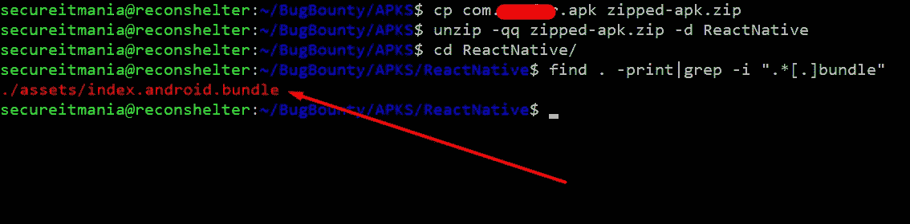
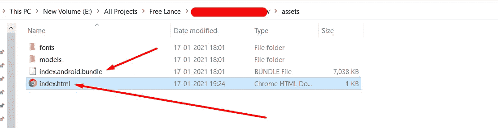
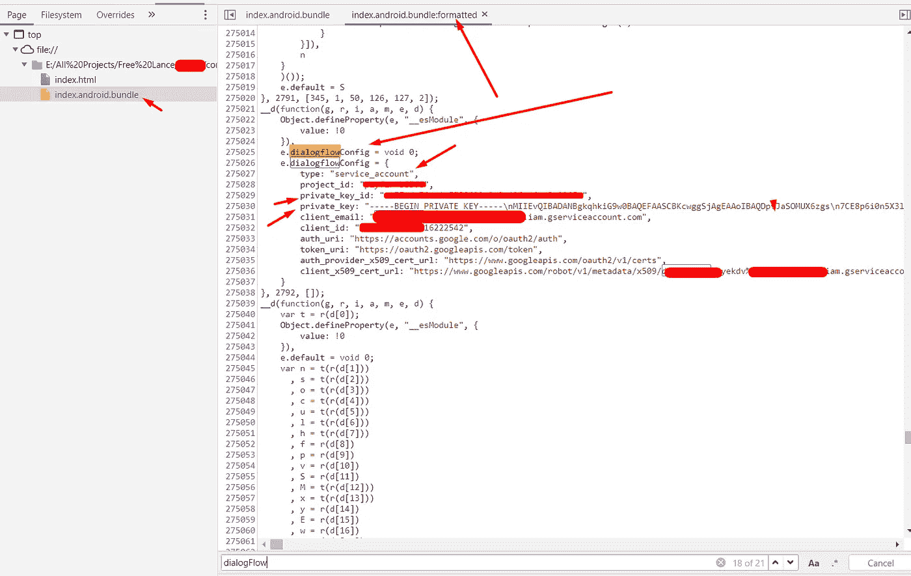

# 让我们知道我是如何探索 React 本机应用程序中隐藏的秘密的

> 原文：<https://infosecwriteups.com/lets-know-how-i-have-explored-the-buried-secrets-in-react-native-application-6236728198f7?source=collection_archive---------0----------------------->

## 移动应用渗透测试指南

## Android 逆向工程的新时代(上)

> T 感谢对我上一篇文章 **的巨大反响 [**。**最近我发现了一个关于硬编码凭证问题的 bug，它是通过不同的方法而不是旧的逆向工程方法发现的。](https://secureitmania.medium.com/hack-crypto-secrets-from-heap-memory-to-exploit-android-application-728097fcda3)**

## 简介:

React Native 是一个**移动应用程序框架**，通过支持 React 和原生平台功能的使用，最常用于为 **Android** 和 **iOS** 开发应用程序。如今，跨平台使用 React 变得越来越流行。

## **古老的** - **过时的安卓逆向工程方式**

通常，在对 Android 应用程序进行逆向时，会使用 **apktool、dex2jar** 进行反编译，然后使用 [**JD-GUI**](https://java-decompiler.github.io/) 进行分析。当处理 React 本机应用程序时，如果应用程序有任何您想要分析的本机代码，这可能是有用的。

但是很多时候，应用的核心逻辑在于 React Native **JavaScript，不需要使用 dex2jar 就可以获得**。

# 逆向工程过程:反应原生应用程序

**步骤 1** :让我们确认一下应用程序是否构建在 React 原生框架上。

要检查这一点，使用 zip 扩展名重命名 APK，然后使用以下命令将 APK 解压缩到一个新文件夹

```
cp com.example.apk example-apk.zip
unzip -qq example-apk.zip -d ReactNative
```

浏览到新创建的`ReactNative`文件夹，找到`assets`文件夹。在这个文件夹里，应该有`index.android.bundle`。这个文件将包含所有缩小格式的 React JavaScript。



反应原生逆向工程

**步骤 2** :在同一个目录下创建一个名为`index.html`的文件，其中包含以下代码。

```
<script src="index.android.bundle"></script>
```



反应原生逆向工程

在**谷歌浏览器**中打开**index.html**文件。打开开发者工具栏(**OS X 的 Command+Option+J 或者 Windows** 的 Control+Shift+J)，点击“Sources”。您应该看到一个 JavaScript 文件，它被分成文件夹和文件，构成了主包。

> 如果您能够找到一个名为`index.android.bundle.map`的文件，您将能够以一种非统一的格式分析源代码。`map`文件包含允许您映射缩小标识符的源映射。

**步骤 3** :搜索敏感凭证和端点

在这个阶段，你必须识别出**敏感关键词**来分析 **Javascript** 代码。React 本机应用程序中流行的一种模式是使用第三方服务，如 Firebase、AWS s3 服务端点、私钥等。,

在我最初的 **recon 过程**中，我观察到应用程序使用了 Dialogflow 服务。所以基于此，我搜索了一个与其配置相关的模式。幸运的是，我能够在 Javascript 代码中找到敏感的硬编码凭证。



*分析 Chrome DevTools 中的 index . Android . bundle*

# 结论

React 本机应用程序的逆向工程过程很容易。敏感凭证和 API 端点通常可以通过分析 JavaScript 代码从 React 本机应用程序中提取出来。如果您正在构建具有敏感逻辑的 React 原生应用程序，请确保保护它们免受代码窃取。

感谢你花时间阅读这篇博客。如果你想学习 android 黑客技术，请关注我，关注有趣的**黑客技术**并查看 [**我的简介**](https://medium.com/@secureITmania) 阅读有趣的 **BugBounty** 报道。